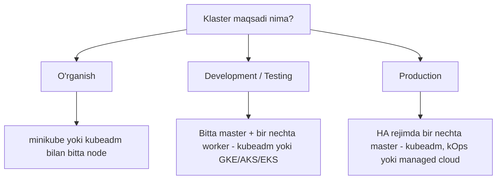
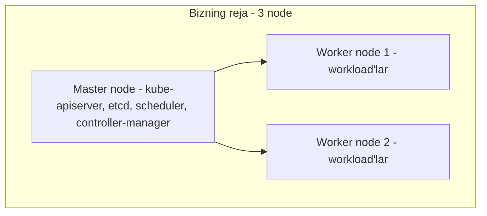

# Dars 255 — Kubernetes klasterini loyihalash (dizayn)

> 🎯 **Bu darsda nimani o'rganamiz:**
> - Klaster qurishdan oldin qanday savollarni berish kerakligi
> - Maqsadga qarab klaster turini tanlash: o'rganish, dev/test, production
> - Klaster o'lchamlari va node resurslari qanday hisoblanishi
> - Cloud va on-prem muhitlar, storage va node turlari haqida

## 🏠 Hayotiy o'xshatish

Klaster loyihalash — uy qurishga o'xshaydi. Uy qurishdan oldin siz o'zingizga savol berasiz: bu uy kim uchun? Bitta talaba yashaydigan ijara xonami (o'rganish uchun minikube), oilaviy hovlimi (dev/test klasteri), yoki yuzlab odam yashaydigan ko'p qavatli binami (production klaster)? Ko'p qavatli binoga mustahkam poydevor, zaxira generator va bir nechta lift kerak bo'lganidek, production klasterga ham bir nechta master node, kuchli resurslar va zaxira (HA) kerak bo'ladi.

## Loyihalashdan oldin beriladigan savollar

Klaster dizayniga kirishishdan oldin quyidagi savollarga javob topishingiz kerak:

1. **Klasterning maqsadi nima?** O'rganish uchunmi, development/testing uchunmi, yoki production darajadagi ilovalarni joylashtirish uchunmi?
2. **Tashkilotingizda cloud'dan foydalanish qanday?** Platformani cloud provayder boshqarganini xohlaysizmi (managed) yoki o'zingiz boshqarasizmi (self-hosted)?
3. **Qanday workload'lar ishlaydi?** Klasterda nechta ilova bo'ladi — ozmi yoki ko'pmi?
4. **Ilovalar qanday turda?** Web ilovalarmi, big data'mi yoki analitikami? Ilova turiga qarab resurs talablari farq qiladi.
5. **Tarmoq trafigi qanday?** Doimiy og'ir trafikmi yoki vaqti-vaqti bilan keladigan portlash (burst) trafikmi?

## Maqsadga qarab klaster tanlash

### O'rganish uchun

Agar klaster faqat **o'rganish** uchun kerak bo'lsa, minikube asosidagi yechim yoki kubeadm bilan lokal VM'da yo cloud provayderda (GCP, AWS) o'rnatilgan **bitta node'li klaster** yetarli.

### Development va testing uchun

Bu maqsad uchun **bitta master va bir nechta worker node'dan iborat** multi-node klaster mos keladi. Bu yerda ham kubeadm — juda qulay vosita. Agar managed cloud muhitida ishlasangiz, GCP'da Google Container Engine (GKE), AWS'da yoki Azure'da AKS orqali klasterni bir necha daqiqada tayyorlab olishingiz mumkin.

### Production uchun

Production darajadagi ilovalar uchun **bir nechta master node'ga ega, yuqori darajada mavjud (highly available) multi-node klaster** tavsiya etiladi. HA sozlamalari haqida shu bo'limning keyingi darslarida batafsil gaplashamiz. Bunday klasterni kubeadm bilan, GCP'da, yoki AWS'da kOps vositasi bilan qurish mumkin.

## Klaster chegaralari (limitlar)

Kubernetes klasterining maksimal o'lchamlari quyidagicha:

| Ko'rsatkich | Maksimal qiymat |
|---|---|
| Klasterdagi node'lar soni | 5 000 |
| Klasterdagi jami pod'lar | 150 000 |
| Jami konteynerlar | 300 000 |
| Bitta node'dagi pod'lar | 100 |

💡 Bu raqamlarni yodlash shart emas — ular rasmiy hujjatlarda bor. Lekin klaster shu darajagacha kengaya olishini bilish foydali.

## Node resurslari — klaster hajmiga qarab

Klaster hajmiga qarab node'ning resurs talabi o'zgaradi. GCP va AWS kabi cloud provayderlar klasterdagi node'lar soniga qarab to'g'ri o'lchamdagi instance'larni **avtomatik** tanlab beradi. Masalan (GCP misolida):

| Node'lar soni | GCP instance turi | AWS instance turi | Taxminiy resurs |
|---|---|---|---|
| 1-5 node | n1-standard-1 | m3.medium | 1 vCPU, 3.75 GB |
| 6-10 node | n1-standard-2 | m3.large | 2 vCPU, 7.5 GB |
| 11-100 node | n1-standard-4 | m3.xlarge | 4 vCPU, 15 GB |
| 101-250 node | n1-standard-8 | m3.2xlarge | 8 vCPU, 30 GB |

Agar on-prem (o'z serverlaringizda) o'rnatayotgan bo'lsangiz, shu raqamlarni boshlang'ich asos sifatida olishingiz mumkin.

## Cloud yoki On-prem?

Yuqoridagi barcha o'rnatish variantlari istalgan muhitda ishlaydi:

| Muhit | Tavsiya etilgan vosita | Afzalligi |
|---|---|---|
| On-prem | kubeadm | O'z serverlaringizda to'liq nazorat |
| GCP | Google Container Engine (GKE) | Bir bosishda klaster yangilash (one click upgrade) |
| AWS | kOps | AWS'da klaster yaratishni avtomatlashtiradi |
| Azure | AKS | Azure'da hosted Kubernetes muhitini boshqaradi |

## Storage (saqlash) haqida mulohazalar

Workload turiga qarab node va disk konfiguratsiyasi farq qiladi:

- **Yuqori unumdorlik** talab qiladigan workload'lar uchun — **SSD'ga asoslangan storage** ishlating (bir vaqtda ko'p parallel murojaat uchun).
- Bir nechta pod **umumiy volume'ga** kirishi kerak bo'lsa — **tarmoqqa asoslangan (network based) storage** ko'rib chiqing.
- Storage bo'limida o'rgangan **Persistent Volume**'lardan foydalaning.
- Turli **storage class**'lar aniqlab, har bir ilovaga mos klassni biriktiring.

## Node'lar haqida muhim faktlar

- Node'lar **fizik yoki virtual** mashina bo'lishi mumkin. Kursda biz VirtualBox muhitida virtual mashinalar yaratamiz. Siz fizik mashinalar, VM'lar yoki GCP/AWS/Azure kabi cloud muhitlarini tanlashingiz mumkin.
- Kursdagi rejamiz: **3 node'li klaster — 1 master va 2 worker**.
- Master node'lar control plane komponentlarini (kube-apiserver, etcd va boshqalar) joylashtiradi, worker'lar esa workload'larni. Lekin bu **qat'iy talab emas** — master ham oddiy node hisoblanadi va unda workload ishlashi mumkin.
- **Best practice:** ayniqsa production'da master node'larni faqat control plane uchun ajratish tavsiya etiladi. kubeadm kabi vositalar buni master node'ga **taint** qo'yish orqali avtomatik ta'minlaydi — workload'lar master'ga tushmaydi.
- Node'lar uchun **64-bitli Linux** operatsion tizimi ishlatilishi shart.
- Odatda barcha control plane komponentlari master node'da bo'ladi. Lekin **katta klasterlarda etcd'ni master'dan ajratib, alohida serverlar klasteriga** chiqarish mumkin. Bu topologiyalar haqida HA darsida batafsil gaplashamiz.

## ❓ Savol-Javob

**Savol:** O'rganish uchun qanday klaster yetarli?
**Javob:** minikube yoki kubeadm bilan o'rnatilgan bitta node'li klaster — lokal VM'da yoki cloud'da.

**Savol:** Production klaster uchun asosiy talab nima?
**Javob:** Yuqori mavjudlik (HA) — ya'ni bir nechta master node'li multi-node klaster, har bir komponentda zaxira bo'lishi.

**Savol:** Master node'da oddiy ilovalar (workload) ishlashi mumkinmi?
**Javob:** Texnik jihatdan ha — master ham node. Lekin production'da master'ni faqat control plane uchun ajratish tavsiya etiladi. kubeadm buni taint qo'yish orqali oldini oladi.

**Savol:** Bitta klasterda maksimal nechta node bo'lishi mumkin?
**Javob:** 5 000 node, 150 000 pod, 300 000 konteyner va har bir node'da 100 tagacha pod.

## 📌 CKA imtihon uchun maslahat

Imtihon nuqtai nazaridan bu darsdan deyarli hech narsani yodlash shart emas. Yuqoridagi raqamlar (5000 node, 150000 pod va h.k.) rasmiy hujjatlar sahifasida mavjud — imtihonda kubernetes.io hujjatlaridan foydalanish mumkin. Asosiysi, dizayn tamoyillarini tushunish: maqsad → klaster turi → resurslar.

## 📖 Asosiy atamalar

| Atama | Oddiy tushuntirish |
|---|---|
| HA (High Availability) | Yuqori mavjudlik — bitta komponent ishdan chiqsa ham tizim ishlashda davom etishi |
| minikube | Lokal kompyuterda bitta node'li o'quv klasterini tez ko'taruvchi vosita |
| kubeadm | Tayyor VM'larda bitta yoki ko'p node'li klaster o'rnatuvchi rasmiy vosita |
| kOps | AWS'da Kubernetes klasterini yaratish va boshqarish vositasi |
| Taint | Node'ga qo'yiladigan "belgilar" — unga mos tolerance'i yo'q pod'lar shu node'ga joylashmaydi |
| On-prem | O'z tashkilotingiz serverlarida (cloud'da emas) joylashgan infratuzilma |
| Storage class | Turli xil disk turlarini (tez SSD, oddiy HDD) klassifikatsiya qilish usuli |

## 🔗 Manbalar

- [Kubernetes hujjatlari — Considerations for large clusters](https://kubernetes.io/docs/setup/best-practices/cluster-large/)
- [Kubernetes hujjatlari — Production environment](https://kubernetes.io/docs/setup/production-environment/)
- [kubeadm bilan klaster yaratish](https://kubernetes.io/docs/setup/production-environment/tools/kubeadm/create-cluster-kubeadm/)

---
*Bu dars KodeKloud CKA kursining 255-videosi asosida tayyorlandi.*
