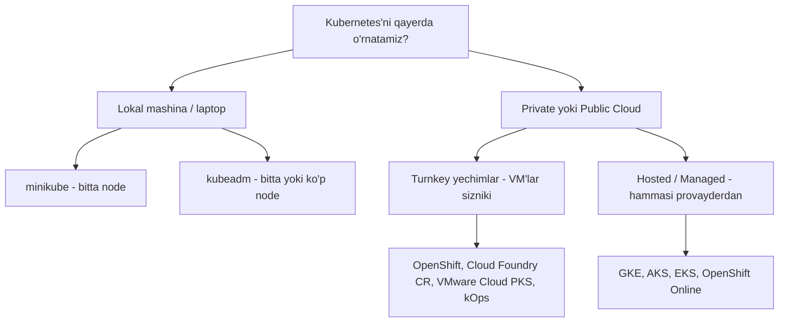
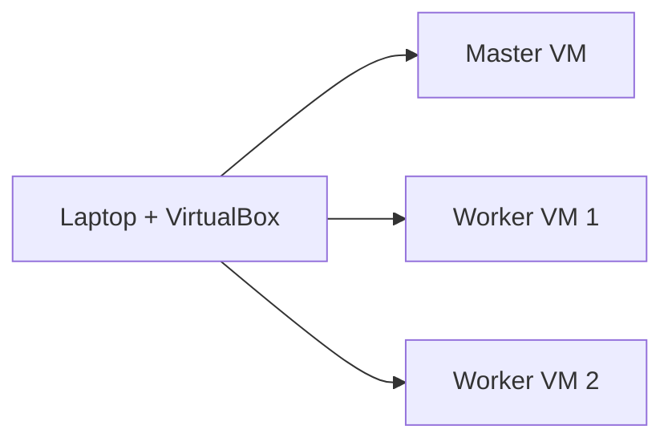

# Dars 256 — Kubernetes infratuzilmasini tanlash

> 🎯 **Bu darsda nimani o'rganamiz:**
> - Kubernetes'ni qayerlarda o'rnatish mumkinligi: laptop, on-prem serverlar, cloud
> - Lokal yechimlar: minikube va kubeadm farqi
> - Turnkey yechimlar: kOps, OpenShift, Cloud Foundry, VMware, Vagrant
> - Hosted (managed) yechimlar: GKE, AKS, EKS, OpenShift Online

## 🚗 Hayotiy o'xshatish

Infratuzilma tanlash — mashinaga ega bo'lish usulini tanlashga o'xshaydi. **Binarlarni qo'lda o'rnatish** — mashinani ehtiyot qismlardan o'zingiz yig'ish: hamma narsani chuqur o'rganasiz, lekin juda mashaqqatli. **Turnkey yechim** — tayyor mashina sotib olish: mashina sizniki, yoqilg'i quyish, moy almashtirish (VM'larni patch/upgrade qilish) o'z zimmangizda. **Hosted/managed yechim** esa — taksi xizmatiga obuna: mashina ham, haydovchi ham, texnik xizmat ham provayderdan, siz faqat manzilni aytasiz (ilovangizni deploy qilasiz).

## Kubernetes'ni qayerda o'rnatish mumkin?

Kubernetes juda ko'p tizimlarda turli usullarda o'rnatiladi: shaxsiy laptopdan tortib, tashkilot ichidagi fizik yoki virtual serverlargacha, hamda cloud muhitlarigacha. Tanlov sizning talablaringiz, cloud ekotizimingiz va joylashtirmoqchi bo'lgan ilovalar turiga bog'liq.

## Lokal mashinada o'rnatish

### Linux'da

Qo'llab-quvvatlanadigan Linux mashinasida binarlarni **qo'lda o'rnatib**, lokal klaster sozlashingiz mumkin. Lekin bu juda mashaqqatli ish, ayniqsa endi boshlayotganlar uchun. Shuning uchun bu jarayonni avtomatlashtiradigan yechimdan foydalanish klasterni bir necha daqiqada tayyorlashga yordam beradi.

### Windows'da

Windows'da Kubernetes'ni **nativ o'rnatib bo'lmaydi** — Windows uchun binarlar yo'q. Hyper-V, VMware Workstation yoki VirtualBox kabi virtualizatsiya dasturidan foydalanib, Linux VM'lar yaratishingiz va ularda Kubernetes'ni ishga tushirishingiz kerak.

⚠️ Windows VM'larda Kubernetes komponentlarini Docker konteyner sifatida ishga tushiruvchi yechimlar ham bor. Lekin esda tuting: bu Docker image'lar ham Linux'ga asoslangan va aslida ular Hyper-V yaratgan Linux OS ustida ishlaydi.

### minikube vs kubeadm

| Xususiyat | minikube | kubeadm |
|---|---|---|
| Node soni | Faqat bitta node | Bitta yoki ko'p node |
| VM'larni kim yaratadi? | O'zi (VirtualBox orqali avtomatik) | Siz — VM'lar oldindan tayyor bo'lishi kerak |
| Maqsad | O'rganish, tez boshlash | O'rganish, dev/test, hatto production |

Ikkalasining asosiy farqi: **minikube VM'ni kerakli konfiguratsiya bilan o'zi yaratadi**, kubeadm esa **VM'lar allaqachon tayyor** deb kutadi. Buning evaziga kubeadm multi-node klasterlarni ham o'rnatish imkonini beradi.

💡 Laptop'da lokal klaster odatda faqat o'rganish, testlash va development uchun ishlatiladi.

## Production uchun: Turnkey va Hosted yechimlar

Production maqsadlari uchun private yoki public cloud muhitida klaster ko'tarishning ko'p usullari bor. Ularni ikki toifaga bo'lish mumkin:

| Toifa | VM'larni kim yaratadi? | VM'larni kim boshqaradi? | Misol |
|---|---|---|---|
| **Turnkey yechimlar** | Siz | Siz (patch, upgrade sizning zimmangizda) | AWS'da kOps bilan klaster |
| **Hosted / Managed yechimlar** | Provayder | Provayder | GKE — bir necha daqiqada tayyor klaster |

- **Turnkey yechim** — siz kerakli VM'larni yaratasiz, so'ng maxsus vosita/skriptlar yordamida ularda Kubernetes sozlanadi. VM'larni saqlash, patch va upgrade qilish sizning mas'uliyatingizda, lekin klaster boshqaruvi vositalar tufayli ancha yengil.
- **Hosted yechim** — "Kubernetes as a Service": klaster ham, VM'lar ham provayder tomonidan yaratiladi va Kubernetes provayder tomonidan sozlanadi. VM'larni ham provayder boshqaradi.

## Turnkey yechimlar bilan tanishuv

- **OpenShift** — Red Hat'ning mashhur on-prem Kubernetes platformasi. Bu ochiq kodli konteyner ilovalar platformasi bo'lib, Kubernetes ustiga qurilgan. Qo'shimcha vositalar va qulay GUI beradi, CI/CD pipeline'lar bilan oson integratsiya qilinadi.
- **Cloud Foundry Container Runtime** — Cloud Foundry'ning ochiq kodli loyihasi. **BOSH** nomli vositasi yordamida yuqori mavjudlikdagi (HA) Kubernetes klasterlarini o'rnatish va boshqarishga yordam beradi.
- **VMware Cloud PKS** — mavjud VMware muhitingizni Kubernetes uchun ishlatmoqchi bo'lsangiz, ko'rib chiqishga arziydigan yechim.
- **Vagrant** — turli cloud provayderlarda Kubernetes klasterini o'rnatish uchun foydali skriptlar to'plamini beradi.

Bularning barchasi tashkilot ichida (private) klasterni oson o'rnatish va boshqarish imkonini beradi. Buning uchun mos konfiguratsiyali bir nechta VM tayyor bo'lishi kerak. Bular — ko'plab Kubernetes sertifikatlangan yechimlarning bir qismi xolos; to'liq ro'yxat rasmiy hujjatlarda bor.

## Hosted (managed) yechimlar bilan tanishuv

- **GKE (Google Kubernetes Engine)** — GCP'dagi juda mashhur "Kubernetes as a Service" xizmati.
- **OpenShift Online** — Red Hat taklifi: onlayn to'liq ishlaydigan Kubernetes klasteriga ega bo'lasiz.
- **AKS (Azure Kubernetes Service)** — Azure'ning hosted Kubernetes xizmati.
- **EKS (Amazon Elastic Container Service for Kubernetes)** — Amazon'ning hosted Kubernetes taklifi.

Bular ham ko'p yechimlardan bir nechtasi xolos.

## Bizning kursdagi tanlov

Kurs o'rganish maqsadida bo'lgani, ba'zi o'quvchilarda public cloud akkaunti yo'qligi va so'rovnomada ko'pchilik VirtualBox bilan lokal o'rnatishni afzal ko'rgani uchun — biz **lokal kompyuterda VirtualBox'da bir nechta VM yaratib, klasterni noldan o'rnatishni** tanladik.

Demak, hozirgi dizaynimiz: **3 node — 1 master, 2 worker**, laptopda VirtualBox orqali yaratilgan VM'larda.

## ❓ Savol-Javob

**Savol:** minikube bilan kubeadm'ning asosiy farqi nima?
**Javob:** minikube VM'ni o'zi yaratadi, lekin faqat bitta node'li klaster ko'taradi. kubeadm VM'lar tayyor bo'lishini kutadi, lekin multi-node klaster o'rnatishi mumkin.

**Savol:** Turnkey va Hosted yechimlarning farqi nimada?
**Javob:** Turnkey'da VM'larni siz yaratasiz va boshqarasiz (patch/upgrade o'zingizda), Kubernetes'ni vositalar sozlaydi. Hosted'da VM'lar ham, Kubernetes ham provayder tomonidan yaratiladi va boshqariladi.

**Savol:** Windows'da Kubernetes'ni to'g'ridan-to'g'ri o'rnatsa bo'ladimi?
**Javob:** Yo'q, Windows binarlari mavjud emas. Hyper-V, VMware Workstation yoki VirtualBox orqali Linux VM yaratib, unda o'rnatiladi.

**Savol:** OpenShift nima?
**Javob:** Red Hat'ning Kubernetes ustiga qurilgan ochiq kodli konteyner platformasi — qo'shimcha vositalar, GUI va CI/CD integratsiyasini beradi.

## 📌 CKA imtihon uchun maslahat

CKA imtihoni **kubeadm bilan qurilgan klasterlarga** asoslangan. Turnkey va hosted yechimlar nomlarini yodlash shart emas, lekin minikube vs kubeadm farqini va kubeadm'ning imkoniyatlarini (multi-node, production-ready) aniq bilib oling — kursning amaliy qismi ham aynan kubeadm ustida bo'ladi.

## 📖 Asosiy atamalar

| Atama | Oddiy tushuntirish |
|---|---|
| Turnkey yechim | VM'larni o'zingiz yaratib, tayyor vositalar bilan Kubernetes o'rnatiladigan yechim |
| Hosted / Managed yechim | Klaster va VM'lar to'liq provayder tomonidan yaratilib boshqariladigan "Kubernetes as a Service" |
| minikube | Bitta node'li lokal klasterni avtomatik ko'taruvchi vosita |
| kubeadm | Tayyor VM'larda bitta/ko'p node'li klasterni tez o'rnatuvchi rasmiy vosita |
| OpenShift | Red Hat'ning Kubernetes asosidagi konteyner platformasi |
| BOSH | Cloud Foundry'ning klasterlarni o'rnatish/boshqarish uchun ochiq kodli vositasi |
| GKE / AKS / EKS | Google, Azure va Amazon'ning managed Kubernetes xizmatlari |

## 🔗 Manbalar

- [Kubernetes hujjatlari — Production environment tools](https://kubernetes.io/docs/setup/production-environment/tools/)
- [Kubernetes Partners — sertifikatlangan yechimlar ro'yxati](https://kubernetes.io/partners/)
- [minikube hujjatlari](https://minikube.sigs.k8s.io/docs/)
- [kubeadm bilan o'rnatish](https://kubernetes.io/docs/setup/production-environment/tools/kubeadm/install-kubeadm/)

---
*Bu dars KodeKloud CKA kursining 256-videosi asosida tayyorlandi.*
