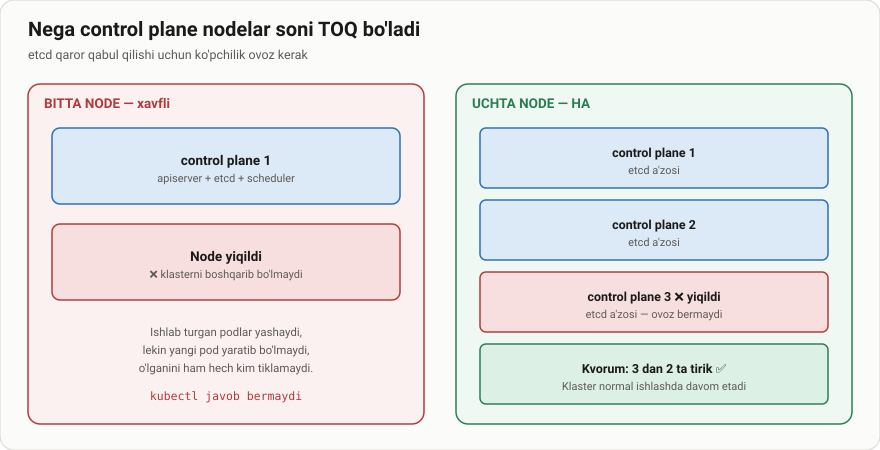
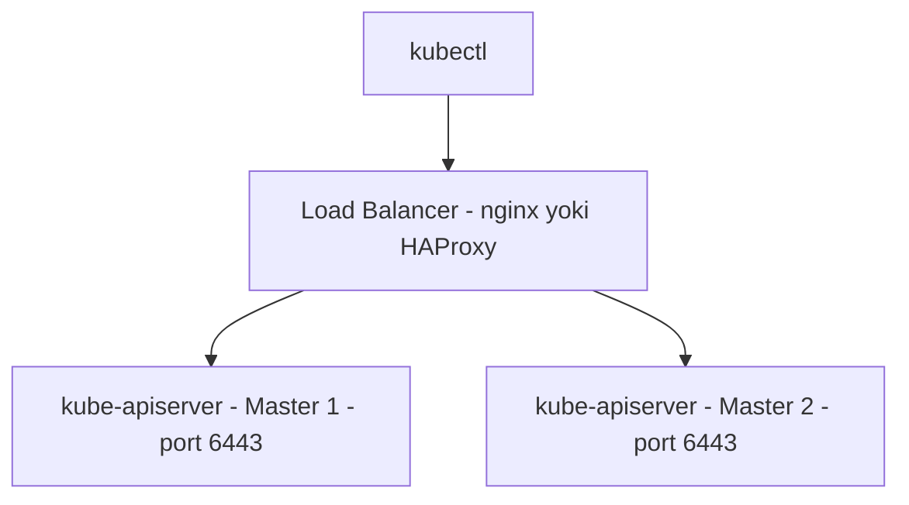
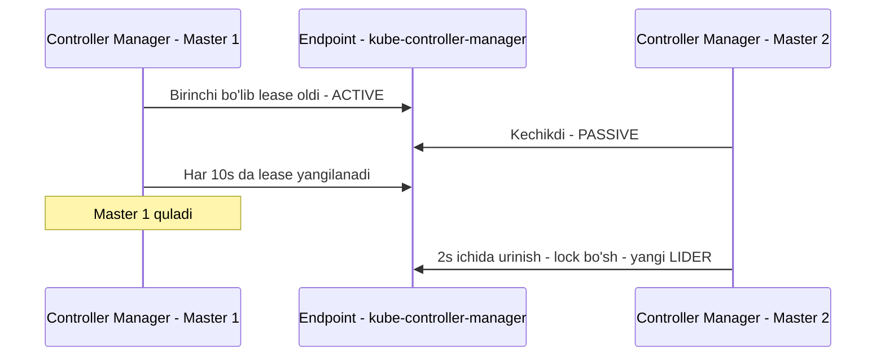
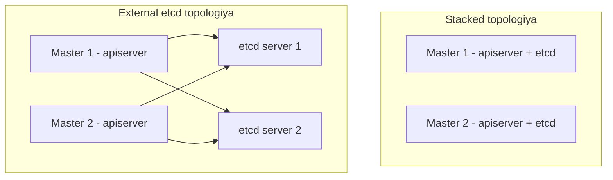

# Dars 257 — High Availability (yuqori mavjudlik) sozlash

> 🎯 **Bu darsda nimani o'rganamiz:**
> - Master node ishdan chiqsa nima bo'lishi va nima uchun HA kerakligi
> - Bir nechta master node'da komponentlar qanday ishlashi
> - kube-apiserver uchun load balancer (active-active rejim)
> - Scheduler va Controller Manager'da leader election (active-standby rejim)
> - etcd'ning ikki topologiyasi: stacked va external



## ✈️ Hayotiy o'xshatish

HA — samolyotdagi ikki uchuvchiga o'xshaydi. Samolyotni bitta uchuvchi ham boshqara oladi, lekin doim ikkinchisi ham o'tiradi. Asosiy uchuvchi (leader) boshqaradi, ikkinchisi (standby) kuzatib turadi — asosiysiga bir gap bo'lsa, darhol boshqaruvni oladi. Kubernetes'da ham: bitta master yo'qolsa, ilovalaringiz hali "uchishda" davom etadi, lekin boshqaradigan hech kim qolmaydi. Shuning uchun production'da bir nechta master bo'lishi shart.

## Master node yo'qolsa nima bo'ladi?

Klasterda master node ishdan chiqdi deylik. Worker'lar tirik va konteynerlar ishlayotgan ekan, **ilovalaringiz ishlashda davom etadi** — foydalanuvchilar ularga kira oladi. Lekin muammolar boshlanishi bilan ahvol o'zgaradi:

- Worker node'dagi biror pod yoki konteyner qulab tushdi. Agar u ReplicaSet tarkibida bo'lsa, master'dagi replication controller worker'ga yangi pod yuklashni buyurishi kerak edi. Lekin **master yo'q** — controller'lar ham, scheduler ham yo'q. Pod'ni qayta yaratadigan va uni node'larga joylashtiradigan hech kim yo'q.
- kube-apiserver ham ishlamayotgani uchun kubectl orqali yoki API orqali klasterni **tashqaridan boshqarib bo'lmaydi**.

Aynan shu sababdan production muhitida **bir nechta master node'li HA konfiguratsiya** zarur.

💡 **HA konfiguratsiya** — klasterdagi **har bir komponentda zaxira (redundancy)** bo'lishi, ya'ni hech qayerda single point of failure (yagona zaif nuqta) qolmasligi: master node'lar, worker node'lar, control plane komponentlari va, albatta, ilovaning o'zi (u allaqachon ReplicaSet va Service'lar orqali ko'p nusxada mavjud). Bu darsda diqqatimiz master va control plane komponentlarida.

## Ikkinchi master qo'shsak, komponentlar qanday ishlaydi?

Kurs davomida 1 master + 2 worker'li klasterni ko'rib keldik. Master node control plane komponentlarini joylashtiradi: API server, Controller Manager, Scheduler va etcd server. Qo'shimcha master qo'shilganda **xuddi shu komponentlar yangi master'da ham ishlaydi**.

Xo'sh, bir xil komponentning ikki nusxasi bir xil ishni ikki marta qilmaydimi? Ishni o'zaro qanday bo'lishadi? Javob — komponent nima ish qilishiga qarab farq qiladi:

| Komponent | Rejim | Sabab |
|---|---|---|
| kube-apiserver | **Active-Active** | So'rovlarni bittalab qayta ishlaydi, parallel ishlashi bemalol mumkin |
| Controller Manager | **Active-Standby** | Parallel ishlasa harakatlar takrorlanadi (keragidan ko'p pod yaratiladi) |
| Scheduler | **Active-Standby** | Xuddi shu sabab — parallel ishlamasligi kerak |
| etcd | Distributed (keyingi dars) | Leader + quorum asosida ishlaydi |

### kube-apiserver — Active-Active va Load Balancer

API server so'rovlarni qabul qilib qayta ishlaydi va klaster haqida ma'lumot beradi — bir vaqtda bitta so'rov ustida ishlaydi. Shuning uchun barcha master'lardagi API server'lar **bir vaqtning o'zida tirik va ishlayotgan** bo'lishi mumkin — bu **active-active** rejim.

kubectl utilitasi API server bilan gaplashadi va biz uni master node'ning **6443-portiga** yo'naltiramiz — API server shu portda tinglaydi, bu kubeconfig faylida sozlangan.

Endi ikkita master bor — kubectl'ni qaysi biriga yo'naltiramiz? So'rovni istalgan biriga yuborish mumkin, lekin **bitta so'rovni ikkalasiga birdan yuborib bo'lmaydi**. To'g'ri yechim — master node'lar oldiga trafikni API server'lar o'rtasida taqsimlaydigan **load balancer** qo'yish va kubectl'ni o'sha load balancer'ga yo'naltirish. Buning uchun **nginx, HAProxy** yoki boshqa istalgan load balancer ishlatiladi.



### Scheduler va Controller Manager — Active-Standby va Leader Election

Bular klaster holatini kuzatib, harakat qiladigan controller'lar. Masalan, Controller Manager tarkibidagi replication controller doim pod'lar holatini kuzatadi va biri ishdan chiqsa yangisini yaratadi. Agar bunday komponentlarning bir nechta nusxasi **parallel ishlasa**, harakatlar takrorlanib, kerak bo'lganidan **ko'proq pod** yaratilib ketishi mumkin. Scheduler'da ham xuddi shunday. Shuning uchun ular **active-standby** rejimida ishlaydi.

Qaysi biri active bo'lishini kim hal qiladi? Bu **leader election** (lider saylash) jarayoni orqali hal bo'ladi. Controller Manager misolida:

- Jarayon sozlanganda `--leader-elect` opsiyasi beriladi (standart qiymati `true`).
- Ishga tushganda har bir nusxa Kubernetes'dagi **kube-controller-manager** nomli endpoint obyekti ustidan **lease (ijara/lock)** olishga urinadi.
- Endpoint'ni **birinchi bo'lib o'z ma'lumoti bilan yangilagan** jarayon lease'ni qo'lga kiritadi va ikkalasidan **active** bo'ladi. Ikkinchisi **passive** bo'lib qoladi.

Muhim parametrlar:

```bash
kube-controller-manager \
  --leader-elect=true \
  --leader-elect-lease-duration=15s \
  --leader-elect-renew-deadline=10s \
  --leader-elect-retry-period=2s
```

| Opsiya | Standart qiymat | Ma'nosi |
|---|---|---|
| --leader-elect | true | Leader election yoqilgan |
| --leader-elect-lease-duration | 15s | Lock (lease) shu muddatga ushlab turiladi |
| --leader-elect-renew-deadline | 10s | Active jarayon lease'ni har 10 sekundda yangilab turadi |
| --leader-elect-retry-period | 2s | Ikkala jarayon har 2 sekundda lider bo'lishga urinadi |

Shu mexanizm tufayli, agar active jarayon ishdan chiqsa (masalan, birinchi master qulasa), ikkinchi jarayon lock'ni egallab **yangi lider** bo'ladi. **Scheduler ham xuddi shu yondashuvga amal qiladi** va xuddi shu buyruq qatori opsiyalariga ega.



## etcd — ikki xil topologiya

etcd haqida kurs boshida gaplashgandik — o'sha darsni qayta ko'rib chiqish foydali. HA nuqtai nazaridan Kubernetes'da etcd'ni **ikki xil topologiyada** sozlash mumkin:

### 1. Stacked control plane nodes topologiyasi

Kurs davomida ko'rib kelganimiz — **etcd master node'larning o'zida** joylashadi.

- ✅ O'rnatish oson, boshqarish oson, kamroq server kerak
- ❌ Bitta node qulasa, **ham etcd a'zosi, ham control plane nusxasi birga yo'qoladi** — zaxira zaiflashadi

### 2. External etcd topologiyasi

etcd control plane node'lardan ajratilib, **o'zining alohida serverlar to'plamida** ishlaydi.

- ✅ Xavf kamroq — control plane node qulasa, etcd klasteri va undagi ma'lumotlarga ta'sir qilmaydi
- ❌ O'rnatish qiyinroq va external etcd node'lar uchun **ikki barobar ko'p server** kerak

| Xususiyat | Stacked | External etcd |
|---|---|---|
| etcd joylashuvi | Master node'ning o'zida | Alohida serverlarda |
| O'rnatish | Oson | Qiyinroq |
| Server soni | Kamroq | Ko'proq (taxminan ikki barobar) |
| Node qulaganda xavf | etcd + control plane birga yo'qoladi | etcd zarar ko'rmaydi |



⚠️ Esda tuting: **etcd bilan faqat API server gaplashadi**. API server konfiguratsiyasida etcd server qayerdaligini ko'rsatuvchi opsiyalar bor. Qaysi topologiyani tanlamang, API server **etcd serverlarning to'g'ri manziliga** yo'naltirilganiga ishonch hosil qilishingiz kerak:

```bash
kube-apiserver --etcd-servers=https://10.240.0.10:2379,https://10.240.0.11:2379
```

etcd — distributed (taqsimlangan) tizim, shuning uchun API server unga **istalgan instance orqali** murojaat qila oladi: istalgan tirik etcd nusxasidan o'qish va unga yozish mumkin. Shuning uchun kube-apiserver konfiguratsiyasida etcd serverlar **ro'yxat** sifatida ko'rsatiladi.

## Yangilangan dizaynimiz

Dastlab bitta master rejalashtirgan edik. HA uchun endi **bir nechta master** sozlashga qaror qildik, hamda API server uchun **load balancer** ham qo'shamiz. Natijada klasterimizda jami **5 ta node** bo'ladi: 2 master + 2 worker + 1 load balancer.

## 🧪 Mustaqil topshiriqlar

> Yechishdan oldin darsni yopib qo'ying. Taxminiy vaqt: 10 daqiqa.

**1-topshiriq · oson.** Klasteringizda nechta control plane node borligini aniqlang.

<details><summary>O'zingizni tekshiring</summary>

```bash
kubectl get nodes -l node-role.kubernetes.io/control-plane
```
</details>

**2-topshiriq · o'rta.** Control plane komponentlari qaysi Pod'lar sifatida ishlayotganini ko'ring.

<details><summary>O'zingizni tekshiring</summary>

```bash
kubectl get pods -n kube-system -o wide | grep -E 'apiserver|scheduler|controller-manager|etcd'
```
</details>

**3-topshiriq · qiyin.** Nima uchun control plane node'lar soni **toq** bo'lishi kerak?
**Avval ayting.**

<details><summary>O'zingizni tekshiring</summary>

etcd qaror qabul qilish uchun **kvorum** — ya'ni ko'pchilik ovoz talab qiladi.

| Node soni | Kvorum | Nechta yiqilsa chidaydi |
|---|---|---|
| 1 | 1 | 0 |
| 2 | 2 | **0** |
| 3 | 2 | 1 |
| 4 | 3 | 1 |
| 5 | 3 | 2 |

2 va 4 node hech qanday foyda bermaydi — ular 1 va 3 bilan bir xil
chidamlilik beradi, lekin ko'proq resurs yeydi. Shuning uchun 3 yoki 5.
</details>

## ❓ Savol-Javob

**Savol:** Master node qulasa, ishlab turgan ilovalar darhol to'xtaydimi?
**Javob:** Yo'q. Worker'lar va konteynerlar tirik ekan, ilovalar ishlayveradi. Lekin pod qulasa uni qayta yaratadigan hech kim bo'lmaydi va kubectl orqali boshqarish imkoni yo'qoladi.

**Savol:** Nega API server'lar active-active, Controller Manager esa active-standby ishlaydi?
**Javob:** API server har so'rovni mustaqil qayta ishlaydi — parallellik zarar qilmaydi. Controller Manager va Scheduler esa klasterni kuzatib harakat qiladi; parallel ishlasa harakatlar takrorlanib, ortiqcha pod'lar yaratilishi mumkin.

**Savol:** Ikki master bo'lsa, kubectl qaysi biriga ulanadi?
**Javob:** Ikkalasiga ham to'g'ridan-to'g'ri emas — master'lar oldiga nginx yoki HAProxy kabi load balancer qo'yiladi va kubectl o'shanga yo'naltiriladi.

**Savol:** Stacked va external etcd topologiyasining farqi nimada?
**Javob:** Stacked'da etcd master node'ning o'zida — o'rnatish oson, lekin node qulasa etcd a'zosi ham yo'qoladi. External'da etcd alohida serverlarda — xavfsizroq, lekin qimmatroq va murakkabroq.

## 📌 CKA imtihon uchun maslahat

Leader election opsiyalarini (`--leader-elect`, lease-duration 15s, renew-deadline 10s, retry-period 2s) va API server 6443-portda tinglashini bilib oling. Imtihonda HA klaster topologiyasini tushunish, ayniqsa **stacked vs external etcd** farqini ajrata olish va `--etcd-servers` opsiyasi ro'yxat qabul qilishini bilish foydali. HA klasterni qo'lda qurish imtihonda so'ralmaydi, lekin komponentlar rollari bo'yicha savollar uchraydi.

## 📖 Asosiy atamalar

| Atama | Oddiy tushuntirish |
|---|---|
| High Availability (HA) | Har bir komponentda zaxira bo'lib, bitta uzilish tizimni to'xtatmasligi |
| Single point of failure | Ishdan chiqsa butun tizimni to'xtatadigan yagona zaif nuqta |
| Active-Active | Barcha nusxalar bir vaqtda ishlaydigan rejim (API server) |
| Active-Standby | Bittasi ishlab, qolganlari kutib turadigan rejim (scheduler, controller manager) |
| Leader election | Nusxalar orasidan "active" ni tanlash jarayoni — endpoint ustidan lease olish orqali |
| Lease (lock) | Liderlik huquqini beruvchi vaqtinchalik "ijara" — muntazam yangilab turilishi kerak |
| Stacked topologiya | etcd control plane node'larning o'zida joylashgan topologiya |
| External etcd | etcd alohida serverlar to'plamida ishlaydigan topologiya |

## 🔗 Manbalar

- [Kubernetes hujjatlari — Options for Highly Available Topology](https://kubernetes.io/docs/setup/production-environment/tools/kubeadm/ha-topology/)
- [kubeadm bilan HA klaster yaratish](https://kubernetes.io/docs/setup/production-environment/tools/kubeadm/high-availability/)
- [Leases va leader election](https://kubernetes.io/docs/concepts/architecture/leases/)

---
*Bu dars KodeKloud CKA kursining 257-videosi asosida tayyorlandi.*
