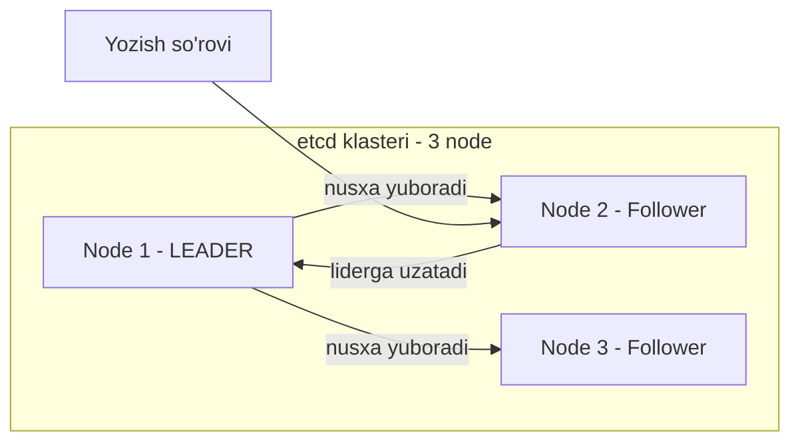
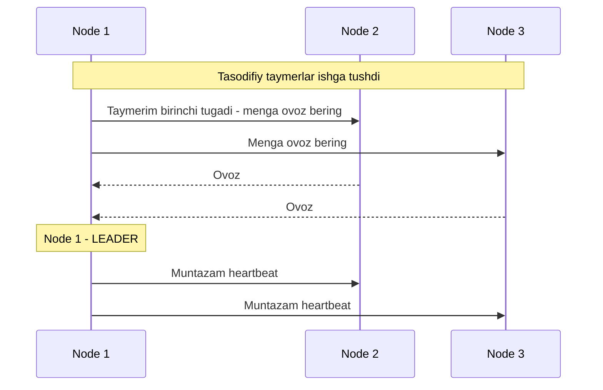

# Dars 258 — etcd yuqori mavjudlik (HA) rejimida

> 🎯 **Bu darsda nimani o'rganamiz:**
> - etcd nima va "distributed" degani nimani anglatishi
> - Leader-Follower modeli va yozish (write) qanday amalga oshishi
> - RAFT protokoli — lider qanday saylanishi
> - Quorum tushunchasi, N/2+1 formulasi va jadval
> - Nega toq son (3 yoki 5) node tanlash kerakligi

## 🏛️ Hayotiy o'xshatish

etcd klasteri — mahalla oqsoqollar kengashiga o'xshaydi. Kengashda bir kishi raislik qiladi (leader), qolganlari a'zolar (follower). Har qanday qaror rais orqali o'tadi, lekin qaror kuchga kirishi uchun **a'zolarning ko'pchiligi** (quorum) rozilik berishi kerak. 6 kishilik kengash ikkiga bo'linib 3 va 3 bo'lsa — hech qaysi tomonda ko'pchilik yo'q, kengash qarorsiz qoladi. 7 kishilik kengash esa qanday bo'linmasin, bir tomonda baribir ko'pchilik bo'ladi. Shuning uchun a'zolar soni doim **toq** tanlanadi.

## etcd nima? Qisqa takrorlash

etcd — **distributed (taqsimlangan), ishonchli key-value store**: sodda, xavfsiz va tez.

An'anaviy usulda ma'lumot jadvallarda saqlanardi (masalan, odamlar ro'yxati satrlarda). **Key-value store** esa ma'lumotni hujjatlar/sahifalar ko'rinishida saqlaydi: har bir shaxsga alohida hujjat, u haqidagi barcha ma'lumot shu fayl ichida. Fayllar istalgan format va tuzilishda bo'lishi mumkin, bir fayldagi o'zgarish boshqalariga ta'sir qilmaydi. Masalan, ishlaydigan shaxslarning fayllarida salary (maosh) maydoni bo'lishi mumkin. Ma'lumot murakkablashganda odatda **JSON yoki YAML** formatlarida ishlanadi.

## "Distributed" degani nima?

Avval etcd bitta serverda edi. Lekin bu — muhim ma'lumotlarni saqlayotgan bo'lishi mumkin bo'lgan ma'lumotlar bazasi. Shuning uchun uni **bir nechta serverda** saqlash mumkin. Endi uchta serverimiz bor — hammasida etcd ishlaydi va hammasi **bazaning bir xil nusxasini** saqlaydi. Bittasini yo'qotsangiz, ma'lumotning yana ikki nusxasi qoladi.



### O'qish va yozish qanday ishlaydi?

- **O'qish (read)** — oson: bir xil ma'lumot barcha node'larda bor, istalgan node'dan o'qish mumkin.
- **Yozish (write)** — murakkabroq. Ikki turli instance'ga ikkita yozish so'rovi kelsa nima bo'ladi? Masalan, biriga `name=John`, boshqasiga `name=Joe` yozilsa? Ikki node'da ikki xil ma'lumot bo'lishi mumkin emas!

etcd yozuvlarni har bir node'da alohida qayta ishlamaydi. Ichkarida **faqat bitta instance — leader** yozuvlarni qayta ishlashga mas'ul. Node'lar o'zaro **lider saylaydi**: bittasi leader, qolganlari follower bo'ladi.

- Yozish so'rovi **leader'ga** kelsa — leader o'zi qayta ishlaydi va boshqa node'larga ma'lumot nusxasini yuboradi.
- Yozish so'rovi **follower'ga** kelsa — follower uni ichkarida **leader'ga uzatadi**, leader qayta ishlab, nusxalarni boshqa instance'larga tarqatadi.

⚠️ Yozuv faqat **leader klasterdagi boshqa a'zolarning roziligini (ko'pchilikni)** olgandagina bajarilgan hisoblanadi.

## RAFT protokoli — lider qanday saylanadi?

etcd distributed konsensusni **RAFT protokoli** orqali amalga oshiradi. 3 node'li klasterda bu shunday ishlaydi:

1. Klaster ishga tushganda lider hali yo'q. RAFT har bir node'da **tasodifiy taymer** ishga tushiradi.
2. Taymeri **birinchi tugagan node** boshqalarga "lider bo'lishga ruxsat bering" degan so'rov yuboradi.
3. Boshqa node'lar **ovoz berib** javob qaytaradi, so'rov yuborgan node lider rolini oladi.
4. Lider muntazam ravishda boshqalarga **xabarnoma (heartbeat)** yuborib, liderligini davom ettirayotganini bildiradi.
5. Agar boshqa node'lar biror payt liderdan xabarnoma olmay qolsa (lider qulagan yoki tarmoq uzilgan), ular o'zaro **qayta saylov** o'tkazadi va yangi lider aniqlanadi.



Yozuv leader tomonidan qayta ishlanadi va boshqa node'larga replikatsiya qilinadi — yozuv **faqat klasterning boshqa instance'lariga replikatsiya qilingandan keyingina** tugallangan hisoblanadi.

## Quorum — ko'pchilik tushunchasi

Klaster yuqori mavjud (HA) bo'lgani uchun bitta node yo'qolsa ham ishlashi kerak. Deylik, yangi yozuv keldi, lekin bitta node javob bermayapti — leader faqat 2 node'ga yoza oldi. Yozuv tugallangan hisoblanadimi?

**Ha!** Yozuv klasterdagi **node'larning ko'pchiligiga** yozilsa, tugallangan hisoblanadi. 3 node'da ko'pchilik — 2. Uchinchi node qayta tiklansa, ma'lumot unga ham ko'chiriladi.

Ko'pchilikning aniqroq atamasi — **quorum (kvorum)**: klaster to'g'ri ishlashi yoki muvaffaqiyatli yozuv bo'lishi uchun mavjud bo'lishi shart bo'lgan **minimal node'lar soni**.

**Formula:** `Quorum = N/2 + 1` (kasr chiqsa, faqat butun qismi olinadi)

Masalan: 3 node uchun 3/2 = 1.5, +1 = 2.5 → butun qismi **2**. 5 node uchun quorum — **3**.

| Node'lar soni (N) | Quorum (N/2+1) | Fault tolerance (N - Quorum) |
|---|---|---|
| 1 | 1 | 0 |
| 2 | 2 | 0 |
| **3** ✅ | 2 | 1 |
| 4 | 3 | 1 |
| **5** ✅ | 3 | 2 |
| 6 | 4 | 2 |
| **7** ✅ | 4 | 3 |

- **Quorum of 1 = 1**: bitta node'li klasterda bularning hech biri amal qilmaydi — o'sha node ketsa, hammasi ketadi.
- **Quorum of 2 = 2**: 2/2 = 1, +1 = 2. Ikki node'dan biri qulasa quorum yo'q — yozuvlar qayta ishlanmaydi. Demak **2 ta instance = 1 ta instance bilan barobar**, hech qanday real foyda bermaydi.
- Shuning uchun etcd klasterida **kamida 3 ta instance** tavsiya etiladi — bu kamida 1 node'lik fault tolerance beradi.

💡 **Fault tolerance** = jami node'lar − quorum, ya'ni klasterni tirik saqlagan holda yo'qotishingiz mumkin bo'lgan node'lar soni.

## Nega toq son? Tarmoq bo'linishi (network partition)

Jadvalga qarang: 3 va 4 node'ning fault tolerance'i bir xil (1), 5 va 6'niki ham bir xil (2). Demak juft son qo'shimcha foyda bermaydi. Bundan tashqari, juft sonda yashirin xavf bor:

**6 node'li klaster misoli.** Tarmoqda uzilish yuz berib, klaster ikkiga bo'lindi:

- **4 + 2 bo'linish**: 4 node'li guruhda quorum (4) bor — klaster normal ishlashda davom etadi. ✅
- **3 + 3 bo'linish**: har guruhda faqat 3 node. Dastlab 6 node bo'lgani uchun quorum = 4. Hech bir guruhda 4 node yo'q — **klaster ishdan chiqadi**! ❌

**7 node bo'lganda** esa tarmoq qanday bo'linmasin (masalan 4 + 3), bir tomonda baribir quorum'ga yetarli 4 node bo'ladi — klaster yashashda davom etadi.

Demak, **toq sonli node'larda** tarmoq segmentatsiyasida klaster tirik qolish ehtimoli doim yuqoriroq. Shuning uchun:

- Toq son juft sondan afzal: **5 ta 6 tadan yaxshi**.
- 5 tadan ortig'i odatda **keraksiz** — 5 node yetarli fault tolerance (2) beradi.
- Tanlov: **3, 5 yoki 7** — muhitingiz, fault tolerance talabi va byudjetga qarab.

## etcd'ni o'rnatish va sozlash

etcd'ni serverga o'rnatish uchun: eng so'nggi qo'llab-quvvatlanadigan binarni yuklab oling, arxivdan chiqaring, kerakli papka tuzilmasini yarating va etcd uchun yaratilgan sertifikat fayllarini ko'chiring (sertifikatlarni yaratishni TLS bo'limida batafsil ko'rganmiz). So'ng etcd xizmatini sozlang.

Bu yerda eng muhimi — **`--initial-cluster` opsiyasi**: unda peer'lar (klasterdagi boshqa a'zolar) haqidagi ma'lumot beriladi. Aynan shu opsiya orqali har bir etcd xizmati o'zining klaster a'zosi ekanini va peer'lari qayerdaligini biladi:

```bash
etcd --initial-cluster peer-1=https://10.240.0.10:2380,peer-2=https://10.240.0.11:2380
```

O'rnatib sozlagach, ma'lumotni saqlash va o'qish uchun **etcdctl** utilitasidan foydalaniladi:

```bash
# Yozish: kalit - name, qiymat - John
etcdctl put name John

# O'qish: kalitni berib qiymatni olamiz
etcdctl get name
name
John

# Barcha kalitlarni ko'rish
etcdctl get / --prefix --keys-only
```

## Bizning dizayn — nechta node tanlaymiz?

HA muhitida klasterimiz nechta node'ga ega bo'lishi kerak?

- 1 yoki 2 instance mantiqsiz — biri yo'qolsa quorum yo'q, klaster ishlamaydi.
- Demak **HA uchun minimum — 3 node**.
- Juft sonlar tarmoq bo'linishida xavfli, hisobdan chiqadi. Qoladi: 3, 5, 7 va undan yuqori toq sonlar.
- **3 — yaxshi boshlanish**, yuqoriroq fault tolerance kerak bo'lsa **5 — yaxshiroq**. Undan ortig'i ortiqcha.

Kursda biz **3 ta** bilan ketamiz. Lekin laptop imkoniyati cheklangani uchun amalda **2 ta master** ko'taramiz (yetarli quvvatga ega muhitda bo'lsangiz, bemalol 3 ta qiling). Topologiya sifatida **stacked** ni tanladik — etcd serverlar master node'larning o'zida bo'ladi.

## ❓ Savol-Javob

**Savol:** Yozish so'rovi follower node'ga kelsa nima bo'ladi?
**Javob:** Follower uni ichkarida leader'ga uzatadi. Yozuvlarni faqat leader qayta ishlaydi va nusxalarini boshqa a'zolarga tarqatadi.

**Savol:** Quorum nima va qanday hisoblanadi?
**Javob:** Klaster ishlashi uchun mavjud bo'lishi shart bo'lgan minimal node'lar soni: N/2+1 (kasrning butun qismi olinadi). 3 node'da — 2, 5 node'da — 3, 7 node'da — 4.

**Savol:** Nega 2 node'li etcd klasteri foydasiz?
**Javob:** 2 node'ning quorum'i ham 2. Bittasi qulasa quorum yig'ilmaydi va yozuvlar qayta ishlanmaydi — xuddi 1 node'dagidek. Shuning uchun minimal tavsiya — 3.

**Savol:** Nega 6 emas, 5 yoki 7?
**Javob:** Juft sonda tarmoq teng ikkiga bo'linsa (3+3), hech bir tomonda quorum bo'lmaydi va klaster o'ladi. Toq sonda qanday bo'linmasin bir tomonda ko'pchilik qoladi. Bunga qo'shimcha, 4 node 3'dan, 6 node 5'dan ortiq fault tolerance bermaydi.

## 📌 CKA imtihon uchun maslahat

Quorum formulasi **N/2+1** va jadvalni (3→2, 5→3, 7→4) yoddan biling — bu CKA'da tez-tez uchraydigan mavzu. "etcd klasteri uchun nechta node kerak?" tipidagi savolga javob: **minimum 3, toq son, 5 — yuqori fault tolerance uchun**. Shuningdek `--initial-cluster` opsiyasi peer'larni belgilashini va etcd'ning peer porti 2380, client porti 2379 ekanini eslab qoling.

## 📖 Asosiy atamalar

| Atama | Oddiy tushuntirish |
|---|---|
| Key-value store | Ma'lumotni jadval emas, kalit-qiymat (hujjat) ko'rinishida saqlovchi baza |
| Distributed | Bir nechta serverda bir xil nusxada taqsimlangan tizim |
| Leader | Yozuvlarni qayta ishlashga mas'ul yagona etcd a'zosi |
| Follower | Leader'dan ma'lumot nusxasini oluvchi va yozuvlarni unga uzatuvchi a'zo |
| RAFT | Distributed konsensus protokoli — lider saylash va replikatsiyani boshqaradi |
| Quorum | Klaster ishlashi uchun kerak bo'lgan minimal node'lar soni (N/2+1) |
| Fault tolerance | Klasterni tirik saqlab yo'qotish mumkin bo'lgan node'lar soni (N minus quorum) |
| Network partition | Tarmoq uzilishi tufayli klasterning ikki guruhga bo'linib qolishi |
| etcdctl | etcd bilan ishlash (put/get) uchun buyruq qatori utilitasi |

## 🔗 Manbalar

- [Kubernetes hujjatlari — Operating etcd clusters](https://kubernetes.io/docs/tasks/administer-cluster/configure-upgrade-etcd/)
- [etcd rasmiy hujjatlari — FAQ (quorum va klaster hajmi)](https://etcd.io/docs/latest/faq/)
- [RAFT protokoli tushuntirilishi](https://raft.github.io/)
- [kubeadm HA topologiyalari](https://kubernetes.io/docs/setup/production-environment/tools/kubeadm/ha-topology/)

---
*Bu dars KodeKloud CKA kursining 258-videosi asosida tayyorlandi.*
