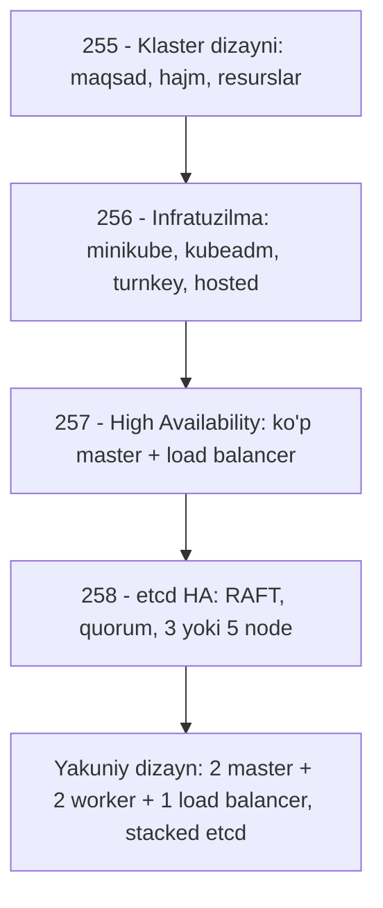

# 🏗️ 10-bo'lim — Kubernetes klasterini loyihalash va o'rnatish

Bu bo'limda Kubernetes klasterini **noldan loyihalashni** o'rganamiz: klaster maqsadini aniqlashdan boshlab, infratuzilma tanlash, yuqori mavjudlik (HA) arxitekturasi va etcd klasterini to'g'ri o'lchashgacha. Bo'lim oxirida dizaynimiz tayyor bo'ladi va keyingi bo'limlarda uni amalda quramiz.

## 📚 Darslar ro'yxati

| # | Dars | Mavzu |
|---|---|---|
| 255 | [Klaster dizayni](255_Klaster_dizayni.md) | Maqsadga qarab loyihalash: o'rganish / dev / production, klaster limitlari, node resurslari, cloud vs on-prem, storage |
| 256 | [Infratuzilma tanlash](256_Infratuzilma_tanlash.md) | minikube vs kubeadm, turnkey yechimlar (kOps, OpenShift, Cloud Foundry CR, VMware, Vagrant), hosted yechimlar (GKE, AKS, EKS) |
| 257 | [High Availability](257_High_Availability.md) | Nega HA kerak, bir nechta master, load balancer, active-active vs active-standby, leader election, stacked vs external etcd |
| 258 | [etcd HA rejimida](258_ETCD_HA.md) | Distributed etcd, leader-follower, RAFT protokoli, quorum N/2+1 jadvali, nega 3 yoki 5 node |

## 🗺️ Bo'lim yo'l xaritasi

> ⚠️ **259 - Important Update — Kubernetes the Hard Way**
>
> Kubernetes'ni "the hard way" (qiyin yo'l bilan, hamma komponentni qo'lda) o'rnatish — turli komponentlarni qo'lda yig'ishni chuqurroq tushunishga yordam beradi. Bu **ixtiyoriy** video seriya kurs muallifining YouTube kanalida mavjud:
>
> - Video pleylist: [https://www.youtube.com/watch?v=uUupRagM7m0&list=PL2We04F3Y_41jYdadX55fdJplDvgNGENo](https://www.youtube.com/watch?v=uUupRagM7m0&list=PL2We04F3Y_41jYdadX55fdJplDvgNGENo)
> - Git repozitoriysi: [https://github.com/mmumshad/kubernetes-the-hard-way](https://github.com/mmumshad/kubernetes-the-hard-way)

## 💡 Bo'limning asosiy xulosalari

- Klaster dizayni **maqsaddan** boshlanadi: o'rganish → minikube/bitta node; dev/test → 1 master + worker'lar; production → HA, ko'p master.
- **kubeadm** — CKA va kursimizning asosiy vositasi; VM'lar tayyor bo'lsa, multi-node klasterni tez ko'taradi.
- Production'da **har bir komponentda zaxira** bo'lishi kerak: API server'lar load balancer ortida active-active, scheduler/controller-manager leader election bilan active-standby.
- etcd uchun **toq sonli node** (3 yoki 5) tanlanadi — quorum = N/2+1.

## 🔗 Umumiy manbalar

- [kubernetes.io — rasmiy hujjatlar](https://kubernetes.io/docs/home/)
- [Production muhitini sozlash](https://kubernetes.io/docs/setup/production-environment/)
- [kubeadm bilan HA klaster](https://kubernetes.io/docs/setup/production-environment/tools/kubeadm/high-availability/)
- [etcd rasmiy sayti](https://etcd.io/)

---
*Bu bo'lim KodeKloud CKA kursining 10-bo'limi (255-259 videolar) asosida tayyorlandi.*
