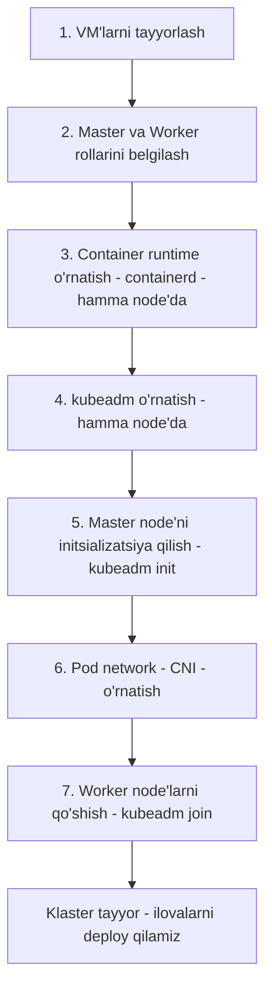

# Dars 261 — kubeadm bilan tanishuv: klasterni "qo'lda" emas, aqlli vosita bilan qurish

> 🎯 **Bu darsda nimani o'rganamiz:**
> - kubeadm nima va u qanday muammoni hal qilishini
> - Nega komponentlarni bittalab qo'lda o'rnatish og'ir ish ekanini
> - kubeadm bilan klaster qurishning umumiy qadamlarini (yuqori darajadagi reja)

Assalomu alaykum! Shu paytgacha Kubernetes klasterining ichki qismlarini — kube-apiserver, etcd, controller-manager, scheduler, kubelet, kube-proxy — nazariy jihatdan o'rgandik. Endi eng qiziq bosqichga keldik: o'z qo'limiz bilan haqiqiy, ko'p node'li (multi-node) klaster quramiz. Buni bizga **kubeadm** vositasi osonlashtirib beradi.

## 🏗️ Hayotiy o'xshatish

Uy qurishni tasavvur qiling. G'isht terish, elektr simlarini tortish, suv quvurlarini ulash, har bir xonaga alohida ruxsatnoma olish — hammasini o'zingiz bittalab qilsangiz, oylab vaqt ketadi va bir joyda xato qilsangiz, uy "ishlamaydi". **kubeadm** — bu tajribali prorab (qurilish boshlig'i): siz unga "mana yer maydoni (VM'lar), uy qur" deysiz, u esa hamma ishni to'g'ri tartibda, standartlarga (best practices) mos bajarib beradi. Sertifikatlar — bu binoning ruxsatnomalari, kubeadm ularni ham o'zi rasmiylashtiradi.

## kubeadm nima uchun kerak?

Kubernetes klasteri ko'plab komponentlardan tashkil topadi: kube-apiserver, etcd, controller'lar va hokazo. Oldingi bo'limlarda ko'rganimizdek, bu komponentlar bir-biri bilan xavfsiz gaplashishi uchun sertifikatlar (TLS) va to'g'ri konfiguratsiya kerak.

Agar hammasini qo'lda qilsak:

- har bir komponentni har bir node'ga alohida o'rnatish kerak,
- konfiguratsiya fayllarini o'zgartirib, komponentlarni bir-biriga "ko'rsatish" kerak,
- barcha sertifikatlarni o'zimiz yaratishimiz va tarqatishimiz kerak.

Bu juda zerikarli va xatoga moyil ish. **kubeadm** ana shu ishlarning hammasini o'z zimmasiga oladi: kerakli komponentlarni kerakli node'larda, to'g'ri tartibda o'rnatadi va sozlaydi.

## Klaster qurishning umumiy qadamlari

kubeadm bilan klaster ko'tarish jarayoni yuqori darajada mana bunday ko'rinadi:

1. **Bir nechta tizim (VM) tayyorlash** — klaster uchun bir nechta mashina kerak. Keyingi darsda buni o'z noutbukingizda qanday qilishni ko'ramiz.
2. **Rollarni belgilash** — bitta node'ni master (control plane) deb, qolganlarini worker deb tayinlaymiz.
3. **Container runtime o'rnatish** — BARCHA node'larga. Biz **containerd** ishlatamiz.
4. **kubeadm vositasini o'rnatish** — yana BARCHA node'larga. Aynan kubeadm keyin barcha kerakli komponentlarni to'g'ri node'larda, to'g'ri tartibda o'rnatib sozlaydi.
5. **Master serverni initsializatsiya qilish** — `kubeadm init`. Shu jarayonda control plane'ning barcha komponentlari master'da o'rnatiladi va sozlanadi.
6. **Tarmoq talablarini ta'minlash — Pod network.** Oddiy tarmoq ulanishi (ping ishlashi) yetarli emas! Kubernetes master va worker node'lar orasida maxsus tarmoq yechimini talab qiladi — bu **pod network** deb ataladi.
7. **Worker node'larni master'ga qo'shish** — `kubeadm join`. Shundan keyin klaster ilovalarni ishga tushirishga tayyor.

## Nega container runtime hamma node'ga kerak?

Bu savol ko'pchilikni chalg'itadi. Worker node'larda konteynerlar ishlashi tushunarli. Lekin master'da-chi? Gap shundaki, kubeadm control plane komponentlarining o'zini ham (apiserver, etcd, scheduler...) **konteyner (Pod) sifatida** ishga tushiradi. Konteyner bor joyda esa uni yurgizadigan runtime bo'lishi shart.

| Qadam | Qaysi node'larda bajariladi |
|---|---|
| Container runtime (containerd) o'rnatish | Barcha node'lar (master + worker) |
| kubeadm, kubelet, kubectl o'rnatish | Barcha node'lar |
| `kubeadm init` | Faqat master node |
| Pod network (CNI) o'rnatish | Master'dan bitta buyruq bilan (agent hamma node'ga o'zi tarqaladi) |
| `kubeadm join` | Faqat worker node'lar |

## ❓ Savol-Javob

"Savol:" kubeadm klasterni "boshqaradimi" yoki faqat "o'rnatadimi"?
"Javob:" kubeadm — bu bootstrap (birinchi ishga tushirish) vositasi. U klasterni quradi, sozlaydi va yangilashda (upgrade) yordam beradi, lekin kunlik boshqaruv `kubectl` orqali bo'ladi.

"Savol:" Node'lar orasida ping ishlayapti — demak, tarmoq tayyor, to'g'rimi?
"Javob:" Yo'q! Oddiy tarmoq ulanishi yetarli emas. Pod'lar bir-biri bilan gaplashishi uchun maxsus **pod network** (CNI plagini) o'rnatish shart. Busiz node'lar `NotReady` holatda qoladi.

"Savol:" Minikube turganda nega kubeadm o'rganamiz?
"Javob:" Minikube — o'rganish uchun bitta node'li "o'yinchoq" muhit. kubeadm esa haqiqiy, ishlab chiqarishga (production) yaqin ko'p node'li klaster quradi — CKA imtihonida ham aynan kubeadm bilan qurilgan klasterlar ishlatiladi.

## 📌 CKA imtihon uchun maslahat

CKA imtihonida klasterni noldan qurish so'ralmasa ham, kubeadm bilan ishlash (masalan, klasterni upgrade qilish, node qo'shish, join token yaratish) tez-tez uchraydi. Yuqoridagi 7 qadamni ketma-ketligi bilan yodda tuting — ayniqsa "avval runtime, keyin kubeadm, keyin init, keyin CNI, oxirida join" tartibini. Tartib buzilsa, klaster ko'tarilmaydi.

## 📖 Asosiy atamalar

| Atama | Oddiy tushuntirish |
|---|---|
| kubeadm | Kubernetes klasterini best practice asosida qurib beruvchi rasmiy vosita |
| Bootstrap | Tizimni noldan birinchi marta ishga tushirish jarayoni |
| Container runtime | Konteynerlarni yurgizuvchi dastur (bizda containerd) |
| Master / Control plane node | Klasterni boshqaruvchi komponentlar joylashgan node |
| Worker node | Ilova konteynerlari ishlaydigan node |
| Pod network | Pod'lar bir-biri bilan gaplashishi uchun maxsus tarmoq yechimi (CNI) |

## 🔗 Manbalar

- kubeadm bilan klaster bootstrap qilish: https://kubernetes.io/docs/setup/production-environment/tools/kubeadm/create-cluster-kubeadm/
- kubeadm o'rnatish: https://kubernetes.io/docs/setup/production-environment/tools/kubeadm/install-kubeadm/
- kubeadm haqida umumiy ma'lumot: https://kubernetes.io/docs/reference/setup-tools/kubeadm/

---
*Bu dars KodeKloud CKA kursining 261-videosi asosida tayyorlandi.*
