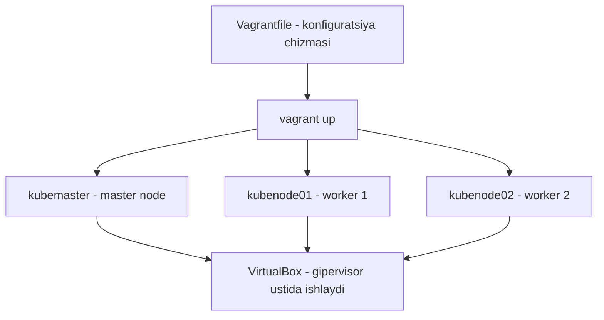

# Dars 263 — Vagrant bilan klaster uchun VM'larni tayyorlash

> 🎯 **Bu darsda nimani o'rganamiz:**
> - VirtualBox va Vagrant nima va ular qanday birga ishlashini
> - Kursning tayyor Vagrantfile'i bilan 1 master + 2 worker VM'ni bitta buyruq bilan ko'tarishni
> - `vagrant status`, `vagrant up`, `vagrant ssh` buyruqlarini amalda qo'llashni

Klaster qurishdan oldin bizga "temir" kerak — bir nechta mashina. Hammada 3 ta alohida server yo'q, shuning uchun ularni o'z noutbukimizda virtual mashina (VM) sifatida yaratamiz: **bitta master node va ikkita worker node**.

## 🚚 Hayotiy o'xshatish

VirtualBox — bu yer maydoni va qurilish texnikasi: uning ustida "uylar" (VM'lar) turadi. Vagrant esa — tayyor loyiha chizmasi bo'yicha ishlaydigan qurilish firmasi: siz unga chizmani (Vagrantfile) berasiz, u bitta buyurtma bilan uchta bir xil uyni qurib beradi. Chizma hamma uchun bir xil bo'lgani sababli, kursdagi barcha o'quvchilarda VM'lar aynan bir xil konfiguratsiyada chiqadi — "menda ishladi, senda ishlamadi" muammosi bo'lmaydi.

## Kerakli dasturlar (prerequisites)

Ikki dastur o'rnatilgan bo'lishi shart:

| Dastur | Vazifasi | Qayerdan olinadi |
|---|---|---|
| VirtualBox | Gipervisor — VM'larni real yurgizuvchi dastur | virtualbox.org → Downloads sahifasi, o'z OS'ingizni tanlang |
| Vagrant | Avtomatlashtirish vositasi — bitta buyruq bilan bir nechta VM'ni bir xil konfiguratsiyada ko'taradi | Vagrant rasmiy hujjatlaridagi o'rnatish qo'llanmasi (OS'ga qarab bir necha usul bor) |

💡 Ikkalasining o'rnatilishi oddiy: saytga kiring, OS'ingizga mos versiyani yuklab, qadamlarni bajaring.

## Vagrantfile — VM'larning "chizmasi"

Vagrant butun konfiguratsiyani **Vagrantfile** deb ataluvchi fayldan o'qiydi. Bizga uni o'zimiz yozish shart emas — kurs repozitoriysida tayyor turibdi:

```bash
git clone https://github.com/kodekloudhub/certified-kubernetes-administrator-course
cd certified-kubernetes-administrator-course
ls
```

`ls` qilganingizda papka ichida `Vagrantfile` ni ko'rasiz. Uni ochib qarasak, asosiy sozlamalar taxminan shunday:

```ruby
NUM_WORKER_NODE = 2

IP_NW = "192.168.56."
MASTER_IP_START = 10
NODE_IP_START = 20

Vagrant.configure("2") do |config|
  config.vm.box = "ubuntu/bionic64"
  # kubemaster  -> 192.168.56.11
  # kubenode01  -> 192.168.56.21
  # kubenode02  -> 192.168.56.22
  ...
end
```

Muhim nuqtalar:

- **1 ta master + 2 ta worker** node sozlangan;
- VM'lar (node'lar) IP manzillari **192.168.56.x** tarmog'idan olinadi — bu hali Kubernetes'ga aloqasi yo'q, oddiy host tarmog'i;
- bazaviy image sifatida **Ubuntu Bionic 64** ishlatiladi;
- qolgan tafsilotlarni hozircha bilish shart emas — xohlasangiz faylni ochib o'rganib chiqishingiz mumkin.



## VM'larni ko'tarish

Avval holatni tekshiramiz:

```bash
vagrant status
```

Natijada uchta VM ko'rinadi — `kubemaster`, `kubenode01`, `kubenode02` — va hammasi `not created` holatda, chunki hali hech narsa yaratmadik.

Endi hammasini bitta buyruq bilan ko'taramiz:

```bash
vagrant up
```

Bu buyruq uchchala VM'ni Vagrantfile'dagi aynan bir xil spetsifikatsiya bilan yaratadi. Jarayon:

1. avval **Ubuntu Bionic 64** bazaviy image'i yuklab olinadi;
2. keyin VM'lar ketma-ket ko'tariladi: avval `kubemaster`, keyin `kubenode01`, oxirida `kubenode02`.

⚠️ Bu qadam ancha vaqt oladi — bu normal holat, xavotir olmang, kutib turing.

Tugagach yana tekshiramiz:

```bash
vagrant status
```

Endi uchchala node `running` holatda — aynan bizga kerak bo'lgan natija.

## VM'larga SSH orqali ulanish

VM'ga ulanish uchun `vagrant ssh` buyrug'iga node nomini beramiz:

```bash
vagrant ssh kubemaster
```

Buyruq bizni avtomatik ravishda `kubemaster` node'iga ulaydi — parol so'ramaydi, terminal prompt'idan qaysi mashinada ekaningizni ko'rasiz. Ichkarida oddiy Linux buyruqlarini sinab ko'rish mumkin:

```bash
ls -la
```

Sessiyadan chiqish uchun:

```bash
logout
```

Bu bizni yana lokal mashinamizga qaytaradi. Endi worker node'larga ham ulanib tekshiramiz:

```bash
vagrant ssh kubenode01
uptime
```

`uptime` VM bir necha daqiqadan beri ishlab turganini ko'rsatadi — demak, haqiqatan `kubenode01` ichidamiz. Chiqib, ikkinchisiga ham ulanamiz:

```bash
logout
vagrant ssh kubenode02
```

Uchchala VM ishlayapti va ularga ulana olamiz — hammasi tayyor. Keyingi darsda ana shu VM'lar ustida kubeadm yordamida haqiqiy Kubernetes klasterini ko'taramiz.

## 🧪 Mustaqil topshiriqlar

> Yechishdan oldin darsni yopib qo'ying. Taxminiy vaqt: 15 daqiqa.

**1-topshiriq · oson.** Vagrant o'rnatilganini tekshiring.

<details><summary>O'zingizni tekshiring</summary>

```bash
vagrant --version
```
</details>

**2-topshiriq · o'rta.** Vagrantfile'dagi VM'lar sonini va resurslarini aniqlang.

<details><summary>O'zingizni tekshiring</summary>

```bash
grep -E 'memory|cpus|NODE_COUNT' Vagrantfile
```
</details>

**3-topshiriq · qiyin.** Klaster uchun VM'da swap nima uchun o'chiriladi? **Avval ayting.**

<details><summary>O'zingizni tekshiring</summary>

kubelet standart holatda **swap yoqilgan node'da ishga tushmaydi**.

Sababi: Kubernetes Pod'larga aniq xotira limiti beradi va bu limitni
hisoblash swap bo'lganda ishonchsiz bo'lib qoladi — Pod limitdan oshsa
ham diskga tushib ishlashda davom etadi, natijada butun node sekinlashadi.

```bash
sudo swapoff -a
sudo sed -i '/ swap / s/^/#/' /etc/fstab   # qayta yuklashdan keyin ham
```

(Yangi versiyalarda swap qo'llab-quvvatlashi alfa bosqichida bor, lekin
standart holatda hamon o'chirilgan bo'lishi kerak.)
</details>

## ❓ Savol-Javob

"Savol:" Nega VM'larni VirtualBox'ning o'zida qo'lda yaratmaymiz?
"Javob:" Qo'lda yaratsangiz ham bo'ladi, lekin 3 ta VM'ni bir xil sozlash — sekin va xatoga moyil. Vagrant bilan hamma narsa Vagrantfile'da yozilgan va `vagrant up` bitta buyruq bilan barchasini bir xil holatda ko'taradi. Buzilsa — `vagrant destroy` qilib qaytadan ko'tarasiz.

"Savol:" 192.168.56.x manzillari Kubernetes pod'lariga tegishlimi?
"Javob:" Yo'q. Bu VM'larning (node'larning) o'zaro gaplashadigan host tarmog'i. Pod'lar uchun alohida tarmoq (pod network CIDR) keyingi darsda `kubeadm init` paytida belgilanadi.

"Savol:" `vagrant ssh` parol so'ramadi — bu qanday ishlaydi?
"Javob:" Vagrant VM yaratishda avtomatik SSH kalit juftligini sozlab qo'yadi, shuning uchun `vagrant ssh <nom>` to'g'ridan-to'g'ri kiritadi.

## 📌 CKA imtihon uchun maslahat

Imtihonda Vagrant so'ralmaydi — u faqat mashq muhitini tayyorlash vositasi. Lekin uyda mashq qilish uchun bu eng qulay yo'l: kurs repozitoriysini (kodekloudhub/certified-kubernetes-administrator-course) klonlab, o'zingizga doimiy mashq klasterini ko'tarib oling. Klasterni buzib-tuzib mashq qilish — CKA'ga tayyorlanishning eng samarali usuli.

## 📖 Asosiy atamalar

| Atama | Oddiy tushuntirish |
|---|---|
| Gipervisor | Bitta fizik kompyuterda bir nechta VM yurgizuvchi dastur (VirtualBox) |
| Vagrant | VM'larni kod (Vagrantfile) orqali avtomatik yaratuvchi vosita |
| Vagrantfile | VM'lar soni, image, IP kabi sozlamalar yozilgan konfiguratsiya fayli |
| Box / image | VM uchun tayyor bazaviy OS shabloni (ubuntu/bionic64) |
| Provision | VM'ni yaratish va sozlash jarayoni |
| vagrant ssh | Vagrant yaratgan VM'ga parolsiz SSH orqali kirish buyrug'i |

## 🔗 Manbalar

- Kurs repozitoriysi (Vagrantfile shu yerda): https://github.com/kodekloudhub/certified-kubernetes-administrator-course
- VirtualBox yuklab olish: https://www.virtualbox.org/wiki/Downloads
- Vagrant o'rnatish qo'llanmasi: https://developer.hashicorp.com/vagrant/docs/installation
- kubeadm o'rnatishdan oldingi talablar: https://kubernetes.io/docs/setup/production-environment/tools/kubeadm/install-kubeadm/

---
*Bu dars KodeKloud CKA kursining 263-videosi asosida tayyorlandi.*
