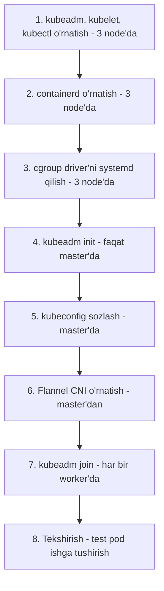

# Dars 264 — Katta amaliy demo: kubeadm bilan klasterni noldan ko'tarish

> 🎯 **Bu darsda nimani o'rganamiz:**
> - Barcha node'larga kubeadm, kubelet, kubectl va containerd o'rnatishni
> - cgroup driver nima va nega kubelet bilan containerd'da bir xil bo'lishi shartligini
> - `kubeadm init` bilan master'ni ko'tarish, kubeconfig sozlash, Flannel CNI o'rnatishni
> - `kubeadm join` bilan worker node'larni klasterga qo'shishni

Oldingi darsda Vagrant bilan uchta VM tayyorlagan edik. Endi ular ustida haqiqiy Kubernetes klasterini bootstrap qilamiz. Bu dars — bo'limning yuragi, shuning uchun har bir qadamni alohida, buyruqlari bilan beramiz.

## 🍽️ Hayotiy o'xshatish

Bu jarayon restoran ochishga o'xshaydi. Avval har bir filialga oshxona jihozini o'rnatamiz (containerd — konteynerlarni "pishiradigan" plita), keyin menejerlik dasturini (kubeadm/kubelet/kubectl), so'ng bosh ofisni ishga tushiramiz (`kubeadm init` — control plane), filiallar orasiga yetkazib berish yo'llarini quramiz (Flannel — pod network), va nihoyat filiallarni bosh ofisga rasmiy ulaymiz (`kubeadm join`).

## Boshlang'ich holat

Uchta VM tayyor, klaster ichidagi muloqot uchun asosiy interfeys — `enp0s8`:

| Node | Roli | IP manzil (enp0s8) |
|---|---|---|
| kubemaster | Master (control plane) | 192.168.56.11 |
| kubenode01 | Worker | 192.168.56.21 |
| kubenode02 | Worker | 192.168.56.22 |

⚠️ Har bir VM'da bir nechta interfeys bor. Ikkinchisi — Vagrant'ning ichki texnik interfeysi, u bizga kerak emas. Klaster muloqoti faqat **192.168.56.x** manzillar orqali bo'ladi — buni keyinroq `--apiserver-advertise-address` flagida aniq ko'rsatamiz.

Ishlashdan oldin rasmiy hujjatlarning ikki sahifasini ochib qo'ying (imtihonda ham shu odat asqotadi):

1. **Installing kubeadm** — kubeadm o'rnatish qo'llanmasi (versiyaga mos: biz **v1.31** ishlatamiz, bu paytdagi eng yangi versiya);
2. **Creating a cluster with kubeadm** — klaster yaratish qo'llanmasi. Agar bir nechta master node'li (HA) klaster qursangiz — "Creating Highly Available Clusters with kubeadm" sahifasi kerak bo'ladi; bizda bitta master, shuning uchun oddiy sahifa yetadi.



### 1-qadam: kubeadm, kubelet, kubectl o'rnatish (BARCHA node'larda)

Avval Kubernetes paket repozitoriysining ochiq imzo kalitini (public signing key) yuklab olamiz. Diqqat: kalit URL'ida versiya bor — v1.31 uchun `v1.31`, agar v1.32 o'rnatmoqchi bo'lsangiz, `v1.32` ga almashtirasiz. Quyidagi buyruqlarni **uchchala node'da** bajaramiz:

```bash
curl -fsSL https://pkgs.k8s.io/core:/stable:/v1.31/deb/Release.key | sudo gpg --dearmor -o /etc/apt/keyrings/kubernetes-apt-keyring.gpg
```

Keyin Kubernetes apt repozitoriysini qo'shamiz (yana uchchala node'da):

```bash
echo 'deb [signed-by=/etc/apt/keyrings/kubernetes-apt-keyring.gpg] https://pkgs.k8s.io/core:/stable:/v1.31/deb/ /' | sudo tee /etc/apt/sources.list.d/kubernetes.list
```

Va nihoyat paketlarni o'rnatamiz (uchchala node'da):

```bash
sudo apt-get update
sudo apt-get install -y kubelet kubeadm kubectl
sudo apt-mark hold kubelet kubeadm kubectl
```

💡 Hozircha texnik jihatdan faqat `kubeadm` kerak, `kubectl` va `kubelet` esa keyinroq baribir kerak bo'ladi — shuning uchun uchchalasini birdaniga o'rnatib qo'yamiz. `apt-mark hold` esa paketlar tasodifan avtomatik yangilanib ketishining oldini oladi.

O'rnatilgan versiyani tekshiramiz:

```bash
kubeadm version
```

Natija: major versiya `1`, minor versiya `31` — ya'ni **v1.31.1** o'rnatildi.

### 2-qadam: containerd o'rnatish (BARCHA node'larda)

Klaster yaratishdan oldin container runtime shart. Nega **hamma** node'da? Worker'larda ilova konteynerlari ishlaydi, master'da esa control plane komponentlarining o'zi Pod (konteyner) sifatida ishlaydi — demak, master'ga ham runtime kerak.

Rasmiy hujjatlar bir nechta runtime'ni qo'llab-quvvatlaydi; biz **containerd** ni tanlaymiz va uni apt orqali o'rnatamiz (uchchala node'da):

```bash
sudo apt update
sudo apt install -y containerd
```

### 3-qadam: cgroup driver'ni to'g'rilash (BARCHA node'larda)

Bu — hujjatlardagi "muhim" (important) deb belgilangan bo'lim. **Cgroups** — Linux'ning konteynerlarga resurs limiti qo'yish imkonini beruvchi mexanizmi (masalan, "bu konteyner faqat 512MB RAM ishlatsin" — bu aynan cgroups orqali ishlaydi).

kubelet va container runtime uchun ikkita cgroup driver mavjud:

| Driver | Izoh |
|---|---|
| `cgroupfs` | Standart (default) driver |
| `systemd` | Init tizimi systemd bo'lgan distributivlar uchun tavsiya etiladi |

⚠️ **Oltin qoida:** qaysi driver tanlanmasin, **kubelet ham, containerd ham AYNAN BIR XIL driver'da bo'lishi shart.** Aks holda klaster beqaror ishlaydi.

Avval init tizimimizni tekshiramiz:

```bash
ps -p 1
```

Natijada `systemd` chiqadi — demak, init tizimimiz systemd va hujjatlarga ko'ra cgroup driver ham `systemd` bo'lishi kerak.

**kubelet tomonida:** v1.22 dan boshlab, agar foydalanuvchi kubelet konfiguratsiyasida `cgroupDriver` maydonini bermasa, kubeadm avtomatik `systemd` ni qo'yadi. Biz v1.31 damiz — demak, kubelet uchun hech narsa qilish shart emas. (Agar qo'lda bermoqchi bo'lsangiz: kubeadm konfiguratsiya faylida KubeletConfiguration ichida `cgroupDriver: systemd` yozib, `kubeadm init --config` bilan uzatasiz.)

**containerd tomonida esa** standart holatda systemd ishlatilmaydi — buni o'zimiz sozlaymiz. Avval konfiguratsiya papkasini yaratamiz (uchchala node'da):

```bash
sudo mkdir -p /etc/containerd
```

containerd o'zining standart konfiguratsiyasini generatsiya qila oladi — uni ko'rish uchun:

```bash
containerd config default
```

Endi shu standart konfiguratsiyani olib, ichidagi `SystemdCgroup = false` ni `true` ga almashtirib, kerakli faylga yozamiz (uchchala node'da):

```bash
containerd config default | sed 's/SystemdCgroup = false/SystemdCgroup = true/' | sudo tee /etc/containerd/config.toml
```

Tekshirib olamiz — o'zgargan qator to'g'ri bo'limda turibdimi:

```bash
cat /etc/containerd/config.toml | grep -B 10 SystemdCgroup
```

Natijada quyidagini ko'rishimiz kerak — aynan hujjatda ko'rsatilgan joyda:

```toml
[plugins."io.containerd.grpc.v1.cri".containerd.runtimes.runc.options]
  SystemdCgroup = true
```

Konfiguratsiya o'zgargandan keyin containerd'ni qayta ishga tushirish shart (uchchala node'da):

```bash
sudo systemctl restart containerd
```

### 4-qadam: kubeadm init — master'ni initsializatsiya qilish (faqat MASTER'da)

Endi "Creating a cluster with kubeadm" hujjatiga qaytamiz. Birinchi initsializatsiya qilinadigan node — control plane node. `kubeadm init` ga beradigan flaglarimiz:

- `--apiserver-advertise-address` — kube-apiserver qaysi IP'da "e'lon qilinishini" bildiradi. Boshqa node'lar master bilan shu manzil orqali gaplashadi. VM'da bir nechta interfeys borligi uchun (Vagrant'niki ham bor) buni aniq ko'rsatamiz: master'da `ip a` qilib enp0s8 manzilini olamiz — **192.168.56.11**.
- `--pod-network-cidr` — pod'lar IP oladigan subnet. Biz **10.244.0.0/16** beramiz (Flannel'ning standart tarmog'i). Masalan 10.0.0.0/16 bersangiz, barcha pod'lar shu subnetdan IP oladi.
- `--upload-certs` — sertifikatlarni klaster ichidagi Secret'ga yuklaydi, boshqa (control plane) node'lar ularga ega bo'lishi uchun.
- `--control-plane-endpoint` — biz BERMAYMIZ. Bu flag keyinchalik bitta master'ni HA (ko'p master'li) klasterga aylantirish rejasi bo'lsa kerak: virtual IP / load balancer manzili beriladi. Bizda bitta master — kerak emas.
- `--cri-socket` — ham bermaymiz: kubeadm container runtime'ni ma'lum standart socket yo'llari ro'yxati orqali o'zi topadi; faqat nostandart joyda bo'lsa qo'lda beriladi.

Master node'da ishga tushiramiz:

```bash
sudo kubeadm init --apiserver-advertise-address=192.168.56.11 --pod-network-cidr=10.244.0.0/16 --upload-certs
```

kubeadm avval bir qancha tekshiruvlarni (preflight checks) o'tkazadi, keyin control plane'ni ko'taradi. Chiqarilgan log'ni o'qisangiz, u qadamma-qadam nima qilayotganini ko'rasiz:

1. CA sertifikatini generatsiya qiladi;
2. apiserver, etcd va boshqa komponentlar uchun sertifikatlar yaratadi;
3. kubelet uchun conf fayl, controller-manager konfiguratsiyasini yozadi;
4. komponentlar uchun **static pod manifest'larini** yaratadi va ularni ko'taradi.

Oxirida uchta muhim narsani beradi: kubeconfig'ni sozlash yo'riqnomasi, "pod network deploy qiling" eslatmasi va **worker'lar uchun `kubeadm join` buyrug'i** — uni albatta nusxalab, bloknotga saqlab qo'ying!

💡 Agar ko'p master'li (HA) klaster qursangiz, init chiqishida qo'shimcha yana bitta buyruq bo'lardi — boshqa control plane node'larni ulash uchun (o'z tokeni bilan). Bizda bitta master bo'lgani uchun faqat worker join buyrug'i chiqdi — bu aynan kutgan natijamiz.

### 5-qadam: kubeconfig sozlash (MASTER'da)

kubeadm klasterga ulanish uchun admin konfiguratsiya faylini yaratib qo'ydi. Uni ko'rish mumkin:

```bash
sudo cat /etc/kubernetes/admin.conf
```

Bu — kube config fayl, u orqali kubectl master bilan gaplashadi. Init chiqishidagi yo'riqnoma bo'yicha uni home papkamizga nusxalaymiz:

```bash
mkdir -p $HOME/.kube
sudo cp -i /etc/kubernetes/admin.conf $HOME/.kube/config
sudo chown $(id -u):$(id -g) $HOME/.kube/config
```

Endi kubectl ishlashi kerak:

```bash
kubectl get nodes
```

```
NAME         STATUS     ROLES           AGE   VERSION
kubemaster   NotReady   control-plane   1m    v1.31.1
```

Node `NotReady` holatda — bu **muammo emas, kutilgan holat**: hali tarmoq plaginini (CNI) o'rnatmadik. CNI o'rnatilgach `Ready` ga o'tadi.

### 6-qadam: Pod network — Flannel CNI o'rnatish (MASTER'dan)

Hujjatlardagi keyingi qadam — "Install a Pod network add-on". Add-on'lar ro'yxatidan biz **Flannel** ni tanlaymiz. Odatda CNI o'rnatish juda oson — tayyor manifest beriladi:

```bash
kubectl apply -f https://github.com/flannel-io/flannel/releases/latest/download/kube-flannel.yml
```

⚠️ **Muhim:** agar siz standart bo'lmagan pod CIDR ishlatsangiz (ya'ni 10.244.0.0/16 emas), manifestni avval yuklab olib, ichidagi tarmoqni o'zingiznikiga moslashingiz kerak. Ko'rish uchun:

```bash
wget https://github.com/flannel-io/flannel/releases/latest/download/kube-flannel.yml
```

Fayl ichida namespace, ServiceAccount, ClusterRole, ClusterRoleBinding va boshqa resurslar yaratiladi, tarmoq esa mana bu joyda sozlangan:

```json
net-conf.json: |
  {
    "Network": "10.244.0.0/16",
    "Backend": {
      "Type": "vxlan"
    }
  }
```

Bu qiymat `kubeadm init` da bergan `--pod-network-cidr` bilan **bir xil bo'lishi shart**. Biz aynan 10.244.0.0/16 ishlatganmiz — hech narsani o'zgartirmaymiz, to'g'ridan-to'g'ri apply qilamiz.

Tekshiramiz — Flannel `kube-system` ga emas, o'zining `kube-flannel` namespace'iga o'rnatiladi:

```bash
kubectl get namespace
kubectl get pods -n kube-flannel
```

Bitta flannel pod ishlayapti (hozircha node ham bitta). Endi node holatini qaytadan ko'ramiz:

```bash
kubectl get nodes
```

```
NAME         STATUS   ROLES           AGE   VERSION
kubemaster   Ready    control-plane   5m    v1.31.1
```

Tarmoq plagini o'rnatilgani uchun master `Ready` holatga o'tdi.

### 7-qadam: kubeadm join — worker'larni qo'shish (har bir WORKER'da)

Eng oson qadam. `kubeadm init` chiqishida saqlab qo'ygan join buyrug'imizni **har bir worker node'da** `sudo` bilan bajaramiz (token va hash sizda o'zgacha bo'ladi):

```bash
sudo kubeadm join 192.168.56.11:6443 --token <sizning-token> \
    --discovery-token-ca-cert-hash sha256:<sizning-hash>
```

Buyruq bir necha tekshiruv o'tkazadi, kubelet'ga yangi xavfsiz ulanish ma'lumotlarini beradi, node apiserver'ga ulanadi va "successfully joined the cluster" xabari chiqadi. Xuddi shu buyruqni `kubenode02` da ham bajaramiz.

### 8-qadam: Yakuniy tekshirish va test pod

Master'ga qaytib:

```bash
kubectl get nodes
```

```
NAME         STATUS   ROLES           AGE   VERSION
kubemaster   Ready    control-plane   10m   v1.31.1
kubenode01   Ready    <none>          2m    v1.31.1
kubenode02   Ready    <none>          1m    v1.31.1
```

Flannel namespace'ini yana tekshirsak, endi **uchta** pod ko'ramiz:

```bash
kubectl get pods -n kube-flannel
```

Sababi: Flannel har bir node'da o'z agentini (DaemonSet orqali) yurgizadi — har yangi node qo'shilganda yana bitta flannel pod avtomatik paydo bo'ladi.

Oxirgi imtihon — oddiy pod ishga tushirib ko'ramiz:

```bash
kubectl run web --image=nginx
kubectl get pod -w
```

Pod avval `ContainerCreating`, keyin `Running` holatga o'tadi (`-w` — watch, jonli kuzatish). Hammasi ishlayapti! Test podini o'chirib qo'yamiz:

```bash
kubectl delete pod web
```

Tabriklayman — kubeadm yordamida to'laqonli, 3 node'li Kubernetes klasterini muvaffaqiyatli qurdik!

## ❓ Savol-Javob

"Savol:" `kubeadm init` dan keyin master nega `NotReady` edi?
"Javob:" Chunki hali CNI (pod network plagini) o'rnatilmagan edi. kubelet tarmoq plaginini topa olmasa, node'ni `NotReady` deb belgilaydi. Flannel o'rnatilishi bilan `Ready` bo'ldi.

"Savol:" `--pod-network-cidr=10.244.0.0/16` bilan Flannel'dagi Network qiymati mos kelmasa nima bo'ladi?
"Javob:" Pod'lar noto'g'ri subnetdan IP olishga urinadi va pod'lararo tarmoq ishlamaydi. Yechim: yoki init'da Flannel'ning standart 10.244.0.0/16 ini bering, yoki kube-flannel.yml dagi `net-conf.json` ichidagi `Network` ni o'z CIDR'ingizga moslang.

"Savol:" Join buyrug'idagi tokenni yo'qotib qo'ydim. Endi nima qilaman?
"Javob:" Master'da `kubeadm token create --print-join-command` bajaring — yangi token bilan tayyor join buyrug'ini chiqarib beradi.

"Savol:" cgroup driver'ni nega aynan `systemd` qildik?
"Javob:" Chunki `ps -p 1` bizning tizimda init sifatida systemd ishlayotganini ko'rsatdi. Hujjatlar qoidasi: init tizimi systemd bo'lsa, cgroup driver ham systemd bo'lsin — va kubelet hamda containerd ikkalasida bir xil bo'lishi shart.

## 📌 CKA imtihon uchun maslahat

Imtihonda kubernetes.io hujjatlaridan foydalanish mumkin — "Installing kubeadm" va "Creating a cluster with kubeadm" sahifalarining qayerdaligini oldindan bilib oling, buyruqlarni yodlab o'tirmang, lekin QADAMLAR TARTIBINI aniq biling: runtime → kubeadm/kubelet/kubectl → init (to'g'ri flaglar bilan) → kubeconfig → CNI → join. Eng ko'p yo'qotiladigan ballar: `--apiserver-advertise-address` ga noto'g'ri interfeys IP'sini berish va CIDR nomuvofiqligi. Yana: `kubeadm token create --print-join-command` — imtihonda node qo'shish topshirig'ining kaliti.

## 📖 Asosiy atamalar

| Atama | Oddiy tushuntirish |
|---|---|
| kubeadm init | Master (control plane) node'ni initsializatsiya qiluvchi buyruq |
| kubeadm join | Worker node'ni mavjud klasterga ulovchi buyruq |
| cgroups | Linux'da konteynerlarga CPU/RAM limiti qo'yish mexanizmi |
| cgroup driver | kubelet/runtime cgroups bilan qanday gaplashishini belgilaydi (cgroupfs yoki systemd) |
| Static pod manifest | kubelet apiserver'siz ham o'qib ishga tushiradigan pod ta'rifi (control plane shu tarzda ko'tariladi) |
| kubeconfig (admin.conf) | kubectl'ning klasterga ulanish ma'lumotlari yozilgan fayl |
| CNI / Flannel | Pod tarmog'ini ta'minlovchi plagin; Flannel — eng sodda variantlaridan biri |
| Preflight checks | kubeadm init/join oldidan tizim talablarini tekshirish bosqichi |

## 🔗 Manbalar

- kubeadm o'rnatish (v1.31): https://kubernetes.io/docs/setup/production-environment/tools/kubeadm/install-kubeadm/
- kubeadm bilan klaster yaratish: https://kubernetes.io/docs/setup/production-environment/tools/kubeadm/create-cluster-kubeadm/
- HA klaster yaratish: https://kubernetes.io/docs/setup/production-environment/tools/kubeadm/high-availability/
- Container runtime'lar va cgroup driver: https://kubernetes.io/docs/setup/production-environment/container-runtimes/
- containerd o'rnatish hujjati: https://github.com/containerd/containerd/blob/main/docs/getting-started.md
- Tarmoq add-on'lari ro'yxati: https://kubernetes.io/docs/concepts/cluster-administration/addons/
- Flannel: https://github.com/flannel-io/flannel

---
*Bu dars KodeKloud CKA kursining 264-videosi asosida tayyorlandi.*
