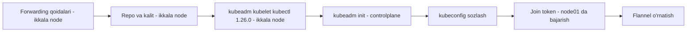

# 🧪 Lab 266 — Yechim: kubeadm yordamida Kubernetes klasterini deploy qilish

> 🎯 **Bu labda nimani mashq qilamiz:**
> - controlplane va node01 ga ANIQ versiyali (1.26.0) kubeadm/kubelet/kubectl o'rnatishni
> - `curl failed writing body` xatosini tushunish va tuzatishni (keyrings papkasi muammosi)
> - `kubeadm init` + kubeconfig + join token + Flannel bilan klasterni to'liq ko'tarishni

Bu — 264-darsdagi demo'ning lab varianti. Farqi: bu yerda **aniq versiya (1.26.0)** talab qilinadi va yo'lda bitta klassik xatoga duch kelamiz — uni birga hal qilamiz.

## 🔧 Hayotiy o'xshatish

Demo darsda "eng yangi modeldagi" uskunani o'rnatgan edik. Ishlab chiqarishda esa ko'pincha "aynan shu model, shu versiya" degan buyurtma keladi — chunki butun tizim shu versiyaga moslab tekshirilgan. Bu labda ham xuddi shunday: `apt install kubeadm` deb eng yangisini emas, `kubeadm=1.26.0-00` deb aynan so'ralgan versiyani o'rnatamiz.

## Masala sharti (qisqacha)

1. controlplane va node01 ga **kubeadm** va **kubelet** paketlarining **1.26.0** versiyasini o'rnating (kubectl ham).
2. O'rnatilgan kubelet versiyasini aniqlang.
3. Klasterda nechta node borligini ayting.
4. controlplane'ni `kubeadm init` bilan initsializatsiya qiling: apiserver advertise address = eth0 IP'si, pod network CIDR = `10.244.0.0/16`; keyin kubeconfig'ni sozlang.
5. Join token oling.
6. node01 ni klasterga qo'shing.
7. Flannel tarmoq plaginini o'rnating.

Ish muhiti: ikkita terminal — birinchisi controlplane'ga ulangan, ikkinchisidan node01 ga SSH qilamiz.



## Yechim

### 1-qadam: Tarmoq forwarding qoidalarini yoqish (ikkala node'da)

Hujjatlardagi container runtime sahifasi har doim avval mana bu prerequisit qoidalarni sozlashni aytadi — ularni **controlplane va node01 ikkalasida** bajaramiz:

```bash
cat <<EOF | sudo tee /etc/sysctl.d/k8s.conf
net.ipv4.ip_forward = 1
EOF

# Reboot'siz qo'llash
sudo sysctl --system
```

### 2-qadam: Distributivni aniqlash (ikkala node'da)

O'rnatish yo'riqnomasi distributivga qarab farq qiladi (Debian/Ubuntu vs RedHat). Tekshiramiz:

```bash
cat /etc/*-release
```

Ikkala node ham **Ubuntu** — demak, Debian turidagi (apt) yo'riqnomadan yuramiz.

### 3-qadam: apt repozitoriyasini tayyorlash (ikkala node'da)

Avval kerakli yordamchi paketlar:

```bash
sudo apt-get update
sudo apt-get install -y apt-transport-https ca-certificates curl
```

Keyin ochiq imzo kalitini (Google Cloud public signing key) yuklab olamiz:

```bash
curl -fsSL https://packages.cloud.google.com/apt/doc/apt-key.gpg | sudo gpg --dearmor -o /etc/apt/keyrings/kubernetes-archive-keyring.gpg
```

⚠️ Va mana xato chiqdi:

```
curl: (23) Failed writing body
```

Bu xato biroz chalg'ituvchi. Aslida gap shundaki: kalitni `/etc/apt/keyrings` papkasiga yozmoqchimiz, lekin hujjatlarda aytilganidek, **Debian 12 va Ubuntu 22.04 dan ESKI relizlarda bu papka mavjud emas** — uni o'zimiz yaratishimiz kerak:

```bash
sudo mkdir -p /etc/apt/keyrings
```

Papkani yaratgach, yuqoridagi `curl ... | gpg` buyrug'ini ikkala node'da qaytadan bajaramiz — endi hech qanday xato chiqmaydi.

Endi Kubernetes apt repozitoriysini qo'shamiz (ikkala node'da):

```bash
echo "deb [signed-by=/etc/apt/keyrings/kubernetes-archive-keyring.gpg] https://apt.kubernetes.io/ kubernetes-xenial main" | sudo tee /etc/apt/sources.list.d/kubernetes.list
```

Va yangilaymiz:

```bash
sudo apt-get update
```

### 4-qadam: Aynan 1.26.0 versiyani o'rnatish (ikkala node'da)

⚠️ Hujjatdagi `sudo apt-get install -y kubelet kubeadm kubectl` buyrug'ini AYNAN ko'chirib bo'lmaydi — u **eng yangi** versiyani o'rnatadi, bizga esa **1.26.0** kerak. Versiya paket nomidan keyin `=` bilan beriladi:

```bash
sudo apt install -y kubeadm=1.26.0-00 kubelet=1.26.0-00 kubectl=1.26.0-00
```

Va versiyalar qimirlamasligi uchun hold qilamiz:

```bash
sudo apt-mark hold kubelet kubeadm kubectl
```

Shu bilan birinchi topshiriq bajarildi — validatsiyadan o'tadi.

### 5-qadam: kubelet versiyasini tekshirish

```bash
kubelet --version
```

```
Kubernetes v1.26.0
```

Javob: **1.26.0** — o'zimiz o'rnatgan versiya.

### 6-qadam: Klasterda nechta node bor?

controlplane'da:

```bash
kubectl get nodes
```

```
E... couldn't get current server API group list ...
The connection to the server localhost:8080 was refused
```

Bu xato **kutilgan holat**: klasterni hali initsializatsiya qilmadik — `kubeadm init` ishga tushirilmagan, apiserver yo'q. Demak, javob: **0 ta node**.

### 7-qadam: kubeadm init (controlplane'da)

Shart bo'yicha ikkita flag beramiz: apiserver advertise manzili — **eth0 interfeysining IP'si**, pod tarmog'i — **10.244.0.0/16**. Avval IP'ni aniqlaymiz:

```bash
ip add
```

`eth0` interfeysida IP: **192.7.220.6** (sizning labda boshqacha bo'lishi mumkin — o'zingiznikini oling).

Endi init:

```bash
kubeadm init --apiserver-advertise-address=192.7.220.6 --pod-network-cidr=10.244.0.0/16
```

💡 Buyruq nomida xato qilmang: `kubeadm` (video muallifi ham avval typo qilib yubordi). Jarayon bir-ikki daqiqa davom etadi.

### 8-qadam: kubeconfig sozlash (controlplane'da)

Init tugagach, chiqishdagi yo'riqnoma bo'yicha standart kubeconfig'ni sozlaymiz:

```bash
mkdir -p $HOME/.kube
sudo cp -i /etc/kubernetes/admin.conf $HOME/.kube/config
sudo chown $(id -u):$(id -g) $HOME/.kube/config
```

Tekshiramiz:

```bash
kubectl get nodes
```

```
NAME           STATUS     ROLES           AGE   VERSION
controlplane   NotReady   control-plane   1m    v1.26.0
```

Bitta control plane node bor, holati `NotReady` — bu ham kutilgan: hali tarmoq plagini yo'q.

### 9-qadam: Join token olish

Ikki yo'l bor:

1. `kubeadm init` chiqishining oxiridagi tayyor `kubeadm join ...` buyrug'ini nusxalash (biz shu yo'ldan boramiz);
2. yoki yangi token generatsiya qilish:

```bash
kubeadm token create --print-join-command
```

### 10-qadam: node01 ni klasterga qo'shish

Nusxalagan join buyrug'ini **node01 terminalida** bajaramiz (token/hash sizda o'zgacha):

```bash
sudo kubeadm join 192.7.220.6:6443 --token <token> --discovery-token-ca-cert-hash sha256:<hash>
```

Validatsiya o'tadi — node01 klasterga qo'shildi.

### 11-qadam: Flannel tarmoq plaginini o'rnatish (controlplane'da)

Oxirgi topshiriq — **flannel** o'rnatish. `kubeadm init` chiqishida tarmoq add-on'lari ro'yxatiga havola bor edi — o'sha sahifadan Flannel'ni tanlasak, deploy bitta buyruq ekanini ko'ramiz:

```bash
kubectl apply -f https://github.com/flannel-io/flannel/releases/latest/download/kube-flannel.yml
```

Bir necha soniya kutamiz — initsializatsiyaga vaqt kerak. Keyin tekshiramiz:

```bash
kubectl get pod -A
```

Flannel pod'lari ishga tushgan, node'lar `Ready` holatga o'tadi. Validatsiya — muvaffaqiyatli. Lab tugadi!

## Xatolar va sabablar jadvali

| Ko'ringan xato / holat | Asl sabab | Yechim |
|---|---|---|
| `curl: failed writing body` | `/etc/apt/keyrings` papkasi eski Ubuntu'da (22.04 dan oldingi) mavjud emas | `sudo mkdir -p /etc/apt/keyrings`, keyin buyruqni qaytarish |
| `couldn't get current server API group list` | Klaster hali init qilinmagan, apiserver ishlamayapti | Kutilgan holat — `kubeadm init` dan keyin yo'qoladi |
| Node `NotReady` | CNI (tarmoq plagini) o'rnatilmagan | Flannel'ni apply qilish |
| apt eng yangi versiyani o'rnatib yubordi | Versiya ko'rsatilmagan | `paket=1.26.0-00` sintaksisi bilan aniq versiya berish |

## ❓ Savol-Javob

"Savol:" Nega `apt install kubeadm` emas, `apt install kubeadm=1.26.0-00`?
"Javob:" Oddiy `apt install` repodagi eng yangi versiyani oladi. Klaster komponentlari versiyalari kelishilgan bo'lishi kerak — masala aniq 1.26.0 ni so'ragan, shuning uchun `=` bilan versiyani qotirib beramiz.

"Savol:" `--apiserver-advertise-address` uchun IP'ni qayerdan oldik?
"Javob:" `ip add` buyrug'i bilan `eth0` interfeysining manzilini ko'rdik (labda 192.7.220.6). Aynan shu interfeys orqali boshqa node'lar master bilan gaplashadi.

"Savol:" Join buyrug'ini yo'qotdim, init chiqishi ham o'chib ketgan bo'lsa-chi?
"Javob:" controlplane'da `kubeadm token create --print-join-command` — yangi token bilan to'liq join buyrug'ini beradi.

## 📌 CKA imtihon uchun maslahat

`curl failed writing body` singari "yolg'onchi" xatolarga imtihonda ham duch kelasiz. Qoida: xato matniga emas, KONTEKSTGA qarang — fayl qayerga yozilyapti, o'sha papka bormi? Hujjatlarning "Note" bloklarini o'qish odatini chiqaring: keyrings papkasi haqidagi izoh aynan shunday blokda yozilgan edi. Va versiya qotirish sintaksisini yod oling: `apt install kubeadm=<versiya>` + `apt-mark hold`.

## 📖 Asosiy atamalar

| Atama | Oddiy tushuntirish |
|---|---|
| ip_forward | Linux'ga kelgan paketlarni boshqa interfeysga uzatishga ruxsat beruvchi kernel sozlamasi |
| GPG kalit / keyring | Paketlar haqiqiyligini tekshirish uchun repozitoriy imzo kaliti saqlanadigan joy |
| apt-mark hold | Paketni avtomatik yangilanishdan "muzlatib" qo'yish |
| Join token | Worker node'ning klasterga xavfsiz qo'shilishi uchun vaqtinchalik kalit |
| discovery-token-ca-cert-hash | Worker master'ning haqiqiyligini tekshiradigan CA sertifikat xeshi |
| Flannel | Sodda va mashhur pod network (CNI) plagini |

## 🔗 Manbalar

- kubeadm o'rnatish: https://kubernetes.io/docs/setup/production-environment/tools/kubeadm/install-kubeadm/
- kubeadm bilan klaster yaratish: https://kubernetes.io/docs/setup/production-environment/tools/kubeadm/create-cluster-kubeadm/
- Container runtime prerequisitlari (forwarding, sysctl): https://kubernetes.io/docs/setup/production-environment/container-runtimes/
- kubeadm token buyrug'i: https://kubernetes.io/docs/reference/setup-tools/kubeadm/kubeadm-token/
- Flannel: https://github.com/flannel-io/flannel

---
*Bu dars KodeKloud CKA kursining 266-videosi asosida tayyorlandi.*
