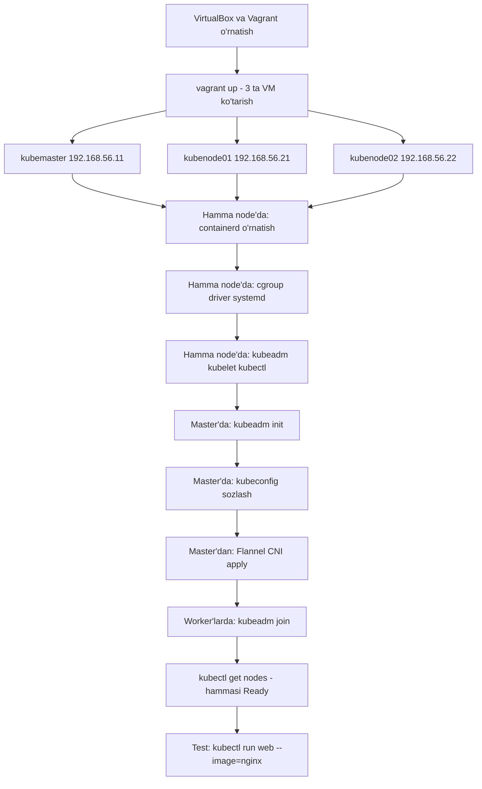

# ⚙️ 11-bo'lim — Kubernetesni kubeadm bilan o'rnatish

CKA kursining "11 - Install Kubernetes the kubeadm way" bo'limi asosida tayyorlangan o'zbekcha darsliklar. Bu bo'limda nazariyadan amaliyotga o'tamiz: o'z noutbukimizda Vagrant bilan VM'lar ko'tarib, ular ustida **kubeadm** yordamida haqiqiy 3 node'li (1 master + 2 worker) Kubernetes klasterini noldan quramiz.

## 📚 Darslar tartibi

| # | Fayl | Mavzu |
|---|---|---|
| 261 | [261_Kubeadm_kirish.md](261_Kubeadm_kirish.md) | kubeadm nima, klaster qurishning 7 qadamlik umumiy rejasi |
| 263 | [263_Vagrant_VM_tayyorlash.md](263_Vagrant_VM_tayyorlash.md) | VirtualBox + Vagrant: 1 master + 2 worker VM'ni ko'tarish, SSH |
| 264 | [264_Kubeadm_demo.md](264_Kubeadm_demo.md) | Katta amaliy demo: containerd, cgroup driver, kubeadm init, kubeconfig, Flannel, kubeadm join |
| 266 | [Lab_266_Kubeadm_klaster.md](Lab_266_Kubeadm_klaster.md) | 🧪 Lab yechimi: 1.26.0 versiyali klaster, keyrings xatosi, join, Flannel |

💡 262-video alohida dars emas — resurslar sahifasi; uning havolalari quyidagi "Foydali manbalar" bo'limiga kiritilgan.

## 🗺️ O'rnatish jarayonining oqim diagrammasi

## 💡 Qanday o'qish kerak

1. Avval 261 ni o'qib umumiy rejani tushunib oling — qolgan darslar shu rejaning bosqichlari.
2. 263 va 264 ni kompyuteringizda birga bajarib boring — VM'lar bilan mashq qilish xavfsiz: buzilsa `vagrant destroy` qilib qaytadan boshlaysiz.
3. 264-darsda buyruqlarning qaysi node'da bajarilishiga alohida e'tibor bering (hamma node'da / faqat master / faqat worker).
4. Lab 266 dagi xatolar jadvalini takrorlang — imtihonda ham xuddi shu xatolar uchraydi.

## 🔗 Foydali manbalar

262 - Resources sahifasidan:

- Keyingi videoda ishlatiladigan Vagrantfile joylashgan kurs repozitoriysi: https://github.com/kodekloudhub/certified-kubernetes-administrator-course
- kubeadm o'rnatish rasmiy hujjati: https://kubernetes.io/docs/setup/production-environment/tools/kubeadm/install-kubeadm/

Qo'shimcha:

- kubeadm bilan klaster yaratish: https://kubernetes.io/docs/setup/production-environment/tools/kubeadm/create-cluster-kubeadm/
- Container runtime'lar: https://kubernetes.io/docs/setup/production-environment/container-runtimes/
- Tarmoq add-on'lari: https://kubernetes.io/docs/concepts/cluster-administration/addons/
- Flannel CNI: https://github.com/flannel-io/flannel

---
*Bu bo'lim KodeKloud CKA kursining 11-bo'limi asosida o'zbek tilida tayyorlandi.*
