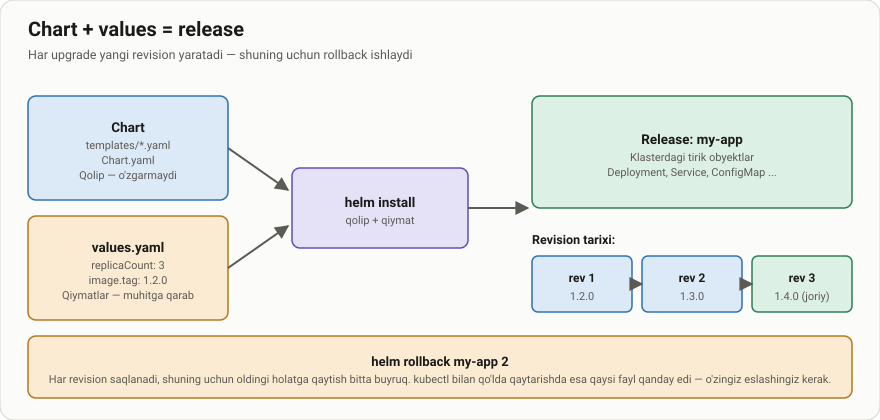
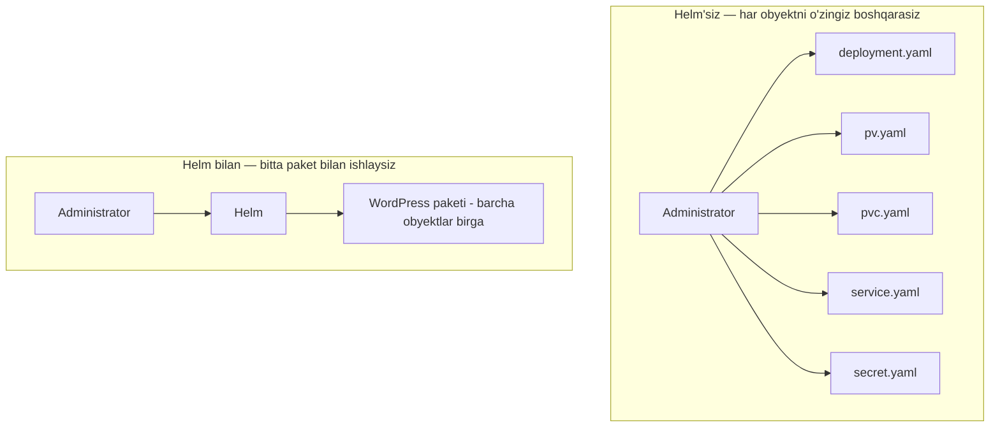
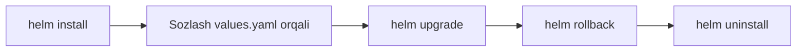

# Dars 267 — Helm bilan tanishuv: nima uchun u kerak?

> 🎯 **Bu darsda nimani o'rganamiz:**
> - Kubernetes'da katta ilovalarni "qo'lda" boshqarish nima uchun qiyin (WordPress misoli)
> - Helm nima va nima uchun uni "Kubernetes uchun package manager" deb atashadi
> - Helm bizga qanday yordam beradi: install, sozlash, upgrade, rollback, uninstall

## Muammo: Kubernetes ilovasi — bu bitta narsa emas, o'nlab bo'laklar

Kubernetes murakkab infratuzilmalarni boshqarishda juda zo'r. Lekin biz — odamlar — murakkablik bilan ishlashda qiynalamiz. Klasterga joylashtiradigan ilovalarimiz juda ko'p obyektlardan tashkil topadi va bu obyektlar bir-biri bilan bog'lanib ishlashi kerak.

Oddiy misol olaylik — **WordPress sayti**. Qarasangiz "oddiy sayt", lekin unga kamida shular kerak:

| Obyekt | Nima uchun kerak |
|---|---|
| Deployment | Pod'larni ishga tushirish (MySQL database server, web server) |
| PersistentVolume (PV) | Ma'lumotlar bazasini diskda saqlash |
| PersistentVolumeClaim (PVC) | PV'dan joy so'rash |
| Service | Pod'dagi web serverni internetga ochish |
| Secret | Admin parol va boshqa maxfiy ma'lumotlarni saqlash |
| Job, CronJob va h.k. | Qo'shimcha narsalar: davriy backup'lar va boshqalar |

Har bir obyekt uchun alohida YAML fayl kerak. Keyin har bir faylga `kubectl apply` qilamiz. Bu zerikarli ish, lekin muammo bu bilan tugamaydi:

- **Sozlashni o'zgartirish**: internetdan yuklab olgan YAML'larda PV hajmi 20 GB, bizga 100 GB kerak. Har bir faylni ochib, kerakli joyni topib, tahrirlashimiz kerak.
- **Upgrade**: ikki oy o'tib, ilovani yangilash kerak bo'lsa — yana bir nechta YAML faylni ehtiyotkorlik bilan tahrirlaymiz, noto'g'ri joyni o'zgartirib yubormaslik uchun qo'rqib ishlaymiz.
- **O'chirish**: ilovani o'chirmoqchi bo'lsak, unga tegishli HAR BIR obyektni eslab qolib, birma-bir o'chirishimiz kerak.

"Hammasini bitta katta YAML faylga yozib qo'ysak-chi?" — deb o'ylashingiz mumkin. Bo'ladi, lekin unda 25 sahifalik matn ichidan kerakli joyni qidirish yanada og'ir bo'ladi. Hech bo'lmasa alohida fayllarda tartib bor: Deployment'ga oid narsa `mydeployment.yaml` ichida ekanini bilamiz.

## 💡 Hayotiy o'xshatish: kompyuter o'yini o'rnatuvchisi (installer)

Kompyuter o'yini yuz minglab fayllardan iborat: dastur kodi, musiqa va tovushlar, grafika va tekstura fayllari, konfiguratsiya ma'lumotlari... Tasavvur qiling, har bir faylni alohida-alohida qo'lda yuklab olishingiz kerak bo'lsa — bu azob bo'lardi.

Baxtimizga, o'yin bilan birga **installer** keladi: ishga tushiramiz, papkani tanlaymiz, "Install" tugmasini bosamiz — va installer minglab fayllarni o'z joyiga o'zi qo'yib chiqadi.

**Helm ham xuddi shunday ish qiladi** — faqat YAML fayllar va Kubernetes obyektlari uchun. Bitta buyruq bilan butun ilovani o'rnatamiz, yuzlab obyekt kerak bo'lsa ham, Helm hammasini o'zi klasterga qo'shib chiqadi.

## Helm — paradigmani o'zgartiradi

Gap shundaki, Kubernetes bizning ilovamizga "yaxlit bir narsa" deb qaramaydi. U faqat alohida obyektlarni ko'radi: mana PV, mana Deployment, mana Secret, mana Service. Bularning hammasi "WordPress" degan bitta katta ilovaning qismlari ekanini Kubernetes bilmaydi — har birini alohida-alohida boshqaradi.

**Helm esa boshidanoq aynan shu narsani bilish uchun yaratilgan.** Shuning uchun uni **Kubernetes uchun package manager** (paket menejeri) deb atashadi. U obyektlarga bitta katta **paketning** qismlari sifatida qaraydi. Biror amal bajarish kerak bo'lsa, Helm'ga qaysi obyektlarga tegishini aytmaymiz — faqat **paket nomini** aytamiz (masalan, "WordPress ilovam"). Paket nomiga qarab, Helm o'zi qaysi obyektlarni va qanday o'zgartirish kerakligini biladi — hatto o'sha paketga yuzlab obyekt tegishli bo'lsa ham.

## Helm bizga nima beradi?

1. **Bitta buyruq bilan o'rnatish** — yuzlab obyekt bo'lsa ham, Helm hammasini avtomatik yaratadi, mayda detallar bilan boshimizni og'ritmaydi.

2. **Bitta joyda sozlash** — o'nlab YAML faylni tahrirlash o'rniga, barcha sozlamalar **bitta faylda** — `values.yaml` da turadi. U yerda PV hajmini, sayt nomini, admin parolni, database sozlamalarini o'zgartirishimiz mumkin.

3. **Bitta buyruq bilan upgrade** — Helm qaysi obyektlarni qanday o'zgartirish kerakligini o'zi biladi.

4. **Rollback (orqaga qaytish)** — Helm ilovaga qilingan barcha o'zgarishlarni kuzatib boradi, shuning uchun oldingi **revision** (versiya holati) ga qaytish mumkin.

5. **Bitta buyruq bilan o'chirish** — Helm har bir ilovaga qaysi obyektlar tegishli ekanini eslab qoladi, shuning uchun nimani o'chirishni o'zi biladi. Endi 10 ta alohida buyruq kerak emas.

Xulosa qilib aytganda: Helm ham **package manager** (o'rnatish/o'chirish ustasi), ham **release manager** (yangilash va orqaga qaytarishga yordamchi) bo'lib ishlaydi. Eng muhimi — u bizga Kubernetes ilovalarini "obyektlar to'plami" emas, **yaxlit ilova (app)** sifatida boshqarish imkonini beradi. Bu yelkamizdan katta yukni oladi: endi har bir obyektni alohida nazorat qilishimiz shart emas — buni Helm qiladi.

## ❓ Savol-Javob

**Savol:** Nima uchun Kubernetes'ning o'zi ilovani "yaxlit paket" sifatida boshqara olmaydi?
**Javob:** Kubernetes faqat alohida obyektlar (Deployment, Service, Secret...) bilan ishlaydi va ular orasidagi "bular bitta ilovaga tegishli" degan bog'liqlikni bilmaydi. Helm esa aynan shu bog'liqlikni saqlaydi va obyektlar guruhini bitta paket sifatida boshqaradi.

**Savol:** Helm'siz WordPress'ni o'chirish uchun nima qilish kerak edi?
**Javob:** Ilovaga tegishli har bir obyektni (Deployment, PV, PVC, Service, Secret...) yodda tutib, ularni birma-bir qo'lda o'chirish kerak edi. Helm bilan esa bitta buyruq kifoya.

**Savol:** Ilova sozlamalarini Helm'da qayerda o'zgartiramiz?
**Javob:** `values.yaml` faylida — bu barcha sozlanadigan qiymatlar to'plangan yagona joy. Ko'p YAML fayllarni titkilash shart emas.

## 📌 CKA imtihon uchun maslahat

CKA imtihonining 2025-yilgi dasturida Helm asoslari bor. Bu darsdagi asosiy g'oyani mustahkam tushunib oling: **chart = o'rnatish ko'rsatmasi, release = o'rnatilgan nusxa, values.yaml = sozlamalar fayli**. Keyingi darslardagi `helm install`, `helm upgrade`, `helm rollback` buyruqlari imtihonda bevosita asqotadi.

## 📖 Asosiy atamalar

| Atama | Oddiy tushuntirish |
|---|---|
| Helm | Kubernetes uchun paket menejeri — ilovalarni bitta buyruq bilan o'rnatish, yangilash, o'chirish vositasi |
| Package manager | Dasturlarni paketlar ko'rinishida o'rnatib/o'chirib beruvchi vosita (apt, snap kabi) |
| Chart | Helm'ning "o'rnatish ko'rsatmasi" — ilovaga kerakli barcha obyektlar ta'rifi |
| values.yaml | Chart'ning sozlamalar fayli — barcha o'zgartiriladigan qiymatlar shu yerda |
| Revision | Ilova holatining "surati" — har muhim o'zgarishda yangi revision yaratiladi |
| PersistentVolume (PV) | Klasterda ma'lumotlarni doimiy saqlash uchun disk maydoni |
| Secret | Parol va boshqa maxfiy ma'lumotlarni saqlovchi Kubernetes obyekti |

## 🔗 Manbalar

- [Helm rasmiy sayti](https://helm.sh/)
- [Helm hujjatlari — kirish](https://helm.sh/docs/intro/using_helm/)
- [Artifact Hub — tayyor chart'lar katalogi](https://artifacthub.io/)
- [Kubernetes hujjatlari](https://kubernetes.io/docs/home/)

---
*Bu dars KodeKloud CKA kursining 267-videosi asosida tayyorlandi.*
