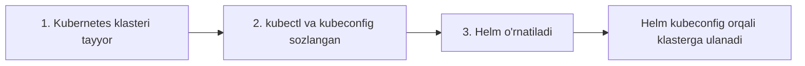

# Dars 268 — Helm'ni o'rnatish va sozlash

> 🎯 **Bu darsda nimani o'rganamiz:**
> - Helm'ni o'rnatishdan oldin qanday shartlar bajarilishi kerak
> - Linux tizimlarida Helm'ni o'rnatishning turli usullari (snap, apt, pkg)
> - Nima uchun snap'da `--classic` opsiyasi kerak

## 💡 Hayotiy o'xshatish

Helm'ni o'rnatish — yangi telefon ilovasini o'rnatishga o'xshaydi: ilova ishlashi uchun avval telefoningiz (Kubernetes klasteri) ishlab turishi va internetga (kubeconfig orqali klasterga) ulangan bo'lishi kerak. Ilovaning o'zi esa Play Market'dan (snap/apt kabi paket menejerlaridan) bir necha soniyada o'rnatiladi.

## Oldindan kerak bo'ladigan narsalar

Helm'ni o'rnatishdan oldin quyidagilar tayyor bo'lishi shart:

1. **Ishlayotgan Kubernetes klasteri** — Helm o'z ishini aynan klaster ustida bajaradi.
2. **kubectl o'rnatilgan va sozlangan** bo'lishi kerak — to'g'ri login ma'lumotlari bilan.
3. **kubeconfig fayli** kerakli klasterga ulanadigan qilib sozlangan bo'lishi kerak (odatda `~/.kube/config`).

Helm alohida serverga muhtoj emas — u sizning kompyuteringizda ishlaydigan CLI (buyruqlar qatori) dasturi va klasterga xuddi kubectl kabi kubeconfig orqali ulanadi.



## Linux'da o'rnatish usullari

Helm'ni Linux, Windows va macOS tizimlariga o'rnatish mumkin. Bu darsda Linux usullarini ko'ramiz.

### 1. Snap orqali (Ubuntu va snap bor tizimlar)

```bash
sudo snap install helm --classic
```

⚠️ **`--classic` opsiyasi nima uchun kerak?** Snap odatda ilovalarni qattiq izolyatsiyalangan "qum qutisi"da (sandbox) ishlatadi. `--classic` esa yumshoqroq rejim — ilovaga tizimga kengroq kirish beradi. Helm'ga bu kerak, chunki u sizning home papkangizdagi **kubeconfig faylini o'qiy olishi** kerak — aks holda klasterga qanday ulanishni bilmaydi.

### 2. APT orqali (Debian/Ubuntu)

APT'ga asoslangan tizimlarda avval Helm'ning kalitini (key) va manbalar ro'yxatini (sources list) qo'shamiz, keyin o'rnatamiz:

```bash
curl https://baltocdn.com/helm/signing.asc | gpg --dearmor | sudo tee /usr/share/keyrings/helm.gpg > /dev/null
sudo apt-get install apt-transport-https --yes
echo "deb [arch=$(dpkg --print-architecture) signed-by=/usr/share/keyrings/helm.gpg] https://baltocdn.com/helm/stable/debian/ all main" | sudo tee /etc/apt/sources.list.d/helm-stable-debian.list
sudo apt-get update
sudo apt-get install helm
```

### 3. PKG orqali (FreeBSD)

```bash
pkg install helm
```

O'rnatilgandan keyin tekshirib olamiz:

```bash
helm version
```

| Usul | Qaysi tizim | Buyruq |
|---|---|---|
| Snap | Ubuntu va snap'li tizimlar | `sudo snap install helm --classic` |
| APT | Debian, Ubuntu | key + sources list, keyin `sudo apt-get install helm` |
| PKG | FreeBSD | `pkg install helm` |

💡 Operatsion tizimingiz versiyasi uchun har doim eng yangi ko'rsatmalarni [rasmiy hujjatlar sahifasidan](https://helm.sh/docs/intro/install/) olganingiz ma'qul — o'rnatish yo'llari vaqt o'tishi bilan yangilanib turadi.

## ❓ Savol-Javob

**Savol:** Helm'ni o'rnatishdan oldin nimalar tayyor bo'lishi kerak?
**Javob:** Ishlayotgan Kubernetes klasteri hamda to'g'ri kubeconfig bilan sozlangan kubectl. Helm klasterga aynan shu kubeconfig orqali ulanadi.

**Savol:** `snap install helm --classic` dagi `--classic` nimani anglatadi?
**Javob:** Bu yumshatilgan sandbox rejimi — Helm'ga tizimga kengroq kirishga ruxsat beradi, shunda u home papkadagi kubeconfig faylni bemalol o'qiy oladi. Qattiq izolyatsiyada Helm klasterga ulana olmay qolishi mumkin edi.

**Savol:** Helm klaster ichiga biror narsa o'rnatadimi?
**Javob:** Yo'q, Helm 3 faqat lokal CLI dasturi — klaster ichida alohida komponent (masalan, eski Helm 2'dagi Tiller) kerak emas. Bu haqda 270-darsda batafsil gaplashamiz.

## 📌 CKA imtihon uchun maslahat

Imtihon muhitida Helm odatda allaqachon o'rnatilgan bo'ladi, lekin `helm version` bilan tekshirishni odat qiling. O'rnatish buyruqlarini yodlab o'tirmang — kerak bo'lsa, imtihonda ruxsat etilgan helm.sh hujjatlaridan "Installing Helm" sahifasini oching.

## 📖 Asosiy atamalar

| Atama | Oddiy tushuntirish |
|---|---|
| kubeconfig | kubectl va Helm klasterga qanday ulanishni biladigan sozlamalar fayli (odatda `~/.kube/config`) |
| snap | Ubuntu'dagi universal paket menejeri, ilovalarni izolyatsiyada ishlatadi |
| sandbox | Ilovani tizimdan ajratib turadigan xavfsiz "qum qutisi" muhiti |
| `--classic` | Snap'ning yumshoq rejimi — ilovaga tizimga kengroq kirish beradi |
| APT | Debian/Ubuntu'ning standart paket menejeri |
| CLI | Command Line Interface — buyruqlar qatori orqali ishlaydigan dastur |

## 🔗 Manbalar

- [Helm'ni o'rnatish — rasmiy qo'llanma](https://helm.sh/docs/intro/install/)
- [Helm tezkor start (Quickstart)](https://helm.sh/docs/intro/quickstart/)
- [kubectl'ni o'rnatish — kubernetes.io](https://kubernetes.io/docs/tasks/tools/)

---
*Bu dars KodeKloud CKA kursining 268-videosi asosida tayyorlandi.*
