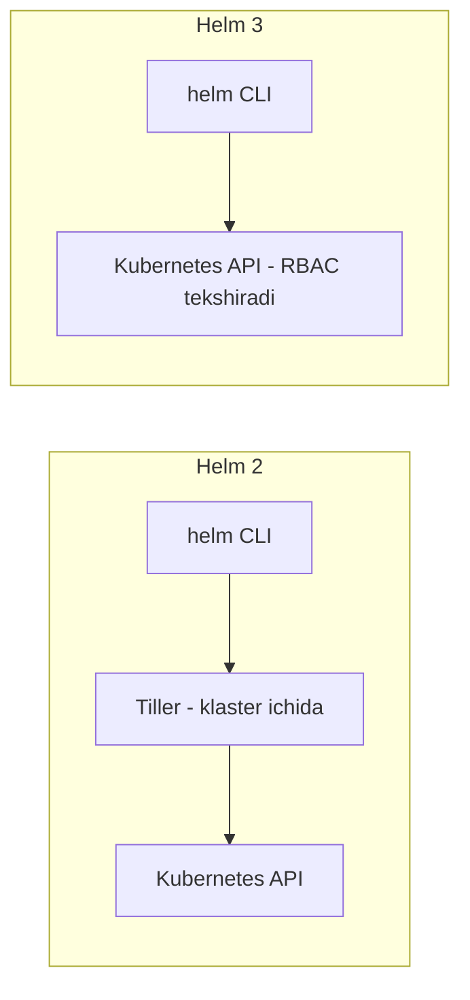
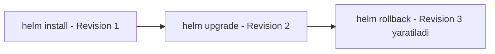
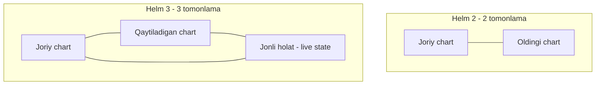

# Dars 270 — Helm 2 va Helm 3: nima o'zgardi?

> 🎯 **Bu darsda nimani o'rganamiz:**
> - Helm versiyalarining qisqa tarixi
> - Tiller nima edi va nima uchun Helm 3'da olib tashlandi
> - RBAC Helm xavfsizligini qanday yaxshiladi
> - 3-way strategic merge patch — Helm 3'ning "aqlli" rollback va upgrade usuli

Internetda chart va maqolalarni ko'rganingizda Helm 2'ga ham, Helm 3'ga ham duch kelishingiz mumkin. Shuning uchun ular orasidagi farqni bilish muhim.

## Qisqa tarix

| Versiya | Chiqqan vaqti |
|---|---|
| Helm 1.0 | 2016-yil fevral |
| Helm 2.0 | 2016-yil noyabr |
| Helm 3.0 | 2019-yil noyabr |

2016-yildan beri loyiha ancha pishib yetildi. Buning bir sababi — Kubernetes'ning o'zi ham rivojlanib bordi va Helm undan yangi imkoniyatlarni ishlata oldi. Biz darslarimizda **Helm 3** dan foydalanamiz — u soddaroq, yaxshiroq loyihalangan va "aqlliroq".

## 💡 Hayotiy o'xshatish: vositachi orqali ishlash

Helm 2 davri — xuddi bankdagi ishlaringizni faqat bitta "hamma eshikni ochadigan universal kalitli" vositachi xodim orqali qilganday edi: siz vositachiga (Tiller'ga) aytasiz, u bank ichida (klasterda) hamma narsani qila oladi. Qulay, lekin xavfli — o'sha vositachiga yo'l topgan HAR KIM hamma narsani qila oladi. Helm 3'da vositachi olib tashlandi: endi bankka o'z shaxsiy hujjatingiz (RBAC ruxsatlaringiz) bilan o'zingiz kirasiz va faqat o'zingizga ruxsat etilgan ishlarni qilasiz.

## Tiller: Helm 2'ning "vositachisi"

Helm 2 davrida Kubernetes'da hali **RBAC** (role-based access control — rolga asoslangan kirish nazorati) va **CRD** (custom resource definitions) yo'q edi. Shuning uchun Helm ishlashi uchun klaster ichiga **Tiller** degan qo'shimcha komponent o'rnatish kerak edi.

Ish tartibi shunday edi: siz Helm buyrug'ini berasiz → Helm client Tiller bilan gaplashadi → Tiller Kubernetes bilan gaplashib, so'ralgan ishni bajaradi. Ya'ni Tiller — o'rtada turgan vositachi.

Tiller'ning muammolari:

- **Qo'shimcha murakkablik** — siz va Kubernetes orasida yana bitta komponent.
- **Xavfsizlik** — Tiller sukut bo'yicha "God mode"da (xudo rejimida) ishlardi, ya'ni klasterda XOHLAGAN ishini qila olardi. Bu chart o'rnatish uchun qulay edi, lekin Tiller'ga kirish huquqi bor har qanday foydalanuvchi ham klasterda hamma narsani qila olardi.

Kubernetes'da RBAC va CRD paydo bo'lgach, Tiller'ga ehtiyoj qolmadi — va **Helm 3'da u butunlay olib tashlandi**. Endi Helm va klaster orasida hech narsa turmaydi.

RBAC bilan xavfsizlik ham ancha yaxshilandi: har bir foydalanuvchining Helm orqali qila oladigan ishlarini cheklash mumkin. Kubernetes uchun farqi yo'q — foydalanuvchi o'zgarishni `kubectl` bilan qilyaptimi yoki `helm` bilanmi, ikkalasida ham **o'sha foydalanuvchining RBAC ruxsatlari** amal qiladi.

## Revision tushunchasi — Helm'ning "surat olish" xususiyati

Helm'da snapshot'ga o'xshash narsa bor. Misol: chart bilan to'liq WordPress sayt o'rnatasiz — bu **revision 1** bo'ladi. Keyin biror narsani o'zgartirsangiz (masalan, yangiroq chart'ga upgrade qilsangiz) — **revision 2** paydo bo'ladi. Har bir revision — paketning o'sha paytdagi aniq holatining "surati". Kerak bo'lsa, rollback orqali revision 1'ga qaytishingiz mumkin.

Yangi revision har safar Helm buyrug'i bilan muhim o'zgarish qilinganda yaratiladi:

⚠️ E'tibor bering: rollback ham **yangi** revision yaratadi (eski raqamga "qaytib ketmaydi") — bu haqda 276-darsda batafsil.

## 3-way strategic merge patch — Helm 3'ning aqlli tomoni

Nomi qo'rqinchli eshitilsa ham, aslida bu oddiy va juda foydali narsa.

### Helm 2 qanday ishlar edi (2-tomonlama taqqoslash)

Rollback buyrug'ida Helm 2 faqat **ikkita narsani** solishtirardi: joriy chart (masalan, WordPress image 5.8) va oldingi chart (WordPress image 4.8). Farq bor — demak, eski chart'ni qo'llab, image'ni 4.8'ga qaytaradi. Bu oddiy holatda ishlaydi.

Endi boshqa misol: chart bilan WordPress o'rnatdik (revision 1). Keyin foydalanuvchi Helm'ni chetlab, **qo'lda** `kubectl set image` buyrug'i bilan image'ni yangiladi. Bu o'zgarish Helm orqali qilinmagani uchun **yangi revision yaratilmaydi**. Endi rollback qilsak nima bo'ladi? Helm 2 joriy revision'ni oldingisi bilan solishtiradi — lekin revision bitta xolos, farq "yo'q", shuning uchun **hech narsa qilmaydi**. Foydalanuvchining qo'lda qilgan o'zgarishi joyida qolib ketadi — rollback ishlamadi!

### Helm 3 qanday ishlaydi (3-tomonlama taqqoslash)

Helm 3 **uchta narsani** solishtiradi:

1. Hozir ishlatilayotgan chart (agar revision bo'lsa)
2. Qaytmoqchi bo'lgan revision'dagi chart
3. **Jonli holat (live state)** — Kubernetes obyektlari hozir klasterda real qanday ko'rinishda

"3-way strategic merge patch" degan nom aynan shu uchtalikdan keladi. Jonli holatga ham qaragani uchun Helm 3 ko'radi: klasterda image 5.8, revision 1'da esa 4.8 — demak, farq bor, va kerakli o'zgarishlarni qilib, asl holatga qaytaradi.

### Upgrade'da ham xuddi shu ustunlik

Chart o'rnatib, keyin ba'zi Kubernetes obyektlariga o'zingiz qo'shimcha o'zgartirishlar kiritdingiz deylik. Helm 2'da upgrade qilsangiz — u faqat eski va yangi chart'ni ko'radi, sizning qo'shimchalaringiz ikkala chart'da ham yo'q, shuning uchun **ular yo'qolib ketadi**. Helm 3 esa jonli holatni ham ko'radi, siz nimadir qo'shganingizni payqaydi va **upgrade'ni sizning o'zgarishlaringizni saqlagan holda** bajaradi.

## Taqqoslash jadvali

| Xususiyat | Helm 2 | Helm 3 |
|---|---|---|
| Tiller | Kerak (klaster ichida vositachi) | Yo'q — olib tashlangan |
| Xavfsizlik | Tiller "God mode"da, cheklash qiyin | Kubernetes RBAC orqali aniq cheklovlar |
| Rollback/upgrade taqqoslashi | 2 tomonlama (eski chart vs yangi chart) | 3 tomonlama (chartlar + jonli holat) |
| Qo'lda qilingan o'zgarishlar | Rollback'da sezilmaydi, upgrade'da yo'qoladi | Sezadi va hisobga oladi/saqlaydi |
| Chiqqan yili | 2016-noyabr | 2019-noyabr |

## ❓ Savol-Javob

**Savol:** Tiller nima edi va nega Helm 3'da olib tashlandi?
**Javob:** Tiller — Helm 2'da klaster ichida ishlaydigan vositachi komponent edi, chunki o'sha paytda Kubernetes'da RBAC va CRD yo'q edi. RBAC paydo bo'lgach, vositachiga ehtiyoj qolmadi, ustiga-ustak Tiller cheklovsiz huquqlar bilan ishlab, xavfsizlik muammosi tug'dirardi — shu sababli Helm 3'da butunlay olib tashlandi.

**Savol:** Foydalanuvchi `kubectl set image` bilan qo'lda o'zgarish qilsa, Helm'da yangi revision paydo bo'ladimi?
**Javob:** Yo'q. Revision faqat Helm buyruqlari (install, upgrade, rollback) orqali qilingan o'zgarishlarda yaratiladi. Aynan shu holat Helm 2'da rollback'ni ishlamay qolishiga sabab bo'lardi — Helm 3 esa jonli holatni tekshirib, baribir to'g'ri qaytaradi.

**Savol:** 3-way strategic merge patch'dagi uchta "tomon" nima?
**Javob:** 1) hozirgi chart, 2) qaytilmoqchi/o'tilmoqchi bo'lgan chart, 3) klasterdagi obyektlarning jonli holati (live state).

## 📌 CKA imtihon uchun maslahat

Imtihonda siz faqat Helm 3 bilan ishlaysiz — Tiller haqida amaliy topshiriq bo'lmaydi. Lekin kontseptual savol chiqishi mumkin: "Helm 3'da Tiller bormi?" — yo'q. "Rollback yangi revision yaratadimi?" — ha. Shu ikki faktni esda tuting.

## 📖 Asosiy atamalar

| Atama | Oddiy tushuntirish |
|---|---|
| Tiller | Helm 2'da klaster ichida ishlagan vositachi server komponenti (Helm 3'da yo'q) |
| RBAC | Role-Based Access Control — foydalanuvchi huquqlarini rollar orqali cheklash tizimi |
| CRD | Custom Resource Definition — Kubernetes'ga o'z maxsus obyekt turlaringizni qo'shish imkoni |
| Revision | Release holatining raqamlangan "surati"; har Helm o'zgarishida yangisi yaratiladi |
| Rollback | Release'ni oldingi revision holatiga qaytarish |
| Live state | Klasterdagi obyektlarning hozirgi real holati |
| 3-way strategic merge patch | Eski chart, yangi chart va jonli holatni birga solishtirib o'zgarish qilish usuli |

## 🔗 Manbalar

- [Helm 2'dan 3'ga o'tishda o'zgarishlar (rasmiy FAQ)](https://helm.sh/docs/faq/changes_since_helm2/)
- [Helm 3 e'loni — Helm blogi](https://helm.sh/blog/helm-3-released/)
- [Kubernetes RBAC hujjatlari](https://kubernetes.io/docs/reference/access-authn-authz/rbac/)

---
*Bu dars KodeKloud CKA kursining 270-videosi asosida tayyorlandi.*
