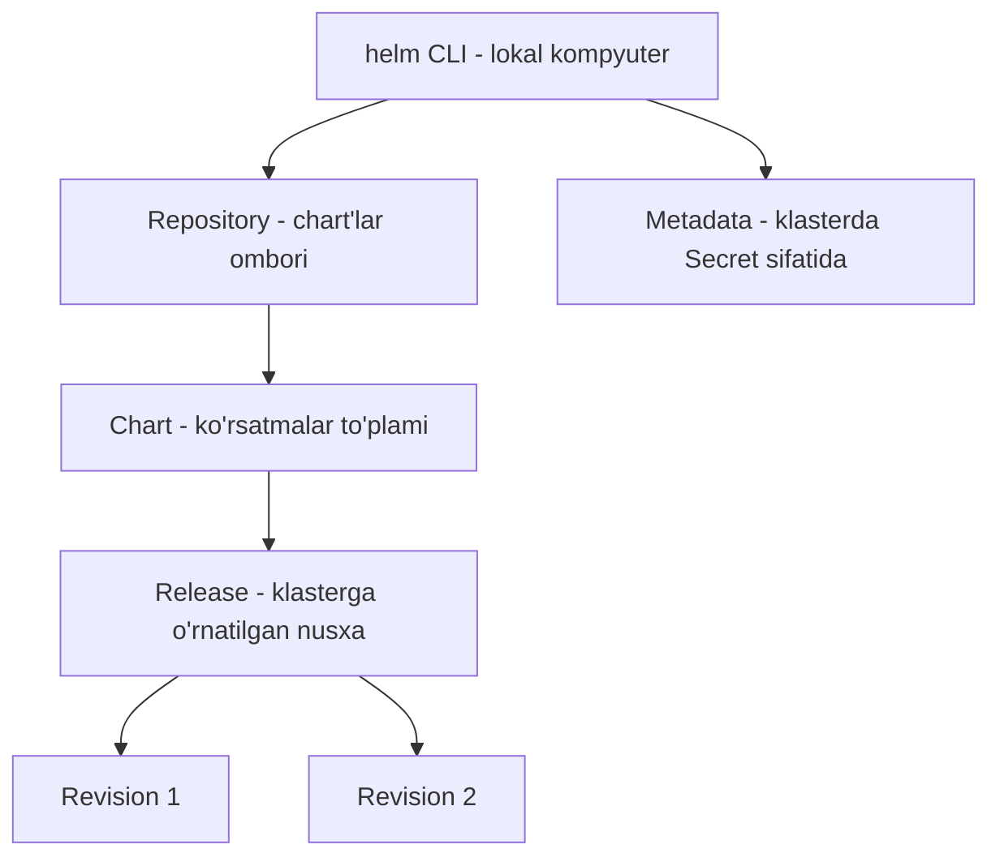
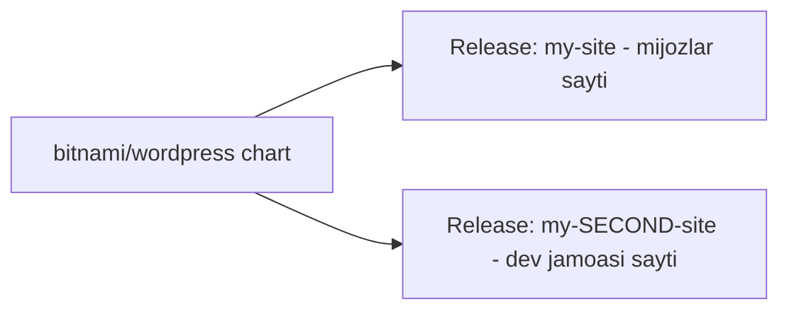

# Dars 271 — Helm komponentlari

> 🎯 **Bu darsda nimani o'rganamiz:**
> - Helm'ning asosiy qismlari: CLI, chart, release, revision, repository, metadata
> - Nima uchun bitta chart'dan bir nechta release yaratish mumkin
> - Helm o'z metadata'sini qayerda saqlaydi va nima uchun aynan klasterda

## Umumiy manzara

Helm bilan ishlaganda bir nechta komponentga duch kelamiz:

| Komponent | Qisqacha |
|---|---|
| **helm CLI** | Lokal kompyuterdagi buyruqlar qatori dasturi — install, upgrade, rollback va h.k. shu orqali bajariladi |
| **Chart** | Fayllar to'plami — Helm klasterda qaysi obyektlarni qanday yaratishni bilishi uchun barcha ko'rsatmalar |
| **Release** | Chart'ning klasterga bitta o'rnatilgan nusxasi |
| **Revision** | Release ichidagi holat "surati" — har muhim o'zgarishda yangisi paydo bo'ladi |
| **Repository** | Tayyor chart'lar saqlanadigan onlayn ombor |
| **Metadata** | Helm'ning "xotirasi" — nima o'rnatgani, qaysi chart, qaysi revision — klasterda Secret sifatida saqlanadi |



## Chart — Helm'ning ko'rsatmalar kitobi

Chart — fayllar to'plami bo'lib, unda Helm klasteringizda kerakli obyektlar to'plamini yaratishi uchun barcha ko'rsatmalar bor. Helm chart'dagi ko'rsatmalarga qarab obyektlarni qo'shadi va shu tarzda ilovani klasterga "o'rnatadi".

Kursda ikki misol ilova ishlatiladi:

1. **Hello World** — oddiy NGINX'ga asoslangan web server va uni ochib beruvchi Service. Tushunchalarni eng sodda ko'rinishda tushunish uchun.
2. **WordPress** — biroz murakkabroq sayt. Real hayotdagi ishlatilishni ko'rsatish uchun.

Hello World misolida ikkita obyekt bor: Deployment (image'dan pod'lar yaratadi) va Service (uni NodePort sifatida ochadi). Lekin e'tibor bering — image nomi va replicas soni odatdagidan **boshqacha ko'rinishda** yozilgan:

```yaml
# templates/deployment.yaml (qisqartirilgan)
apiVersion: apps/v1
kind: Deployment
metadata:
  name: hello-world
spec:
  replicas: {{ .Values.replicaCount }}
  template:
    spec:
      containers:
        - name: hello-world
          image: {{ .Values.image.repository }}
```

Bu **templating** (shablonlash) deyiladi. `{{ ... }}` ichidagi qiymatlar boshqa fayldan — **values.yaml** dan olinadi.

### values.yaml — chart'ning "sozlamalar fayli"

Ko'pincha chart'larni o'zimiz yozmaymiz — yuzlab tayyorlari repository'larda bor. Lekin deyarli har doim qiladigan ishimiz — o'rnatgan paketimizni **sozlash**. values.yaml — barcha sozlanadigan qiymatlar turadigan fayl. Aksariyat hollarda ilovani o'zingizga moslash uchun faqat shu bitta faylni o'zgartirasiz. Bu chart'ning "settings" yoki "inputs" fayli desak bo'ladi.

```yaml
# values.yaml
replicaCount: 2
image:
  repository: nginx
```

WordPress kabi ilovalar uchun chart'lar ancha murakkab — ko'p fayl va chuqur templating bilan. Templating'ni kursning keyingi qismlarida batafsil ko'ramiz, hozircha oddiy chart'lar bilan asoslarni o'rganamiz.

## Release — chart'ning o'rnatilgan nusxasi

Chart klasterga qo'llanilganda **release** yaratiladi:

```bash
helm install my-site bitnami/wordpress
```

Bu yerda `bitnami/wordpress` — chart, `my-site` — release nomi.

"Nega shunchaki `helm install bitnami/wordpress` deb qo'ya qolmaymiz, release nomi nimaga kerak?" — degan savol tug'iladi. Sabab oddiy: **bitta chart'dan bir nechta mustaqil release o'rnatish mumkin**:

```bash
helm install my-site bitnami/wordpress
helm install my-SECOND-site bitnami/wordpress
```

Ikkalasi ham bir xil chart'ga asoslangan, lekin bular **ikki butunlay boshqa-boshqa release** — alohida kuzatiladi va mustaqil o'zgartiriladi.

💡 **Hayotiy o'xshatish:** chart — bu tort retsepti, release — shu retsept bo'yicha yopilgan aniq bitta tort. Bitta retseptdan xohlagancha tort yopish mumkin: biri mehmonlarga, biri sinov uchun oshxonada. Retsept bitta, tortlar mustaqil.

Amaliy foyda: bitta release — mijozlar ishlatadigan asosiy WordPress sayt, ikkinchisi — faqat ichki dasturchilar jamoasi ko'radigan sayt. Dasturchilar u yerda asosiy saytni buzmasdan tajriba qiladi, yangi funksiya ishlagach, uni asosiy saytga o'tkazadi — ikkala sayt bir xil chart'dan qurilgani uchun aynan bir xil ishlaydi, ular mohiyatan klonlar.



## Revision — release ichidagi suratlar

Har bir release ichida bir nechta **revision** bo'lishi mumkin. Har bir revision — ilovaning "surati" (snapshot). Ilovaga har muhim o'zgarish qilinganda — image yangilansa, replicas soni yoki konfiguratsiya obyektlari o'zgarsa — yangi revision yaratiladi.

## Repository va Artifact Hub

Docker Hub'da image'lar, Vagrant Cloud'da box'lar bo'lgani kabi, Helm chart'larni **ommaviy repository'lardan** topish mumkin. Turli provayderlar o'z repository'larini yuritadi: AppsCode, Community Operators, TrueCharts, Bitnami va boshqalar.

Har bir repository'ga alohida kirib qidirish shart emas — hammasi chart'larini yagona joyda ro'yxatga olgan: **Helm Hub**, hozirgi nomi bilan **Artifact Hub** ([artifacthub.io](https://artifacthub.io)). Video yozilgan paytda u yerda 6300 dan ortiq paket bor edi. Qidirishingiz yoki mavjudlarini ko'rib chiqishingiz mumkin. Ba'zi chart'larni loyihaning haqiqiy dasturchilari o'zi e'lon qiladi — bunday chart'larda **official** yoki **verified publisher** belgisi bo'ladi, imkon boricha aynan shulardan foydalaning.

## Metadata — Helm'ning xotirasi qayerda?

Helm klasterda nima qilganini — qaysi release'larni o'rnatgani, qaysi chart'lar ishlatilgani, revision holatlari va hokazolarni — biror joyga yozib borishi kerak. Bu ma'lumot **metadata** (ma'lumot haqidagi ma'lumot) deyiladi.

Agar Helm buni sizning **lokal kompyuteringizda** saqlaganida, jamoadagi boshqa odam sizning release'laringiz bilan ishlashi uchun bu ma'lumotning nusxasi kerak bo'lardi — noqulay. Shuning uchun Helm aqlli yo'l tutadi: metadata'ni to'g'ridan-to'g'ri **Kubernetes klasterining o'zida, Secret obyektlari sifatida** saqlaydi.

Natijada:
- Ma'lumot klaster yashar ekan, saqlanib qoladi
- Jamoadagi hamma unga kira oladi — istalgan kishi helm upgrade qila oladi
- Helm klasterda qilgan har bir ishini har doim kuzata oladi, chunki metadata doim qo'l ostida

## ❓ Savol-Javob

**Savol:** Chart va release'ning farqi nima?
**Javob:** Chart — ko'rsatmalar to'plami (retsept), release — shu chart'ning klasterga o'rnatilgan aniq bitta nusxasi (tayyor taom). Bitta chart'dan bir nechta mustaqil release yaratish mumkin.

**Savol:** Helm o'z metadata'sini qayerda saqlaydi va nega lokal kompyuterda emas?
**Javob:** Klasterning ichida, Kubernetes Secret'lari sifatida. Lokalda saqlansa, jamoaning boshqa a'zolari release'lar bilan ishlay olmasdi; klasterda esa hamma uchun ochiq va klaster bilan birga yashaydi.

**Savol:** Artifact Hub'da qaysi chart'larni tanlagan ma'qul?
**Javob:** "Official" yoki "verified publisher" belgisi borlarini — bular loyihaning rasmiy dasturchilari yoki tasdiqlangan nashriyotchilar chiqargan sifatli chart'lar.

**Savol:** Yangi revision qachon yaratiladi?
**Javob:** Ilovaga Helm orqali muhim o'zgarish qilinganda — masalan, image upgrade qilinsa, replicas yoki konfiguratsiya o'zgartirilsa.

## 📌 CKA imtihon uchun maslahat

Imtihonda "shu chart'dan shu nom bilan release o'rnating" tipidagi topshiriqlar uchraydi — `helm install <release-nomi> <repo>/<chart>` sintaksisini avtomatizmgacha yodlang: avval release nomi, keyin chart. Metadata Secret'larda saqlanishini bilish `kubectl get secrets` chiqishida `sh.helm.release.v1...` nomli secretlarni ko'rganda dovdiramaslikka yordam beradi.

## 📖 Asosiy atamalar

| Atama | Oddiy tushuntirish |
|---|---|
| helm CLI | Lokal kompyuterda ishlaydigan Helm buyruqlar qatori dasturi |
| Chart | Ilovani o'rnatish uchun barcha ko'rsatmalarni o'z ichiga olgan fayllar to'plami |
| Release | Chart'ning klasterga bitta o'rnatilgan nusxasi, o'z nomiga ega |
| Revision | Release holatining raqamlangan "surati" |
| Templating | YAML'da qiymatlar o'rniga `{{ .Values... }}` shablonlarini ishlatish |
| values.yaml | Chart'ning sozlanadigan qiymatlari to'plangan fayl |
| Repository | Chart'lar saqlanadigan onlayn ombor (Bitnami, TrueCharts...) |
| Artifact Hub | Barcha repository'lardagi chart'larni bir joyda ko'rsatadigan katalog (artifacthub.io) |
| Metadata | Helm'ning ish tarixi haqidagi ma'lumotlari — klasterda Secret sifatida saqlanadi |

## 🔗 Manbalar

- [Helm asosiy tushunchalari (Three Big Concepts)](https://helm.sh/docs/intro/using_helm/#three-big-concepts)
- [Artifact Hub](https://artifacthub.io/)
- [Helm chart'lar haqida rasmiy hujjat](https://helm.sh/docs/topics/charts/)
- [Kubernetes Secrets](https://kubernetes.io/docs/concepts/configuration/secret/)

---
*Bu dars KodeKloud CKA kursining 271-videosi asosida tayyorlandi.*
