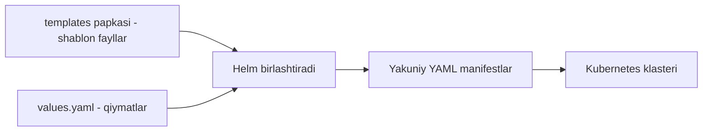
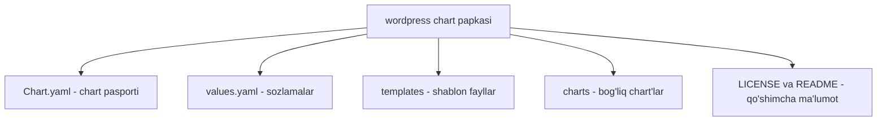

# Dars 272 — Helm chart'lar: ichida nima bor?

> 🎯 **Bu darsda nimani o'rganamiz:**
> - Chart Helm uchun qanday "yo'riqnoma" vazifasini bajaradi
> - Chart.yaml faylining maydonlari: apiVersion, appVersion, version, type, dependencies...
> - Chart papkasining tuzilishi: templates, values.yaml, charts va boshqalar

## Helm — manzilni aytasiz, yo'lni o'zi topadi

Helm — ishlatish uchun juda oson buyruqlar qatori vositasi. Siz unga shunchaki "buni o'rnat", "anavini o'chir", "yangila", "oldingi holatga qaytar" deysiz — va u butun og'ir ishni sahna ortida o'zi bajaradi. Bu avtomatlashtirish vositasi: biz — operatorlar — istalgan **yakuniy natijani** (manzilni) aytamiz, va o'sha natijaga yetish uchun 5, 10, 20 yoki 50 ta amal kerakmi — farqi yo'q, Helm hammasini bizni detallar bilan bezovta qilmasdan bajaradi.

Lekin buyruq qatorida biz Helm'ga deyarli hech qanday ma'lumot bermaymiz — "shu narsani o'rnatib ber" xolos. U qanday qilib nima qilishni biladi? Javob: **chart'lar** yordamida.

## 💡 Hayotiy o'xshatish: yig'ma mebel yo'riqnomasi

Chart — Helm uchun xuddi yig'ma mebel qutisidagi yo'riqnoma kabi. Ustaga "shkaf yig'ib ber" deysiz — u qutidagi yo'riqnomani o'qib, qaysi taxtani qayerga, qaysi vintni qaysi teshikka ekanini aniq biladi. Sizga esa jarayonning detallari qiziq emas — tayyor shkaf kerak xolos. Chart'ni o'qib, Helm ham foydalanuvchi so'rovini bajarish uchun aynan nima qilishni biladi.

Biz — odamlar uchun chart shunchaki bir dasta matnli fayl. Har bir ma'lum nom bilan atalgan faylning aniq vazifasi bor.

## Templates va values.yaml — eslatma

Oldingi darsdagi oddiy misolni eslaylik: ikkita obyekt — Deployment (image'dan pod'lar yaratadi) va uni NodePort sifatida ochuvchi Service. Ularning fayllarida image nomi va replicas boshqacha ko'rinishda yozilgan edi:

```yaml
# templates/deployment.yaml (parcha)
spec:
  replicas: {{ .Values.replicaCount }}
  ...
      containers:
        - image: {{ .Values.image.repository }}
```

Bu — **templating**. Bu ikki fayl — **template'lar** (shablonlar). Ular `values.yaml` faylidagi qiymatlar bilan to'ldirilib, ilovani klasterga joylash uchun kerakli fayllarning **yakuniy versiyasi** hosil qilinadi. `values.yaml` da esa chart'ga uzatiladigan sozlanadigan parametrlar turadi — hamma narsa biz xohlagan konfiguratsiyada o'rnatilishi uchun.



## Chart.yaml — chart'ning pasporti

`values.yaml` dan tashqari har bir chart'da **Chart.yaml** fayli bo'ladi. Unda chart'ning o'zi haqidagi ma'lumotlar turadi. WordPress chart'ining Chart.yaml misolida ko'raylik:

```yaml
apiVersion: v2
appVersion: 5.8.1
version: 12.1.27
name: wordpress
description: Web publishing platform for building blogs and websites.
type: application
dependencies:
  - name: mariadb
    version: 9.x.x
    repository: https://charts.bitnami.com/bitnami
    condition: mariadb.enabled
keywords:
  - blog
  - cms
  - wordpress
maintainers:
  - name: Bitnami
    url: https://github.com/bitnami/charts
home: https://wordpress.org/
icon: https://bitnami.com/assets/stacks/wordpress/img/wordpress-stack-220x234.png
```

Endi har bir maydonni ko'rib chiqamiz:

### apiVersion — chart qaysi Helm uchun yozilgan?

Helm 2 davrida bu maydon umuman yo'q edi. Helm 3 chiqqach, chart fayliga yangi imkoniyatlar qo'shildi (masalan, `dependencies` bo'limi va `type` maydoni Helm 2'da yo'q edi). Shuning uchun Helm 3'ga eski (Helm 2 uchun) va yangi (Helm 3 uchun) chart'larni farqlash usuli kerak edi — va `apiVersion` maydoni kiritildi:

| Holat | apiVersion |
|---|---|
| Helm 2 uchun qurilgan eski chart | maydon umuman yo'q, yoki `v1` |
| Helm 3 uchun qurilgan chart | `v2` |

⚠️ Agar `apiVersion: v2` chart'ni Helm 2'da ishlatsangiz, Helm 2 bu maydonni umuman tekshirmaydi va Helm 3'ga xos qo'shimcha maydonlarni shunchaki e'tiborsiz qoldiradi — natija kutilmagan bo'lishi mumkin. **Xulosa:** bundan buyon chart yozsangiz, `apiVersion: v2` qo'ying (siz deyarli aniq Helm 3 uchun yozasiz). Bu maydon yo'q chart'ni ko'rsangiz — katta ehtimol u Helm 2 uchun qurilgan.

### appVersion va version — ikkita alohida versiya

- **appVersion** — chart ichidagi **ilovaning** versiyasi. Bizning misolda ilova — WordPress, demak bu shu chart o'rnatadigan WordPress versiyasi. Bu maydon faqat ma'lumot uchun.
- **version** — **chart'ning o'z** versiyasi. Har bir chart o'z versiyasiga ega bo'lishi kerak va bu ilova versiyasidan mustaqil. Bu chart'ning o'ziga kiritilgan o'zgarishlarni kuzatishga yordam beradi.

### name, description, type

- **name** — chart nomi (wordpress).
- **description** — qisqacha tavsif.
- **type** — chart turi. Ikki tur bor:
  - `application` — standart tur, ilovalarni joylash uchun yaratadigan barcha oddiy chart'lar;
  - `library` — chart qurishga yordam beruvchi utilitalarni taqdim etadigan chart'lar (bu haqda keyinroq).

### dependencies — bog'liq chart'lar

WordPress — ikki qavatli (two-tier) ilova: WordPress serverning o'zi va ma'lumotlar bazasi serveri. Bu misolda baza — **MariaDB**. MariaDB'ning o'z Helm chart'i bor, shuning uchun uni shunchaki ilovamizga **dependency** (bog'liqlik) sifatida qo'shamiz. Shu tufayli MariaDB'ning manifest fayllarini o'z chart'imizga qo'shib aralashtirib yurishimiz shart emas.

### Qolgan maydonlar

- **keywords** — loyihaga oid kalit so'zlar ro'yxati; ommaviy repository'da chart'ni qidirishda yordam beradi.
- **maintainers** — chart'ni kim yuritishi haqida ma'lumot.
- **home**, **icon** — ixtiyoriy: loyiha bosh sahifasi URL'i va ikonka URL'i.

## Chart papkasining tuzilishi

```
wordpress/
├── Chart.yaml        # chart haqidagi ma'lumotlar (yuqorida ko'rdik)
├── values.yaml       # sozlanadigan qiymatlar — "settings" fayli
├── templates/        # template fayllar (deployment, service va h.k.)
├── charts/           # bu chart bog'liq bo'lgan boshqa chart'lar
├── LICENSE           # chart litsenziyasi haqida ma'lumot
└── README.md         # chart haqida odam o'qiydigan ma'lumot
```



Chart dependency (bog'liqliklar) mavzusini kursda keyinroq batafsil ko'ramiz.

## ❓ Savol-Javob

**Savol:** `appVersion` va `version` maydonlarining farqi nima?
**Javob:** `appVersion` — chart o'rnatadigan ilovaning versiyasi (masalan, WordPress 5.8.1), faqat ma'lumot uchun. `version` — chart'ning o'z versiyasi, ilova versiyasidan mustaqil, chart'dagi o'zgarishlarni kuzatish uchun ishlatiladi.

**Savol:** Chart.yaml'da `apiVersion` maydoni umuman yo'q bo'lsa, bu nimani bildiradi?
**Javob:** Katta ehtimol bilan bu chart Helm 2 uchun qurilgan — chunki `apiVersion` maydonini Helm 3 kiritgan. Yangi chart'lar uchun doimo `v2` qo'yiladi.

**Savol:** WordPress chart'iga MariaDB qanday qo'shiladi?
**Javob:** `dependencies` bo'limida bog'liqlik sifatida ko'rsatiladi — MariaDB'ning o'z chart'i bor, uning manifest fayllarini WordPress chart'iga qo'lda birlashtirish shart emas.

**Savol:** `application` va `library` chart turlarining farqi nima?
**Javob:** `application` (standart) — ilovalarni joylash uchun; `library` — o'zi ilova o'rnatmaydi, boshqa chart'larni qurishga yordam beradigan utilitalarni beradi.

## 📌 CKA imtihon uchun maslahat

Imtihonda chart'ni ko'zdan kechirish so'ralsa, `helm show chart <repo>/<chart>` va `helm show values <repo>/<chart>` buyruqlari Chart.yaml va values.yaml tarkibini yuklamasdan ko'rsatadi — vaqtni tejaydi. Chart papka tuzilishini eslab qoling: templates/, values.yaml, Chart.yaml — imtihonda lokal chart'ni tahrirlash topshirig'ida qaysi faylga qarashni darrov bilasiz.

## 📖 Asosiy atamalar

| Atama | Oddiy tushuntirish |
|---|---|
| Chart.yaml | Chart'ning "pasporti" — nomi, versiyalari, turi, bog'liqliklari yozilgan fayl |
| apiVersion | Chart formati versiyasi: `v2` — Helm 3 uchun, `v1` yoki yo'q — Helm 2 uchun |
| appVersion | Chart o'rnatadigan ilovaning versiyasi (ma'lumot uchun) |
| version | Chart'ning o'z versiyasi |
| type | Chart turi: `application` (ilova) yoki `library` (yordamchi utilitalar) |
| dependencies | Bu chart tayanadigan boshqa chart'lar (masalan, WordPress uchun MariaDB) |
| templates/ | Shablon YAML fayllar turadigan papka |
| charts/ | Bog'liq chart'larning nusxalari turadigan papka |
| Two-tier ilova | Ikki qatlamli ilova: frontend/server + ma'lumotlar bazasi |

## 🔗 Manbalar

- [Helm chart'lar rasmiy hujjati](https://helm.sh/docs/topics/charts/)
- [Chart.yaml maydonlari ro'yxati](https://helm.sh/docs/topics/charts/#the-chartyaml-file)
- [Chart bog'liqliklari (dependencies)](https://helm.sh/docs/helm/helm_dependency/)
- [Bitnami WordPress chart — Artifact Hub](https://artifacthub.io/packages/helm/bitnami/wordpress)

---
*Bu dars KodeKloud CKA kursining 272-videosi asosida tayyorlandi.*
