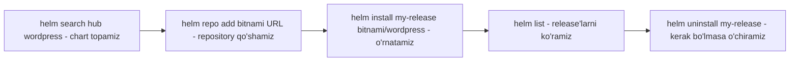

# Dars 273 — Helm bilan ishlash: asosiy buyruqlar

> 🎯 **Bu darsda nimani o'rganamiz:**
> - `helm --help` orqali kerakli buyruqni tez topish
> - Chart qidirish: Artifact Hub sayti va `helm search hub/repo` buyruqlari
> - Repository qo'shish va ilovani o'rnatish: `helm repo add`, `helm install`
> - Release'larni boshqarish: `helm list`, `helm uninstall`, `helm repo update`

## Yordamni Helm'ning o'zidan so'rang

Barcha amallar `helm` buyruqlar qatori orqali bajariladi. Shunchaki `helm` yoki yordam opsiyasi bilan ishga tushirsangiz, foydali ma'lumotlar ro'yxati chiqadi:

```bash
helm --help
```

Bu — to'g'ri buyruqni eslashning tezkor usuli. Masalan, muvaffaqiyatsiz upgrade'dan keyin release'ni oldingi versiyaga qaytarish kerak, lekin buyruq nomi esdan chiqdi: "helm restore edimi?" Ro'yxatga qarasak — to'g'ri buyruq aslida **`helm rollback`** ekan. Internetdan qidirgandan ancha tez, chunki javob buyruqlar qatorining o'zida.

Sub-buyruqlar uchun ham yordam bor. Masalan, repository'ga oid qanday amallar borligini ko'rish:

```bash
helm repo --help
```

Bu bizga chart repository qo'shish, ro'yxatini ko'rish, o'chirish va hokazolarni ko'rsatadi. Yana ham chuqurroq kirib, bitta sub-buyruqning nima qilishini va qaysi parametrlarni qo'llab-quvvatlashini o'rganish mumkin:

```bash
helm repo add --help
```

## 💡 Hayotiy o'xshatish: ilovalar do'koni

Helm bilan ishlash — telefondagi ilovalar do'konidan foydalanishga juda o'xshaydi: Artifact Hub — do'kon vitrinasi (qidirasiz, reytingga va "rasmiy" belgisiga qaraysiz), `helm repo add` — do'konning manzilini telefoningizga qo'shish, `helm install` — "O'rnatish" tugmasi, `helm list` — o'rnatilgan ilovalar ro'yxati, `helm uninstall` — ilovani o'chirish. Farqi — bu yerda "ilova" butun boshli Kubernetes paketi.

## Vazifa: Kubernetes'da WordPress sayt ochish

Faraz qilaylik, Kubernetes'da WordPress sayt ishga tushirishimiz kerak va buning uchun tayyor chart kerak.

### 1-usul: Artifact Hub saytida qidirish

Barcha chart'lar [artifacthub.io](https://artifacthub.io) onlayn katalogida ro'yxatga olingan. Saytga kirib, qo'lda qidiramiz. Sifatli chart olish uchun **official** yoki **verified publisher** belgisi borini tanlaganimiz ma'qul.

Chart tanlangach, batafsil sahifa ochiladi. Unda:
- chart'ni klasterga o'rnatish uchun **aniq buyruqlar**;
- qaysi dasturiy komponentlar ishlatilishi;
- pastroqda — sozlash mumkin bo'lgan eng muhim **parametrlar** (chart dasturchilari muhim deb hisoblagan narsalar).

### 2-usul: buyruqlar qatoridan qidirish

`helm search` buyrug'i qidiradi, lekin **qayerda** qidirishni ko'rsatuvchi qo'shimcha sub-buyruq talab qiladi: `hub` yoki `repo`.

```bash
# Artifact Hub bo'ylab qidirish (barcha ro'yxatga olingan chart'lar)
helm search hub wordpress

# Lokal qo'shilgan repository'lar ichida qidirish
helm search repo wordpress
```

| Buyruq | Qayerda qidiradi |
|---|---|
| `helm search hub` | artifacthub.io — barcha repository'lar ro'yxatga olingan markaziy hub |
| `helm search repo` | Faqat siz lokal qo'shgan repository'lar ichida |

Natijada WordPress'ni o'rnatuvchi chart'lar ro'yxati chiqadi — chart versiyasi va **app version** (bu chart o'rnatadigan WordPress versiyasi) bilan birga:

```bash
$ helm search repo wordpress
NAME                    CHART VERSION   APP VERSION     DESCRIPTION
bitnami/wordpress       12.1.27         5.8.1           Web publishing platform for building blogs and ...
```

## O'rnatish — ikki buyruq kifoya

Chart tanlangach, ilovani ikki buyruq bilan joylashtirish mumkin (bular chart README'sida ham yozilgan):

**1) Repository'ni qo'shamiz.** Bitnami chart repository'si `https://charts.bitnami.com/bitnami` manzilida turadi. Uni lokal Helm sozlamamizga qo'shishimiz kerak — shunda install buyrug'ida Helm chart'ni qayerdan olishni biladi:

```bash
helm repo add bitnami https://charts.bitnami.com/bitnami
```

**2) Ilovani o'rnatamiz:**

```bash
helm install my-release bitnami/wordpress
```

Bo'ldi — shu xolos! Kubernetes klasteriga ilova joylashtirish hech qachon bunchalik oson bo'lmagan. Buyruq oxirida hattoki bu WordPress'dan qanday foydalanish haqida foydali ma'lumot ham chiqadi — bu matnni chart ichidagi ko'rsatmalar generatsiya qiladi, shunda foydalanuvchi yangi o'rnatilgan paketi bilan nima qilishni biladi.



## Release'larni ko'rish va o'chirish

Chart o'rnatilgach, u **release** bo'lib joylashadi. Barcha mavjud release'larni ko'rish:

```bash
helm list
```

Bu nafaqat nima o'rnatilganini kuzatish, balki qaysi release anchadan beri yangilanmaganini ko'rish uchun ham juda foydali.

Ilovaning barcha izlarini o'chirish kerak bo'lsa — buni qo'lda qilishni tasavvur qiling: WordPress'ga oid o'nlab obyektni klasterdan birma-bir o'chirish kerak bo'lardi. Helm bilan esa release nomini bilganimiz uchun bitta oddiy buyruq bilan WordPress qo'shgan **barcha** Kubernetes obyektlarini o'chiramiz:

```bash
helm uninstall my-release
```

Mana shu yerda Helm'ning Kubernetes uchun package manager sifatidagi kuchi yaqqol ko'rinadi.

## Repository buyruqlari

`helm repo` buyrug'i repository'larni qo'shish, ko'rish, o'chirish va yangilash uchun ishlatiladi:

```bash
# Repository qo'shish (yuqorida ko'rdik)
helm repo add bitnami https://charts.bitnami.com/bitnami

# Mavjud repository'lar ro'yxati
helm repo list

# Repository ma'lumotlarini yangilash
helm repo update
```

💡 `helm repo update` — Linux'dagi `sudo apt-get update` ga o'xshash buyruq. Gap shundaki, Helm repository haqidagi ma'lumotni **lokalda** saqlaydi. Vaqt o'tishi bilan repository egalari o'zgarishlar kiritadi, yangilaydi — va bizdagi lokal nusxa eskirib qoladi. Bu buyruq onlayn repository'dan eng so'nggi ma'lumotlarni tortib olib, lokal nusxani yangilaydi.

## ❓ Savol-Javob

**Savol:** `helm search hub` va `helm search repo` ning farqi nima?
**Javob:** `hub` — artifacthub.io'dagi barcha ro'yxatga olingan chart'lar bo'ylab qidiradi; `repo` — faqat siz `helm repo add` bilan lokal qo'shgan repository'lar ichida qidiradi.

**Savol:** Nega o'rnatishdan oldin `helm repo add` qilish kerak?
**Javob:** `helm install` paytida Helm chart'ni qayerdan yuklab olishni bilishi kerak. Repository qo'shilmagan bo'lsa, `bitnami/wordpress` degan manzil Helm uchun notanish bo'ladi.

**Savol:** `helm repo update` nima qiladi va u nimaga o'xshaydi?
**Javob:** Lokal saqlanadigan repository ma'lumotlarini onlayn manbadan yangilaydi — Ubuntu'dagi `sudo apt-get update` ning Helm'dagi ekvivalenti. Chart'larning yangi versiyalarini ko'rish uchun kerak.

**Savol:** Release'ni o'chirsak, uning obyektlari-chi?
**Javob:** `helm uninstall <release>` release tarkibida yaratilgan barcha Kubernetes obyektlarini o'chiradi — birma-bir qo'lda o'chirish shart emas.

## 📌 CKA imtihon uchun maslahat

Imtihonda internet'dan faqat ruxsat etilgan hujjat saytlari ochiladi — shuning uchun buyruqni unutsangiz, Google emas, `helm --help` va `helm <buyruq> --help` dan foydalaning: bu eng tez yo'l. Tipik topshiriq zanjirini mashq qiling: `helm repo add` → `helm repo update` → `helm search repo <nom>` → `helm install <release> <repo>/<chart>` → `helm list` — bu ketma-ketlik imtihonda deyarli aynan shu ko'rinishda uchraydi. Release'larni qidirishda `helm list -A` (barcha namespace'lar) borligini unutmang.

## 📖 Asosiy atamalar

| Atama | Oddiy tushuntirish |
|---|---|
| helm search hub | Artifact Hub bo'ylab chart qidirish |
| helm search repo | Lokal qo'shilgan repository'larda chart qidirish |
| helm repo add | Yangi chart repository'sini lokal Helm'ga qo'shish |
| helm repo update | Repository'lar haqidagi lokal ma'lumotni yangilash (apt-get update kabi) |
| helm install | Chart'dan release yaratib, ilovani klasterga o'rnatish |
| helm list | O'rnatilgan release'lar ro'yxatini ko'rish |
| helm uninstall | Release va uning barcha obyektlarini o'chirish |
| Verified publisher | Artifact Hub'da tasdiqlangan nashriyotchi belgisi — sifat kafolati |

## 🔗 Manbalar

- [Helm'dan foydalanish — rasmiy qo'llanma](https://helm.sh/docs/intro/using_helm/)
- [helm buyruqlari to'liq ro'yxati](https://helm.sh/docs/helm/helm/)
- [Artifact Hub](https://artifacthub.io/)
- [Bitnami chart'lari](https://github.com/bitnami/charts)

---
*Bu dars KodeKloud CKA kursining 273-videosi asosida tayyorlandi.*
