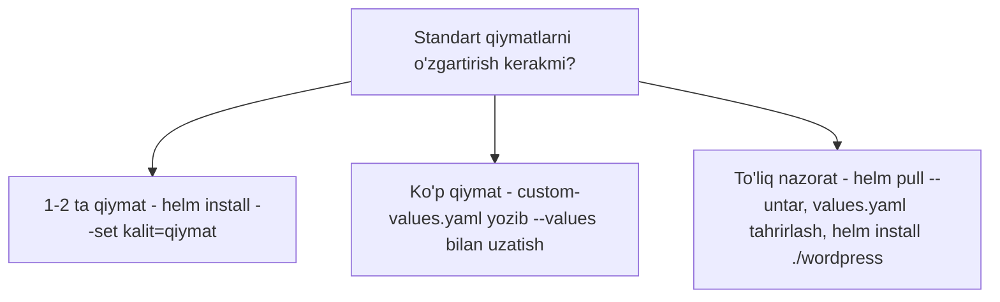

# Dars 274 — Chart parametrlarini sozlash

> 🎯 **Bu darsda nimani o'rganamiz:**
> - O'rnatish paytida standart qiymatlarni o'zgartirishning 3 usuli
> - `--set` opsiyasi bilan alohida qiymatlarni berish
> - `--values` bilan o'z custom values faylimizni ishlatish
> - `helm pull --untar` bilan chart'ni yuklab, values.yaml'ni bevosita tahrirlash

## Muammo: hamma narsa standart qiymatlar bilan o'rnatildi

O'tgan darsda WordPress'ni o'rnatganimizda hammasi **standart (default) qiymatlar** bilan o'rnatildi. Lekin har doim ham buni xohlamaymiz. Masalan, blogning standart nomi — "User's Blog". Bizning saytimiz bu nom bilan atalishini xohlamasligimiz mumkin.

Bu nom qayerdan keldi? Zanjir shunday: `deployment.yaml` fayli WordPress blog nomini **environment variable** (muhit o'zgaruvchisi) sifatida o'rnatadi, qiymatni esa **values.yaml** faylidan oladi — u yerda `User's Blog` deb yozilgan:

```yaml
# values.yaml (parcha)
wordpressBlogName: User's Blog
wordpressEmail: user@example.com
```

Muammo shundaki, `helm install` buyrug'i chart'ni tortib olib, ilovani **darhol** joylashtiradi — bizga values.yaml'ni o'zgartirishga "oyna" qolmaydi. Yechimlar bor — uchta usul.

## 💡 Hayotiy o'xshatish: restoranda taom buyurtma qilish

Standart qiymatlar bilan o'rnatish — menyudagi taomni "qanday bo'lsa shunday" buyurtma qilish. `--set` — ofitsiantga og'zaki aytish: "achchiq qilmasin, piyozsiz bo'lsin" (bir-ikki o'zgarish uchun qulay). `--values customvalues.yaml` — o'z istaklaringizni qog'ozga yozib berish (istaklar ko'p bo'lsa). `helm pull` qilib values.yaml'ni tahrirlash — retseptni olib, uyda o'zingizga moslab pishirish (to'liq nazorat).

## 1-usul: `--set` — buyruq qatorida qiymat berish

`--set` opsiyasi bilan values.yaml'dagi istalgan maydonni buyruq qatorida berish mumkin. Uni bir necha marta takrorlab, bir nechta parametr uzatish mumkin:

```bash
helm install my-release bitnami/wordpress \
  --set wordpressBlogName="Helm Tutorials" \
  --set wordpressEmail="john@example.com"
```

Bu qiymatlar values.yaml'dagi standart qiymatlarni **bekor qilib, ustidan yozadi** (override).

## 2-usul: `--values` — o'z custom fayl bilan

Agar bunday qiymatlar juda ko'payib ketsa, ularni o'zimizning maxsus values fayliga ko'chirgan qulay. `custom-values.yaml` nomli fayl yaratamiz va o'zgaruvchilarni ichiga o'tkazamiz. Bu YAML fayl bo'lgani uchun `=` belgisi o'rniga `:` ishlatamiz:

```yaml
# custom-values.yaml
wordpressBlogName: Helm Tutorials
wordpressEmail: john@example.com
```

Keyin bu faylni `--values` opsiyasi bilan uzatamiz:

```bash
helm install my-release bitnami/wordpress --values custom-values.yaml
```

Endi qiymatlar bizning custom fayldan olinadi va chart'ning standart values.yaml qiymatlarini bekor qiladi.

## 3-usul: values.yaml'ning o'zini tahrirlash (`helm pull --untar`)

Agar buyruq qatori opsiyasi yoki custom fayl emas, chart ichidagi **values.yaml faylning o'zini** o'zgartirmoqchi bo'lsak-chi? Unda `helm install` o'rniga ishni **ikki bosqichga** bo'lamiz.

**1) Chart'ni yuklab olamiz.** `helm pull` chart'ni arxivlangan (siqilgan) ko'rinishda tortadi — keyin uni o'zingiz ochishingiz kerak bo'ladi. Yoki `--untar` opsiyasi bilan Helm'ning o'ziga ochtirib olamiz:

```bash
helm pull --untar bitnami/wordpress
```

Bu joriy papkada `wordpress` nomli katalog yaratadi. Ichida chart'ning barcha fayllari, jumladan values.yaml turadi:

```bash
ls wordpress/
# Chart.yaml  values.yaml  templates/  charts/  README.md ...
```

Endi values.yaml'ni istalgan matn muharririda ochib tahrirlaymiz:

```bash
vim wordpress/values.yaml
```

**2) Lokal papkadan o'rnatamiz.** Tayyor bo'lgach, `helm install` da chart nomi o'rniga **lokal katalog yo'lini** ko'rsatamiz:

```bash
helm install my-release ./wordpress
```

`./` — joriy katalogni bildiradi, ya'ni chart joriy papka ostidagi `wordpress` katalogidan olinadi. Demak, `helm install` da release nomidan keyin repository'dagi chart nomini ham, lokal fayl tizimidagi katalog yo'lini ham berish mumkin.



## Uch usulni taqqoslash

| Usul | Buyruq | Qachon qulay |
|---|---|---|
| `--set` | `helm install ... --set kalit=qiymat` | 1-2 ta qiymatni tez o'zgartirish |
| `--values` | `helm install ... --values custom-values.yaml` | Qiymatlar ko'p bo'lsa, ularni faylda tartibli saqlash |
| values.yaml tahrirlash | `helm pull --untar` + tahrir + `helm install ./chart` | Chart'ni to'liq ko'rib chiqib, ichidan sozlash kerak bo'lsa |

## ❓ Savol-Javob

**Savol:** Nega o'rnatish paytida values.yaml'ni to'g'ridan-to'g'ri tahrirlab bo'lmaydi?
**Javob:** `helm install` chart'ni tortib olib, darhol joylashtiradi — jarayon orasida faylni ochib o'zgartirishga imkoniyat yo'q. Shuning uchun `--set`, `--values` yoki oldindan `helm pull` qilish kerak.

**Savol:** `--set` bilan berilgan qiymat va values.yaml'dagi qiymat to'qnashsa, qaysi biri g'olib?
**Javob:** `--set` (va `--values` dagi qiymatlar) chart'ning standart values.yaml'idagi qiymatlarni bekor qiladi — buyruq qatorida bergan qiymatingiz amal qiladi.

**Savol:** `helm pull` va `helm pull --untar` farqi nima?
**Javob:** Oddiy `helm pull` chart'ni siqilgan arxiv (.tgz) ko'rinishida yuklaydi — keyin o'zingiz ochishingiz kerak. `--untar` bilan Helm arxivni o'zi ochib, tayyor katalog qilib beradi.

**Savol:** Lokal katalogdagi chart'ni qanday o'rnatamiz?
**Javob:** Chart nomi o'rniga katalog yo'lini beramiz: `helm install my-release ./wordpress`.

## 📌 CKA imtihon uchun maslahat

Imtihonda "chart'ni falon parametr bilan o'rnating" topshirig'i tez-tez uchraydi — `--set` sintaksisini aniq biling: `--set kalit=qiymat`, ichma-ich maydonlar nuqta bilan (`--set image.tag=1.21`). Chart'da qanday parametrlar borligini bilmasangiz, `helm show values <repo>/<chart>` bilan to'liq values.yaml'ni ko'ring. Ko'p parametrli topshiriqda xato qilmaslik uchun `--values` fayl usuli ishonchliroq.

## 📖 Asosiy atamalar

| Atama | Oddiy tushuntirish |
|---|---|
| Default (standart) qiymat | Chart'ning values.yaml'ida oldindan yozilgan qiymat |
| `--set` | O'rnatish buyrug'ida alohida qiymatlarni berish opsiyasi |
| `--values` (`-f`) | O'z custom values faylini uzatish opsiyasi |
| Override | Standart qiymatni yangi qiymat bilan bekor qilish, ustidan yozish |
| helm pull | Chart'ni o'rnatmasdan lokal kompyuterga yuklab olish |
| `--untar` | Yuklangan chart arxivini avtomatik ochish opsiyasi |
| Environment variable | Konteyner ichidagi dasturga uzatiladigan muhit o'zgaruvchisi |

## 🔗 Manbalar

- [Helm'da qiymatlar bilan ishlash (Values Files)](https://helm.sh/docs/chart_template_guide/values_files/)
- [helm install hujjati](https://helm.sh/docs/helm/helm_install/)
- [helm pull hujjati](https://helm.sh/docs/helm/helm_pull/)
- [helm show values hujjati](https://helm.sh/docs/helm/helm_show_values/)

---
*Bu dars KodeKloud CKA kursining 274-videosi asosida tayyorlandi.*
