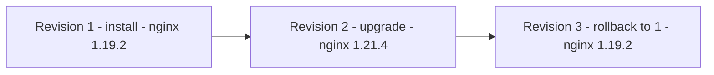

# Dars 276 — Helm bilan Lifecycle boshqaruvi (upgrade, history, rollback)

> 🎯 **Bu darsda nimani o'rganamiz:**
> - Lifecycle management nima va release'lar qanday mustaqil boshqariladi
> - `helm upgrade` bilan ilovani bitta buyruqda yangilash
> - `helm history` bilan release tarixini o'qish
> - `helm rollback` qanday ishlaydi va nimalarni QAYTARMAYDI

## Lifecycle management — oddiy tilda

"Lifecycle management" (hayot sikli boshqaruvi) — dabdabali texnik atama bo'lib eshitiladi, lekin amaliy misollar bilan qarasak, hammasi tushunarli.

Har safar chart'ni tortib o'rnatganimizda **release** yaratiladi. Release ilovaga o'xshaydi, aniqrog'i — Kubernetes obyektlari to'plamidan iborat paket. Helm har bir release'ga qaysi obyektlar tegishli ekanini bilgani uchun, **boshqa release'larning obyektlariga tegmagan holda** upgrade, downgrade yoki uninstall qila oladi. Har bir release mustaqil boshqariladi — hatto hammasi bitta chart'ga asoslangan bo'lsa ham.

Release oylar, yillar davomida yashashi mumkin. Helm uning hayot siklini boshqaradi: joriy holatini, o'tgan holatlarini kuzatib boradi va uni kelajak holatlarga olib o'tadi.

## 💡 Hayotiy o'xshatish: hujjatning versiyalar tarixi

Release'ning revision'lari — Google Docs'dagi "Version history"ga o'xshaydi: har muhim tahrirda yangi versiya saqlanadi, kim-qachon-nima qilganini ko'rasiz (`helm history`) va istalgan eski versiyaga qaytishingiz mumkin (`helm rollback`). Va muhim jihat: eski versiyaga qaytsangiz ham, tarix o'chmaydi — "qaytish"ning o'zi tarixda yangi yozuv bo'lib qoladi.

## Amaliyot: eski Nginx o'rnatamiz

Ataylab ancha eski versiyadagi Nginx chart'ini o'rnatamiz. Aytgancha, `--version` opsiyasi bilan chart'ning aniq versiyasini tanlash mumkin:

```bash
helm install nginx-release bitnami/nginx --version 7.1.0
```

Endi tasavvur qiling: ikki oy o'tdi — dasturiy ta'minot uchun, ayniqsa websayt uchun bu uzoq muddat. Ko'plab xavfsizlik zaifliklari topilib, yamalishi kerak. Nginx saytimizning klasterda ko'p obyektlari bo'lishi mumkin, va Nginx pod'larini yangilaganda boshqa obyektlarni ham o'zgartirish kerak bo'lishi mumkin: yangi versiya yangi environment variable talab qilar, yoki yangi Secret yaratish kerakdir — bu konfiguratsiya obyektlarini va manifest fayllarni o'zgartirishni bildiradi. Hammasini qo'lda kuzatish qiyin.

Baxtimizga, Helm release'ga tegishli hamma narsani kuzatib boradi — obyektlarni birma-bir yangilashimiz shart emas: **bitta buyruq bilan hammasini o'zi yangilaydi**.

### Avval joriy versiyani tekshiramiz

Pod nomini topib, ichidagi image versiyasini ko'ramiz:

```bash
kubectl get pods
# nginx-release-687cdd5c75-ztn2n   1/1   Running   0   44s

kubectl describe pod nginx-release-687cdd5c75-ztn2n | grep -i image:
#   Image: docker.io/bitnami/nginx:1.19.2
```

Nginx **1.19.2** — ancha eski.

### helm upgrade

Buyruq juda sodda: qaysi release'ni yangilashni va u asoslangan chart'ni aytamiz:

```bash
helm upgrade nginx-release bitnami/nginx
# Release "nginx-release" has been upgraded. Happy Helming!
# NAME: nginx-release
# REVISION: 2
# ...
```

Chiqishdagi **REVISION: 2** ga e'tibor bering — Revision 1 o'rnini Revision 2 egalladi.

Upgrade haqiqatan ishladimi? Tekshiramiz. Upgrade jarayonida eski pod o'chirilib, yangisi yaratiladi — shuning uchun yangi pod nomini olamiz va describe qilamiz:

```bash
kubectl get pods
# nginx-release-77bfb8b6f7-kqz9d   1/1   Running   0   60s

kubectl describe pod nginx-release-77bfb8b6f7-kqz9d | grep -i image:
#   Image: docker.io/bitnami/nginx:1.21.4
```

Yangi versiya — **1.21.4**. Mana shu — lifecycle management amalda: release'ni kelajak holatga olib o'tdik (upgrade), Helm esa o'tgan holat (Revision 1) yozuvini ham saqlab qoldi.

## helm history — release tarixi

Release'lar ro'yxatini ko'ramiz:

```bash
helm list
# NAME            NAMESPACE  REVISION  UPDATED   STATUS    CHART         APP VERSION
# nginx-release   default    2         ...       deployed  nginx-9.5.13  1.21.4
```

Joriy revision — 2. Biz oldingisi nima bo'lganini bilamiz, lekin katta jamoada ko'p odam release boshqarsa, bu chiqish nima bo'lganini aytib bermaydi. Chuqurroq qarash uchun:

```bash
helm history nginx-release
# REVISION  UPDATED   STATUS      CHART         APP VERSION  DESCRIPTION
# 1         ...       superseded  nginx-7.1.0   1.19.2       Install complete
# 2         ...       deployed    nginx-9.5.13  1.21.4       Upgrade complete
```

Bu ancha foydali — aniq ko'ramiz:
- har revision'da **qaysi chart versiyasi** ishlatilgan;
- har revision'da **qaysi app versiyasi** bo'lgan;
- revision'ni **qaysi amal** yaratgan: install, upgrade yoki rollback.

Bu release bosib o'tgan bosqichlarning — hayot sikli tarixining aniq manzarasi.

## helm rollback — orqaga qaytish

Faraz qilaylik, bu upgrade bizga yoqmagan narsa qildi. Helm'ning lifecycle boshqaruvida yana bir zo'r imkoniyat bor — **rollback**, release'ni oldingi holatga qaytarish. Revision 1'ga qaytmoqchimiz:

```bash
helm rollback nginx-release 1
# Rollback was a success! Happy Helming!
```

⚠️ **Muhim nuance:** Helm barcha konfiguratsiyani Revision 1'dagi holatiga qaytaradi, lekin texnik jihatdan Revision 1'ga "qaytib ketmaydi" — **Revision 1'dagi kabi konfiguratsiyali YANGI Revision 3 yaratadi**:

```bash
helm history nginx-release
# REVISION  UPDATED   STATUS      CHART         APP VERSION  DESCRIPTION
# 1         ...       superseded  nginx-7.1.0   1.19.2       Install complete
# 2         ...       superseded  nginx-9.5.13  1.21.4       Upgrade complete
# 3         ...       deployed    nginx-7.1.0   1.19.2       Rollback to 1
```

Revision 1 va 3 — bir xil chart va app versiyaga ega, 3'ning tavsifida "Rollback to 1" deb yozilgan.



## Har doim ham shunchalik silliqmi?

Bu yerda Nginx tanlaganimizga sabab — uni yangilash oson. Lekin ba'zi Kubernetes paketlari upgrade uchun qo'shimcha qadamlar talab qiladi. Masalan, oldin yaratgan WordPress release'imizni yangilashga urinsak, xato chiqadi: Helm ba'zi **administrativ parollarsiz** hammasini yangilay olmaydi — unga zarur o'zgarishlarni qilish uchun database'ga va WordPress saytining o'ziga admin kirish huquqi kerak. Bu muammo emas — xato matnida ko'rsatilganidek, buyruqqa bir nechta qo'shimcha parametr berish bilan oson hal qilinadi.

## ⚠️ Rollback nimani QAYTARMAYDI

Rollback — Backup/Restore funksiyasiga o'xshaydi, lekin muhim cheklovi bor: u ilovalarimiz yaratgan **fayl va katalog ma'lumotlarini qamrab olmaydi**. Helm faqat Kubernetes obyektlarining **deklaratsiyalarini (manifest fayllarini)** zaxiralab tiklaydi.

Demak, persistent volume'lar, boshqa doimiy ma'lumotlar yoki tashqi narsalar (masalan, tashqi database) uchun rollback u ma'lumotlarni tiklamaydi. Misol: MySQL database serverini rollback qilsangiz — MySQL pod'lari oldingi holatiga, eski dastur versiyalariga qaytadi, lekin **database'ning o'zi, uning ichidagi ma'lumotlar o'z holicha qoladi** — ular zaxiralanmaydi ham, tiklanmaydi ham.

Chart yangilashdan oldin database'larning izchil (consistent) zaxira nusxalarini olish, hatto ularni tiklash uchun imkoniyatlar bor — bular **chart hooks** deb ataladigan mexanizm orqali qilinadi, uni kursda keyinroq ko'ramiz.

| Rollback tiklaydi | Rollback tiklamaydi |
|---|---|
| Kubernetes obyektlari deklaratsiyalari (manifestlar) | PersistentVolume ichidagi fayllar/ma'lumotlar |
| Pod'lar holati, image versiyalari | Database ichidagi real ma'lumotlar |
| Konfiguratsiya obyektlari | Tashqi tizimlar (tashqi database va h.k.) |

## ❓ Savol-Javob

**Savol:** `helm rollback nginx-release 1` bajarilgach, joriy revision raqami nechchi bo'ladi?
**Javob:** 3 (agar oldin 2 ta revision bo'lsa). Rollback eski revision'ga "qaytmaydi" — oldingi konfiguratsiya bilan yangi revision yaratadi.

**Savol:** `helm history` chiqishidan qanday ma'lumot olamiz?
**Javob:** Har bir revision uchun: qaysi chart versiyasi va app versiyasi ishlatilgani, revision'ni qaysi amal yaratgani (install/upgrade/rollback) va tavsifi. Bu release hayot tarixining to'liq manzarasi.

**Savol:** MySQL release'ni rollback qilsak, database'dagi ma'lumotlar ham eski holatiga qaytadimi?
**Javob:** Yo'q. Rollback faqat manifest/deklaratsiyalarni tiklaydi — pod'lar va dastur versiyalari qaytadi, lekin database ichidagi ma'lumotlar o'z holicha qoladi. Ma'lumotlar zaxirasi uchun chart hooks kerak.

**Savol:** Chart'ning aniq eski versiyasini qanday o'rnatamiz?
**Javob:** `--version` opsiyasi bilan: `helm install nginx-release bitnami/nginx --version 7.1.0`.

## 📌 CKA imtihon uchun maslahat

Uchlik buyruqni yodlang: `helm upgrade <release> <chart>`, `helm history <release>`, `helm rollback <release> <revision-raqami>`. Imtihonda "release'ni oldingi revisiyaga qaytaring" desa, avval `helm history` bilan raqamni aniqlang — taxmin qilmang. Va esda tuting: rollback'dan keyin `helm history`da yangi revision paydo bo'lishi — xato emas, kutilgan xatti-harakat. Aniq chart versiyasi so'ralsa `--version` opsiyasini ishlating.

## 📖 Asosiy atamalar

| Atama | Oddiy tushuntirish |
|---|---|
| Lifecycle management | Release'ning butun hayotini boshqarish: o'rnatish, yangilash, qaytarish, o'chirish |
| helm upgrade | Release'ni yangi chart/konfiguratsiyaga bitta buyruqda yangilash |
| helm history | Release'ning barcha revision'lari tarixini ko'rsatish |
| helm rollback | Release'ni tanlangan revision konfiguratsiyasiga qaytarish (yangi revision yaratib) |
| `--version` | O'rnatishda chart'ning aniq versiyasini tanlash opsiyasi |
| superseded | "O'rnini boshqasi egallagan" — eski revision statusi |
| Chart hooks | Upgrade/rollback oldidan-keyin maxsus amallar (masalan, DB backup) bajarish mexanizmi |

## 🔗 Manbalar

- [helm upgrade hujjati](https://helm.sh/docs/helm/helm_upgrade/)
- [helm rollback hujjati](https://helm.sh/docs/helm/helm_rollback/)
- [helm history hujjati](https://helm.sh/docs/helm/helm_history/)
- [Chart hooks — rasmiy hujjat](https://helm.sh/docs/topics/charts_hooks/)

---
*Bu dars KodeKloud CKA kursining 276-videosi asosida tayyorlandi.*
