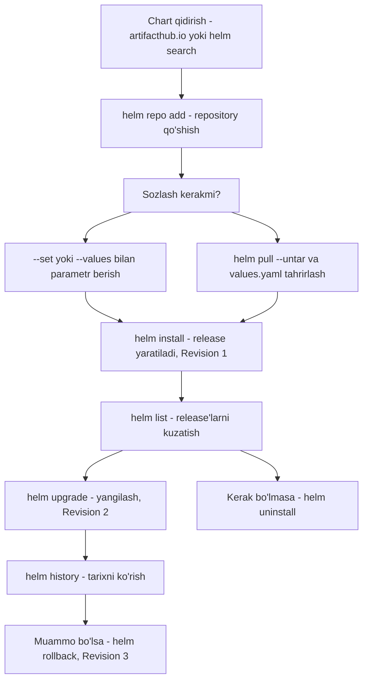

# 📦 12-bo'lim — Helm asoslari (2025)

Bu bo'limda Kubernetes uchun paket menejeri — **Helm** bilan tanishamiz: nima uchun u kerak, qanday o'rnatiladi, chart va release tushunchalari, ilovalarni o'rnatish, sozlash, yangilash va orqaga qaytarish. Bo'lim KodeKloud CKA kursining "Helm Basics" (2025 Updates) qismiga asoslangan.

## 📚 Darslar ro'yxati

| # | Dars fayli | Mavzu |
|---|---|---|
| 267 | [267_Helm_kirish.md](267_Helm_kirish.md) | Nima uchun Helm kerak — WordPress misoli, package manager o'xshatishi |
| 268 | [268_Helm_ornatish.md](268_Helm_ornatish.md) | Helm'ni o'rnatish: talablar, snap/apt/pkg usullari |
| 270 | [270_Helm2_vs_Helm3.md](270_Helm2_vs_Helm3.md) | Helm 2 vs Helm 3: Tiller, RBAC, 3-way strategic merge patch |
| 271 | [271_Helm_komponentlari.md](271_Helm_komponentlari.md) | Komponentlar: helm CLI, chart, release, revision, repository, metadata |
| 272 | [272_Helm_chartlar.md](272_Helm_chartlar.md) | Chart tuzilishi: Chart.yaml, values.yaml, templates papkasi |
| 273 | [273_Helm_bilan_ishlash.md](273_Helm_bilan_ishlash.md) | Asosiy buyruqlar: search hub/repo, repo add, install, list, uninstall |
| 274 | [274_Chart_parametrlari.md](274_Chart_parametrlari.md) | Parametrlarni sozlash: --set, --values, helm pull --untar |
| 276 | [276_Lifecycle_boshqaruvi.md](276_Lifecycle_boshqaruvi.md) | Lifecycle: helm upgrade, history, rollback, revision'lar |

## 🔄 Helm ish oqimi

## 🧠 Bo'limning asosiy g'oyalari

- **Chart** — ilovani o'rnatish yo'riqnomasi; **release** — uning klasterga o'rnatilgan mustaqil nusxasi; **revision** — release holatining "surati".
- Barcha sozlamalar **bitta joyda** — `values.yaml` faylida; o'rnatishda `--set` yoki `--values` bilan bekor qilish mumkin.
- Helm 3'da **Tiller yo'q**, xavfsizlik RBAC orqali, rollback/upgrade esa **3-way strategic merge patch** bilan aqlli ishlaydi.
- Helm o'z metadata'sini klasterda **Secret** sifatida saqlaydi — jamoaning hamma a'zosi release'lar bilan ishlay oladi.
- **Rollback** manifestlarni tiklaydi, lekin persistent ma'lumotlarni (masalan, database ichidagi ma'lumotlar) tiklamaydi.

## 🔗 Umumiy manbalar

- [helm.sh](https://helm.sh/) — Helm rasmiy sayti va hujjatlari
- [helm.sh/docs](https://helm.sh/docs/) — to'liq hujjatlar (o'rnatish, buyruqlar, chart yozish)
- [artifacthub.io](https://artifacthub.io/) — barcha ommaviy Helm chart'lar katalogi
- [kubernetes.io](https://kubernetes.io/docs/home/) — Kubernetes rasmiy hujjatlari

---
*Bu bo'lim KodeKloud CKA kursining "12 - Helm Basics (2025 Updates)" videolari asosida tayyorlandi.*
