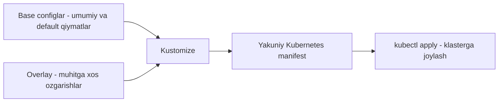

# Dars 278 — Kustomize: muammo bayoni va asosiy g'oya

> 🎯 **Bu darsda nimani o'rganamiz:**
> - Bitta YAML faylni dev, staging va production muhitlariga moslashtirish muammosi
> - Kataloglarni nusxalash yechimi nima uchun yaxshi emas
> - Kustomize'ning ikki asosiy tushunchasi: **base** va **overlay**
> - Nega Kustomize'da template tili yo'q va bu nimasi bilan qulay

## Oddiy hayotiy o'xshatish: bitta retsept, uch xil qozon

Tasavvur qiling, sizda oshning bitta retsepti bor. Uyda 2 kishiga, to'yxonada 200 kishiga, katta sayilda 2000 kishiga osh damlaysiz. Retseptni har safar boshidan qayta yozmaysiz-ku! Retsept **bitta** (bu — *base*), faqat miqdorlar o'zgaradi: "uyda — yarim kilo guruch, to'yda — 20 kilo" (bu — *overlay*). Kustomize aynan shu prinsipda ishlaydi: asosiy konfiguratsiya bitta joyda turadi, har bir muhit uchun faqat **farqlar** yoziladi.

## Muammo: bitta deployment, uchta muhit

Faraz qilaylik, bizda oddiy nginx deployment fayli bor:

```yaml
# nginx-deployment.yaml
apiVersion: apps/v1
kind: Deployment
metadata:
  name: nginx-deployment
spec:
  replicas: 1
  selector:
    matchLabels:
      app: nginx
  template:
    metadata:
      labels:
        app: nginx
    spec:
      containers:
        - name: nginx
          image: nginx
```

Va bizda uchta muhit (environment) bor:

- **dev** — o'z kompyuterimizda ishlab chiqamiz, kuchi kam, **1 replica** yetadi
- **staging** — sinov muhiti, **2-3 replica** kerak
- **production** — real trafikni ko'taradi, **5-10 replica** kerak

Fayl esa bitta va unda `replicas: 1` deb yozilgan. Demak, qayerga apply qilsak ham 1 ta pod chiqadi. Har muhitga o'zining replica sonini qanday beramiz?

## Sodda (lekin yomon) yechim: uchta katalogga nusxalash

Eng birinchi kallaga keladigan yechim — har muhit uchun alohida katalog ochib, barcha YAML fayllarni uchala katalogga **nusxalab** chiqish, keyin har birida kerakli qiymatni qo'lda o'zgartirish:

```
k8s/
├── dev/
│   └── nginx-deployment.yaml   # replicas: 1
├── staging/
│   └── nginx-deployment.yaml   # replicas: 2
└── production/
    └── nginx-deployment.yaml   # replicas: 5
```

Deploy qilish ham oddiy — kerakli katalogni ko'rsatamiz:

```bash
kubectl apply -f k8s/dev/        # 1 ta nginx pod yaratiladi
kubectl apply -f k8s/staging/    # 2 ta nginx pod yaratiladi
```

Bu ishlaydi, texnik cheklovi yo'q. Lekin bu **masshtablanmaydigan** yechim. Nega?

Aytaylik, endi yangi `service.yaml` yaratdik. Uni **uchala katalogga ham** nusxalashni unutmasligimiz kerak. Har qanday o'zgarishni ham uch joyda takrorlash kerak. Muhitlar soni 5 ta bo'lsa — besh joyda. Ertami-kechmi siz yoki jamoadoshingiz bitta katalogni unutadi va muhitlar orasida **konfiguratsiya nomuvofiqligi** paydo bo'ladi: staging'da bir narsa, production'da boshqa narsa ishlab turadi. Bunday xatoni topish juda qiyin.

Dasturlashdagi **DRY** (Don't Repeat Yourself — "o'zingni takrorlama") qoidasi konfiguratsiyalarga ham tegishli. Aynan shu muammoni hal qilish uchun Kustomize yaratilgan.

## Kustomize yechimi: base + overlay

Kustomize'da ikkita kalit tushuncha bor:

| Tushuncha | Nima u | Oshxona tilida |
|---|---|---|
| **Base** (asos) | Barcha muhitlar uchun **bir xil** bo'lgan konfiguratsiya + standart (default) qiymatlar | Asl retsept |
| **Overlay** (qatlam) | Har bir muhit uchun base'dan **nimani o'zgartirish** kerakligi | "To'y uchun: guruch 20 kg" degan qo'shimcha varaq |

- **Base config** — hamma muhitda o'zgarmaydigan resurslar shu yerga yoziladi. Shuningdek, u standart qiymatlarni beradi: masalan, `replicas: 1`. Keyin bu qiymatni istalgan muhitda qayta yozish (override) mumkin.
- **Overlay** — har muhit uchun alohida: base'dagi qaysi parametrni qanday qiymatga o'zgartirishni aytadi. Bizning misolda:
  - dev → o'zgartirish shart emas (default 1 allaqachon mos)
  - staging → `replicas: 2`
  - production → `replicas: 5`

Katalog tuzilishi odatda shunday ko'rinadi:

```
k8s/
├── base/
│   ├── kustomization.yaml
│   └── nginx-deployment.yaml      # replicas: 1 (default)
└── overlays/
    ├── dev/
    │   └── kustomization.yaml
    ├── staging/
    │   └── kustomization.yaml     # replicas: 2 ga o'zgartiradi
    └── production/
        └── kustomization.yaml     # replicas: 5 ga o'zgartiradi
```

Overlay'da faqat farqlar emas, o'sha muhitga **xos yangi resurslar** ham bo'lishi mumkin (masalan, faqat production'da kerak bo'ladigan biror obyekt).

Ish jarayoni:



Kustomize base va overlay'ni olib, ularni birlashtiradi va **tayyor, oddiy YAML manifest** chiqarib beradi — uni klasterga apply qilamiz.

💡 Yana bir yoqimli tomoni: Kustomize **kubectl ichiga o'rnatilgan** — alohida hech narsa o'rnatmasdan ham ishlatsa bo'ladi. Lekin kubectl bilan birga keladigan versiya har doim ham eng yangisi emas, shuning uchun keyingi darslarda alohida o'rnatishni ham ko'ramiz.

## Template'siz yondashuv — Kustomize'ning falsafasi

Helm'dan farqli o'laroq, Kustomize **hech qanday template (shablon) tilidan foydalanmaydi**:

- Yangi til o'rganish shart emas — faqat oddiy YAML yozasiz
- Base ham, overlay ham — **100% haqiqiy (valid) YAML**. Uni istalgan YAML vositasi bilan o'qish, tekshirish va qayta ishlash mumkin
- Maxsus sintaksis, o'zgaruvchilar, qavslar yo'q — hammasi ochiq va o'qish oson
- Murakkab Helm chartlar template sintaksisi tufayli o'qish qiyin bo'lib ketadi; Kustomize esa **soddalikni** birinchi o'ringa qo'yadi

## ❓ Savol-Javob

**Savol:** Har muhit uchun kataloglarga nusxalash yechimi ishlaydi-ku, nega u tavsiya etilmaydi?

**Javob:** Kichik loyihada ishlaydi, lekin resurslar soni o'sgani sari har o'zgarishni barcha kataloglarda takrorlash kerak bo'ladi. Bittasini unutish — muhitlar orasida config nomuvofiqligiga olib keladi. Bu masshtablanmaydigan yechim.

**Savol:** Base config'da nima turadi, overlay'da nima?

**Javob:** Base'da barcha muhitlar uchun bir xil bo'lgan resurslar va default qiymatlar turadi. Overlay'da esa faqat o'sha muhit uchun o'zgartirilishi kerak bo'lgan parametrlar va shu muhitga xos qo'shimcha resurslar bo'ladi.

**Savol:** Kustomize'ni ishlatish uchun alohida dastur o'rnatish shartmi?

**Javob:** Yo'q, Kustomize kubectl ichiga o'rnatilgan (`kubectl apply -k`). Lekin kubectl'dagi versiya eskiroq bo'lishi mumkin, shuning uchun eng yangi imkoniyatlar uchun alohida o'rnatish tavsiya etiladi.

**Savol:** Kustomize'da template tili bormi?

**Javob:** Yo'q, va bu ataylab qilingan. Hamma narsa oddiy YAML — o'rganish oson, o'qish oson, har qanday YAML vositasi bilan ishlaydi.

## 📌 CKA imtihon uchun maslahat

2025-yilgi CKA dasturiga Kustomize kiritilgan. Imtihonda sizdan template yozish so'ralmaydi — asosiy tushunchalarni bilish kifoya: **base** (umumiy configlar) va **overlay** (muhitga xos o'zgarishlar) nima ekanini, hamda `kubectl apply -k <katalog>` buyrug'i kustomization'ni qo'llashini yodda tuting. Katalog tuzilishini (base/ va overlays/dev, overlays/staging, overlays/production) ko'z oldingizga keltira oling.

## 📖 Asosiy atamalar

| Atama | Oddiy tushuntirish |
|---|---|
| Kustomize | Kubernetes configlarini template'siz, muhitga moslab boshqarish vositasi |
| Environment (muhit) | Ilova ishlaydigan alohida joy: dev, staging, production |
| Base | Barcha muhitlar uchun umumiy bo'lgan asosiy konfiguratsiya va default qiymatlar |
| Overlay | Muayyan muhit uchun base'dan farqlarni belgilaydigan qatlam |
| Override | Default qiymatni yangi qiymat bilan qayta yozish |
| Manifest | Kubernetes resursini tavsiflaydigan YAML fayl |
| DRY | Don't Repeat Yourself — kodni (configni) takrorlamaslik prinsipi |
| Replica | Deployment ichida ishlaydigan pod nusxalari soni |

## 🔗 Manbalar

- [Kustomize rasmiy sayti — kustomize.io](https://kustomize.io/)
- [Kustomize hujjatlari — kubectl.docs.kubernetes.io](https://kubectl.docs.kubernetes.io/references/kustomize/)
- [Declarative Management with Kustomize — kubernetes.io](https://kubernetes.io/docs/tasks/manage-kubernetes-objects/kustomization/)
- [Bases and Overlays tushunchasi — kubectl.docs.kubernetes.io](https://kubectl.docs.kubernetes.io/guides/config_management/components/)

---
*Bu dars KodeKloud CKA kursining 278-videosi asosida tayyorlandi.*
