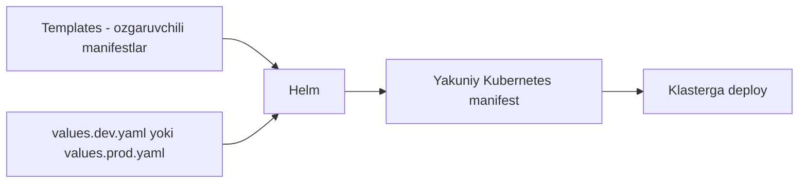

# Dars 279 — Kustomize va Helm taqqoslash

> 🎯 **Bu darsda nimani o'rganamiz:**
> - Helm shu muammoni (muhitga moslashtirish) qanday hal qiladi
> - Go template sintaksisi va `values.yaml` fayli nima
> - Kustomize va Helm'ning kuchli/zaif tomonlari
> - Loyihangiz uchun qaysi vositani tanlashni qanday hal qilish

## Oddiy hayotiy o'xshatish: bo'sh joyli blanka va tayyor xat

**Helm** — bo'sh joylari bor rasmiy blanka kabi: "Hurmatli ______, sizga ______ so'm to'lanadi". Blankaning o'zi to'liq hujjat emas — bo'sh joylarni to'ldirmaguncha ma'noga ega bo'lmaydi. Qiymatlar alohida ro'yxatdan (values.yaml) olinib joyiga qo'yiladi.

**Kustomize** — tayyor yozilgan xat va unga ilova qilingan tuzatish varag'i: "3-qatordagi '1' ni '5' ga o'zgartiring". Xatning o'zi boshdan-oxir to'liq va o'qiladigan hujjat.

## Helm muammoni qanday hal qiladi: Go templating

Helm ham xuddi shu masalani — Kubernetes manifestlarini har muhitga moslashtirishni — hal qiladi, lekin boshqa yo'l bilan: **Go template sintaksisi** orqali qiymatlar o'rniga o'zgaruvchilar qo'yiladi.

Mana Helm'dagi deployment template namunasi:

```yaml
# templates/deployment.yaml
apiVersion: apps/v1
kind: Deployment
metadata:
  name: nginx-deployment
spec:
  replicas: {{ .Values.replicaCount }}
  selector:
    matchLabels:
      app: nginx
  template:
    metadata:
      labels:
        app: nginx
    spec:
      containers:
        - name: nginx
          image: nginx:{{ .Values.image.tag }}
```

E'tibor bering: `replicas` qiymati o'rnida qo'sh jingalak qavs ichida `{{ .Values.replicaCount }}` turibdi. Bu — **o'zgaruvchi**. Qiymat qattiq yozilmagan (hard code qilinmagan), keyinroq beriladi.

Qiymatlar qayerdan keladi? **values.yaml** faylidan:

```yaml
# values.yaml
replicaCount: 1

image:
  tag: 2.4.4
```

Deploy paytida Helm `replicaCount` o'rniga `1` ni, `image.tag` o'rniga `2.4.4` ni template ichiga **qo'yib chiqadi** va tayyor manifest hosil bo'ladi.

## Helm loyihasining tuzilishi

Muhitlarga moslashtirish uchun har muhitga alohida values fayli tutiladi:

```
helm-project/
├── templates/
│   ├── deployment.yaml      # o'zgaruvchilar bilan yozilgan templatelar
│   └── service.yaml
└── environments/
    ├── values.dev.yaml      # dev uchun qiymatlar
    ├── values.staging.yaml  # staging uchun qiymatlar
    └── values.prod.yaml     # production uchun qiymatlar
```

Deploy qilishda qaysi values faylini ishlatishni ko'rsatamiz — Helm o'sha qiymatlarni templatega quyadi.



## Helm — shunchaki config vositasi emas

Muhim fakt: Helm faqat muhitga moslashtirish vositasi emas — u ilovangiz uchun to'laqonli **paket menejeri (package manager)**. Linux'dagi **YUM** yoki **APT** qanday ishlasa, Helm Kubernetes ilovalari uchun shunday ishlaydi: tayyor chartlarni topish, o'rnatish, yangilash, versiyalash.

Bundan tashqari Helm'da Kustomize'da yo'q qo'shimcha imkoniyatlar bor:

- **Conditionals** — shartli bloklar (if/else)
- **Loops** — sikllar
- **Functions** — funksiyalar
- **Hooks** — deploy jarayonining ma'lum bosqichlarida ishga tushadigan amallar

Lekin bu qo'shimcha kuch **qo'shimcha murakkablik** bilan keladi.

## Asosiy kamchilik: template valid YAML emas

Helm template'lari Go sintaksisi ishlatilgani uchun **texnik jihatdan valid YAML hisoblanmaydi**. Katta Helm chartlarni ochib ko'rsangiz — hamma joy o'zgaruvchi, qaysi qiymat qayerdan kelayotganini tushunish qiyin, "bu chart aslida nima qilyapti?" degan savolga javob topish mushkul bo'lib qoladi.

Kustomize'da esa hammasi — base ham, overlay ham — **oddiy, valid YAML**. O'qish oson, tushunish oson.

## Taqqoslash jadvali

| Mezon | Kustomize | Helm |
|---|---|---|
| Yondashuv | Base + overlay (patch qilish) | Go template + values.yaml |
| Sintaksis | Oddiy, valid YAML | Template sintaksisi — valid YAML emas |
| O'rganish qiyinligi | Oson — yangi til yo'q | Qiyinroq — templating tilini o'rganish kerak |
| O'qish qulayligi | Yuqori | Katta chartlarda past |
| Paket menejeri | Yo'q | Ha (YUM/APT kabi) |
| Conditionals, loops, functions, hooks | Yo'q | Bor |
| kubectl bilan integratsiya | O'rnatilgan (`kubectl apply -k`) | Alohida CLI kerak (`helm`) |
| Yaxshi mos keladi | O'z configlaringizni muhitlarga moslashtirish | Murakkab ilovalarni paketlash va tarqatish |

## Qaysi birini tanlash?

Asosiy savdolashuv (trade-off) shunday:

- **Kustomize** — soddaroq va yengilroq. O'z Kubernetes configlaringizni bir necha muhitga moslashtirish kerak bo'lsa — ideal.
- **Helm** — murakkabroq, lekin imkoniyatlari ko'proq. Ilovani paket sifatida tarqatish, murakkab mantiq (shartlar, sikllar) kerak bo'lsa — Helm kuchli.

Ikkalasining ham ishlash prinsipini va afzallik/kamchiliklarini bilib, loyihangiz talabidan kelib chiqib tanlang.

## ❓ Savol-Javob

**Savol:** Helm va Kustomize bir xil muammoni hal qiladimi?

**Javob:** Muhitga moslashtirish masalasida — ha, ikkalasi ham shu masalani hal qiladi. Lekin Helm bundan kengroq: u to'laqonli paket menejeri hamdir. Yondashuvlari esa butunlay boshqacha: Helm template + qiymatlar, Kustomize esa base + overlay.

**Savol:** Nega Helm chartlarni o'qish qiyin deyiladi?

**Javob:** Chunki template'lar Go sintaksisidagi o'zgaruvchilarga to'la bo'ladi va fayl valid YAML bo'lmay qoladi. Qaysi qiymat qayerdan kelishini kuzatish, chart nima qilayotganini tushunish murakkablashadi.

**Savol:** Helm'da muhitga qarab qiymat qanday beriladi?

**Javob:** Har muhit uchun alohida values fayli tutiladi (values.dev.yaml, values.staging.yaml, values.prod.yaml). Deploy paytida kerakli fayl ko'rsatiladi va Helm undagi qiymatlarni template ichiga joylab chiqadi.

**Savol:** Kustomize'da conditionals yoki loops bormi?

**Javob:** Yo'q. Bu — ataylab qilingan tanlov: Kustomize soddalikni saqlaydi. Shartlar, sikllar, funksiyalar va hooks kerak bo'lsa — Helm'ga qarang.

## 📌 CKA imtihon uchun maslahat

CKA'da sizdan Helm chart yozish talab qilinmaydi, lekin ikkala vositaning **konseptual farqini** bilish foydali: Kustomize — overlay/patch yondashuvi, valid YAML; Helm — templating va paket menejeri. Imtihon muhitida `helm` va `kubectl apply -k` ikkalasi ham mavjud bo'lishi mumkin — topshiriq qaysi vositani so'rasa, o'shani ishlating va vaqtni taqqoslashga sarflamang.

## 📖 Asosiy atamalar

| Atama | Oddiy tushuntirish |
|---|---|
| Helm | Kubernetes uchun paket menejeri va templating vositasi |
| Chart | Helm'dagi ilova paketi (templatelar + metadata + values) |
| Go templating | `{{ }}` qavslar bilan o'zgaruvchi qo'yish sintaksisi |
| values.yaml | Template o'zgaruvchilariga qiymat beruvchi fayl |
| Variable (o'zgaruvchi) | Qattiq yozilgan qiymat o'rnida turuvchi nom, qiymati keyin beriladi |
| Package manager | Dasturlarni o'rnatish/yangilashni boshqaruvchi vosita (YUM, APT kabi) |
| Hook | Deploy jarayonining ma'lum nuqtasida avtomatik bajariladigan amal |
| Trade-off | Bir afzallik evaziga boshqa narsadan voz kechish — tanlov muvozanati |

## 🔗 Manbalar

- [Kustomize rasmiy sayti — kustomize.io](https://kustomize.io/)
- [Kustomize hujjatlari — kubectl.docs.kubernetes.io](https://kubectl.docs.kubernetes.io/references/kustomize/)
- [Helm rasmiy hujjatlari — helm.sh](https://helm.sh/docs/)
- [Declarative Management with Kustomize — kubernetes.io](https://kubernetes.io/docs/tasks/manage-kubernetes-objects/kustomization/)

---
*Bu dars KodeKloud CKA kursining 279-videosi asosida tayyorlandi.*
