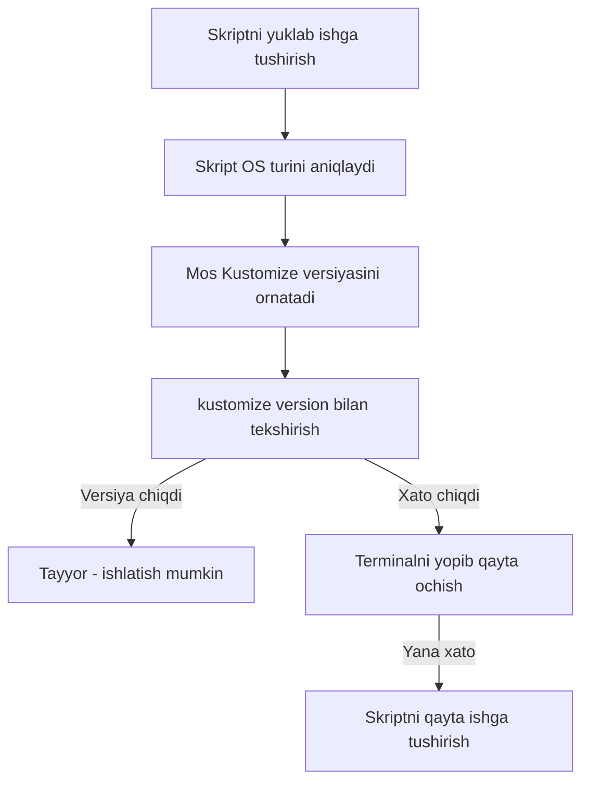

# Dars 280 — Kustomize'ni o'rnatish hamda apiVersion va kind

> 🎯 **Bu darsda nimani o'rganamiz:**
> - Kustomize'ni o'rnatishdan oldin nima tayyor bo'lishi kerak
> - Rasmiy skript orqali bitta buyruq bilan o'rnatish
> - O'rnatishni tekshirish va tez-tez uchraydigan muammo yechimi
> - kustomization.yaml faylidagi `apiVersion` va `kind` maydonlari

## Oddiy hayotiy o'xshatish: ustaning yordamchisi

Kustomize'ni o'rnatish — do'kondan asbob sotib olishga o'xshamaydi, bu ko'proq "aqlli yordamchi" chaqirishga o'xshaydi: siz bitta buyruq berasiz, skript o'zi kompyuteringiz qanaqaligini (Linux, Mac yoki Windows) aniqlab, mos versiyani tanlab, o'rnatib beradi. Sizdan faqat bitta buyruq.

## O'rnatishdan oldingi shartlar

Kustomize'ni o'rnatishdan avval quyidagilar tayyor bo'lishi kerak:

1. Ishlab turgan **Kubernetes klaster**
2. Kompyuteringizda o'rnatilgan **kubectl**
3. kubectl klasteringizga **ulanishga sozlangan** bo'lishi

💡 Esda tuting: Kustomize'ning bir versiyasi kubectl ichida allaqachon bor (`kubectl apply -k`). Alohida o'rnatishning sababi — kubectl bilan birga keladigan versiya har doim ham eng yangisi emas.

## O'rnatish: bitta skript hammasini qiladi

Kustomize jamoasi o'rnatishni juda osonlashtirgan: rasmiy skript operatsion tizimingizni (Linux, Windows, Mac) **avtomatik aniqlab**, mos versiyani o'rnatadi. Terminalda quyidagi buyruqni ishga tushiring:

```bash
curl -s "https://raw.githubusercontent.com/kubernetes-sigs/kustomize/master/hack/install_kustomize.sh" | bash
```

Bu buyruq skriptni yuklab olib ishga tushiradi — boshqa hech qanday buyruq kerak emas, hamma ish skriptning o'zida bajariladi. O'rnatilgan faylni PATH'dagi katalogga ko'chirib qo'ying:

```bash
sudo mv kustomize /usr/local/bin/
```

## Tekshirish

O'rnatish to'g'ri o'tganini tekshiramiz:

```bash
kustomize version
```

Natija taxminan shunday bo'ladi:

```
v5.4.3
```

⚠️ Agar bunga o'xshash natija chiqmasa — katta ehtimol o'rnatishda muammo bo'lgan yoki **environment variable'lar joriy terminal sessiyasida yangilanmagan**. Yechim tartibi:

1. Joriy terminalni **yopib, yangisini oching** — ko'p hollarda shu yetarli
2. Muammo davom etsa — o'rnatish skriptini **qaytadan ishga tushiring**



## kustomization.yaml'da apiVersion va kind

Boshqa har qanday Kubernetes resurs fayli kabi, `kustomization.yaml` faylida ham `apiVersion` va `kind` maydonlarini belgilash mumkin:

```yaml
# kustomization.yaml
apiVersion: kustomize.config.k8s.io/v1beta1
kind: Kustomization

resources:
  - nginx-deployment.yaml
```

Muhim nuanslar:

| Maydon | Qiymat | Majburiymi? |
|---|---|---|
| apiVersion | `kustomize.config.k8s.io/v1beta1` | Texnik jihatdan ixtiyoriy |
| kind | `Kustomization` | Texnik jihatdan ixtiyoriy |

Bu ikkala maydon **texnik jihatdan ixtiyoriy** — yozmasangiz, Kustomize default qiymatlarni o'zi oladi. Lekin baribir ularni **qo'lda aniq yozib qo'yish tavsiya etiladi**: kelajakda biror breaking change (moslikni buzuvchi o'zgarish) bo'lsa, faylingiz kutilmaganda ishlamay qolmaydi.

## ❓ Savol-Javob

**Savol:** Kustomize kubectl ichida bor-ku, nega alohida o'rnatamiz?

**Javob:** kubectl bilan birga keladigan Kustomize versiyasi ko'pincha eng yangisi emas. Yangi funksiyalar va tuzatishlar uchun mustaqil (standalone) Kustomize o'rnatgan ma'qul.

**Savol:** O'rnatish skripti ishladi, lekin `kustomize version` "command not found" deyapti. Nima qilay?

**Javob:** Avval terminalni yopib yangisini oching — environment variable'lar yangi sessiyada yuklanadi. Yordam bermasa, skriptni qayta ishga tushiring va kustomize binary PATH'dagi katalogda (masalan /usr/local/bin) turganini tekshiring.

**Savol:** kustomization.yaml'da apiVersion va kind yozish shartmi?

**Javob:** Shart emas — ular ixtiyoriy va Kustomize defaultlarni o'zi qo'yadi. Lekin kelajakdagi breaking change'lardan himoyalanish uchun `apiVersion: kustomize.config.k8s.io/v1beta1` va `kind: Kustomization` ni qo'lda yozib qo'yish tavsiya etiladi.

## 📌 CKA imtihon uchun maslahat

Imtihon muhitida odatda kustomize allaqachon o'rnatilgan yoki `kubectl apply -k` yetarli bo'ladi — o'rnatishga vaqt sarflamang. Lekin `kustomization.yaml` faylini noldan tez yoza olish kerak: birinchi ikki qatorni (`apiVersion: kustomize.config.k8s.io/v1beta1` va `kind: Kustomization`) yod oling — bu fayl uchun `kubectl create` kabi generator buyruq yo'q, qo'lda yoziladi.

## 📖 Asosiy atamalar

| Atama | Oddiy tushuntirish |
|---|---|
| Standalone Kustomize | kubectl'dan alohida o'rnatilgan mustaqil kustomize dasturi |
| Install script | OS'ni aniqlab mos versiyani o'zi o'rnatadigan rasmiy skript |
| Environment variable | Terminal sessiyasidagi muhit o'zgaruvchisi (masalan PATH) |
| PATH | Terminal buyruqlarni qidiradigan kataloglar ro'yxati |
| apiVersion | Resurs qaysi API versiyasiga tegishli ekanini bildiruvchi maydon |
| kind | Resurs turi — kustomization.yaml uchun `Kustomization` |
| Breaking change | Eski konfiguratsiyani ishlamay qoldirishi mumkin bo'lgan o'zgarish |

## 🔗 Manbalar

- [Kustomize o'rnatish — kubectl.docs.kubernetes.io](https://kubectl.docs.kubernetes.io/installation/kustomize/)
- [Skript orqali o'rnatish — kubectl.docs.kubernetes.io](https://kubectl.docs.kubernetes.io/installation/kustomize/binaries/)
- [Kustomization fayl maydonlari — kubectl.docs.kubernetes.io](https://kubectl.docs.kubernetes.io/references/kustomize/kustomization/)
- [Kustomize rasmiy sayti — kustomize.io](https://kustomize.io/)

---
*Bu dars KodeKloud CKA kursining 280- va 283-videolari asosida tayyorlandi.*
