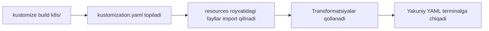

# Dars 281 — kustomization.yaml fayli

> 🎯 **Bu darsda nimani o'rganamiz:**
> - Kustomize nima uchun aynan `kustomization.yaml` faylini qidiradi
> - Fayl ichidagi ikkita asosiy bo'lim: **resources** va **customizations**
> - `kustomize build` buyrug'i qanday ishlaydi
> - Nega `kustomize build` klasterga hech narsa deploy qilmaydi

## Oddiy hayotiy o'xshatish: kutubxonachining ro'yxat daftari

Kutubxonaga kirsangiz, minglab kitob bor — lekin kutubxonachi hammasini titkilamaydi, u **katalog daftariga** qaraydi: qaysi kitoblar hisobda turibdi va ularga qanday belgi (muhr) qo'yish kerak. `kustomization.yaml` — ana shu daftar: Kustomize katalogingizdagi YAML fayllarga o'zi qaramaydi, faqat shu daftarda **ro'yxatga olingan** fayllarni oladi va daftarda ko'rsatilgan **o'zgartirishlarni** qo'llaydi.

## Boshlang'ich holat

Bizda `k8s/` katalogi bor, unda ikkita oddiy Kubernetes config fayli turibdi:

```
k8s/
├── nginx-deployment.yaml
└── nginx-service.yaml
```

Kustomize'ni shu katalogga yo'naltiramiz. Lekin muhim fakt: **Kustomize bu fayllarning hech biriga o'zi qaramaydi**. U faqat bitta maxsus faylni qidiradi — `kustomization.yaml`. Bu faylni **o'zingiz yaratishingiz** kerak va nomi aynan `kustomization.yaml` bo'lishi shart.

## kustomization.yaml ichida nima bo'ladi?

Fayl juda sodda — unda faqat **ikkita** narsa bo'ladi:

1. **Resources** — Kustomize boshqarishi kerak bo'lgan barcha Kubernetes resurslar (YAML fayllar) ro'yxati
2. **Customizations (transformations)** — o'sha resurslarga qo'llanishi kerak bo'lgan o'zgartirishlar

```yaml
# k8s/kustomization.yaml

# 1-bo'lim: Kustomize boshqaradigan resurslar ro'yxati
resources:
  - nginx-deployment.yaml
  - nginx-service.yaml

# 2-bo'lim: qo'llanadigan o'zgartirishlar (customizations)
commonLabels:
  company: KodeKloud
```

Bu misolda bitta oddiy transformatsiya ishlatilgan: `commonLabels` — Kustomize orqali yaratiladigan **barcha** resurslarga `company: KodeKloud` label'ini qo'shib chiqadi. Bu — ko'plab mumkin bo'lgan transformatsiyalardan faqat bittasi; qolganlarini keyingi darslarda ko'ramiz.

| Bo'lim | Savoli | Misolda |
|---|---|---|
| resources | "Qaysi fayllarni boshqaraman?" | nginx-deployment.yaml, nginx-service.yaml |
| customizations | "Ularni qanday o'zgartiraman?" | Hammasiga company: KodeKloud label'i qo'shish |

## kustomize build buyrug'i

kustomization.yaml tayyor bo'lgach, build buyrug'ini ishga tushiramiz — unga kustomization.yaml **joylashgan katalogni** ko'rsatamiz:

```bash
kustomize build k8s/
```

Buyruq nima qiladi:

1. `k8s/` katalogidan `kustomization.yaml` faylini topadi
2. Undagi `resources` ro'yxatidagi fayllarni import qiladi
3. Barcha belgilangan transformatsiyalarni qo'llaydi
4. **Yakuniy config qanday ko'rinishini terminalga chiqarib beradi**



Natijada terminalda taxminan shunday chiqadi:

```yaml
apiVersion: v1
kind: Service
metadata:
  labels:
    company: KodeKloud
  name: nginx-service
spec:
  ports:
  - port: 80
  selector:
    app: nginx
    company: KodeKloud
---
apiVersion: apps/v1
kind: Deployment
metadata:
  labels:
    company: KodeKloud
  name: nginx-deployment
spec:
  replicas: 1
  selector:
    matchLabels:
      app: nginx
      company: KodeKloud
  template:
    metadata:
      labels:
        app: nginx
        company: KodeKloud
    spec:
      containers:
      - image: nginx
        name: nginx
```

Ko'rib turganingizdek, ikkala resurs ham chiqdi va eng muhimi — **transformatsiya qo'llangan**: `company: KodeKloud` label'i service'ga ham, deployment'ga ham qo'shildi. `commonLabels` aynan shunday ishlaydi — bitta label'ni barcha resurslarga tarqatadi.

## ⚠️ Muhim: build hech narsa deploy qilmaydi

`kustomize build` ishga tushganda klasterda **hech qanday resurs yaratilmaydi**. Buyruq faqat "yakuniy config mana bunday bo'ladi" deb terminalga **chiqarib beradi**, xolos. Klasterga haqiqatan apply qilish uchun bu output'ni `kubectl apply` buyrug'iga uzatish kerak — buni keyingi darsda ko'ramiz.

## ❓ Savol-Javob

**Savol:** Kustomize katalogdagi YAML fayllarni o'zi avtomatik topib olmaydimi?

**Javob:** Yo'q. Kustomize faqat `kustomization.yaml` fayliga qaraydi. Qaysi fayllar boshqarilishini o'sha fayldagi `resources` ro'yxatida o'zingiz aniq ko'rsatishingiz kerak. Ro'yxatda yo'q fayl e'tiborga olinmaydi.

**Savol:** kustomization.yaml faylida nimalar bo'ladi?

**Javob:** Ikkita asosiy narsa: (1) Kustomize boshqaradigan resurslar (YAML fayllar) ro'yxati — `resources`; (2) ularga qo'llanadigan o'zgartirishlar — customizations/transformations (masalan `commonLabels`).

**Savol:** `kustomize build k8s/` ni ishga tushirdim — klasterda pod paydo bo'ladimi?

**Javob:** Yo'q. Build faqat yakuniy manifestni terminalga chiqaradi, klasterga hech narsa apply qilmaydi. Deploy qilish uchun output'ni `kubectl apply -f -` ga pipe qilish kerak.

**Savol:** commonLabels transformatsiyasi nima qiladi?

**Javob:** kustomization.yaml'da ko'rsatilgan label'ni (misolda `company: KodeKloud`) Kustomize boshqaradigan barcha resurslarga qo'shib chiqadi.

## 📌 CKA imtihon uchun maslahat

Fayl nomi imtihonda tipik xato manbai: aynan **kustomization.yaml** bo'lishi shart (customization emas, kustomize.yaml ham emas). "Kustomize resurslarni ko'rmayapti" degan holatda birinchi bo'lib fayl nomini va `resources` ro'yxatida kerakli fayllar borligini tekshiring. `kustomize build <katalog>` argument sifatida faylni emas, **katalogni** olishini unutmang.

## 📖 Asosiy atamalar

| Atama | Oddiy tushuntirish |
|---|---|
| kustomization.yaml | Kustomize qidiradigan yagona "katalog daftari" fayli |
| resources | Kustomize boshqaradigan YAML fayllar ro'yxati |
| Customization / Transformation | Resurslarga qo'llanadigan o'zgartirish qoidasi |
| commonLabels | Barcha resurslarga bir xil label qo'shadigan transformatsiya |
| kustomize build | Resurslarni yig'ib, transformatsiyalarni qo'llab, yakuniy YAML'ni chiqaruvchi buyruq |
| Label | Resursga yopishtiriladigan kalit-qiymat belgisi |
| Output | Buyruqning terminalga chiqargan natijasi |

## 🔗 Manbalar

- [Kustomization fayli haqida — kubectl.docs.kubernetes.io](https://kubectl.docs.kubernetes.io/references/kustomize/kustomization/)
- [resources maydoni — kubectl.docs.kubernetes.io](https://kubectl.docs.kubernetes.io/references/kustomize/kustomization/resource/)
- [commonLabels — kubectl.docs.kubernetes.io](https://kubectl.docs.kubernetes.io/references/kustomize/kustomization/commonlabels/)
- [Kustomize rasmiy sayti — kustomize.io](https://kustomize.io/)

---
*Bu dars KodeKloud CKA kursining 281-videosi asosida tayyorlandi.*
