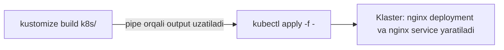

# Dars 282 — Kustomize output'ini klasterga qo'llash

> 🎯 **Bu darsda nimani o'rganamiz:**
> - `kustomize build` natijasini `kubectl apply` ga pipe orqali uzatish
> - Xuddi shu ishni faqat kubectl bilan qilish: `-k` bayrog'i
> - Kustomize orqali resurslarni o'chirish (delete)

## Oddiy hayotiy o'xshatish: oshpaz va ofitsiant

`kustomize build` — oshpaz: taomni tayyorlab, oshxona peshtaxtasiga qo'yadi. Lekin taom o'z-o'zidan mijoz stoliga bormaydi! Uni yetkazish uchun **ofitsiant** kerak — bu `kubectl apply`. Linux'dagi **pipe** (`|`) belgisi esa oshxona bilan zal orasidagi uzatish darchasi: oshpaz tayyorlaganini ofitsiantga to'g'ridan-to'g'ri uzatadi.

## Muammo: build qildik, lekin klaster bo'sh

O'tgan darsda `kustomize build` buyrug'i barcha resurslarni yig'ib, transformatsiyalarni qo'llab, yakuniy configni **terminalga chiqarishini** ko'rdik. Lekin klasterga kirib tekshirsak:

```bash
kubectl get pods
kubectl get deployments
kubectl get services
```

— hech narsa yaratilmagan. Chunki build faqat **ko'rsatadi**, deploy qilmaydi. Xo'sh, qanday apply qilamiz?

## Yechim: pipe orqali kubectl apply'ga uzatish

Kerakli buyruq mana bu:

```bash
kustomize build k8s/ | kubectl apply -f -
```

Buyruq uzunroq, lekin mantig'i sodda. Bu yerda `|` — **Linux pipe utilitasi**. Bu Kubernetes yoki Kustomize'ga xos narsa emas — har qanday bash/shell'ning imkoniyati. Pipe **birinchi buyruq output'ini olib, ikkinchi buyruqqa input qilib beradi**:

1. Chapda: `kustomize build k8s/` — yakuniy YAML'ni chiqaradi
2. O'ngda: `kubectl apply -f -` — o'sha YAML'ni qabul qilib klasterga apply qiladi (oxiridagi `-` "faylni emas, kelayotgan oqimni o'qi" degani)



Natija:

```bash
kustomize build k8s/ | kubectl apply -f -
service/nginx-service created
deployment.apps/nginx-deployment created
```

Endi nginx deployment ham, nginx service ham klasterda haqiqatan yaratildi.

## kubectl'ning o'zi bilan: -k bayrog'i

Xuddi shu ishni pipe'siz, faqat kubectl bilan (native usulda) qilish mumkin — `-f` o'rniga `-k` yoziladi va kustomization.yaml turgan **katalog** ko'rsatiladi:

```bash
kubectl apply -k k8s/
```

`-k` bayrog'i "kustomize" degani — kubectl o'zi ichidagi Kustomize'ni ishlatib build qiladi va darhol apply qiladi.

## Resurslarni o'chirish

O'chirish yaratishga deyarli aynan o'xshaydi — shunchaki `apply` so'zini `delete` ga almashtiramiz:

```bash
kustomize build k8s/ | kubectl delete -f -
```

Bu oldingi qadamda yaratgan ikkala resursimizni o'chiradi:

```
service "nginx-service" deleted
deployment.apps "nginx-deployment" deleted
```

Native kubectl varianti ham xuddi shunday:

```bash
kubectl delete -k k8s/
```

## Buyruqlar jadvali

| Amal | Standalone kustomize bilan | Faqat kubectl bilan |
|---|---|---|
| Ko'rish (deploy qilmasdan) | `kustomize build k8s/` | `kubectl kustomize k8s/` |
| Yaratish / yangilash | `kustomize build k8s/ \| kubectl apply -f -` | `kubectl apply -k k8s/` |
| O'chirish | `kustomize build k8s/ \| kubectl delete -f -` | `kubectl delete -k k8s/` |

## 🧪 Mustaqil topshiriqlar

> Yechishdan oldin darsni yopib qo'ying. Taxminiy vaqt: 10 daqiqa.

**1-topshiriq · oson.** `kubectl kustomize` bilan natijani ko'ring — klasterga hech nima yubormasdan.

<details><summary>O'zingizni tekshiring</summary>

```bash
kubectl kustomize .
```
</details>

**2-topshiriq · o'rta.** Xuddi shu natijani klasterga qo'llang.

<details><summary>O'zingizni tekshiring</summary>

```bash
kubectl apply -k .
kubectl get all
```
</details>

**3-topshiriq · qiyin.** `kubectl apply -k` va `kubectl kustomize . | kubectl apply -f -` farqi bormi?

<details><summary>O'zingizni tekshiring</summary>

**Natija bir xil**, lekin `-k` qulayroq: u bitta buyruq va `kubectl` ning
o'z Kustomize'ini ishlatadi.

Ikkinchi shakl esa oraliq natijani ko'rish yoki uni faylga saqlash kerak
bo'lganda foydali:

```bash
kubectl kustomize overlays/prod > chiqish.yaml
kubectl diff -f chiqish.yaml
```
</details>

## ❓ Savol-Javob

**Savol:** `kustomize build k8s/ | kubectl apply -f -` buyrug'idagi `|` nima qiladi?

**Javob:** Bu Linux pipe utilitasi — birinchi buyruqning output'ini ikkinchi buyruqning input'iga uzatadi. Ya'ni kustomize build chiqargan yakuniy YAML to'g'ridan-to'g'ri kubectl apply'ga "fayl" sifatida beriladi.

**Savol:** Buyruq oxiridagi yolg'iz `-` belgisi nima?

**Javob:** `kubectl apply -f -` dagi `-` "faylni diskdan emas, standart input'dan (pipe orqali kelayotgan oqimdan) o'qi" degan ma'noni bildiradi.

**Savol:** `-k` va `-f` bayroqlarining farqi nima?

**Javob:** `-f` oddiy YAML fayl yoki katalogni apply qiladi. `-k` esa ko'rsatilgan katalogdan kustomization.yaml'ni topib, kubectl ichidagi Kustomize bilan build qilib, natijani apply qiladi.

**Savol:** Kustomize bilan yaratilgan resurslarni qanday o'chiraman?

**Javob:** Xuddi yaratishdagi buyruqda apply'ni delete'ga almashtiring: `kustomize build k8s/ | kubectl delete -f -` yoki `kubectl delete -k k8s/`.

## 📌 CKA imtihon uchun maslahat

Imtihonda vaqt tejash uchun eng qisqa yo'l — `kubectl apply -k <katalog>`. Lekin pipe variantining afzalligi bor: apply qilishdan **oldin** `kustomize build <katalog>` ni alohida ishga tushirib, natijani ko'zdan kechirishingiz mumkin — kutilmagan narsani apply qilib qo'yishdan saqlaydi. Avval build, ko'rib chiqib keyin apply — xavfsiz odat.

## 📖 Asosiy atamalar

| Atama | Oddiy tushuntirish |
|---|---|
| Pipe ( \| ) | Birinchi buyruq output'ini ikkinchisiga input qilib uzatuvchi Linux mexanizmi |
| stdin (standart input) | Buyruq o'qiydigan kirish oqimi; `-f -` dagi `-` shuni bildiradi |
| kubectl apply -f | Fayl yoki oqimdagi manifestni klasterga qo'llash |
| kubectl apply -k | Katalogdagi kustomization'ni build qilib apply qilish (k = kustomize) |
| kubectl delete -k | Kustomization'dagi resurslarni klasterdan o'chirish |
| Native | Qo'shimcha vositasiz, kubectl'ning o'z imkoniyati bilan |

## 🔗 Manbalar

- [Declarative Management with Kustomize — kubernetes.io](https://kubernetes.io/docs/tasks/manage-kubernetes-objects/kustomization/)
- [kustomize build buyrug'i — kubectl.docs.kubernetes.io](https://kubectl.docs.kubernetes.io/references/kustomize/cmd/build/)
- [Kustomize rasmiy sayti — kustomize.io](https://kustomize.io/)

---
*Bu dars KodeKloud CKA kursining 282-videosi asosida tayyorlandi.*
