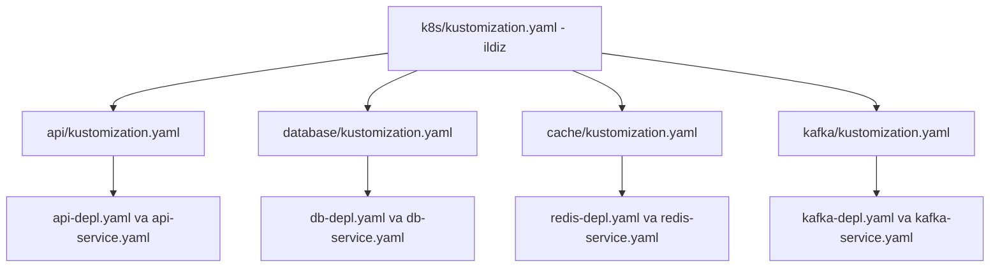

# Dars 284 — Kataloglarni Kustomize bilan boshqarish

> 🎯 **Bu darsda nimani o'rganamiz:**
> - Configlar ichki kataloglarga bo'linganda apply qilish nega qiyinlashadi
> - Ildiz (root) kustomization.yaml orqali barcha fayllarni bitta buyruq bilan boshqarish
> - Yanada toza yechim: **har bir ichki katalogda alohida kustomization.yaml**

## Oddiy hayotiy o'xshatish: korxona va bo'lim boshliqlari

Kichik korxonada direktor har bir xodimga o'zi topshiriq beradi — xodim ko'payganda bu imkonsiz bo'lib qoladi. Katta korxonada esa direktor faqat **bo'lim boshliqlariga** murojaat qiladi, har bir boshliq o'z bo'limidagi xodimlarni o'zi biladi. Ildiz `kustomization.yaml` — direktor; har ichki katalogdagi `kustomization.yaml` — bo'lim boshlig'i. Direktor ro'yxatida yuzlab xodim emas, faqat bo'limlar nomi turadi.

## Boshlang'ich holat: hammasi bitta katalogda

Bizda `k8s/` katalogi va unda 4 ta YAML fayl bor — API va ma'lumotlar bazasi (db) uchun deployment va service:

```
k8s/
├── api-depl.yaml
├── api-service.yaml
├── db-depl.yaml
└── db-service.yaml
```

Deploy qilish oddiy — Kustomize umuman kerak emas, oddiy Kubernetes:

```bash
kubectl apply -f k8s/
```

## Muammo: fayllar ko'payib, ichki kataloglarga bo'lindi

Vaqt o'tib YAML fayllar 20, 30, 50 taga yetdi — tartibsizlik boshlanadi. Tabiiy qadam — fayllarni mavzu bo'yicha **ichki kataloglarga** ajratish:

```
k8s/
├── api/
│   ├── api-depl.yaml
│   └── api-service.yaml
└── database/
    ├── db-depl.yaml
    └── db-service.yaml
```

Endi bitta `kubectl apply -f k8s/` yetmaydi — har bir ichki katalogga **alohida** apply qilish kerak:

```bash
kubectl apply -f k8s/api/
kubectl apply -f k8s/database/
```

Kataloglar soni o'ssa, bu haqiqiy azobga aylanadi: har apply/delete'da barcha kataloglarni aylanib chiqish, CI/CD pipeline'ni ham har katalog uchun sozlash kerak. Bittasini unutish oson.

## 1-yechim: ildizda bitta kustomization.yaml

`k8s/` ildizida `kustomization.yaml` yaratamiz va unda **barcha fayllarga nisbiy yo'l** ko'rsatamiz:

```yaml
# k8s/kustomization.yaml
apiVersion: kustomize.config.k8s.io/v1beta1
kind: Kustomization

resources:
  - api/api-depl.yaml
  - api/api-service.yaml
  - database/db-depl.yaml
  - database/db-service.yaml
```

Yo'llar kustomization.yaml **joylashgan joyga nisbatan** yoziladi. Endi hammasi bitta buyruq:

```bash
kustomize build k8s/ | kubectl apply -f -
# yoki
kubectl apply -k k8s/
```

Ichki kataloglarga birma-bir kirish shart emas — Kustomize hamma faylni o'zi yig'adi.

### Lekin bu ham mukammal emas

Kataloglar soni o'ssin: api, database, cache va kafka bo'ldi:

```yaml
# k8s/kustomization.yaml — sekin-asta "shishib" boryapti
resources:
  - api/api-depl.yaml
  - api/api-service.yaml
  - database/db-depl.yaml
  - database/db-service.yaml
  - cache/redis-depl.yaml
  - cache/redis-service.yaml
  - kafka/kafka-depl.yaml
  - kafka/kafka-service.yaml
  # ... va hokazo, yuzlab qator
```

Ildiz fayli yuzlab resursli, o'qib bo'lmas ro'yxatga aylanadi. Texnik jihatdan ishlaydi, lekin tartibsiz.

## 2-yechim (yaxshiroq): har katalogda o'z kustomization.yaml'i

Har bir ichki katalogga **o'zining** kustomization.yaml faylini qo'yamiz — u faqat o'sha katalogdagi fayllarni import qiladi:

```
k8s/
├── kustomization.yaml          # ildiz — faqat kataloglarni ko'rsatadi
├── api/
│   ├── kustomization.yaml      # faqat api fayllarini import qiladi
│   ├── api-depl.yaml
│   └── api-service.yaml
├── database/
│   ├── kustomization.yaml
│   ├── db-depl.yaml
│   └── db-service.yaml
├── cache/
│   ├── kustomization.yaml
│   ├── redis-depl.yaml
│   └── redis-service.yaml
└── kafka/
    ├── kustomization.yaml
    ├── kafka-depl.yaml
    └── kafka-service.yaml
```

Ichki katalogdagi fayl (masalan database uchun):

```yaml
# k8s/database/kustomization.yaml
apiVersion: kustomize.config.k8s.io/v1beta1
kind: Kustomization

resources:
  - db-depl.yaml
  - db-service.yaml
```

Ildiz fayli esa endi alohida fayllarni emas, faqat **kataloglarni** ko'rsatadi:

```yaml
# k8s/kustomization.yaml
apiVersion: kustomize.config.k8s.io/v1beta1
kind: Kustomization

resources:
  - api/
  - database/
  - cache/
  - kafka/
```

Ildiz faylda katalog ko'rsatilganda Kustomize o'sha katalog ichiga kirib, **undagi kustomization.yaml'ni qidiradi** va o'sha fayl import qilgan resurslarni oladi.



Apply qilish o'zgarmaydi — hamon bitta buyruq:

```bash
kustomize build k8s/ | kubectl apply -f -
# yoki
kubectl apply -k k8s/
```

## Uch yondashuv taqqoslash

| Yondashuv | Apply qilish | Kamchiligi |
|---|---|---|
| Kustomize'siz, ichki kataloglar bilan | Har katalogga alohida `kubectl apply -f` | Kataloglar ko'paysa mashaqqatli, unutish xavfi |
| Ildizda bitta kustomization.yaml | Bitta buyruq | Ildiz fayl yuzlab qatorga shishib ketadi |
| Har katalogda o'z kustomization.yaml'i | Bitta buyruq | Deyarli yo'q — eng toza yechim |

## 🧪 Mustaqil topshiriqlar

> Yechishdan oldin darsni yopib qo'ying. Taxminiy vaqt: 15 daqiqa.

**1-topshiriq · oson.** Ikki darajali katalog tuzilmasi yarating: ildizda `kustomization.yaml`,
ichida ikkita papka.

<details><summary>O'zingizni tekshiring</summary>

```bash
kubectl kustomize .    # ikkala papkadagi obyektlar birga chiqadi
```
</details>

**2-topshiriq · o'rta.** Ichki papkaning o'z `kustomization.yaml` fayli borligini tasdiqlang.

<details><summary>O'zingizni tekshiring</summary>

```bash
find . -name kustomization.yaml
```
</details>

**3-topshiriq · qiyin.** Ichki papkadagi `kustomization.yaml` ni o'chiring. **Avval ayting:**
ishlaydimi?

<details><summary>O'zingizni tekshiring</summary>

**Ishlamaydi.** `resources:` da katalog ko'rsatilganda Kustomize o'sha
katalogdan `kustomization.yaml` faylini qidiradi.

```text
Error: unable to find one of 'kustomization.yaml' ... in directory
```

Ya'ni katalog import qilish uchun u **o'zi ham Kustomize katalogi**
bo'lishi kerak.
</details>

## ❓ Savol-Javob

**Savol:** Nega ichki kataloglar paydo bo'lganda `kubectl apply -f k8s/` yetmay qoldi?

**Javob:** Chunki fayllar endi ildizda emas, ichki kataloglarda. Ularni deploy qilish uchun har bir ichki katalogga alohida apply qilish kerak bo'ladi — bu kataloglar ko'payganda noqulay va xatoga moyil.

**Savol:** Ildiz kustomization.yaml'da resurs sifatida katalog ko'rsatsam nima bo'ladi?

**Javob:** Kustomize o'sha katalog ichiga kirib kustomization.yaml faylini qidiradi va undagi resurslarni import qiladi. Shuning uchun har ichki katalogda o'z kustomization.yaml'i bo'lishi shart.

**Savol:** resources'dagi yo'llar nimaga nisbatan yoziladi?

**Javob:** Yo'llar har doim o'sha kustomization.yaml fayli joylashgan katalogga **nisbatan** (relative path) yoziladi. Ichki katalogdagi faylda esa fayllar yonma-yon turgani uchun shunchaki fayl nomini yozish kifoya.

**Savol:** Har katalogda alohida kustomization.yaml tutishning foydasi nima?

**Javob:** Ildiz fayl toza va qisqa qoladi (faqat kataloglar ro'yxati), har katalog o'z resurslarini o'zi boshqaradi. Yangi fayl qo'shilsa, faqat o'sha katalogning kustomization.yaml'i yangilanadi.

## 📌 CKA imtihon uchun maslahat

Imtihonda ko'p katalogli tuzilma berilsa, avval `kustomize build <ildiz-katalog>` bilan hamma resurs yig'ilayotganini tekshiring. "Resurs chiqmayapti" muammosida sabab odatda ikkitadan biri: ichki katalogda kustomization.yaml **yo'q**, yoki ildiz fayldagi `resources` ro'yxatiga o'sha katalog **qo'shilmagan**. Yo'llarning nisbiy ekanini yodda tuting.

## 📖 Asosiy atamalar

| Atama | Oddiy tushuntirish |
|---|---|
| Root (ildiz) katalog | Loyihaning eng yuqori katalogi (misolda k8s/) |
| Subdirectory (ichki katalog) | Katalog ichidagi katalog (api/, database/ ...) |
| Relative path (nisbiy yo'l) | Joriy fayl joylashuviga nisbatan yozilgan yo'l |
| Root kustomization.yaml | Ildizdagi asosiy fayl — kataloglar yoki fayllarni birlashtiradi |
| Import | resources ro'yxati orqali faylni/katalogni Kustomize boshqaruviga olish |
| CI/CD pipeline | Kodni avtomatik yig'ib deploy qiladigan jarayonlar zanjiri |

## 🔗 Manbalar

- [Kustomization fayli va resources — kubectl.docs.kubernetes.io](https://kubectl.docs.kubernetes.io/references/kustomize/kustomization/resource/)
- [Declarative Management with Kustomize — kubernetes.io](https://kubernetes.io/docs/tasks/manage-kubernetes-objects/kustomization/)
- [Kustomize rasmiy sayti — kustomize.io](https://kustomize.io/)

---
*Bu dars KodeKloud CKA kursining 284-videosi asosida tayyorlandi.*
