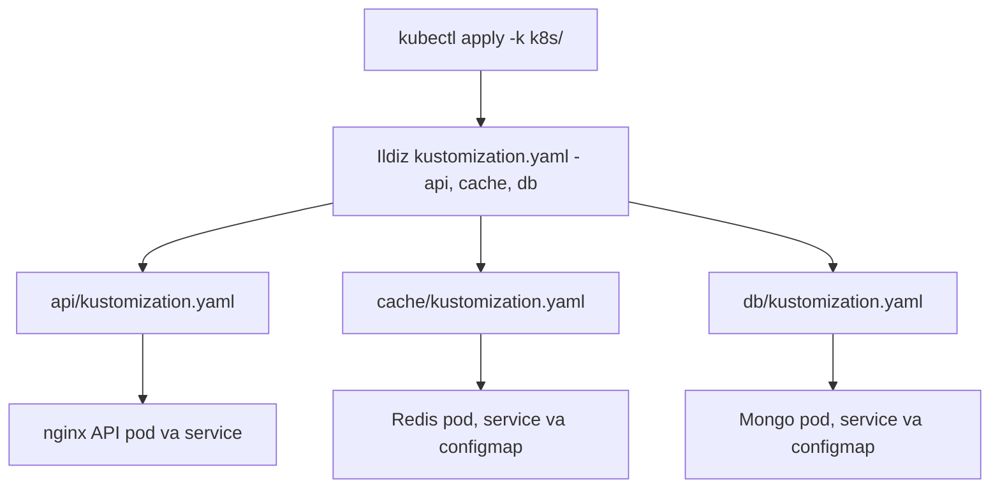

# Dars 285 — Kataloglarni boshqarish: amaliy demo

> 🎯 **Bu darsda nimani o'rganamiz:**
> - Uch katalogli (api, cache, db) loyihani avval Kustomize'siz deploy qilish
> - Ildizda bitta kustomization.yaml bilan hammasini birlashtirish
> - Har katalogga o'z kustomization.yaml'ini qo'yib, toza tuzilmaga o'tish
> - Har bosqichda natijani `kustomize build` va `kubectl get pods` bilan tekshirish

## Oddiy hayotiy o'xshatish: uch do'konga birma-bir borish yoki bitta buyurtma

Uchta narsa kerak bo'lsa — non, go'sht, sabzavot — uchta do'konga birma-bir borish mumkin. Yoki hamma ro'yxatni bitta yetkazib berish xizmatiga berasiz — u o'zi hammasini yig'ib keladi. Bu darsda avval "uch do'konga birma-bir boramiz" (har katalogga alohida apply), keyin "yetkazib berish xizmatiga" (Kustomize) o'tamiz.

## Loyiha tuzilishi

Demo loyihamizda `k8s/` katalogi ichida uchta ichki katalog bor:

```
k8s/
├── api/                      # API (nginx server) configlari
│   ├── api-depl.yaml
│   └── api-service.yaml
├── cache/                    # Redis kesh configlari
│   ├── redis-config.yaml     # ConfigMap
│   ├── redis-depl.yaml
│   └── redis-service.yaml
└── db/                       # Mongo ma'lumotlar bazasi configlari
    ├── db-depl.yaml
    ├── db-service.yaml
    └── db-config.yaml
```

Fayllarning o'zi oddiy narsalar: har katalogda deployment (Mongo, Redis yoki nginx konteyner uchun), service (ClusterIP yoki LoadBalancer) va ba'zilarida ConfigMap bor.

## 1-qadam: Kustomize'siz, eski usulda deploy

Avval standart yo'l bilan — har katalogga alohida apply qilamiz:

```bash
kubectl apply -f k8s/api/
kubectl apply -f k8s/cache/
kubectl apply -f k8s/db/
```

💡 Texnik jihatdan buni bitta qatorda ham yozish mumkin — `-f` bayrog'ini qo'shaverib:

```bash
kubectl apply -f k8s/db/ -f k8s/cache/ -f k8s/api/
```

Lekin ilova o'sgani sari kataloglar ko'payadi va har safar hammasini eslab yurish mashaqqatli. Keyingi qadamga o'tishdan oldin yaratilganlarni o'chirib tashlaymiz — xuddi shu buyruqda apply'ni delete'ga almashtiramiz:

```bash
kubectl delete -f k8s/api/
kubectl delete -f k8s/cache/
kubectl delete -f k8s/db/
```

## 2-qadam: ildizda bitta kustomization.yaml

Endi sodda Kustomize yechimi: `k8s/` ildizida `kustomization.yaml` yaratamiz. Avval `apiVersion` va `kind`, keyin barcha fayllarga **nisbiy yo'llar** bilan `resources` ro'yxati:

```yaml
# k8s/kustomization.yaml
apiVersion: kustomize.config.k8s.io/v1beta1
kind: Kustomization

resources:
  - api/api-depl.yaml
  - api/api-service.yaml
  - cache/redis-config.yaml
  - cache/redis-depl.yaml
  - cache/redis-service.yaml
  - db/db-config.yaml
  - db/db-depl.yaml
  - db/db-service.yaml
```

Fayl ildizda turgani uchun API deployment'ga yetish yo'li `api/api-depl.yaml` bo'ladi — katalog nomi + fayl nomi.

Endi build qilib ko'ramiz:

```bash
kustomize build k8s/
```

Terminalga **yakuniy manifestlar** to'kiladi: api katalogidagi hamma narsa, cache'dagi hamma narsa (Redis) va db'dagi hamma narsa (Mongo). Pastga aylantirib nginx server, database va Redis configlarini ko'rasiz.

⚠️ Esda tuting: `kustomize build` faqat **nima yaratilishini ko'rsatadi**, klasterga hech narsa apply qilmaydi. Apply qilish uchun pipe ishlatamiz:

```bash
kustomize build k8s/ | kubectl apply -f -
```

```
configmap/redis-config created
configmap/db-config created
service/api-service created
service/redis-service created
service/db-service created
deployment.apps/api-deployment created
deployment.apps/redis-deployment created
deployment.apps/db-deployment created
```

Yoki kustomize CLI'siz, kubectl'ning o'zi bilan — ikkalasi bir xil ish qiladi:

```bash
kubectl apply -k k8s/
```

Tekshiramiz:

```bash
kubectl get pods
NAME                                READY   STATUS    RESTARTS   AGE
api-deployment-7c9d8f6b5-x2k4m      1/1     Running   0          30s
db-deployment-6f5b8c7d9-p8n3q       1/1     Running   0          30s
redis-deployment-5d7c9b8f6-w9j2r    1/1     Running   0          30s
```

Uchala konteyner ham Running holatda — hammasi joyida.

## 3-qadam: har katalogda o'z kustomization.yaml'i (yaxshiroq yechim)

Endi toza tuzilmaga o'tamiz. Avval oldingi misol resurslarini o'chiramiz va ildiz fayldagi uzun resources ro'yxatini bo'shatamiz. Keyin **har bir ichki katalogda** kustomization.yaml yaratamiz (apiVersion va kind'ni nusxalab olamiz):

```yaml
# k8s/api/kustomization.yaml
apiVersion: kustomize.config.k8s.io/v1beta1
kind: Kustomization

resources:
  - api-depl.yaml
  - api-service.yaml
```

Diqqat: bu fayl fayllar bilan **bir xil katalogda** turgani uchun nisbiy yo'l — shunchaki fayl nomining o'zi.

```yaml
# k8s/cache/kustomization.yaml
apiVersion: kustomize.config.k8s.io/v1beta1
kind: Kustomization

resources:
  - redis-config.yaml
  - redis-depl.yaml
  - redis-service.yaml
```

```yaml
# k8s/db/kustomization.yaml
apiVersion: kustomize.config.k8s.io/v1beta1
kind: Kustomization

resources:
  - db-config.yaml
  - db-depl.yaml
  - db-service.yaml
```

Endi ildiz faylga qaytamiz — unda alohida fayllar emas, faqat **kataloglar** ko'rsatiladi:

```yaml
# k8s/kustomization.yaml
apiVersion: kustomize.config.k8s.io/v1beta1
kind: Kustomization

resources:
  - api/
  - cache/
  - db/
```

Katalog ko'rsatilganda Kustomize o'sha katalog **ichiga kirib kustomization.yaml'ni qidiradi** — topsa, qolganini o'zi hal qiladi. Faylga yo'l berish shart emas.



## 4-qadam: yakuniy tekshiruv

Oldingi resurslar o'chirilganiga ishonch hosil qilamiz:

```bash
kubectl get pods
No resources found in default namespace.
```

Build qilib chiqishini ko'ramiz:

```bash
kustomize build k8s/
```

Output **avvalgi bilan aynan bir xil** — tuzilmani o'zgartirdik, natija o'zgarmadi. Endi apply qilamiz (ikkala usul ham ishlaydi):

```bash
kubectl apply -k k8s/
# yoki
kustomize build k8s/ | kubectl apply -f -
```

Va tekshiramiz:

```bash
kubectl get pods
NAME                                READY   STATUS    RESTARTS   AGE
api-deployment-7c9d8f6b5-t5m8k      1/1     Running   0          15s
db-deployment-6f5b8c7d9-r2x7n       1/1     Running   0          15s
redis-deployment-5d7c9b8f6-q4v9p    1/1     Running   0          15s
```

Barcha resurslar muvaffaqiyatli yaratildi.

## Demo xulosasi

| Bosqich | Buyruq | Izoh |
|---|---|---|
| Kustomize'siz | `kubectl apply -f k8s/api/` (har katalogga) | Ishlaydi, lekin kataloglar ko'paysa noqulay |
| Ildizda bitta kustomization.yaml | `kubectl apply -k k8s/` | Bitta buyruq, lekin ildiz fayl shishadi |
| Har katalogda kustomization.yaml | `kubectl apply -k k8s/` | Bitta buyruq + toza tuzilma |

## ❓ Savol-Javob

**Savol:** Bir necha katalogni Kustomize'siz bitta qatorda apply qilib bo'ladimi?

**Javob:** Ha — `-f` bayrog'ini takrorlab: `kubectl apply -f k8s/db/ -f k8s/cache/ -f k8s/api/`. Lekin kataloglar ko'paygan sari bu buyruqni yuritish qiyinlashadi — Kustomize aynan shuni yechadi.

**Savol:** Ichki katalogdagi kustomization.yaml'da nega yo'l yozmay, fayl nomini yozdik?

**Javob:** Chunki resources'dagi yo'llar kustomization.yaml turgan joyga nisbatan yoziladi. Fayllar u bilan bir xil katalogda bo'lgani uchun nomining o'zi yetarli.

**Savol:** Ildiz faylda `api/` deb katalog ko'rsatilsa, Kustomize qaysi faylni oladi?

**Javob:** U api/ katalogiga kirib kustomization.yaml'ni qidiradi va o'sha fayl import qilgan resurslarni oladi. Katalogda kustomization.yaml bo'lmasa — xato beradi.

**Savol:** Tuzilmani o'zgartirganda (bitta fayldan har katalogga bo'lganda) klasterdagi natija o'zgardimi?

**Javob:** Yo'q — `kustomize build` output'i ikkala holatda aynan bir xil. O'zgargani faqat fayllarning tashkil etilishi: endi har katalog o'z resurslarini o'zi boshqaradi va ildiz fayl toza qoladi.

## 📌 CKA imtihon uchun maslahat

Amaliy topshiriqda ishlash tartibini odat qiling: (1) katalog tuzilmasini `ls` yoki `tree` bilan ko'ring, (2) `kustomize build <katalog>` bilan output to'g'riligini tekshiring, (3) keyin `kubectl apply -k <katalog>`, (4) oxirida `kubectl get pods` bilan hammasi Running ekanini tasdiqlang. Build bosqichini tashlab yubormang — YAML'dagi xatoni apply'dan oldin ko'rsatib beradi.

## 📖 Asosiy atamalar

| Atama | Oddiy tushuntirish |
|---|---|
| ConfigMap | Konfiguratsiya ma'lumotlarini saqlovchi Kubernetes obyekti |
| ClusterIP | Faqat klaster ichidan kiriladigan service turi |
| LoadBalancer | Tashqaridan kirish va yuk taqsimlash uchun service turi |
| Redis | Xotirada ishlovchi tez kesh/ma'lumotlar bazasi |
| MongoDB | Hujjatga asoslangan ma'lumotlar bazasi |
| kubectl apply -k | Katalogdagi kustomization'ni build qilib apply qiluvchi buyruq |
| kubectl get pods | Podlar holatini ko'rsatuvchi buyruq |
| Running | Pod muvaffaqiyatli ishlab turganini bildiruvchi holat |

## 🔗 Manbalar

- [Declarative Management with Kustomize — kubernetes.io](https://kubernetes.io/docs/tasks/manage-kubernetes-objects/kustomization/)
- [resources maydoni — kubectl.docs.kubernetes.io](https://kubectl.docs.kubernetes.io/references/kustomize/kustomization/resource/)
- [kustomize build — kubectl.docs.kubernetes.io](https://kubectl.docs.kubernetes.io/references/kustomize/cmd/build/)
- [Kustomize rasmiy sayti — kustomize.io](https://kustomize.io/)

---
*Bu dars KodeKloud CKA kursining 285-videosi asosida tayyorlandi.*
