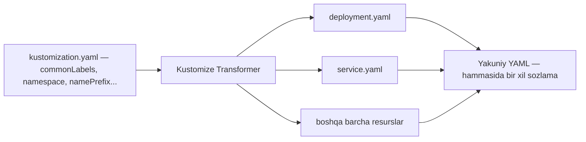
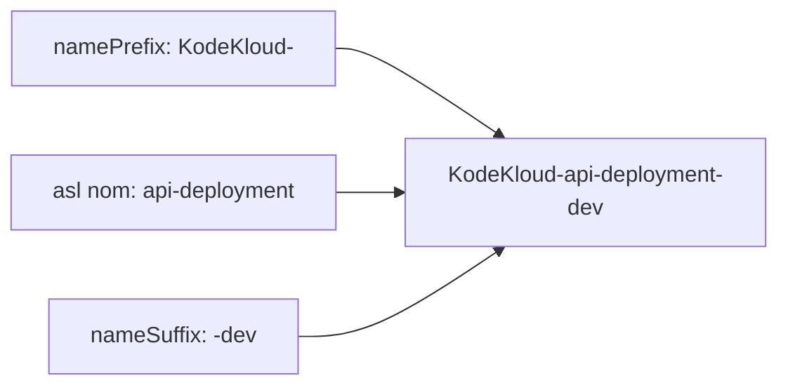

# Dars 287 — Common Transformerlar (umumiy o'zgartirgichlar)

> 🎯 **Bu darsda nimani o'rganamiz:**
> - Kustomize Transformer nima va u qanday muammoni hal qiladi
> - `commonLabels` bilan barcha resurslarga bir xil label qo'shish
> - `namePrefix` / `nameSuffix` bilan nomlarga old va ort qo'shimcha qo'shish
> - `namespace` va `commonAnnotations` transformatsiyalari

## Hayotiy o'xshatish

Tasavvur qiling, maktabda 500 ta o'quvchining formasiga maktab emblemasini tikish kerak. Har bir formani qo'lda alohida tikib chiqish — uzoq va xatolarga to'la ish. Buning o'rniga tikuv sexiga bitta buyruq berasiz: "hammasiga bir xil emblema tikilsin". Kustomize'dagi **Common Transformer** ham xuddi shu tikuv sexi: siz bitta joyda qoida yozasiz, u esa BARCHA Kubernetes resurslaringizga avtomatik qo'llanadi.

## Muammo: bir xil sozlamani ko'p faylga qo'shish

Deylik, bizda `deployment.yaml` va `service.yaml` fayllari bor. Ikkalasiga ham:

- `org: KodeKloud` degan label qo'shmoqchimiz;
- yoki barcha obyektlar nomining oxiriga `-dev` qo'shimchasini qo'shmoqchimiz.

Ikki fayl bo'lsa, qo'lda ham qo'shsa bo'ladi. Lekin haqiqiy production muhitida fayllar soni o'nlab, hatto yuzlab bo'ladi. Ularni birma-bir tahrirlash:

- ⚠️ vaqtni ko'p oladi;
- ⚠️ masshtablanmaydi (yangi fayl qo'shilganda yana takrorlash kerak);
- ⚠️ xatolarga olib keladi (bittasini unutib qo'yish oson).

Aynan shu muammoni Kustomize'ning **Common Transformation**lari hal qiladi — bitta joyda yozasiz, hammasiga qo'llanadi.

> 💡 Kustomize'da bir nechta tayyor (built-in) transformer bor, xohlasangiz o'zingizning custom transformeringizni ham yozishingiz mumkin. Bu darsda eng ko'p ishlatiladigan "common" guruhini ko'ramiz.



## 4 ta asosiy common transformer

| Transformer | Nima qiladi |
|---|---|
| `commonLabels` | Barcha resurslarga bir xil label qo'shadi |
| `namePrefix` / `nameSuffix` | Barcha resurslar nomiga old (prefix) yoki ort (suffix) qo'shimcha qo'shadi |
| `namespace` | Barcha resurslarni ko'rsatilgan namespace ichiga joylaydi |
| `commonAnnotations` | Barcha resurslarga bir xil annotation (metadata) qo'shadi |

⚠️ Muhim: transformer faqat **shu `kustomization.yaml` fayli import qilgan resurslarga** qo'llanadi. Ya'ni `resources:` ro'yxatida nima bo'lsa — o'shalarga ta'sir qiladi.

## 1. commonLabels — umumiy label

Eng sodda transformer. `kustomization.yaml` fayliga quyidagini yozamiz:

```yaml
# kustomization.yaml
resources:
  - deployment.yaml
  - service.yaml

commonLabels:
  org: KodeKloud
```

Natijada barcha resurslarning `metadata.labels` bo'limiga `org: KodeKloud` qo'shiladi:

```yaml
# yakuniy natija (deployment ham, service ham)
metadata:
  labels:
    org: KodeKloud
```

## 2. namespace — hammasini bitta namespace'ga

Barcha resurslarni ma'lum bir namespace ichiga joylash uchun:

```yaml
# kustomization.yaml
namespace: lab
```

Shu bitta qator barcha resurslarning `metadata.namespace` maydonini `lab` qilib qo'yadi.

## 3. namePrefix / nameSuffix — nom old va ort qo'shimchasi

Barcha obyektlar nomiga prefix yoki suffix qo'shish uchun:

```yaml
# kustomization.yaml
namePrefix: KodeKloud-
nameSuffix: -dev
```

Masalan, `api-deployment` nomli Deployment endi `KodeKloud-api-deployment-dev` bo'lib chiqadi:



## 4. commonAnnotations — umumiy annotation

Barcha resurslarga bir xil annotation (qo'shimcha metadata) qo'shish uchun:

```yaml
# kustomization.yaml
commonAnnotations:
  branch: master
```

Natijada har bir resursning `metadata.annotations` bo'limida `branch: master` paydo bo'ladi.

## ❓ Savol-Javob

**Savol:** Common transformer aynan qaysi resurslarga qo'llanadi?
**Javob:** Faqat shu `kustomization.yaml` fayli `resources:` orqali import qilgan resurslarga. Root fayldagi transformer barcha subdirectory'larga ham "tushadi", chunki root fayl ularni import qiladi.

**Savol:** Label bilan annotation'ning farqi nima?
**Javob:** Label — obyektlarni tanlash (selector) va guruhlash uchun ishlatiladi; annotation — shunchaki qo'shimcha ma'lumot (metadata) saqlash uchun, selector'larda ishlatilmaydi.

**Savol:** 100 ta YAML faylga bitta label qo'shish kerak. Har birini qo'lda tahrirlaymizmi?
**Javob:** Yo'q. `kustomization.yaml` fayliga `commonLabels` yozamiz — Kustomize hammasiga o'zi qo'shib chiqadi. Bu masshtablanadigan va xatosiz yechim.

## 📌 CKA imtihon uchun maslahat

Imtihonda "barcha resurslarga label/annotation qo'shing" yoki "hammasini falon namespace'ga joylang" tipidagi topshiriq chiqsa — resurs fayllarini tahrirlashga urinmang. `kustomization.yaml` ichiga `commonLabels`, `namespace`, `namePrefix`/`nameSuffix` yoki `commonAnnotations` yozib, `kubectl apply -k .` (yoki `kustomize build .`) bilan tekshiring. Bu ancha tez va xatosiz.

## 📖 Asosiy atamalar

| Atama | Oddiy tushuntirish |
|---|---|
| Transformer | Kustomize'ning YAML konfiglarni avtomatik o'zgartiruvchi mexanizmi |
| commonLabels | Barcha resurslarga umumiy label qo'shuvchi transformer |
| namePrefix / nameSuffix | Resurs nomlarining boshiga/oxiriga qo'shimcha qo'shuvchi transformer |
| namespace (transformer) | Barcha resurslarni bitta namespace'ga joylovchi transformer |
| commonAnnotations | Barcha resurslarga umumiy annotation qo'shuvchi transformer |
| Annotation | Obyektga biriktirilgan qo'shimcha ma'lumot (metadata), selector'da ishlatilmaydi |

## 🔗 Manbalar

- Kustomize rasmiy hujjati: https://kubectl.docs.kubernetes.io/references/kustomize/kustomization/
- commonLabels: https://kubectl.docs.kubernetes.io/references/kustomize/kustomization/commonlabels/
- namespace: https://kubectl.docs.kubernetes.io/references/kustomize/kustomization/namespace/
- Kubernetes'da Kustomize bilan ishlash: https://kubernetes.io/docs/tasks/manage-kubernetes-objects/kustomization/

---
*Bu dars KodeKloud CKA kursining 287-videosi asosida tayyorlandi.*
