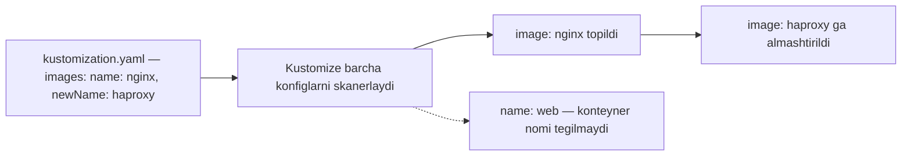

# Dars 288 — Image Transformerlar (konteyner image'ini o'zgartirish)

> 🎯 **Bu darsda nimani o'rganamiz:**
> - `images` transformeri nima va qachon kerak bo'ladi
> - `name` / `newName` bilan image'ni butunlay almashtirish
> - `newTag` bilan faqat tag'ni o'zgartirish
> - `newName` + `newTag` ni birga ishlatish

## Hayotiy o'xshatish

Tasavvur qiling, restoran menyusidagi barcha taomlarda "Coca-Cola" ichimligi yozilgan. Yetkazib beruvchi o'zgardi va endi hamma joyda "Pepsi" bo'lishi kerak. Menyuning har bir sahifasini qo'lda tuzatish o'rniga, bosh oshpazga bitta ko'rsatma berasiz: "qayerda Coca-Cola ko'rsang — Pepsi'ga almashtir". **Image transformer** ham xuddi shunday ishlaydi: barcha konfiglardan ma'lum image'ni topib, yangisiga almashtiradi.

## Image transformer nima?

Image transformer — Kustomize orqali Deployment (yoki boshqa resurs) ichidagi konteyner **image'ini** o'zgartirish imkonini beradi. Buning uchun `kustomization.yaml` faylida `images:` bo'limi ishlatiladi.

Deylik, bizda nginx server deploy qiladigan fayl bor:

```yaml
# deployment.yaml
apiVersion: apps/v1
kind: Deployment
metadata:
  name: web-deployment
spec:
  template:
    spec:
      containers:
        - name: web
          image: nginx
```

## 1. Image'ni almashtirish — name / newName

`kustomization.yaml` faylida ikkita xususiyat ko'rsatamiz:

```yaml
# kustomization.yaml
images:
  - name: nginx        # qaysi image'ni qidirish kerak
    newName: haproxy   # nimaga almashtirish kerak
```

- `name` — almashtirilishi kerak bo'lgan **image nomi**. Kustomize barcha konfiglardan `nginx` image ishlatayotgan konteynerlarni topadi.
- `newName` — yangi image nomi. Topilgan joylarda `nginx` → `haproxy` ga almashadi.

Natija:

```yaml
containers:
  - name: web
    image: haproxy
```

⚠️ **Chalkashtirmang!** `kustomization.yaml` dagi `name:` — bu **image nomi**, konteyner nomi EMAS. Deployment'dagi konteynerning `name: web` maydoni bunga umuman aloqasi yo'q. Kustomize aynan `image: nginx` yozilgan joylarni qidiradi. Bu ko'pchilikni birinchi marta chalg'itadi — esda tuting: konteyner nomi o'zgarmaydi, faqat image o'zgaradi.



## 2. Faqat tag'ni o'zgartirish — newTag

Ba'zan image'ni almashtirish emas, faqat uning **versiyasini (tag)** belgilash kerak. Bunda `newName` o'rniga `newTag` yozamiz:

```yaml
# kustomization.yaml
images:
  - name: nginx
    newTag: "2.4"
```

Natija:

```yaml
containers:
  - name: web
    image: nginx:2.4
```

💡 Tag qiymatini **qo'shtirnoq ichida** yozish tavsiya etiladi (`"2.4"`), chunki qo'shtirnoqsiz YAML uni raqam (number) deb o'qishi va Kustomize xato berishi mumkin — buni keyingi demo darsida jonli ko'ramiz.

## 3. Ikkalasini birga — newName + newTag

Image'ni ham, tag'ni ham bir vaqtda o'zgartirsa bo'ladi:

```yaml
# kustomization.yaml
images:
  - name: nginx
    newName: haproxy
    newTag: "2.4"
```

Natija:

```yaml
containers:
  - name: web
    image: haproxy:2.4
```

## Taqqoslash jadvali

| Maqsad | kustomization.yaml | Natija |
|---|---|---|
| Image'ni almashtirish | `name: nginx` + `newName: haproxy` | `image: haproxy` |
| Faqat tag'ni belgilash | `name: nginx` + `newTag: "2.4"` | `image: nginx:2.4` |
| Ikkalasini ham | `name: nginx` + `newName: haproxy` + `newTag: "2.4"` | `image: haproxy:2.4` |

## ❓ Savol-Javob

**Savol:** `images` bo'limidagi `name` konteyner nomini bildiradimi?
**Javob:** Yo'q! U **image nomini** bildiradi. Konteynerning `name: web` maydoni bu qidiruv uchun ahamiyatsiz — Kustomize faqat `image:` maydonini tekshiradi.

**Savol:** Image'ning faqat versiyasini yangilamoqchiman, image nomi qolsin. Nima qilaman?
**Javob:** `newName` o'rniga `newTag` ishlataman: `name: nginx, newTag: "2.4"` → natija `nginx:2.4`.

**Savol:** Bitta transformer bilan bir nechta joydagi image o'zgaradimi?
**Javob:** Ha. Kustomize shu `kustomization.yaml` import qilgan BARCHA konfiglarni ko'rib chiqadi va o'sha image ishlatilgan har bir konteynerda almashtiradi.

## 📌 CKA imtihon uchun maslahat

Imtihonda "Kustomize yordamida deployment image'ini yangilang" topshirig'i chiqishi mumkin. Deployment faylini qo'lda tahrirlamang — `kustomization.yaml` ga `images:` bo'limini qo'shing va `kustomize build .` bilan natijani avval ko'zdan kechiring, keyin `kubectl apply -k .` qiling. Tag'ni doim qo'shtirnoqda yozing — `"2.4"` — aks holda "cannot unmarshal number" xatosini olishingiz mumkin.

## 📖 Asosiy atamalar

| Atama | Oddiy tushuntirish |
|---|---|
| Image | Konteyner ishga tushadigan tayyor dastur qolipi (masalan, nginx, haproxy) |
| Tag | Image versiyasi belgisi (masalan, `nginx:2.4` dagi `2.4`) |
| `images` transformer | Kustomize'da image nomi/tag'ini almashtirish bo'limi |
| `name` | Qidirilayotgan (almashtiriladigan) image nomi |
| `newName` | Yangi image nomi |
| `newTag` | Yangi tag (versiya), qo'shtirnoqda yoziladi |

## 🔗 Manbalar

- Kustomize images: https://kubectl.docs.kubernetes.io/references/kustomize/kustomization/images/
- Kubernetes'da Kustomize bilan obyektlarni boshqarish: https://kubernetes.io/docs/tasks/manage-kubernetes-objects/kustomization/
- Kubernetes Images haqida: https://kubernetes.io/docs/concepts/containers/images/

---
*Bu dars KodeKloud CKA kursining 288-videosi asosida tayyorlandi.*
