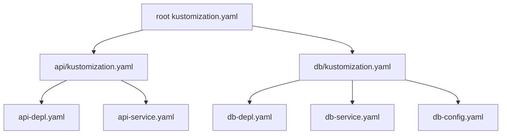

# Dars 289 — Transformerlar amaliy demo

> 🎯 **Bu darsda nimani o'rganamiz:**
> - Common transformerlarni (label, namespace, prefix/suffix, annotation) real loyihada qo'llash
> - Root va subdirectory `kustomization.yaml` fayllaridagi transformer farqini amalda ko'rish
> - Image transformerni faqat kerakli papkaga qo'llash
> - Tag bilan bog'liq tipik xatoni tuzatish

## Hayotiy o'xshatish

Katta kompaniyada bosh direktor buyruq chiqarsa — u BUTUN kompaniyaga tegishli bo'ladi. Bo'lim boshlig'i buyruq chiqarsa — faqat o'z bo'limiga. Kustomize'da ham xuddi shunday: **root** `kustomization.yaml` dagi transformer barcha resurslarga, **subdirectory** dagi transformer esa faqat o'sha papka resurslariga qo'llanadi.

## Loyiha tuzilishi

Demo uchun quyidagi `k8s/` katalogimiz bor:

```
k8s/
├── kustomization.yaml        # root — api va db ni import qiladi
├── api/
│   ├── api-depl.yaml
│   ├── api-service.yaml
│   └── kustomization.yaml    # api papkasidagi resurslarni import qiladi
└── db/
    ├── db-depl.yaml
    ├── db-service.yaml
    ├── db-config.yaml        # ConfigMap
    └── kustomization.yaml    # db papkasidagi resurslarni import qiladi
```

Har bir subdirectory'ning `kustomization.yaml` fayli o'z papkasidagi resurslarni import qiladi, root fayl esa `api/` va `db/` kataloglarini import qiladi.



## 1-qadam: commonLabel — hammasiga

Barcha resurslarga `department: engineering` labelini qo'shamiz. Hammaga tegishli bo'lgani uchun **root** faylga yozamiz:

```yaml
# k8s/kustomization.yaml
resources:
  - api/
  - db/

commonLabels:
  department: engineering
```

Tekshiramiz:

```bash
kustomize build k8s/
```

Natijada ConfigMap, api-service, db-service, api-depl, db-depl — hammasida `department: engineering` labeli paydo bo'ladi. Root fayldagi transformer butun daraxtga "tushdi".

## 2-qadam: subdirectory'dagi transformer — faqat o'z papkasiga

Endi savol: xuddi shu labelni root emas, `api/kustomization.yaml` ichiga yozsak nima bo'ladi?

```yaml
# k8s/api/kustomization.yaml
resources:
  - api-depl.yaml
  - api-service.yaml

commonLabels:
  feature: api
```

`kustomize build k8s/` natijasini ko'rsak:

- `db` papkasidagi ConfigMap'da yangi label **yo'q** (faqat `department: engineering` bor);
- `api-service` da esa `feature: api` **paydo bo'ldi**.

💡 Xulosa: subdirectory'dagi `kustomization.yaml` transformeri faqat o'sha faylning `resources:` ro'yxatidagi obyektlarga ta'sir qiladi. Root'dagi — hamma narsani import qilgani uchun global ta'sir qiladi.

Simmetriya uchun db tomonga ham qo'shamiz:

```yaml
# k8s/db/kustomization.yaml
commonLabels:
  feature: db
```

Endi `db-depl` da `feature: db` labeli bor.

## 3-qadam: namespace — hammasiga

Barcha resurslarni `debugging` namespace'iga joylaymiz. Hammaga tegishli — demak root faylga:

```yaml
# k8s/kustomization.yaml
namespace: debugging
```

`kustomize build k8s/` — barcha 5 ta obyektda `namespace: debugging` paydo bo'ldi.

## 4-qadam: namePrefix va nameSuffix

Maqsad:

- **hamma** obyekt nomi `KodeKloud-` bilan boshlansin → root faylga;
- `api` papkasidagilar `-web` bilan tugasin → `api/kustomization.yaml` ga;
- `db` papkasidagilar `-storage` bilan tugasin → `db/kustomization.yaml` ga.

```yaml
# k8s/kustomization.yaml (root)
namePrefix: KodeKloud-
```

⚠️ E'tibor bering: `KodeKloud-` deb chiziqcha bilan yozdik. Chiziqchasiz yozsangiz so'zlar yopishib ketadi (`KodeKloudapi-deployment`). Demoda instruktor ham avval chiziqchani unutib, keyin tuzatdi.

```yaml
# k8s/api/kustomization.yaml
nameSuffix: -web
```

```yaml
# k8s/db/kustomization.yaml
nameSuffix: -storage
```

Build natijasi:

| Asl nom | Yakuniy nom |
|---|---|
| `api-deployment` | `KodeKloud-api-deployment-web` |
| `db-credentials` (ConfigMap) | `KodeKloud-db-credentials-storage` |
| `db-deployment` | `KodeKloud-db-deployment-storage` |

## 5-qadam: commonAnnotations

Barcha resurslarga oddiy annotation qo'shamiz (root faylga):

```yaml
# k8s/kustomization.yaml
commonAnnotations:
  logging: verbose
```

Build qilsak — har bir resursda `logging: verbose` annotationi paydo bo'ladi.

## 6-qadam: image transformer — faqat db uchun

Endi database image'ini `mongo` dan `postgres` ga almashtiramiz. Qayerga yozamiz — root'gami yoki `db/` gami?

💡 O'ylab ko'ring: agar root'ga yozsak, loyihaning BOSHQA joyida ham mongo ishlatilayotgan bo'lsa, u ham o'zgarib ketadi. Biz faqat db feature'ini o'zgartirmoqchimiz — demak `db/kustomization.yaml` ga yozamiz:

```yaml
# k8s/db/kustomization.yaml
images:
  - name: mongo        # image nomi (konteyner nomi emas!)
    newName: postgres
    newTag: 4.2        # ⚠️ bu xato beradi!
```

Build qilamiz va... xato:

```bash
kustomize build k8s/
# Error: ... cannot unmarshal number into Go struct field Image ... of type string
```

Xatoni o'qiymiz: Kustomize **string** kutgan, biz esa **raqam** berdik. Muammo `newTag: 4.2` da — YAML uni raqam deb o'qidi. Yechim — qo'shtirnoq:

```yaml
images:
  - name: mongo
    newName: postgres
    newTag: "4.2"
```

Endi build muvaffaqiyatli o'tadi. Natijada db-deployment'da:

```yaml
containers:
  - name: mongo          # konteyner nomi O'ZGARMADI
    image: postgres:4.2  # image o'zgardi
```

Boshqa resurslardagi image'lar tegilmagan — chunki transformer faqat `db/` papkasiga yozilgan edi.

## 🧪 Mustaqil topshiriqlar

> Yechishdan oldin darsni yopib qo'ying. Taxminiy vaqt: 15 daqiqa.

**1-topshiriq · oson.** Bir vaqtda `namePrefix`, `commonLabels` va `images` ni qo'llang.

<details><summary>O'zingizni tekshiring</summary>

```bash
kubectl kustomize . | head -40
```
</details>

**2-topshiriq · o'rta.** Base va yakuniy natija orasidagi farqni ko'ring.

<details><summary>O'zingizni tekshiring</summary>

```bash
diff <(kubectl kustomize base/) <(kubectl kustomize overlays/dev/) | head -20
```
</details>

**3-topshiriq · qiyin.** Transformer va patch orasidagi farq nima? Qachon qaysi biri?

<details><summary>O'zingizni tekshiring</summary>

**Transformer** — ko'p obyektga bir xil o'zgarish (barcha nomlarga prefiks,
barcha obyektga label). Deklarativ va qisqa.

**Patch** — bitta obyektning aniq maydonini o'zgartirish (`replicas: 3`
faqat `web` deployment'ida). Aniqroq, lekin ko'proq yozuv.

Qoida: ko'pchilikka tegsa — transformer, bittasiga tegsa — patch.
</details>

## ❓ Savol-Javob

**Savol:** Transformerni root `kustomization.yaml` ga yozish bilan subdirectory'dagisiga yozishning farqi nima?
**Javob:** Root'dagisi — barcha import qilingan resurslarga (butun loyihaga), subdirectory'dagisi — faqat o'sha papka resurslariga qo'llanadi.

**Savol:** `newTag: 4.2` deb yozsam nega xato beradi?
**Javob:** YAML `4.2` ni raqam deb o'qiydi, Kustomize esa tag uchun string kutadi. `newTag: "4.2"` deb qo'shtirnoqda yozish kerak.

**Savol:** Image transformer konteyner nomini ham o'zgartiradimi?
**Javob:** Yo'q. Faqat `image:` maydoni o'zgaradi. Konteynerning `name:` maydoni asl holicha qoladi.

**Savol:** Image transformerni qayerga yozishni qanday tanlayman?
**Javob:** O'zgarish qamroviga qarab: butun loyihadagi barcha shu image'lar o'zgarsin — root'ga; faqat bitta feature/papka o'zgarsin — o'sha papkaning `kustomization.yaml` fayliga.

## 📌 CKA imtihon uchun maslahat

Har bir o'zgarishdan keyin `kustomize build <katalog>` (yoki `kubectl kustomize <katalog>`) bilan natijani apply qilishdan OLDIN ko'zdan kechiring — bu klasterga hech narsa yubormaydi, faqat yakuniy YAML'ni ko'rsatadi. Xato chiqsa, matnini diqqat bilan o'qing — Kustomize xatolari odatda muammoni aniq aytib beradi (masalan, string/number chalkashligi).

## 📖 Asosiy atamalar

| Atama | Oddiy tushuntirish |
|---|---|
| Root kustomization.yaml | Loyiha ildizidagi asosiy fayl — butun loyihani import qiladi |
| Subdirectory kustomization.yaml | Ichki papkadagi fayl — faqat o'z papkasi resurslarini boshqaradi |
| `kustomize build` | Yakuniy YAML'ni yig'ib ekranga chiqaruvchi buyruq (klasterga yubormaydi) |
| Spot check | Natijani tez ko'zdan kechirib, o'zgarishlar to'g'ri qo'llanganini tekshirish |
| unmarshal xatosi | YAML qiymat turi (raqam/string) mos kelmaganda chiqadigan xato |

## 🔗 Manbalar

- Kustomize kustomization maydonlari: https://kubectl.docs.kubernetes.io/references/kustomize/kustomization/
- kubectl kustomize buyrug'i: https://kubernetes.io/docs/tasks/manage-kubernetes-objects/kustomization/
- Kustomize images transformer: https://kubectl.docs.kubernetes.io/references/kustomize/kustomization/images/

---
*Bu dars KodeKloud CKA kursining 289-videosi asosida tayyorlandi.*
