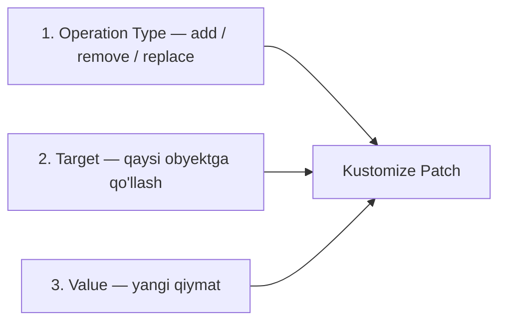
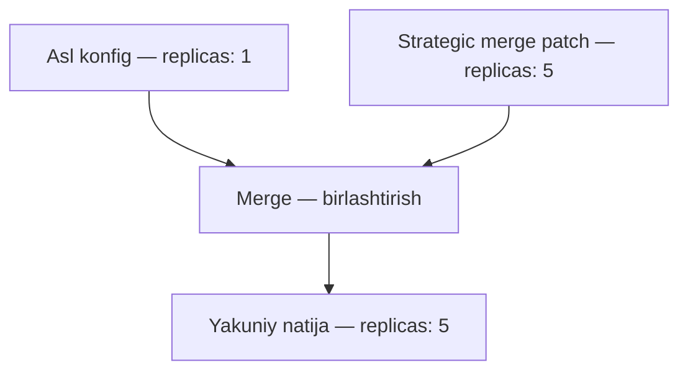

# Dars 291 — Patchlar bilan tanishuv

> 🎯 **Bu darsda nimani o'rganamiz:**
> - Patch nima va u common transformerdan nimasi bilan farq qiladi
> - Patch'ning 3 ta tarkibiy qismi: operatsiya (add/remove/replace), target, value
> - JSON 6902 patch qanday yoziladi (`op`, `path`, `value`)
> - Strategic merge patch — ikkinchi usul

## Hayotiy o'xshatish

Common transformer — dala purkagichi kabi: butun maydonga birdek sepadi. Patch esa — jarrohning skalpeli: faqat KERAKLI joyni, aniq nishonga olib o'zgartiradi. Butun klasterga label qo'shish kerakmi — transformer. Faqat bitta Deployment'ning replicas sonini o'zgartirish kerakmi — patch.

## Patch nima?

Kustomize patch — Kubernetes konfiglarini o'zgartirishning yana bir usuli. Lekin transformerlardan farqli, patch **"jarrohlik" yondashuvi**: bitta yoki bir nechta aniq obyektning aniq bo'limini nishonga oladi.

| Vaziyat | Nima ishlatamiz |
|---|---|
| Barcha obyektlarga label qo'shish | Common transformer |
| Barcha obyektlarni bitta namespace'ga joylash | Common transformer |
| Bitta Deployment'da replicas sonini o'zgartirish | Patch |
| Aniq bir obyektdan konteyner o'chirish | Patch |

## Patch'ning 3 ta tarkibiy qismi

Patch yaratish uchun 3 ta narsani berishimiz kerak:



### 1. Operatsiya turi (Operation Type)

Eng ko'p ishlatiladigan 3 ta operatsiya (yana bir nechtasi bor, lekin kam ishlatiladi):

| Operatsiya | Nima qiladi | Misol |
|---|---|---|
| `add` | Yangi element qo'shadi | Konteynerlar ro'yxatiga yana bitta konteyner qo'shish |
| `remove` | Mavjud elementni o'chiradi | Konteyner yoki labelni o'chirish |
| `replace` | Mavjud qiymatni yangisiga almashtiradi | `replicas: 5` ni `replicas: 10` qilish |

### 2. Target (nishon)

Patch qaysi obyekt(lar)ga qo'llanishini belgilaydigan moslik mezoni. Quyidagi maydonlar bo'yicha moslashtirish mumkin (bir nechtasini birga ishlatsa ham bo'ladi):

- `kind` — obyekt turi (Deployment, Service...)
- `version` — apiVersion
- `name` — obyekt nomi
- `namespace`
- `labelSelector`
- `annotationSelector`

💡 Bitta mezon bilan cheklanmaysiz — bir nechtasini aralashtirib, aynan kerakli obyekt(lar)ni aniq tanlashingiz mumkin.

### 3. Value (qiymat)

Qo'shiladigan yoki almashtiriladigan yangi qiymat. ⚠️ `remove` operatsiyasida value kerak emas — o'chirilayotgan narsaga qiymat berilmaydi, faqat target va path yetarli.

## JSON 6902 patch — birinchi misol: nomni o'zgartirish

Bizda shunday deployment bor:

```yaml
# depl.yaml
apiVersion: apps/v1
kind: Deployment
metadata:
  name: api-deployment
spec:
  replicas: 1
  ...
```

Nomni `api-deployment` dan `web-deployment` ga o'zgartirmoqchimiz. `kustomization.yaml`:

```yaml
# kustomization.yaml
patches:
  - target:
      kind: Deployment          # faqat Deployment turini qidir
      name: api-deployment      # aynan shu nomlisini top
    patch: |-
      - op: replace             # operatsiya: almashtirish
        path: /metadata/name    # YAML daraxtidagi yo'l
        value: web-deployment   # yangi qiymat
```

Bu yerda:

- `target` — `kind: Deployment` va `name: api-deployment` bo'yicha aynan bitta obyekt topiladi;
- `patch: |-` — bu **inline patch** belgisi (patch matni shu faylning ichida yoziladi; keyingi darsda batafsil);
- `path: /metadata/name` — "qiymatgacha qanday yetib boramiz": YAML daraxtida `metadata` ostidagi `name` maydoni. Maydon chuqurroqda bo'lsa, yo'lni davom ettiraverasiz.

Natija — `depl.yaml` yakuniy ko'rinishida `name: web-deployment` bo'ladi.

## Ikkinchi misol: replicas'ni o'zgartirish

Xuddi shu deployment'da `replicas: 1` ni `5` ga o'zgartiramiz:

```yaml
# kustomization.yaml
patches:
  - target:
      kind: Deployment
      name: api-deployment
    patch: |-
      - op: replace
        path: /spec/replicas
        value: 5
```

`replicas` maydoni `spec` ostida, shuning uchun path `/spec/replicas`. Natijada yakuniy YAML'da `replicas: 5` bo'ladi.

## Patch yozishning 2 usuli

Kustomize'da patch'ni ikki xil yozish mumkin:

### 1. JSON 6902 patch

Hozirgacha ko'rganimiz shu. Ikki narsa beriladi: **target** (qaysi obyekt) va **patch tafsilotlari** (`op` + `path` + `value`). Nomi RFC 6902 standartidan olingan — batafsil o'qishni istasangiz, RFC hujjatiga qarang (Manbalar bo'limida).

### 2. Strategic merge patch

Bu usulda patch **oddiy Kubernetes konfigiga o'xshaydi** — chunki u aslida shunday: asl deployment faylidan nusxa olib, o'zgarmaydigan qismlarini o'chirib tashlaysiz:

```yaml
# kustomization.yaml
patches:
  - patch: |-
      apiVersion: apps/v1
      kind: Deployment
      metadata:
        name: api-deployment   # QAYSI obyektni o'zgartirish — nom orqali
      spec:
        replicas: 5            # NIMANI o'zgartirish — yangi qiymat
```

Kustomize bu "mini-konfig"ni asl konfig bilan **birlashtiradi (merge)**: nima o'zgarganini o'zi topib (`replicas: 1` → `5`), yakuniy natijani chiqaradi. Bu usulda ham ikki narsa shart:

1. Obyektni tanish uchun `metadata.name`;
2. O'zgartirilishi kerak bo'lgan aniq maydon(lar) yangi qiymat bilan.



## Qaysi usulni tanlash kerak?

| | JSON 6902 patch | Strategic merge patch |
|---|---|---|
| Ko'rinishi | `op` / `path` / `value` uchligi | Oddiy Kubernetes konfigi parchasi |
| Target berish | Alohida `target` bo'limi | `metadata.name` orqali |
| O'qilishi | Qisqaroq, lekin path'ni bilish kerak | Tanish YAML — o'qish oson |

💡 Ikkala usul ham to'liq ishlaydi — bu shaxsiy didga bog'liq. Hatto ikkalasini aralash ishlatish ham mumkin. Kurs instruktori strategic merge'ni afzal ko'radi, chunki oddiy Kubernetes konfiglari bilan ishlanadi va o'qish osonroq.

## 🧪 Mustaqil topshiriqlar

> Yechishdan oldin darsni yopib qo'ying. Taxminiy vaqt: 15 daqiqa.

**1-topshiriq · oson.** Bitta Deployment'ning `replicas` ini patch bilan o'zgartiring.

<details><summary>O'zingizni tekshiring</summary>

```bash
kubectl kustomize . | grep -A1 'replicas:'
```
</details>

**2-topshiriq · o'rta.** Patch qaysi obyektga tegishini `target` orqali aniq ko'rsating.

<details><summary>O'zingizni tekshiring</summary>

```bash
kubectl kustomize . | grep -B5 'replicas: 5'
```
</details>

**3-topshiriq · qiyin.** Patch mavjud bo'lmagan obyektga yo'naltirilsa nima bo'ladi? **Avval ayting.**

<details><summary>O'zingizni tekshiring</summary>

Kustomize'ning yangi versiyalarida **xato beradi**:

```text
Error: no matches for Id apps_v1_Deployment|~X|yoq-bunday
```

Eski versiyalarda esa jimgina e'tiborsiz qoldirilardi. Yangi xatti-harakat
afzalroq: nomni xato yozganingizni darrov bilasiz, aks holda patch
qo'llanmagani sezilmay qolardi.
</details>

## ❓ Savol-Javob

**Savol:** Qachon transformer, qachon patch ishlataman?
**Javob:** Sozlama HAMMAGA tegishli bo'lsa (label, namespace, prefix) — transformer. Bitta-ikkita ANIQ obyektning aniq maydonini o'zgartirish kerak bo'lsa — patch.

**Savol:** `remove` operatsiyasida `value` berish kerakmi?
**Javob:** Yo'q. O'chirishda yangi qiymat bo'lmaydi — target va path yetarli.

**Savol:** `path: /spec/replicas` nimani anglatadi?
**Javob:** YAML daraxtidagi yo'l: ildizdan `spec` bo'limiga, undan `replicas` maydoniga. Har bir `/` — daraxtda bir pog'ona pastga tushish.

**Savol:** Target'da faqat bitta mezon ishlatish shartmi?
**Javob:** Yo'q, bir nechtasini birga ishlatish mumkin: masalan `kind: Deployment` + `name: api-deployment` — shunda aniq bitta obyekt tanlanadi.

## 📌 CKA imtihon uchun maslahat

Imtihonda replicas, image yoki label kabi bitta maydonni Kustomize orqali o'zgartirish so'ralsa, strategic merge patch odatda tezroq yoziladi — asl fayldan nusxa oling, keraksiz qismlarni o'chiring, yangi qiymatni yozing. JSON 6902 ishlatsangiz, path'ni ehtiyot bilan tuzing: `/spec/replicas`, `/metadata/name` — har bir pog'ona `/` bilan ajratiladi.

## 📖 Asosiy atamalar

| Atama | Oddiy tushuntirish |
|---|---|
| Patch | Aniq obyektning aniq qismini o'zgartiruvchi "jarrohlik" vositasi |
| JSON 6902 patch | `op`/`path`/`value` uchligi bilan yoziladigan patch turi (RFC 6902 standarti) |
| Strategic merge patch | Oddiy Kubernetes konfigi parchasini asl konfig bilan birlashtiruvchi patch turi |
| `op` | Operatsiya turi: add, remove yoki replace |
| `path` | YAML daraxtida o'zgartirilayotgan maydongacha yo'l |
| `target` | Patch qo'llanadigan obyekt(lar)ni tanlash mezoni |
| Inline patch | Patch matni to'g'ridan-to'g'ri kustomization.yaml ichida yozilgani |

## 🔗 Manbalar

- RFC 6902 (JSON Patch standarti): https://datatracker.ietf.org/doc/html/rfc6902
- Kustomize patches: https://kubectl.docs.kubernetes.io/references/kustomize/kustomization/patches/
- Strategic merge patch haqida: https://kubernetes.io/docs/tasks/manage-kubernetes-objects/update-api-object-kubectl-patch/

---
*Bu dars KodeKloud CKA kursining 291-videosi asosida tayyorlandi.*
