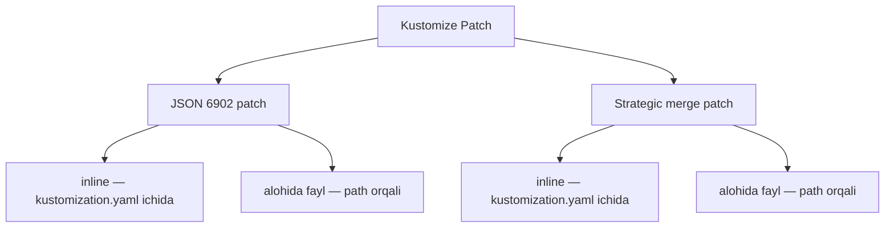

# Dars 292 — Patch yozish usullari: inline va alohida fayl

> 🎯 **Bu darsda nimani o'rganamiz:**
> - Patch'ni yozishning 2 usuli: inline va alohida fayl (separate file)
> - JSON 6902 patch'ni alohida faylga chiqarish
> - Strategic merge patch'ni alohida faylga chiqarish
> - Qachon qaysi usulni tanlash

## Hayotiy o'xshatish

Kichik xarid ro'yxatini telefon eslatmasiga yozib qo'yasiz — bu **inline**. Lekin ro'yxat 50 banddan oshsa, alohida daftar tutgan ma'qul — bu **alohida fayl**. Ikkalasida ham ma'lumot bir xil, faqat saqlanadigan joyi va tartibliligi farq qiladi.

## Ikki o'lchov, to'rt kombinatsiya

Oldingi darsda patch'ning 2 turini ko'rdik: **JSON 6902** va **strategic merge**. Endi yana bir o'lchov qo'shiladi: har ikkala turni ham **2 xil joyda** yozish mumkin:

1. **Inline** — patch matni to'g'ridan-to'g'ri `kustomization.yaml` ichida (hozirgacha shunday qildik);
2. **Alohida fayl** — `kustomization.yaml` da faqat fayl yo'li (`path`) ko'rsatiladi, patch'ning o'zi alohida YAML faylda turadi.



## JSON 6902: inline usul (takrorlash)

```yaml
# kustomization.yaml
patches:
  - target:
      kind: Deployment
      name: api-deployment
    patch: |-
      - op: replace
        path: /spec/replicas
        value: 5
```

## JSON 6902: alohida fayl usuli

`kustomization.yaml` da target odatdagidek qoladi, lekin `patch:` o'rniga patch fayliga **yo'l** beramiz:

```yaml
# kustomization.yaml
patches:
  - target:
      kind: Deployment
      name: api-deployment
    path: replica-patch.yaml
```

Patch'ning o'zi esa alohida faylda — u yerda patchlar **ro'yxati** turadi (bizda bittagina bor):

```yaml
# replica-patch.yaml
- op: replace
  path: /spec/replicas
  value: 5
```

Natija ikkala usulda ham bir xil.

## Strategic merge: inline usul

```yaml
# kustomization.yaml
patches:
  - patch: |-
      apiVersion: apps/v1
      kind: Deployment
      metadata:
        name: api-deployment
      spec:
        replicas: 5
```

## Strategic merge: alohida fayl usuli

```yaml
# kustomization.yaml
patches:
  - path: replica-patch.yaml
```

```yaml
# replica-patch.yaml
apiVersion: apps/v1
kind: Deployment
metadata:
  name: api-deployment
spec:
  replicas: 5
```

## Taqqoslash

| | Inline | Alohida fayl |
|---|---|---|
| Patch qayerda | `kustomization.yaml` ichida, `patch: \|-` ostida | Alohida YAML faylda, `path:` orqali ulanadi |
| Qulaylik | 1-2 ta kichik patch uchun tez va qulay | Ko'p patchlar uchun tartibli |
| Kamchilik | Patchlar ko'paysa kustomization.yaml "ivirsib" ketadi | Qo'shimcha fayllar paydo bo'ladi |
| Qo'llanish | JSON 6902 va strategic merge — ikkalasida ham | JSON 6902 va strategic merge — ikkalasida ham |

💡 Ikkala usul ham to'g'ri ishlaydi. Patchlaringiz kam bo'lsa — inline yozavering. Patchlar ko'payib, `kustomization.yaml` o'qish qiyin bo'lib qolsa — ularni alohida fayllarga chiqaring.

## 🧪 Mustaqil topshiriqlar

> Yechishdan oldin darsni yopib qo'ying. Taxminiy vaqt: 15 daqiqa.

**1-topshiriq · oson.** Inline patch (kustomization.yaml ichida) yozing.

<details><summary>O'zingizni tekshiring</summary>

```bash
kubectl kustomize .
```
</details>

**2-topshiriq · o'rta.** Xuddi shu patchni alohida faylga chiqarib, `path:` orqali ulang.

<details><summary>O'zingizni tekshiring</summary>

```bash
kubectl kustomize .    # natija bir xil bo'lishi kerak
```
</details>

**3-topshiriq · qiyin.** Qaysi holatda inline, qaysi holatda alohida fayl afzal?

<details><summary>O'zingizni tekshiring</summary>

**Inline** — patch 3-4 qatordan oshmasa (`replicas: 5` kabi). Hamma narsa
bitta faylda ko'rinadi.

**Alohida fayl** — patch uzun bo'lsa, bir necha overlay'da qayta
ishlatilsa yoki muharrir YAML sxemasi bo'yicha tekshirishi kerak bo'lsa.

Amaliy qoida: `kustomization.yaml` 60 qatordan oshsa, patchlarni
fayllarga chiqaring.
</details>

## ❓ Savol-Javob

**Savol:** Inline va alohida fayl usullarining natijasi farq qiladimi?
**Javob:** Yo'q, yakuniy natija bir xil. Farq faqat patch matni qayerda saqlanishida.

**Savol:** Alohida fayl usulida `kustomization.yaml` da nima yoziladi?
**Javob:** JSON 6902 uchun — `target` va patch fayliga `path`; strategic merge uchun — faqat `path`. Patch mazmuni alohida faylda turadi.

**Savol:** Qachon alohida fayl usuliga o'tgan ma'qul?
**Javob:** Patchlar soni ko'payib, `kustomization.yaml` ni o'qish qiyinlashganda. Har bir mantiqiy o'zgarishni o'z fayliga chiqarish loyihani tartibli qiladi.

## 📌 CKA imtihon uchun maslahat

Imtihonda tayyor loyiha berilishi mumkin — avval `kustomization.yaml` ni oching va patchlar inline yozilganmi yoki `path:` orqali alohida fayllardami, aniqlang. `path:` ko'rsangiz, o'sha faylni ham oching. Yangi patch qo'shishda mavjud uslubga ergashing — bu vaqtni tejaydi va sintaksis xatolaridan saqlaydi.

## 📖 Asosiy atamalar

| Atama | Oddiy tushuntirish |
|---|---|
| Inline patch | Patch matni to'g'ridan-to'g'ri kustomization.yaml ichida yozilishi |
| Separate file (alohida fayl) | Patch alohida YAML faylda, kustomization.yaml esa unga yo'l ko'rsatishi |
| `path` (patches ichida) | Patch fayliga yo'l (JSON 6902'dagi maydon yo'li `path` bilan adashtirmang) |
| `patch: \|-` | YAML'da ko'p qatorli inline matn boshlanish belgisi |

## 🔗 Manbalar

- Kustomize patches hujjati: https://kubectl.docs.kubernetes.io/references/kustomize/kustomization/patches/
- Kustomize bilan obyektlarni boshqarish: https://kubernetes.io/docs/tasks/manage-kubernetes-objects/kustomization/
- RFC 6902: https://datatracker.ietf.org/doc/html/rfc6902

---
*Bu dars KodeKloud CKA kursining 292-videosi asosida tayyorlandi.*
