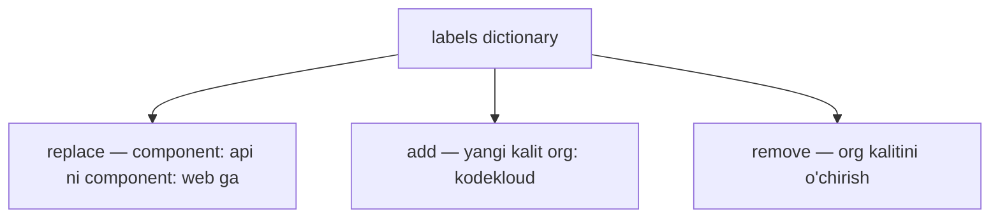

# Dars 293 — Dictionary'ga patch berish (replace, add, remove)

> 🎯 **Bu darsda nimani o'rganamiz:**
> - Dictionary (lug'at) ichidagi kalitni almashtirish — JSON 6902 va strategic merge bilan
> - Dictionary'ga yangi kalit qo'shish — ikkala usulda
> - Dictionary'dan kalitni o'chirish — ikkala usulda (strategic merge'da `null` hiylasi)

## Hayotiy o'xshatish

Dictionary (lug'at) — kalit-qiymat juftliklari, xuddi telefon kontaktlar kitobi kabi: "Ali → 90-123-45-67". Kontaktni **tahrirlash** (raqamini o'zgartirish) — bu `replace`; **yangi kontakt** qo'shish — `add`; kontaktni **o'chirish** — `remove`. Bu darsda Kubernetes konfigidagi `labels` lug'ati misolida uchala amalni ham ikki xil patch usulida bajaramiz.

Ishlaydigan misolimiz — shu deployment:

```yaml
# api-depl.yaml
apiVersion: apps/v1
kind: Deployment
metadata:
  name: api-deployment
spec:
  replicas: 1
  selector:
    matchLabels:
      component: api
  template:
    metadata:
      labels:
        component: api      # shu lug'at bilan ishlaymiz
    spec:
      containers:
        - name: nginx
          image: nginx
```



## 1. Kalit qiymatini almashtirish (replace)

Maqsad: `component: api` → `component: web`.

### JSON 6902 usuli

```yaml
# kustomization.yaml
patches:
  - target:
      kind: Deployment
      name: api-deployment
    patch: |-
      - op: replace
        path: /spec/template/metadata/labels/component
        value: web
```

Path'ni bosqichma-bosqich tushunamiz: `labels` lug'atiga yetib borish uchun `spec` → `template` → `metadata` → `labels`, oxirida esa o'zgartirilayotgan **kalit nomi** — `component`. Natija: `component: web`.

### Strategic merge usuli

Bu safar alohida fayl usulini ishlatamiz (inline ham bo'laveradi, lekin alohida fayl tartibliroq):

```yaml
# kustomization.yaml
patches:
  - path: label-patch.yaml
```

```yaml
# label-patch.yaml
apiVersion: apps/v1
kind: Deployment
metadata:
  name: api-deployment    # qaysi obyekt
spec:
  template:
    metadata:
      labels:
        component: web    # yangi qiymat
```

Bu — asl deployment'dan nusxa, faqat o'zgarmaydigan qismlari (masalan, containers) o'chirilgan. Kustomize ikki konfigni birlashtiradi, farqni topadi (`api` → `web`) va yakuniy natijani chiqaradi.

## 2. Yangi kalit qo'shish (add)

Maqsad: mavjud `component: api` yoniga `org: kodekloud` labelini qo'shish.

### JSON 6902 usuli

```yaml
# kustomization.yaml
patches:
  - target:
      kind: Deployment
      name: api-deployment
    patch: |-
      - op: add
        path: /spec/template/metadata/labels/org
        value: kodekloud
```

E'tibor bering: operatsiya `add` bo'ldi, path oxirida esa **yangi kalit nomi** (`org`) yoziladi, `value` da uning qiymati. Natija — ikkita label:

```yaml
labels:
  component: api
  org: kodekloud
```

### Strategic merge usuli

```yaml
# label-patch.yaml
apiVersion: apps/v1
kind: Deployment
metadata:
  name: api-deployment
spec:
  template:
    metadata:
      labels:
        org: kodekloud    # yangi label
```

Merge paytida Kustomize asl faylda `component: api`, patch'da `org: kodekloud` borligini ko'radi — ikkalasini birlashtiradi, natijada ikkala label ham qoladi.

## 3. Kalitni o'chirish (remove)

Endi deployment'da ikkita label bor deylik (`component: api` va `org: kodekloud`), va biz `org` ni o'chirmoqchimiz.

### JSON 6902 usuli

```yaml
# kustomization.yaml
patches:
  - target:
      kind: Deployment
      name: api-deployment
    patch: |-
      - op: remove
        path: /spec/template/metadata/labels/org
```

Operatsiya `remove`, path oxirida o'chiriladigan kalit — `org`. ⚠️ `value` yozilmaydi — o'chirishda qiymat kerak emas. Natijada faqat `component: api` qoladi.

### Strategic merge usuli — null hiylasi

Strategic merge'da o'chirish qanday bo'ladi? Kalitni patch'ga yozmasak, Kustomize "hech narsa o'zgarmasin" deb tushunadi. O'chirish uchun kalit qiymatini **null** qilib yozamiz:

```yaml
# label-patch.yaml
apiVersion: apps/v1
kind: Deployment
metadata:
  name: api-deployment
spec:
  template:
    metadata:
      labels:
        org: null    # null = bu kalitni o'chir
```

Merge paytida `null` qiymat "bu kalitni o'chirib tashla" degani — natijada `org` labeli yo'qoladi.

## Umumlashtiruvchi jadval

| Amal | JSON 6902 | Strategic merge |
|---|---|---|
| Almashtirish | `op: replace`, path oxirida kalit, `value` — yangi qiymat | Kalitga yangi qiymat yoziladi |
| Qo'shish | `op: add`, path oxirida yangi kalit, `value` — qiymat | Yangi kalit-qiymat yoziladi |
| O'chirish | `op: remove`, path oxirida kalit, value YO'Q | Kalitga `null` qiymat beriladi |

## 🧪 Mustaqil topshiriqlar

> Yechishdan oldin darsni yopib qo'ying. Taxminiy vaqt: 15 daqiqa.

**1-topshiriq · oson.** JSON 6902 patch bilan `replicas` qiymatini `replace` qiling.

<details><summary>O'zingizni tekshiring</summary>

```bash
kubectl kustomize . | grep -A1 replicas
```
</details>

**2-topshiriq · o'rta.** `add` operatsiyasi bilan yangi label qo'shing.

<details><summary>O'zingizni tekshiring</summary>

```bash
kubectl kustomize . | grep -A3 'labels:'
```
</details>

**3-topshiriq · qiyin.** `remove` bilan mavjud bo'lmagan maydonni o'chirmoqchi bo'ling.
**Avval ayting:** xato beradimi?

<details><summary>O'zingizni tekshiring</summary>

**Ha, xato beradi.** JSON Patch (RFC 6902) qat'iy: `remove` operatsiyasi
yo'lni topa olmasa to'xtaydi.

```text
Error: remove operation does not apply: doc is missing path: /spec/foo
```

Strategic merge patch esa yumshoqroq — u yo'q maydonni jimgina
e'tiborsiz qoldiradi. Aniqlik kerak bo'lganda JSON 6902, qulaylik
kerak bo'lganda strategic merge tanlanadi.
</details>

## ❓ Savol-Javob

**Savol:** JSON 6902'da o'zgartirilayotgan kalit nomi qayerda yoziladi?
**Javob:** Path'ning oxirida: `/spec/template/metadata/labels/component` — bu yerda `component` aynan o'zgartirilayotgan kalit.

**Savol:** Strategic merge patch bilan labelni qanday o'chiraman?
**Javob:** Kalitga `null` qiymat beraman: `org: null`. Merge paytida Kustomize buni "o'chir" deb tushunadi.

**Savol:** Strategic merge patch faylini qanday yozish oson?
**Javob:** Asl konfig faylidan nusxa oling, o'zgarmaydigan hamma narsani o'chiring, faqat `metadata.name` (obyektni tanish uchun) va o'zgaradigan maydonlarni qoldiring.

## 📌 CKA imtihon uchun maslahat

JSON 6902'da path yozayotganda YAML daraxtini boshidan kuzatib chiqing: Pod template labellari — `/spec/template/metadata/labels/<kalit>`, Deployment'ning o'z labellari esa — `/metadata/labels/<kalit>`. Bu ikkisini adashtirish keng tarqalgan xato. Ishonch hosil qilish uchun `kustomize build` natijasida labelning to'g'ri joyda o'zgarganini tekshiring.

## 📖 Asosiy atamalar

| Atama | Oddiy tushuntirish |
|---|---|
| Dictionary (lug'at) | Kalit-qiymat juftliklari to'plami (masalan, `labels`) |
| Kalit (key) | Lug'atdagi nom qismi (masalan, `component`) |
| `null` | Strategic merge'da kalitni o'chirish uchun beriladigan qiymat |
| Merge | Ikki konfigni birlashtirib, farqlarni qo'llash jarayoni |

## 🔗 Manbalar

- Kustomize patches: https://kubectl.docs.kubernetes.io/references/kustomize/kustomization/patches/
- Labels va Selectors: https://kubernetes.io/docs/concepts/overview/working-with-objects/labels/
- kubectl patch bilan obyektlarni yangilash: https://kubernetes.io/docs/tasks/manage-kubernetes-objects/update-api-object-kubectl-patch/

---
*Bu dars KodeKloud CKA kursining 293-videosi asosida tayyorlandi.*
