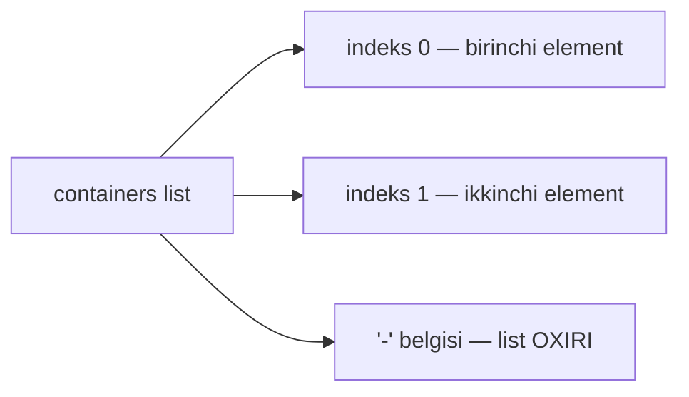

# Dars 294 — List'ga patch berish (replace, add, delete)

> 🎯 **Bu darsda nimani o'rganamiz:**
> - List (ro'yxat) elementini indeks orqali almashtirish
> - List oxiriga `-` belgisi bilan yangi element qo'shish
> - List elementini indeks bo'yicha o'chirish
> - Strategic merge'da `$patch: delete` direktivasi

## Hayotiy o'xshatish

List — navbatda turgan odamlar qatori. Har kimning tartib raqami bor, lekin sanash **0 dan** boshlanadi: birinchi odam — 0, ikkinchisi — 1. "3-o'rindagi odamni almashtir" — `replace`; "navbat oxiriga yangi odam qo'shil" — `add` (`-` belgisi aynan "oxiriga" degani); "1-indeksdagi odam ketsin" — `remove`.

Deployment'dagi `containers:` bo'limi — aynan list. Shuning uchun har bir element `-` (chiziqcha) bilan boshlanadi va bir nechta konteyner bo'lishi mumkin:

```yaml
# api-depl.yaml
apiVersion: apps/v1
kind: Deployment
metadata:
  name: api-deployment
spec:
  template:
    spec:
      containers:          # bu LIST
        - name: nginx      # indeks 0
          image: nginx
```



## 1. List elementini almashtirish (replace)

Maqsad: nginx konteynerining nomi va image'ini haproxy'ga o'zgartirish.

### JSON 6902 usuli — indeks bilan

```yaml
# kustomization.yaml
patches:
  - target:
      kind: Deployment
      name: api-deployment
    patch: |-
      - op: replace
        path: /spec/template/spec/containers/0
        value:
          name: haproxy
          image: haproxy
```

Eng qiziq joyi — path oxiridagi **`0`**. Bu list elementining **indeksi**: dasturlashda bo'lgani kabi sanash 0 dan boshlanadi — birinchi element 0, ikkinchisi 1, uchinchisi 2 va hokazo. Bizda bitta konteyner bor, u ham birinchi, ham oxirgi — indeksi 0. Natija:

```yaml
containers:
  - name: haproxy
    image: haproxy
```

### Strategic merge usuli — nom bilan

```yaml
# kustomization.yaml
patches:
  - path: label-patch.yaml
```

```yaml
# label-patch.yaml
apiVersion: apps/v1
kind: Deployment
metadata:
  name: api-deployment
spec:
  template:
    spec:
      containers:
        - name: nginx       # QAYSI konteyner — nomi bilan tanlanadi
          image: haproxy    # yangi image
```

💡 Strategic merge'da indeks kerak emas — konteyner **nomi** (`name: nginx`) bo'yicha topiladi va uning image'i yangilanadi.

## 2. List'ga element qo'shish (add)

Maqsad: nginx yoniga ikkinchi konteyner (haproxy) qo'shish.

### JSON 6902 usuli — "-" belgisi

```yaml
# kustomization.yaml
patches:
  - target:
      kind: Deployment
      name: api-deployment
    patch: |-
      - op: add
        path: /spec/template/spec/containers/-
        value:
          name: haproxy
          image: haproxy
```

Path oxiridagi **`-`** xatoga o'xshaydi, lekin ataylab yozilgan! Add operatsiyasida path oxirida element **qayerga** qo'shilishini ko'rsatish kerak:

| Path oxiri | Ma'nosi |
|---|---|
| `/containers/-` | List **oxiriga** qo'shish |
| `/containers/0` | List **boshiga** qo'shish (birinchi o'ringa) |
| `/containers/1` | Ikkinchi o'ringa qo'shish |

Tartib muhim bo'lmasa, `-` bilan oxiriga qo'shavering. Natija — ikkita konteyner:

```yaml
containers:
  - name: nginx
    image: nginx
  - name: haproxy
    image: haproxy
```

### Strategic merge usuli

Asl faylda `name: web, image: nginx` konteyneri bor deylik. Patch'da shunchaki **yangi** konteynerni yozamiz:

```yaml
# label-patch.yaml
apiVersion: apps/v1
kind: Deployment
metadata:
  name: api-deployment
spec:
  template:
    spec:
      containers:
        - name: haproxy
          image: haproxy
```

Merge paytida Kustomize asl `web` konteyneri bilan patch'dagi `haproxy` konteyneri **boshqa-boshqa** ekanini (nomlari farq qiladi) ko'radi va ikkalasini ham saqlaydi — natijada listda 2 ta konteyner bo'ladi.

## 3. List elementini o'chirish (remove/delete)

Endi ikkita konteyner bor deylik: `web` (indeks 0) va `database` (indeks 1). `database` ni o'chirmoqchimiz.

### JSON 6902 usuli — indeks bilan

```yaml
# kustomization.yaml
patches:
  - target:
      kind: Deployment
      name: api-deployment
    patch: |-
      - op: remove
        path: /spec/template/spec/containers/1
```

Sanash 0 dan: `web` — 0, `database` — 1. Ikkinchi konteynerni o'chirish uchun indeks **1**. `remove` da `value` kerak emas. Natijada bitta konteyner qoladi.

### Strategic merge usuli — $patch: delete direktivasi

Strategic merge'da savol tug'iladi: patch'ga yozmagan narsa "tegilmasin" degani-ku, o'chirishni qanday aytamiz? Buning uchun maxsus **delete direktivasi** bor:

```yaml
# label-patch.yaml
apiVersion: apps/v1
kind: Deployment
metadata:
  name: api-deployment
spec:
  template:
    spec:
      containers:
        - $patch: delete    # o'chirish direktivasi
          name: database    # nima o'chirilsin — nomi bilan
```

`$patch: delete` — "shu elementni o'chir" degan buyruq; ostida qaysi konteyner o'chirilishi nomi bilan ko'rsatiladi. Natijada `database` konteyneri yo'qoladi.

## Umumlashtiruvchi jadval

| Amal | JSON 6902 | Strategic merge |
|---|---|---|
| Almashtirish | path oxirida indeks: `/containers/0` | Konteyner nomi bo'yicha topib, yangi qiymat yoziladi |
| Qo'shish (oxiriga) | path oxirida `-`: `/containers/-` | Yangi konteyner shunchaki yoziladi |
| Qo'shish (aniq o'ringa) | path oxirida indeks: `/containers/0` | (tartib merge'da boshqarilmaydi) |
| O'chirish | `op: remove` + indeks, value yo'q | `$patch: delete` + nom |

## ❓ Savol-Javob

**Savol:** Path oxiridagi raqam nimani bildiradi?
**Javob:** List elementining indeksini. Sanash 0 dan boshlanadi: birinchi element — 0, ikkinchisi — 1, uchinchisi — 2.

**Savol:** Add operatsiyasida path oxiridagi `-` nima degani?
**Javob:** "List oxiriga qo'sh" degani. Aniq o'ringa qo'ymoqchi bo'lsangiz, `-` o'rniga indeks yozasiz (boshiga — 0).

**Savol:** Strategic merge'da list elementini qanday o'chiraman?
**Javob:** `$patch: delete` direktivasi bilan: konteyner yozuviga `$patch: delete` va o'chiriladigan elementning `name` ini yozaman.

**Savol:** JSON 6902 va strategic merge listdagi elementni qanday "topadi"?
**Javob:** JSON 6902 — pozitsiyasi (indeksi) bo'yicha; strategic merge — kaliti (konteynerlarda `name`) bo'yicha.

## 📌 CKA imtihon uchun maslahat

Indekslar bilan ishlaganda avval asl faylni ochib, konteynerlar tartibini sanab chiqing (0 dan!). Noto'g'ri indeks — noto'g'ri konteyner o'zgaradi yoki o'chadi. Ishonchsiz bo'lsangiz, strategic merge ishlatgan xavfsizroq — u indeksga emas, konteyner nomiga tayanadi, tartib o'zgarsa ham to'g'ri ishlaydi.

## 📖 Asosiy atamalar

| Atama | Oddiy tushuntirish |
|---|---|
| List (ro'yxat) | Tartiblangan elementlar to'plami; YAML'da har bir element `-` bilan boshlanadi |
| Indeks | Elementning listdagi tartib raqami, 0 dan boshlab sanaladi |
| `-` (path oxirida) | Add operatsiyasida "list oxiriga qo'sh" belgisi |
| `$patch: delete` | Strategic merge'da element o'chirish direktivasi |

## 🔗 Manbalar

- RFC 6902 (add/remove/replace va `-` semantikasi): https://datatracker.ietf.org/doc/html/rfc6902
- Kustomize patches: https://kubectl.docs.kubernetes.io/references/kustomize/kustomization/patches/
- Strategic merge patch va direktivalar: https://kubernetes.io/docs/tasks/manage-kubernetes-objects/update-api-object-kubectl-patch/

---
*Bu dars KodeKloud CKA kursining 294-videosi asosida tayyorlandi.*
