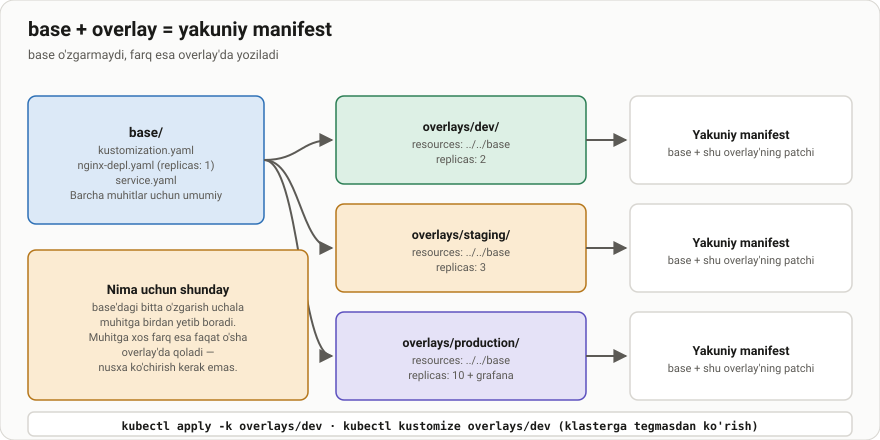
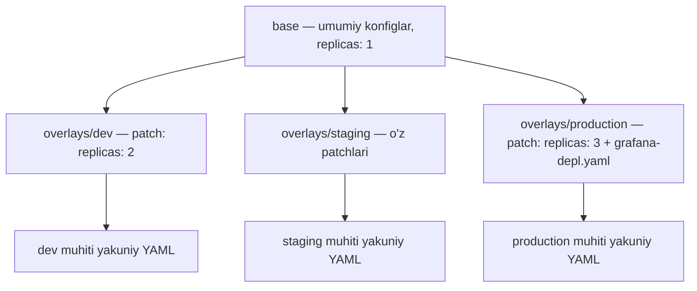

# Dars 296 — Overlaylar: muhitlar bo'yicha sozlash

> 🎯 **Bu darsda nimani o'rganamiz:**
> - Kustomize'ning asosiy vazifasi: base + overlay arxitekturasi
> - `base/` va `overlays/dev|staging|production` katalog tuzilishi
> - `resources:` orqali base konfiglarni import qilish va patch berish
> - Overlay'da yangi (base'da yo'q) resurslar qo'shish



## Hayotiy o'xshatish

Palov retseptini tasavvur qiling. **Asosiy retsept** (base) hamma uchun bir xil: guruch, sabzi, go'sht. Lekin har bir oshpaz o'ziga moslaydi: dietaga tushgan odam uchun kam yog' (dev — kam resurs), to'y uchun 3 barobar ko'p masalliq (production — ko'p replica). Retseptni har safar boshidan yozmaysiz — asosiy retseptni olib, faqat **farqlarni** yozasiz. Overlay — aynan shu "farqlar varag'i".

## Nima uchun overlay?

Kursning boshida aytilgan edi: Kustomize aynan shu masala uchun yaratilgan — **bitta base konfigni olib, har bir muhit (environment) uchun moslashtirish**. Bizda odatda kamida uchta muhit bo'ladi:

- **dev** — dasturchilar sinov muhiti;
- **staging** — ishga tushirishdan oldingi sinov;
- **production** — real foydalanuvchilar muhiti.

Har bir muhitda ba'zi parametrlar (replicas soni, image versiyasi va h.k.) farq qiladi. Overlay — shu farqlarni saqlash usuli. Yaxshi yangilik: **yangi hech narsa o'rganmaymiz** — overlay bu shunchaki "base'ni import qilish + oldingi darslarda o'rgangan patchlarimiz".

## Katalog tuzilishi

Odatiy Kustomize loyihasi ikki qismga bo'linadi:

```
k8s/
├── base/                        # umumiy (shared) va default konfiglar
│   ├── kustomization.yaml
│   ├── nginx-depl.yaml
│   └── service.yaml
└── overlays/
    ├── dev/
    │   └── kustomization.yaml   # dev uchun patchlar
    ├── staging/
    │   └── kustomization.yaml   # staging uchun patchlar
    └── production/
        ├── kustomization.yaml   # production uchun patchlar
        └── grafana-depl.yaml    # faqat productionda bor yangi resurs
```

- **base/** — barcha muhitlar uchun umumiy bo'lgan konfiglar va default qiymatlar;
- **overlays/<muhit>/** — har bir muhitning o'ziga xos o'zgarishlari (patchlar) va, kerak bo'lsa, qo'shimcha resurslari.



## base/kustomization.yaml

Base'dagi fayl — eng oddiy, faqat resurslarni import qiladi:

```yaml
# k8s/base/kustomization.yaml
resources:
  - nginx-depl.yaml
```

```yaml
# k8s/base/nginx-depl.yaml
apiVersion: apps/v1
kind: Deployment
metadata:
  name: nginx-deployment
spec:
  replicas: 1        # default qiymat
  ...
```

## Overlay kustomization.yaml — resources va patchlar

Qiziq narsalar overlay'da boshlanadi. `dev` papkasidagi fayl:

```yaml
# k8s/overlays/dev/kustomization.yaml
resources:
  - ../../base       # base katalogiga nisbiy yo'l

patches:
  - patch: |-
      apiVersion: apps/v1
      kind: Deployment
      metadata:
        name: nginx-deployment
      spec:
        replicas: 2   # dev uchun qiymat
```

Yangi narsa — **`resources:`** ichida katalogga yo'l ko'rsatish. U "base konfiglar qayerda?" degan savolga **nisbiy yo'l** (relative path) bilan javob beradi:

- `../` — bir katalog yuqoriga chiqish degani;
- biz `dev/` ichidamiz → `../` bizni `overlays/` ga chiqaradi → yana `../` bizni `k8s/` ga chiqaradi → `base` — base katalogiga kiramiz. Jami: `../../base`.

Shu yo'l berilgach, Kustomize base katalogdagi `kustomization.yaml` ni topib, u import qilgan barcha resurslarni oladi. Keyin esa overlay'dagi patchlar qo'llanadi.

Production uchun ham xuddi shunday, faqat qiymat boshqa:

```yaml
# k8s/overlays/production/kustomization.yaml
resources:
  - ../../base

patches:
  - patch: |-
      apiVersion: apps/v1
      kind: Deployment
      metadata:
        name: nginx-deployment
      spec:
        replicas: 3   # production uchun qiymat
```

💡 Overlay konsepsiyasi shu bilan tugadi! Hech qanday yangi bilim kerak emas: base'ni import qilasiz, muhitga mos patch berasiz.

## Overlay'da YANGI resurslar

Muhim nuqta: overlay faqat patchlardan iborat bo'lishi shart emas. Overlay papkasida **base'da umuman yo'q, yangi konfiglar** ham bo'lishi mumkin. Masalan, faqat production muhitiga Grafana deploy qilmoqchimiz:

```yaml
# k8s/overlays/production/kustomization.yaml
resources:
  - ../../base          # base katalogi
  - grafana-depl.yaml   # faqat shu muhitda bor yangi resurs

patches:
  - patch: |-
      apiVersion: apps/v1
      kind: Deployment
      metadata:
        name: nginx-deployment
      spec:
        replicas: 3
```

`grafana-depl.yaml` base'da yo'q — u faqat production overlay'ida turadi va `resources:` orqali oddiy fayl kabi import qilinadi. Natijada Grafana faqat production muhitida paydo bo'ladi, dev va staging'da yo'q.

## Katalog tuzilishi — erkinlik

⚠️ "Faqat shu tuzilishda ishlash shart" deb o'ylamang. Kustomize katalog tuzilishida katta erkinlik beradi:

- `base/` ichini feature'lar bo'yicha subdirectorylarga bo'lish mumkin (oldingi darslardagi kabi);
- overlay'larni ham o'z ichida istalgancha bo'laklash mumkin;
- overlay ichidagi subdirectorylar base'nikiga mos kelishi shart emas — butunlay boshqacha bo'lishi mumkin.

Yagona shart: har bir `kustomization.yaml` o'z resurslarini to'g'ri import qilsin.

## Muhitni deploy qilish

| Muhit | Buyruq |
|---|---|
| dev | `kubectl apply -k k8s/overlays/dev` |
| staging | `kubectl apply -k k8s/overlays/staging` |
| production | `kubectl apply -k k8s/overlays/production` |
| Oldindan ko'rish | `kustomize build k8s/overlays/dev` |

## ❓ Savol-Javob

**Savol:** `resources: ../../base` dagi `../../` nima degani?
**Javob:** Nisbiy yo'l: har bir `../` bir katalog yuqoriga chiqishni bildiradi. `dev/` dan ikki pog'ona yuqoriga (`overlays/` → `k8s/`) chiqib, `base/` katalogiga kiriladi.

**Savol:** Overlay'da base'da bo'lmagan yangi resurs qo'shsam bo'ladimi?
**Javob:** Ha! Overlay papkasiga yangi YAML qo'yib, uni ham shu `resources:` ro'yxatiga qo'shasiz — base katalogi bilan yonma-yon. U faqat shu muhitda deploy bo'ladi (masalan, faqat production'dagi Grafana).

**Savol:** Eski qo'llanmalarda `bases:` degan xususiyatni ko'rdim. U nima?
**Javob:** `bases:` — `resources:` ning eski, alohida varianti edi. Kustomize v5 (2023) da u **butunlay olib tashlandi**. kubectl 1.27 va undan yuqorisi o'zida kustomize v5 ni olib yuradi, shuning uchun `bases:` bilan yozilgan fayl bugun `error: json: unknown field "bases"` xatosini beradi. Eski loyihani uchratsangiz — `bases:` ostidagi yo'llarni `resources:` ro'yxatiga ko'chiring, boshqa hech narsa o'zgarmaydi.

**Savol:** Overlay uchun qandaydir yangi patch sintaksisi bormi?
**Javob:** Yo'q. Overlay — bu oddiy `kustomization.yaml`: base'ni import qiladi va oldin o'rgangan JSON 6902 yoki strategic merge patchlarimizni qo'llaydi.

**Savol:** base va overlay kataloglari tuzilishi bir-biriga mos bo'lishi shartmi?
**Javob:** Yo'q, ular mustaqil. Har biri o'z ichida istalgancha subdirectorylarga bo'linishi mumkin — asosiysi importlar to'g'ri bo'lsin.

## 📌 CKA imtihon uchun maslahat

Imtihonda tayyor base/overlays loyihasi berilishi mumkin. Muhitga o'zgarish kiritish so'ralsa — base'ni EMAS, tegishli overlay'ning `kustomization.yaml` faylini tahrirlang (base'dagi o'zgarish barcha muhitlarga ta'sir qiladi!). Deploy uchun `kubectl apply -k <overlay-katalogi>` ishlating.

⚠️ **Faqat `resources:` yozing.** Eski `bases:` xususiyati Kustomize v5 da olib tashlangan va imtihon muhitidagi kubectl'da xato beradi. Agar `unknown field "bases"` xatosini ko'rsangiz — o'sha yo'llarni `resources:` ga ko'chiring.

## 📖 Asosiy atamalar

| Atama | Oddiy tushuntirish |
|---|---|
| Base | Barcha muhitlar uchun umumiy va default Kubernetes konfiglar to'plami |
| Overlay | Bitta muhitning base'dan farqlarini (patchlar, qo'shimcha resurslar) saqlovchi qatlam |
| `resources:` | Import qilinadigan fayl va kataloglar ro'yxati; overlay'da base katalogiga yo'l shu yerda ko'rsatiladi |
| `bases:` (eskirgan) | `resources:` ning eski varianti. Kustomize v5 da olib tashlangan — ishlatilmaydi |
| Nisbiy yo'l (relative path) | Joriy fayldan boshlab hisoblanadigan yo'l; `../` — bir pog'ona yuqoriga |
| Environment (muhit) | Ilova ishlaydigan alohida sharoit: dev, staging, production |

## 🔗 Manbalar

- Kustomize bases and overlays: https://kubectl.docs.kubernetes.io/guides/config_management/components/
- Kustomize glossary (base, overlay): https://kubectl.docs.kubernetes.io/references/kustomize/glossary/
- Kubernetes'da Kustomize: https://kubernetes.io/docs/tasks/manage-kubernetes-objects/kustomization/

---
*Bu dars KodeKloud CKA kursining 296-videosi asosida tayyorlandi.*
