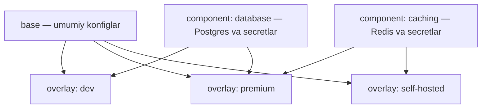

# Dars 298 — Komponentlar (Components): qayta ishlatiladigan konfig bloklari

> 🎯 **Bu darsda nimani o'rganamiz:**
> - Component nima va u qanday muammoni hal qiladi
> - Nega ixtiyoriy feature'ni base'ga ham, har bir overlay'ga ham qo'yib bo'lmaydi
> - Component katalogi tuzilishi va maxsus `kind: Component`
> - Overlay'da componentni `components:` orqali import qilish

## Hayotiy o'xshatish

Telefon tarifi tasavvur qiling: hamma tarifda qo'ng'iroq va SMS bor (bu — **base**). Lekin "Internet 50GB" va "Xalqaro qo'ng'iroqlar" — **ixtiyoriy paketlar**: kimdir birinchisini oladi, kimdir ikkinchisini, kimdir ikkalasini. Operator har tarif uchun paketni qaytadan yozmaydi — bitta tayyor paketni turli tariflarga **ulab qo'yadi**. Kustomize **component**lari — aynan shu "ulanadigan paketlar": bir marta yoziladi, kerakli overlay'larga import qilinadi.

## Muammo: feature faqat BA'ZI overlay'larda kerak

Component — bir nechta overlay'da qayta ishlatiladigan konfiguratsiya mantiqi blokidir. U quyidagi vaziyatda kerak bo'ladi: ilovada **ixtiyoriy feature**lar bor va ular **overlay'larning faqat bir qismida** yoqilishi kerak.

Misol: ilovamiz 3 xil variantda deploy bo'ladi (3 overlay):

- **dev** — ishlab chiqish varianti;
- **premium** — premium mijozlar uchun;
- **self-hosted (standalone)** — o'z serverida o'rnatadigan mijozlar uchun.

Va ikkita ixtiyoriy feature bor:

| Feature | Kerak bo'lgan variantlar | Tarkibi |
|---|---|---|
| Caching (keshlash) | premium, self-hosted | Redis bazasi + uning konfig va secretlari |
| Tashqi baza (external DB) | dev, premium | Postgres bazasi + konfiglar |

Endi caching konfiglarini qayerga qo'yamiz?

1. **base'ga qo'ysak** — barcha 3 overlay oladi, lekin dev'ga caching kerak emas. ❌
2. **premium va self-hosted'ga nusxalab qo'ysak** — ishlaydi, lekin copy-paste: birida o'zgartirsak, ikkinchisini unutamiz (**config drift**), yangi variant qo'shilsa yana nusxalash kerak. ❌
3. **Component qilamiz** — feature'ning barcha konfiglari BIR joyda, kerakli overlay'lar uni bir qator bilan import qiladi. ✅

💡 Component — bu shunchaki qayta ishlatiladigan Kubernetes konfiglari bloki. Murakkablashtirmang: bitta feature'ga tegishli barcha resurslar, patchlar, ConfigMap va Secretlar bitta papkaga yig'iladi, keyin istalgancha overlay'ga ulanadi.



## Loyiha tuzilishi component bilan

```
k8s/
├── base/
│   ├── kustomization.yaml
│   └── api-depl.yaml
├── components/
│   ├── caching/
│   │   ├── kustomization.yaml
│   │   ├── redis-depl.yaml
│   │   └── deployment-patch.yaml
│   └── database/
│       ├── kustomization.yaml
│       ├── postgres-depl.yaml
│       └── deployment-patch.yaml
└── overlays/
    ├── dev/
    │   └── kustomization.yaml
    ├── premium/
    │   └── kustomization.yaml
    └── standalone/
        └── kustomization.yaml
```

Har bir component papkasida shu feature'ga kerak bo'lgan HAMMA narsa turadi: resurslar (masalan, Postgres deployment), secretlar va base konfiglarni o'zgartiruvchi patchlar.

## Component kustomization.yaml — maxsus kind

Component'ning `kustomization.yaml` fayli oddiy fayldan **apiVersion va kind bilan farq qiladi**:

```yaml
# k8s/components/database/kustomization.yaml
apiVersion: kustomize.config.k8s.io/v1alpha1
kind: Component            # oddiy Kustomization emas!

resources:
  - postgres-depl.yaml     # feature'ga kerak resurslar

secretGenerator:
  - name: postgres-cred    # baza paroli uchun secret
    literals:
      - password=postgres123

patches:
  - deployment-patch.yaml  # base'dagi api-deployment'ni o'zgartiruvchi patch
```

⚠️ Esda tuting: `apiVersion: kustomize.config.k8s.io/v1alpha1` va `kind: Component` — componentlar uchun majburiy.

Component ichida uch narsa bo'lishi mumkin:

1. **resources** — feature'ning o'z resurslari (Postgres deployment);
2. **secretGenerator / configMapGenerator** — feature'ga kerak secret va configmaplar;
3. **patches** — base'dagi mavjud konfiglarni feature'ga moslashtiruvchi patchlar.

Masalan, API deployment'ga baza paroli environment variable sifatida kerak. Buni strategic merge patch bilan qilamiz:

```yaml
# k8s/components/database/deployment-patch.yaml
apiVersion: apps/v1
kind: Deployment
metadata:
  name: api-deployment      # base'dagi deployment
spec:
  template:
    spec:
      containers:
        - name: api
          env:
            - name: DB_PASSWORD    # yangi environment variable
              valueFrom:
                secretKeyRef:
                  name: postgres-cred
                  key: password
```

## Overlay'da componentni import qilish

Endi eng oson qismi. Dev varianti tashqi baza feature'ini ishlatadi — demak `dev` overlay'iga database componentini ulaymiz:

```yaml
# k8s/overlays/dev/kustomization.yaml
resources:
  - ../../base             # odatdagi base import

components:
  - ../../components/database   # component import — bitta qator!
```

Premium ikkala feature'ni oladi:

```yaml
# k8s/overlays/premium/kustomization.yaml
resources:
  - ../../base

components:
  - ../../components/caching
  - ../../components/database
```

Self-hosted faqat caching oladi:

```yaml
# k8s/overlays/standalone/kustomization.yaml
resources:
  - ../../base

components:
  - ../../components/caching
```

Shu bilan tamom: feature mantiqi BIR joyda yoziladi, har bir overlay unga faqat havola beradi. O'zgarish kerak bo'lsa — faqat component papkasida o'zgartirasiz, barcha ulangan overlay'lar avtomatik yangi holatni oladi.

## 🧪 Mustaqil topshiriqlar

> Yechishdan oldin darsni yopib qo'ying. Taxminiy vaqt: 20 daqiqa.

**1-topshiriq · oson.** Component yarating (`kind: Component`) va uni bitta overlay'ga ulang.

<details><summary>O'zingizni tekshiring</summary>

```bash
kubectl kustomize overlays/dev | grep -c 'kind:'
```
</details>

**2-topshiriq · o'rta.** Xuddi shu componentni ikkinchi overlay'ga ham ulang.

<details><summary>O'zingizni tekshiring</summary>

```bash
diff <(kubectl kustomize overlays/dev) <(kubectl kustomize overlays/premium)
```
</details>

**3-topshiriq · qiyin.** Component va base farqi nima? **Avval ayting:** nima uchun alohida
`kind` kerak bo'ldi?

<details><summary>O'zingizni tekshiring</summary>

**Base** — to'liq, mustaqil manifestlar to'plami. Uni yakka o'zi
`kubectl apply -k base/` bilan qo'llash mumkin.

**Component** — bu **ixtiyoriy qo'shimcha**: bir imkoniyat (masalan
"tashqi baza", "kesh"). U yakka o'zi ma'noga ega emas, faqat base
ustiga qo'yilganda ishlaydi.

Texnik farqi: componentlar `resources:` emas, alohida `components:`
ro'yxatida ko'rsatiladi va **base import qilingandan keyin** qo'llanadi —
shuning uchun ular base'ni patch qila oladi.
</details>

## ❓ Savol-Javob

**Savol:** Feature barcha overlay'larda kerak bo'lsa, component qilamanmi?
**Javob:** Yo'q, unda oddiy qilib base'ga qo'yaveramiz. Component faqat feature overlay'larning BIR QISMIDA kerak bo'lganda ishlatiladi.

**Savol:** Nega feature konfiglarini har bir overlay'ga nusxalab qo'ymaymiz?
**Javob:** Copy-paste config drift'ga olib keladi: birida o'zgartirib, boshqasini unutasiz. Yangi overlay qo'shilganda yana nusxalash kerak. Component bilan mantiq bir joyda turadi.

**Savol:** Component'ning kustomization.yaml fayli oddiysidan nimasi bilan farq qiladi?
**Javob:** `apiVersion: kustomize.config.k8s.io/v1alpha1` va `kind: Component` bo'lishi shart. Qolgani (resources, generators, patches) odatdagidek.

**Savol:** Component base'dagi resurslarni o'zgartira oladimi?
**Javob:** Ha — component ichida patchlar bo'lishi mumkin. Masalan, database componenti base'dagi api-deployment'ga parol environment variable'ini qo'shadi.

## 📌 CKA imtihon uchun maslahat

Component yaratishda ikkita tipik xatodan saqlaning: (1) `kind: Component` o'rniga `kind: Kustomization` yozish — component sifatida import qilinganda ishlamaydi; (2) overlay'da `components:` o'rniga `resources:` bilan import qilishga urinish. Tekshirish uchun har doim `kustomize build k8s/overlays/<variant>` ishlatib, feature resurslari faqat kerakli variantlarda chiqayotganiga ishonch hosil qiling.

## 📖 Asosiy atamalar

| Atama | Oddiy tushuntirish |
|---|---|
| Component | Bir nechta overlay'ga ulanadigan qayta ishlatiladigan konfig bloki |
| Ixtiyoriy feature | Ilovaning faqat ba'zi variantlarida yoqiladigan funksiya (caching, tashqi baza) |
| Config drift | Nusxalangan konfiglar vaqt o'tishi bilan bir-biridan farqlanib ketishi |
| `kind: Component` | Component kustomization faylining maxsus turi |
| `components:` | Overlay'da componentlarni import qiluvchi bo'lim |
| secretGenerator | Kustomize'ning Secret obyektini avtomatik yaratuvchi vositasi |

## 🔗 Manbalar

- Kustomize Components qo'llanmasi: https://kubectl.docs.kubernetes.io/guides/config_management/components/
- Components KEP (dizayn hujjati): https://github.com/kubernetes/enhancements/tree/master/keps/sig-cli/1802-kustomize-components
- Kustomize glossary: https://kubectl.docs.kubernetes.io/references/kustomize/glossary/

---
*Bu dars KodeKloud CKA kursining 298-videosi asosida tayyorlandi.*
