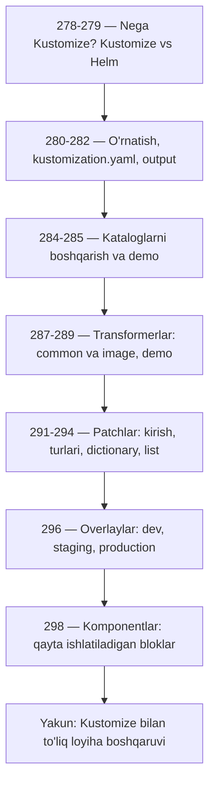
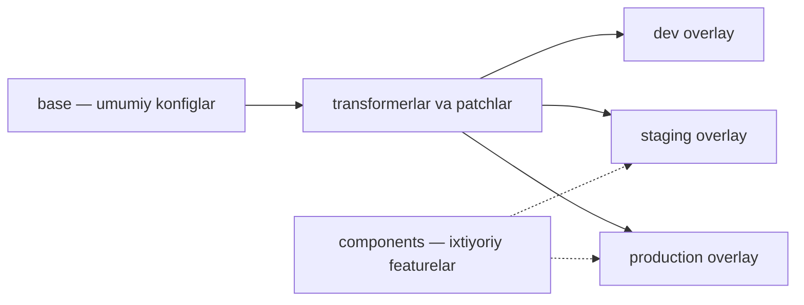

# 🧩 13-bo'lim — Kustomize asoslari (2025)

Bu bo'limda Kubernetes konfiglarini **Kustomize** yordamida boshqarishni o'rganamiz: nima uchun Kustomize kerak, u Helm'dan nimasi bilan farq qiladi, transformerlar va patchlar yordamida konfiglarni o'zgartirish, hamda base/overlay/component arxitekturasi bilan bir loyihani bir nechta muhitga (dev, staging, production) moslashtirish.

## 📚 Darslar ro'yxati

| # | Dars | Mavzu |
|---|---|---|
| 278 | [Kustomize muammo va g'oya](278_Kustomize_muammo_va_goya.md) | Kustomize qanday muammoni hal qiladi, asosiy g'oyasi |
| 279 | [Kustomize vs Helm](279_Kustomize_vs_Helm.md) | Ikki vositaning taqqoslanishi, qachon qaysi biri |
| 280 | [O'rnatish va apiVersion](280_Ornatish_va_apiVersion.md) | Kustomize o'rnatish, apiVersion va kind |
| 281 | [kustomization.yaml fayli](281_kustomization_yaml.md) | Asosiy konfiguratsiya faylining tuzilishi |
| 282 | [Kustomize output](282_Kustomize_output.md) | `kustomize build` natijasi va uni apply qilish |
| 284 | [Kataloglarni boshqarish](284_Kataloglarni_boshqarish.md) | Ko'p katalogli loyihalarda kustomization fayllar |
| 285 | [Kataloglar demo](285_Kataloglar_demo.md) | Kataloglar bilan ishlash amaliy demo |
| 287 | [Common transformerlar](287_Common_transformerlar.md) | commonLabels, namePrefix/nameSuffix, namespace, commonAnnotations |
| 288 | [Image transformerlar](288_Image_transformerlar.md) | images: name/newName/newTag bilan image almashtirish |
| 289 | [Transformerlar demo](289_Transformerlar_demo.md) | Transformerlarni real loyihada qo'llash, qadam-baqadam |
| 291 | [Patchlar kirish](291_Patchlar_kirish.md) | JSON 6902 patch (target, add/remove/replace) va strategic merge |
| 292 | [Patch turlari](292_Patch_turlari.md) | Inline va alohida fayl usullari |
| 293 | [Dictionary patchlar](293_Dictionary_patchlar.md) | Lug'at kalitini replace/add/remove qilish ikkala usulda |
| 294 | [List patchlar](294_List_patchlar.md) | Ro'yxat elementlari bilan ishlash: indekslar, "-", $patch: delete |
| 296 | [Overlaylar](296_Overlaylar.md) | base/overlays tuzilishi, dev/staging/prod muhitlari |
| 298 | [Komponentlar](298_Komponentlar.md) | Qayta ishlatiladigan feature bloklari — components |

## 🗺️ Yo'l xaritasi

## 💡 Bo'limning asosiy g'oyasi

Bitta base konfig → har muhitga moslashtirilgan yakuniy YAML. Copy-paste yo'q, config drift yo'q.

---
*Bu bo'lim KodeKloud CKA kursining 13-bo'limi (2025 Updates — Kustomize Basics) asosida tayyorlandi.*
