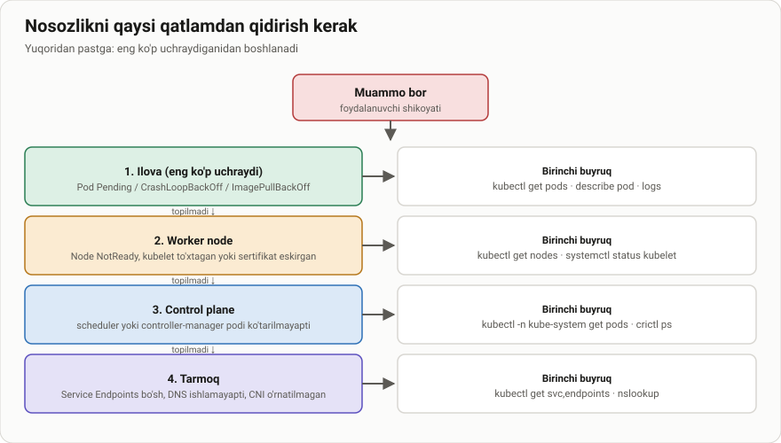
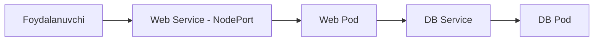
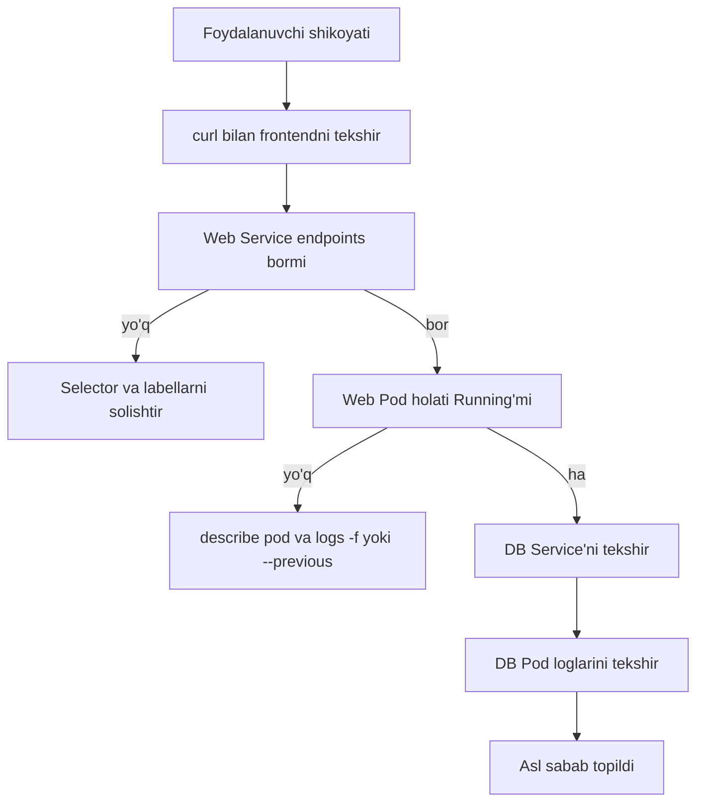

# Dars 301 — Ilova nosozligini aniqlash (Application Failure)

> 🎯 **Bu darsda nimani o'rganamiz:**
> - 2-qavatli (web + database) ilovada muammoni qanday izlash kerakligi
> - Frontdan orqaga qarab tekshirish: curl → Service → Pod → DB
> - Service selektorlari va portlarini tekshirish
> - Pod status, events va loglarni o'qish (`-f` va `--previous` bilan)



## Hayotiy o'xshatish: shifokor tashxisi

Ilovadagi muammoni izlash — shifokor ishiga o'xshaydi. Bemor "boshim og'riyapti" desa, yaxshi shifokor darrov dori yozib bermaydi: avval haroratni o'lchaydi, qon bosimini tekshiradi, tahlil topshirtiradi — ya'ni **belgilardan sababga qarab qadam-baqadam boradi**. Kubernetesda ham xuddi shunday: foydalanuvchi "sayt ochilmayapti" desa, biz ilova xaritasidagi har bir bo'g'inni birma-bir tekshirib chiqamiz, toki asl sabab (root cause) topilguncha.

💡 **Maslahat:** ishni boshlashdan oldin ilovangiz qanday tuzilganini qog'ozga chizib oling (yoki xayolan tasavvur qiling). Muammo haqida qancha ko'p bilsangiz, xaritaning istalgan uchidan boshlashingiz mumkin — lekin xaritadagi **har bir obyekt va har bir bog'lanishni** tekshirishni unutmang.

## Ilova xaritasi: 2-qavatli ilova

Kursda misol sifatida oddiy 2-qavatli ilova olinadi:

- **Web Pod** — web-server ilovasi ishlaydi, foydalanuvchilarga **Web Service** (NodePort) orqali xizmat ko'rsatadi;
- **DB Pod** — ma'lumotlar bazasi ishlaydi, web-serverga **DB Service** orqali ulanadi.



Foydalanuvchilar "ilovaga kira olmayapmiz" deb shikoyat qilishdi deylik. Tekshirishni **old tomondan (frontend)** boshlaymiz va orqaga qarab boramiz.

## 1-qadam: Frontendni tekshirish (curl)

Ilova web-ilova bo'lsa, avval oddiy usulda — brauzer yoki `curl` bilan — node IP va NodePort orqali ochilishini tekshiramiz:

```bash
curl http://web-service-ip:node-port
# masalan:
curl http://192.168.1.10:31000
```

Agar javob kelmasa — muammo ichkarida, davom etamiz.

## 2-qadam: Web Service'ni tekshirish

Service pod'ni topa olganmi? Buni **endpoints** orqali bilamiz:

```bash
kubectl describe service web-service
```

Natijada e'tibor beradigan joylar:

```
Name:              web-service
Selector:          name=webapp-mysql
Endpoints:         10.32.0.6:8080
```

- `Endpoints` bo'sh bo'lsa (`<none>`) — Service hech qanday pod topa olmagan. Bu holda **Service selektori bilan Pod labellarini solishtiring** — ular bir xil bo'lishi shart:

```bash
kubectl describe service web-service   # Selector qatoriga qarang
kubectl get pods --show-labels          # Pod labellari bilan solishtiring
```

⚠️ **Diqqat:** eng ko'p uchraydigan xatolar — selektor va label mos kelmasligi, yoki Service'da noto'g'ri `port`/`targetPort`/`nodePort` yozilgani.

## 3-qadam: Web Pod'ni tekshirish

Pod ishlayaptimi, `Running` holatdami?

```bash
kubectl get pods
```

```
NAME           READY   STATUS    RESTARTS   AGE
webapp-mysql   1/1     Running   5          10m
```

Ikki narsaga qarang:
- **STATUS** — `Running` bo'lishi kerak. `CrashLoopBackOff`, `Error`, `Pending` bo'lsa, muammo shu yerda.
- **RESTARTS** — soni katta bo'lsa, ilova ichida qayta-qayta yiqilayotganini bildiradi.

Pod bilan bog'liq hodisalarni (events) ko'rish:

```bash
kubectl describe pod webapp-mysql
```

Ilova loglarini ko'rish:

```bash
kubectl logs webapp-mysql
```

💡 **Muhim nozik joy:** agar pod qayta ishga tushib turgan bo'lsa, hozirgi konteyner loglari **oldingi yiqilish sababini ko'rsatmasligi mumkin**. Ikki yo'l bor:

```bash
# 1) Loglarni jonli kuzatib, keyingi xatoni kutish:
kubectl logs webapp-mysql -f

# 2) Oldingi (yiqilgan) konteyner loglarini ko'rish:
kubectl logs webapp-mysql --previous
```

## 4-qadam: DB Service va DB Pod'ni tekshirish

Web qismi sog'lom bo'lsa, xuddi shu tekshiruvlarni orqa qavat uchun takrorlaymiz:

```bash
kubectl describe service mysql-service   # selektor, port, endpoints
kubectl get pods                          # DB pod holati
kubectl logs mysql                        # DB loglarida xato izlang
```

DB loglarida ko'pincha parol noto'g'ri, baza nomi xato yoki ulanish rad etilgani kabi xabarlar chiqadi.

## Umumiy tekshirish tartibi (diagramma)



## Tekshirish checklist jadvali

| # | Nima tekshiriladi | Buyruq | Nimaga e'tibor berish |
|---|---|---|---|
| 1 | Ilova ochiladimi | `curl http://node-ip:node-port` | HTTP javob keladimi |
| 2 | Service endpoints | `kubectl describe svc web-service` | `Endpoints` bo'sh emasmi |
| 3 | Selector ↔ label mosligi | `kubectl get pods --show-labels` | Service selektori bilan bir xilmi |
| 4 | Portlar | `kubectl describe svc web-service` | `port`, `targetPort`, `nodePort` to'g'rimi |
| 5 | Pod holati | `kubectl get pods` | STATUS va RESTARTS |
| 6 | Pod hodisalari | `kubectl describe pod <nom>` | Events bo'limidagi xatolar |
| 7 | Ilova loglari | `kubectl logs <pod> -f --previous` | Xato xabarlari |
| 8 | DB qavati | `kubectl describe svc/logs` DB uchun | Ulanish, parol, baza nomi |

## ❓ Savol-Javob

"Savol:" Service'ning `Endpoints` maydoni bo'sh (`<none>`) bo'lsa, birinchi navbatda nimani tekshirish kerak?
"Javob:" Service'dagi `selector` bilan Pod'dagi `labels` mos kelishini. Ular mos kelmasa, Service pod'ni "ko'rmaydi" va trafik hech qayerga bormaydi.

"Savol:" Pod qayta-qayta ishga tushayapti, lekin `kubectl logs` hech qanday xato ko'rsatmayapti. Nima qilamiz?
"Javob:" Hozirgi konteyner endi ishga tushgani uchun loglari toza bo'lishi mumkin. `kubectl logs <pod> --previous` bilan oldingi (yiqilgan) konteyner loglarini ko'ring yoki `-f` bilan jonli kuzatib, keyingi xatoni kuting.

"Savol:" Tekshirishni har doim frontenddan boshlash shartmi?
"Javob:" Yo'q. Muammo haqida qancha ma'lumot borligiga qarab xaritaning istalgan uchidan boshlash mumkin. Asosiysi — xaritadagi har bir obyekt va bog'lanishni asl sabab topilguncha tekshirib chiqish.

## 📌 CKA imtihon uchun maslahat

Troubleshooting — CKA imtihonining **eng katta og'irlikdagi bo'limi** (taxminan 30%)! Sizga "buzilgan" klaster beriladi va muammoni topib tuzatishingiz kerak bo'ladi. Vaqtni tejash uchun:
- Har doim bir xil tartibda yuring: `curl` → Service (endpoints/selector/port) → Pod (status/describe/logs) → keyingi qavat.
- `kubectl describe` va `kubectl logs --previous` — sizning eng yaqin do'stlaringiz.
- Ilovaning environment o'zgaruvchilarida (DB host, user, parol) xato bo'lishi mumkin — pod definitsiyasini `kubectl get pod <nom> -o yaml` bilan ham ko'rib chiqing.
- Kubernetes rasmiy hujjatlaridagi "Debug Applications" sahifasini imtihondan oldin bir marta o'qib chiqing — imtihonda hujjatlardan foydalanish mumkin.

## 📖 Asosiy atamalar

| Atama | Oddiy tushuntirish |
|---|---|
| Root cause | Muammoning asl sababi — belgisi emas, manbai |
| Endpoints | Service topgan pod'larning IP:port ro'yxati |
| Selector | Service qaysi pod'larga trafik yuborishini belgilaydigan label filtri |
| CrashLoopBackOff | Konteyner qayta-qayta yiqilib, Kubernetes uni qayta ishga tushirishga urinayotgan holat |
| `--previous` | Pod'ning oldingi (yiqilgan) konteyneri loglarini ko'rsatadigan flag |

## 🔗 Manbalar

- [Debug Pods — kubernetes.io](https://kubernetes.io/docs/tasks/debug/debug-application/debug-pods/)
- [Debug Services — kubernetes.io](https://kubernetes.io/docs/tasks/debug/debug-application/debug-service/)
- [Troubleshooting Applications — kubernetes.io](https://kubernetes.io/docs/tasks/debug/debug-application/)

---
*Bu dars KodeKloud CKA kursining 301-videosi asosida tayyorlandi.*
