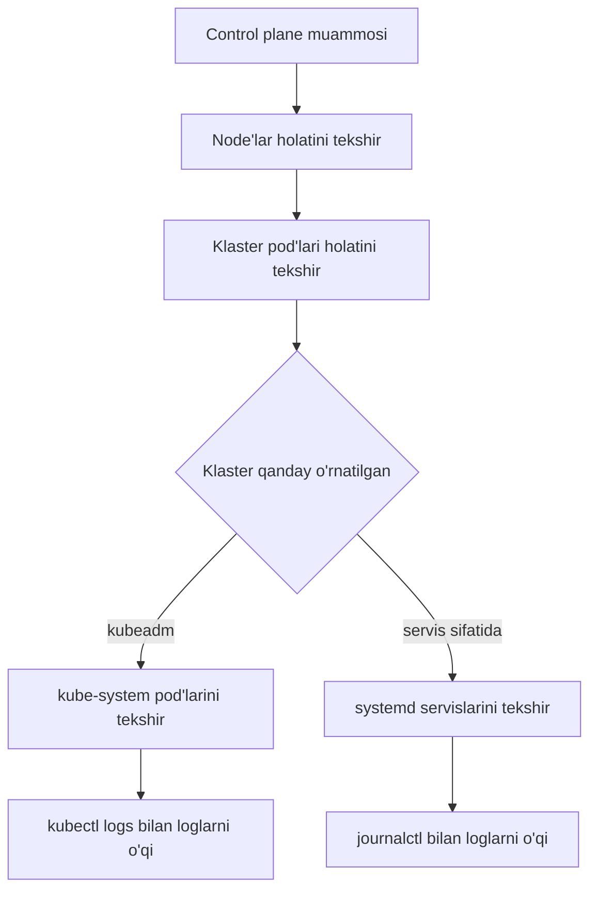

# Dars 304 — Control Plane nosozligini aniqlash (Control Plane Failure)

> 🎯 **Bu darsda nimani o'rganamiz:**
> - Klaster "miyasi" — control plane buzilganda tekshirish tartibi
> - Node va kube-system pod'lari holatini ko'rish
> - kubeadm klasteri va servis sifatida o'rnatilgan klaster farqi
> - kube-apiserver, controller-manager, scheduler loglarini o'qish (`kubectl logs` va `journalctl`)

## Hayotiy o'xshatish: shahar hokimiyati

Control plane — bu shaharning **hokimiyati va dispetcherlik markazi**. Ko'chalar (worker node'lar) joyida turgan bo'lsa ham, hokimiyat ishlamay qolsa: yangi qurilishlarga ruxsat berilmaydi (yangi pod schedule qilinmaydi), buyruqlar bajarilmaydi (`kubectl` javob bermaydi), rejalar amalga oshmaydi. Shuning uchun klaster "aqldan ozganday" bo'lsa — dastlab hokimiyat binosiga, ya'ni master node'ga qaraymiz.

## Control plane qanday o'rnatilganini bilib oling

Tekshirish usuli klaster **qanday o'rnatilganiga** bog'liq:

| O'rnatish usuli | Control plane komponentlari qayerda | Loglarni qanday ko'ramiz |
|---|---|---|
| **kubeadm** bilan | `kube-system` namespace'dagi **pod'lar** sifatida | `kubectl logs <pod> -n kube-system` |
| **"The hard way"** (servis sifatida) | Master node'da tizim **servislari** sifatida | `journalctl -u <servis-nomi>` |



## 1-qadam: Node'lar holatini tekshirish

Avval barcha node'lar sog'lommi, ko'rib chiqamiz:

```bash
kubectl get nodes
```

```
NAME           STATUS   ROLES           AGE   VERSION
controlplane   Ready    control-plane   10d   v1.31.0
node01         Ready    <none>          10d   v1.31.0
```

Keyin klasterdagi pod'lar holatini tekshiramiz:

```bash
kubectl get pods
```

## 2-qadam: Control plane pod'larini tekshirish (kubeadm)

Klaster kubeadm bilan o'rnatilgan bo'lsa, control plane komponentlari `kube-system` namespace'da pod bo'lib ishlaydi:

```bash
kubectl get pods -n kube-system
```

```
NAME                                   READY   STATUS    RESTARTS   AGE
coredns-77d6fd4654-4jhqd               1/1     Running   0          10d
etcd-controlplane                      1/1     Running   0          10d
kube-apiserver-controlplane            1/1     Running   0          10d
kube-controller-manager-controlplane   1/1     Running   0          10d
kube-proxy-x7hpk                       1/1     Running   0          10d
kube-scheduler-controlplane            1/1     Running   0          10d
```

Barcha pod'lar `Running` bo'lishi kerak. Birontasi `CrashLoopBackOff` yoki `Error` bo'lsa — muammo shu komponentda.

## 3-qadam: Servislarni tekshirish (servis sifatida o'rnatilgan klaster)

Agar control plane komponentlari tizim servislari bo'lsa, master node'da ularning holatini ko'ramiz:

```bash
service kube-apiserver status
service kube-controller-manager status
service kube-scheduler status
```

Worker node'larda esa:

```bash
service kubelet status
service kube-proxy status
```

## 4-qadam: Loglarni o'qish

**kubeadm klasterda** — control plane pod loglari `kubectl logs` bilan ko'riladi:

```bash
kubectl logs kube-apiserver-controlplane -n kube-system
```

**Servis sifatida o'rnatilgan klasterda** — hostning log tizimidan, ya'ni `journalctl` orqali:

```bash
sudo journalctl -u kube-apiserver
```

💡 **Maslahat:** loglar juda uzun bo'ladi. Oxirgi qismini ko'rish uchun `journalctl -u kube-apiserver -n 100` (oxirgi 100 qator) yoki jonli kuzatish uchun `-f` flagini qo'shing.

## Tez-tez uchraydigan control plane muammolari

- **kube-apiserver ishlamayapti** → `kubectl` umuman javob bermaydi ("connection refused"). Static pod manifestini (`/etc/kubernetes/manifests/kube-apiserver.yaml`) tekshiring — noto'g'ri flag, xato sertifikat yo'li bo'lishi mumkin.
- **kube-scheduler buzilgan** → yangi pod'lar abadiy `Pending` holatda qoladi.
- **kube-controller-manager buzilgan** → Deployment pod'larni qayta yaratmaydi, ReplicaSet ishlamaydi.
- **etcd muammosi** → apiserver ma'lumot o'qiy-yoza olmaydi, butun klaster "qotib" qoladi.

## Tekshirish checklist jadvali

| # | Nima tekshiriladi | Buyruq |
|---|---|---|
| 1 | Node'lar holati | `kubectl get nodes` |
| 2 | Ilova pod'lari holati | `kubectl get pods` |
| 3 | Control plane pod'lari (kubeadm) | `kubectl get pods -n kube-system` |
| 4 | kube-apiserver servisi | `service kube-apiserver status` |
| 5 | controller-manager servisi | `service kube-controller-manager status` |
| 6 | scheduler servisi | `service kube-scheduler status` |
| 7 | Worker'dagi kubelet va kube-proxy | `service kubelet status`, `service kube-proxy status` |
| 8 | Pod loglari (kubeadm) | `kubectl logs kube-apiserver-controlplane -n kube-system` |
| 9 | Servis loglari | `sudo journalctl -u kube-apiserver` |

## 🧪 Mustaqil topshiriqlar

> Yechishdan oldin darsni yopib qo'ying. Taxminiy vaqt: 20 daqiqa.

**1-topshiriq · oson.** Control plane komponentlarining holatini tekshiring.

<details><summary>O'zingizni tekshiring</summary>

```bash
kubectl get pods -n kube-system | grep -E 'apiserver|scheduler|controller'
```
</details>

**2-topshiriq · o'rta.** Static Pod manifestlari qayerda saqlanishini toping.

<details><summary>O'zingizni tekshiring</summary>

```bash
ls -la /etc/kubernetes/manifests/
```
</details>

**3-topshiriq · qiyin.** `kubectl` umuman javob bermayapti. **Avval ayting:** qayerdan boshlaysiz?

<details><summary>O'zingizni tekshiring</summary>

`kubectl` ishlamasa, klasterni **kubectl bilan** tekshirib bo'lmaydi —
node'ning o'ziga kirish kerak:

```bash
# 1. kubelet ishlayaptimi
sudo systemctl status kubelet
sudo journalctl -u kubelet -n 50

# 2. static Pod'lar ko'tarilganmi (kubectl'siz)
sudo crictl ps -a | grep -E 'apiserver|etcd'

# 3. apiserver konteynerining logi
sudo crictl logs <apiserver-container-id> | tail -30
```

Eng ko'p sabab: `/etc/kubernetes/manifests/kube-apiserver.yaml` da
sintaksis xatosi yoki noto'g'ri yo'l.
</details>

## ❓ Savol-Javob

"Savol:" kubeadm bilan o'rnatilgan klasterda control plane loglarini qanday ko'ramiz?
"Javob:" Komponentlar `kube-system` namespace'da pod bo'lgani uchun `kubectl logs kube-apiserver-controlplane -n kube-system` kabi oddiy `kubectl logs` buyrug'i bilan.

"Savol:" Control plane servis sifatida o'rnatilgan bo'lsa-chi?
"Javob:" Unda hostning log tizimidan foydalanamiz: `sudo journalctl -u kube-apiserver`. Servis holatini esa `service kube-apiserver status` bilan tekshiramiz.

"Savol:" Yangi yaratilgan pod'lar doim `Pending` holatda qolyapti. Qaysi komponentga shubha qilamiz?
"Javob:" kube-scheduler'ga — aynan u pod'larni node'larga joylashtiradi. `kubectl get pods -n kube-system` bilan scheduler pod holatini va loglarini tekshiring.

## 📌 CKA imtihon uchun maslahat

Troubleshooting — imtihonning eng katta qismi, control plane masalalari esa uning "sevimli" mavzusi:
- kubeadm klasterda control plane pod'lari **static pod** — manifestlari `/etc/kubernetes/manifests/` papkasida. Imtihonda ko'pincha aynan shu YAML fayllarga ataylab xato kiritilgan bo'ladi (noto'g'ri image nomi, xato flag, noto'g'ri sertifikat yo'li).
- Agar apiserver o'zi ishlamasa, `kubectl logs` ham ishlamaydi! Bunday holda konteyner loglarini to'g'ridan-to'g'ri ko'ring: `crictl ps -a` va `crictl logs <container-id>`, yoki `/var/log/pods/` papkasiga qarang.
- Klasterlarni debug qilish bo'yicha rasmiy hujjat sahifasini yodda tuting — imtihon paytida ochib foydalanish mumkin.

## 📖 Asosiy atamalar

| Atama | Oddiy tushuntirish |
|---|---|
| Control plane | Klasterni boshqaruvchi komponentlar to'plami: apiserver, etcd, scheduler, controller-manager |
| kube-apiserver | Klasterning "eshigi" — barcha buyruqlar shu orqali o'tadi |
| kube-scheduler | Pod'larni qaysi node'ga joylashtirishni hal qiladi |
| kube-controller-manager | Klaster holatini kuzatib, kerakli holatga keltiradi (masalan, yetishmayotgan pod'ni yaratadi) |
| Static pod | kubelet tomonidan to'g'ridan-to'g'ri manifest fayldan ishga tushiriladigan pod |
| journalctl | Linux'da systemd servislari loglarini ko'rish vositasi |

## 🔗 Manbalar

- [Troubleshooting Clusters — kubernetes.io](https://kubernetes.io/docs/tasks/debug/debug-cluster/)
- [Debug Kubernetes — kubernetes.io](https://kubernetes.io/docs/tasks/debug/)
- [kubeadm troubleshooting — kubernetes.io](https://kubernetes.io/docs/setup/production-environment/tools/kubeadm/troubleshooting-kubeadm/)

---
*Bu dars KodeKloud CKA kursining 304-videosi asosida tayyorlandi.*
