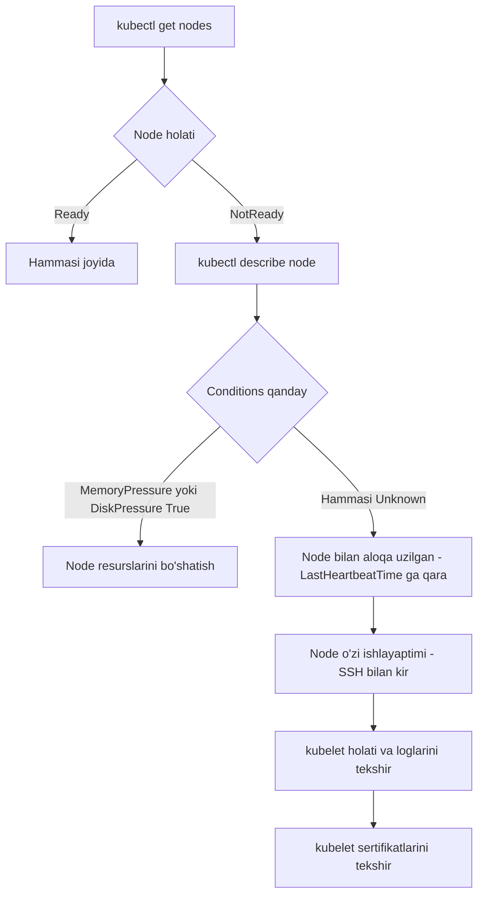

# Dars 307 — Worker Node nosozligini aniqlash (Worker Node Failure)

> 🎯 **Bu darsda nimani o'rganamiz:**
> - Node `NotReady` bo'lganda tekshirish tartibi
> - `kubectl describe node` va node **conditions** (holat bayroqlari) ma'nosi
> - Node resurslari (CPU, xotira, disk) va kubelet holatini tekshirish
> - kubelet loglari va sertifikatlarini tekshirish

## Hayotiy o'xshatish: ishga kelmagan xodim

Worker node — zavoddagi ishchi. Har bir ishchi brigadirga (master'ga) muntazam "men shu yerdaman, sog'lomman" deb xabar (heartbeat) berib turadi. Agar xabar kelmay qolsa, brigadir uni **"noma'lum holatda" (Unknown)** deb belgilaydi: balki kasal, balki yo'lda qolgan, balki telefoni o'chgan. Aniqlash uchun brigadir oxirgi marta qachon xabar kelganini ko'radi va ishchining oldiga odam yuboradi. Kubernetesda ham xuddi shunday: node javob bermasa, `lastHeartbeatTime` ga qarab qachondan beri "jim" ekanini bilamiz va node'ning o'ziga kirib tekshiramiz.

## 1-qadam: Node holatini ko'rish

```bash
kubectl get nodes
```

```
NAME           STATUS     ROLES           AGE   VERSION
controlplane   Ready      control-plane   10d   v1.31.0
node01         NotReady   <none>          10d   v1.31.0
```

Node `Ready` yoki `NotReady`? Agar `NotReady` bo'lsa, batafsil ma'lumot olamiz:

```bash
kubectl describe node node01
```

## 2-qadam: Node conditions (holat bayroqlari)

Har bir node'da bir nechta **condition** bor — ular muammo yo'nalishini ko'rsatib beradi. Har biri `True`, `False` yoki `Unknown` bo'lishi mumkin:

| Condition | `True` bo'lsa nimani bildiradi |
|---|---|
| **OutOfDisk** | Node'da disk joyi tugagan |
| **MemoryPressure** | Node xotirasi (RAM) tugayapti |
| **DiskPressure** | Disk sig'imi kamayib qolgan |
| **PIDPressure** | Node'da jarayonlar (process) soni haddan ko'p |
| **Ready** | Node umuman sog'lom — hammasi joyida |

⚠️ **Muhim:** worker node master bilan aloqani uzsa (masalan, node o'chib qolgan bo'lsa), bu holatlar `Unknown` bo'lib qoladi — bu node "yo'qolgan" bo'lishi mumkinligini bildiradi. Bunday holda `LastHeartbeatTime` maydoniga qarang — node aynan qachon aloqadan chiqqanini ko'rsatadi.



## 3-qadam: Node'ning o'zini tekshirish

Node onlaynmi yoki butunlay o'chib qolganmi? SSH bilan kirib ko'ramiz. O'chgan bo'lsa — qayta yoqamiz. Ishlayotgan bo'lsa, resurslarini tekshiramiz:

```bash
top          # CPU va xotira yuklamasi
df -h        # disk joyi
free -m      # xotira holati
```

## 4-qadam: kubelet holati va loglari

kubelet — node'dagi "brigadir yordamchisi": u ishlamasa, node master bilan gaplasha olmaydi va `NotReady` bo'ladi.

```bash
service kubelet status
# yoki
systemctl status kubelet
```

kubelet loglarini ko'rish:

```bash
sudo journalctl -u kubelet
# oxirgi qatorlarni jonli kuzatish:
sudo journalctl -u kubelet -f
```

Agar kubelet to'xtagan bo'lsa, qayta ishga tushiring:

```bash
systemctl restart kubelet
```

## 5-qadam: kubelet sertifikatlarini tekshirish

kubelet master bilan TLS sertifikat orqali gaplashadi. Sertifikatlarni tekshiring:

```bash
openssl x509 -in /var/lib/kubelet/worker-1.crt -text -noout
```

Natijada uch narsaga e'tibor bering:
- **Muddati o'tmaganmi** — `Validity / Not After` sanasi;
- **To'g'ri guruhda ekanligi** — `Subject` da `O = system:nodes` bo'lishi kerak;
- **To'g'ri CA tomonidan imzolanganmi** — `Issuer` klaster CA'siga mos bo'lishi kerak.

💡 kubelet konfiguratsiyasi odatda `/var/lib/kubelet/config.yaml` faylida, klasterga ulanish ma'lumotlari esa `/etc/kubernetes/kubelet.conf` da bo'ladi — imtihonda bu fayllardagi xatolar (noto'g'ri apiserver porti, xato CA yo'li) tez-tez uchraydi.

## Tekshirish checklist jadvali

| # | Nima tekshiriladi | Buyruq | Nimaga e'tibor berish |
|---|---|---|---|
| 1 | Node holati | `kubectl get nodes` | Ready / NotReady |
| 2 | Node tafsilotlari | `kubectl describe node node01` | Conditions, LastHeartbeatTime |
| 3 | Node onlaynmi | SSH bilan kirish | O'chgan bo'lsa qayta yoqish |
| 4 | Resurslar | `top`, `df -h`, `free -m` | CPU, xotira, disk yetarlimi |
| 5 | kubelet holati | `service kubelet status` | active (running) bo'lishi kerak |
| 6 | kubelet loglari | `sudo journalctl -u kubelet` | Xato xabarlari |
| 7 | Sertifikatlar | `openssl x509 -in ... -text -noout` | Muddati, guruhi, CA |

## 🧪 Mustaqil topshiriqlar

> Yechishdan oldin darsni yopib qo'ying. Taxminiy vaqt: 15 daqiqa.

**1-topshiriq · oson.** Node'lar holatini tekshiring va `NotReady` bo'lganini toping.

<details><summary>O'zingizni tekshiring</summary>

```bash
kubectl get nodes
```
</details>

**2-topshiriq · o'rta.** `NotReady` node'da kubelet holatini ko'ring.

<details><summary>O'zingizni tekshiring</summary>

```bash
sudo systemctl status kubelet
sudo journalctl -u kubelet -n 50 --no-pager
```
</details>

**3-topshiriq · qiyin.** Node `NotReady` bo'lishining uchta eng ko'p sababini ayting.
**Avval ayting.**

<details><summary>O'zingizni tekshiring</summary>

1. **kubelet to'xtagan** — `systemctl start kubelet`.
2. **Disk to'lgan** — `df -h`; kubelet `DiskPressure` e'lon qiladi va
   yangi Pod qabul qilmaydi.
3. **Sertifikat eskirgan yoki noto'g'ri** — `journalctl` da
   `x509: certificate has expired` yoki `unable to load client CA file`.

To'rtinchisi ham uchraydi: **CNI o'rnatilmagan yoki buzilgan**.

```bash
kubectl describe node <nom> | grep -A8 Conditions
```
</details>

## ❓ Savol-Javob

"Savol:" Node conditions hammasi `Unknown` bo'lib qolgan. Bu nimani bildiradi?
"Javob:" Worker node master bilan aloqani uzgan — ehtimol node o'chib qolgan yoki kubelet ishlamayapti. `LastHeartbeatTime` orqali qachon aloqa uzilganini aniqlab, node'ga SSH bilan kirib tekshiring.

"Savol:" Node `NotReady`, lekin node'ning o'zi ishlab turibdi. Birinchi shubha nimada?
"Javob:" kubelet'da. `service kubelet status` bilan holatini, `journalctl -u kubelet` bilan loglarini tekshiring — ko'pincha kubelet to'xtagan yoki konfiguratsiyasida xato bo'ladi.

"Savol:" kubelet sertifikatida qaysi guruh (Organization) bo'lishi kerak?
"Javob:" `system:nodes` guruhi. Shuningdek sertifikat muddati o'tmagan va klasterning to'g'ri CA'si tomonidan imzolangan bo'lishi kerak.

## 📌 CKA imtihon uchun maslahat

Troubleshooting imtihonning eng katta qismi, worker node masalalari esa deyarli har doim chiqadi:
- Klassik ssenariy: node `NotReady` → SSH bilan kiring → `systemctl status kubelet` → kubelet o'chgan bo'lsa `systemctl restart kubelet` — ko'p hollarda masala shu bilan yechiladi.
- Kubelet ishga tushmasa, `journalctl -u kubelet` dagi oxirgi xato qatorlarini o'qing: ko'pincha `/var/lib/kubelet/config.yaml` yoki `/etc/kubernetes/kubelet.conf` da ataylab xato kiritilgan bo'ladi (noto'g'ri CA fayl yo'li, xato apiserver manzili yoki porti).
- O'zgartirishdan keyin `systemctl daemon-reload && systemctl restart kubelet` qilishni unutmang.

## 📖 Asosiy atamalar

| Atama | Oddiy tushuntirish |
|---|---|
| NotReady | Node ish qabul qila olmaydigan holatda ekanini bildiradi |
| Conditions | Node sog'ligi haqidagi bayroqlar to'plami (MemoryPressure, DiskPressure...) |
| Heartbeat | Node'ning master'ga muntazam yuborib turadigan "men tirikman" signali |
| kubelet | Har bir node'da ishlaydigan agent — pod'larni ishga tushiradi va master bilan gaplashadi |
| CA (Certificate Authority) | Sertifikatlarni imzolaydigan ishonchli markaz |

## 🔗 Manbalar

- [Troubleshooting Clusters — kubernetes.io](https://kubernetes.io/docs/tasks/debug/debug-cluster/)
- [Node status va conditions — kubernetes.io](https://kubernetes.io/docs/reference/node/node-status/)
- [Monitor Node Health — kubernetes.io](https://kubernetes.io/docs/tasks/debug/debug-cluster/monitor-node-health/)

---
*Bu dars KodeKloud CKA kursining 307-videosi asosida tayyorlandi.*
