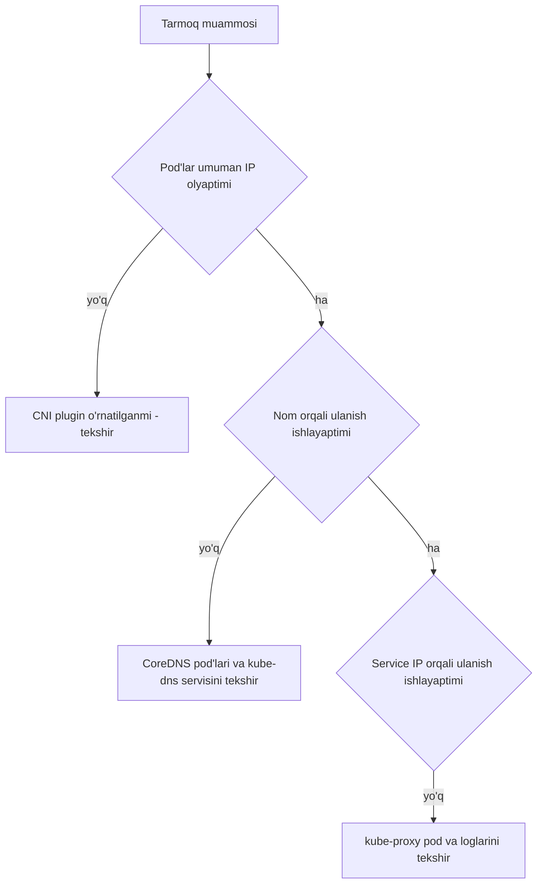

# Dars 311 — Tarmoq muammolarini aniqlash (Network Troubleshooting)

> 🎯 **Bu darsda nimani o'rganamiz:**
> - Kubernetes tarmog'ining 3 asosiy "gumondori": CNI plugin, CoreDNS va kube-proxy
> - CNI pluginlar (Weave, Flannel, Calico) va ularni o'rnatish buyruqlari
> - CoreDNS muammolari: Pending, CrashLoopBackOff va ularni tuzatish yo'llari
> - kube-proxy muammolarini tekshirish qadamlari

## Hayotiy o'xshatish: shahar kommunikatsiyalari

Kubernetes tarmog'ini shahar infratuzilmasiga o'xshatish mumkin:
- **CNI plugin** — shahar **yo'llari**: yo'l bo'lmasa, uylar (pod'lar) orasida umuman qatnov bo'lmaydi;
- **CoreDNS** — **telefon ma'lumotnomasi**: manzilni nomi bo'yicha topib beradi. U ishlamasa, "web-service" degan nom hech kimga hech narsa anglatmaydi;
- **kube-proxy** — **yo'l belgilari va svetoforlar**: trafikni to'g'ri manzilga (haqiqiy pod'larga) yo'naltiradi.

Uchtasidan bittasi buzilsa ham, "tarmoq ishlamayapti" degan shikoyat keladi — vazifamiz qaysi biri aybdor ekanini topish.



## 1. CNI pluginlar (Network Plugin)

Kubernetes o'zi pod tarmog'ini yaratmaydi — buni **CNI plugin** qiladi. Eng mashhurlari:

**Weave Net** — o'rnatish:

```bash
kubectl apply -f https://github.com/weaveworks/weave/releases/download/v2.8.1/weave-daemonset-k8s.yaml
```

**Flannel** — o'rnatish:

```bash
kubectl apply -f https://raw.githubusercontent.com/coreos/flannel/2140ac876ef134e0ed5af15c65e414cf26827915/Documentation/kube-flannel.yml
```

⚠️ Eslatma: Flannel hozircha Kubernetes **NetworkPolicy**'larni qo'llab-quvvatlamaydi.

**Calico** — o'rnatish:

```bash
curl https://raw.githubusercontent.com/projectcalico/calico/v3.25.0/manifests/calico.yaml -O
kubectl apply -f calico.yaml
```

Calico eng ilg'or imkoniyatlarga ega CNI plugin hisoblanadi.

💡 **Bilib qo'ying:** agar CNI konfiguratsiya papkasida (`/etc/cni/net.d/`) bir nechta konfiguratsiya fayli bo'lsa, kubelet **alifbo tartibida birinchi** kelgan faylni ishlatadi.

## 2. DNS muammolari (CoreDNS)

Kubernetes klaster DNS sifatida **CoreDNS**'dan foydalanadi — bu moslashuvchan, kengaytiriladigan DNS server. Katta klasterlarda CoreDNS xotira sarfi asosan pod va servislar soniga, DNS kesh hajmiga va soniyasiga kelayotgan so'rovlar (QPS) soniga bog'liq.

CoreDNS bilan bog'liq Kubernetes resurslari:

| Resurs turi | Nomi |
|---|---|
| ServiceAccount | `coredns` |
| ClusterRole | `coredns`, `kube-dns` |
| ClusterRoleBinding | `coredns`, `kube-dns` |
| Deployment | `coredns` |
| ConfigMap | `coredns` |
| Service | `kube-dns` |

CoreDNS asosiy konfiguratsiyasi **Corefile**'da bo'lib, u ConfigMap sifatida saqlanadi. DNS uchun **53-port** ishlatiladi. Corefile'dagi muhim qism:

```
kubernetes cluster.local in-addr.arpa ip6.arpa {
   pods insecure
   fallthrough in-addr.arpa ip6.arpa
   ttl 30
}
```

Bu — `cluster.local` va teskari (reverse) domenlar uchun Kubernetes backend'i. Klasterdan tashqaridagi domenlar esa to'g'ridan-to'g'ri tegishli DNS serverga uzatiladi:

```
proxy . /etc/resolv.conf
```

### CoreDNS muammolarini tuzatish

**1) CoreDNS pod'lari `Pending` holatda** — birinchi navbatda **CNI plugin o'rnatilganmi**, tekshiring. Tarmoq plugini bo'lmasa, DNS pod'lari joylasha olmaydi.

**2) CoreDNS pod'lari `CrashLoopBackOff` yoki `Error` holatda** — eski Docker versiyasi bilan SELinux ishlatilayotgan node'larda uchraydi. Yechim variantlari:

- Docker'ni yangiroq versiyaga ko'taring;
- SELinux'ni o'chiring;
- Yoki coredns deployment'ida `allowPrivilegeEscalation`'ni `true` qiling:

```bash
kubectl -n kube-system get deployment coredns -o yaml | \
  sed 's/allowPrivilegeEscalation: false/allowPrivilegeEscalation: true/g' | \
  kubectl apply -f -
```

Yana bir sabab — CoreDNS pod **DNS halqa (loop)** aniqlashi: node'dagi `/etc/resolv.conf` DNS so'rovlarni o'z-o'ziga qaytarsa, CoreDNS aylanib qolib yiqiladi. Yechimlar:

- kubelet config'iga haqiqiy resolv.conf yo'lini ko'rsating: `resolvConf: <haqiqiy-resolv-conf-yo'li>`. systemd-resolved ishlatadigan tizimlarda "haqiqiy" fayl odatda `/run/systemd/resolve/resolv.conf` bo'ladi;
- Node'dagi lokal DNS keshni o'chirib, `/etc/resolv.conf` ni asl holiga qaytaring;
- Tezkor (lekin to'liq bo'lmagan) yechim: Corefile'da `forward . /etc/resolv.conf` o'rniga tashqi DNS IP yozing, masalan `forward . 8.8.8.8`. ⚠️ Lekin bu faqat CoreDNS'ni tuzatadi — kubelet baribir noto'g'ri resolv.conf'ni pod'larga uzataveradi.

**3) CoreDNS pod'lari sog'lom, lekin DNS ishlamayapti** — `kube-dns` servisining **endpoint'lari** bor-yo'qligini tekshiring:

```bash
kubectl -n kube-system get ep kube-dns
```

Endpoint bo'sh bo'lsa — servisning selektorlari va portlari to'g'riligini `kubectl describe` bilan tekshiring.

## 3. kube-proxy muammolari

**kube-proxy** — klasterdagi har bir node'da ishlaydigan tarmoq proksisi. U node'larda tarmoq qoidalarini (iptables/ipvs) yuritadi — shu qoidalar tufayli klaster ichidan yoki tashqarisidan pod'larga ulanish mumkin bo'ladi. kube-proxy servislar va ularning endpoint'larini kuzatib turadi; klient servisning virtual IP'siga murojaat qilganda, trafikni haqiqiy pod'larga aynan kube-proxy yo'naltiradi.

kubeadm bilan o'rnatilgan klasterda kube-proxy **DaemonSet** bo'lib ishlaydi (har bir node'da bittadan):

```bash
kubectl describe ds kube-proxy -n kube-system
```

Konteyner ichida kube-proxy quyidagicha ishga tushadi:

```
Command:
  /usr/local/bin/kube-proxy
  --config=/var/lib/kube-proxy/config.conf
  --hostname-override=$(NODE_NAME)
```

Ya'ni konfiguratsiyani `/var/lib/kube-proxy/config.conf` faylidan oladi, hostname sifatida esa pod ishlayotgan node nomi qo'yiladi. Config faylida `clusterCIDR`, kube-proxy rejimi (iptables/ipvs), `bindAddress`, kubeconfig va boshqalar belgilanadi.

### kube-proxy tekshirish qadamlari

1. `kube-system` namespace'da kube-proxy pod ishlayaptimi:

```bash
kubectl get pods -n kube-system | grep kube-proxy
```

2. kube-proxy loglarini tekshiring:

```bash
kubectl logs <kube-proxy-pod> -n kube-system
```

3. ConfigMap to'g'ri belgilanganmi va binary ishlatadigan config fayl to'g'rimi, tekshiring.
4. kubeconfig ConfigMap ichida belgilanganligiga ishonch hosil qiling.
5. kube-proxy konteyner ichida haqiqatan ishlayotganini tekshiring:

```bash
# netstat -plan | grep kube-proxy
tcp        0      0 0.0.0.0:30081           0.0.0.0:*               LISTEN      1/kube-proxy
tcp        0      0 127.0.0.1:10249         0.0.0.0:*               LISTEN      1/kube-proxy
tcp        0      0 172.17.0.12:33706       172.17.0.12:6443        ESTABLISHED 1/kube-proxy
tcp6       0      0 :::10256                :::*                    LISTEN      1/kube-proxy
```

## Tekshirish checklist jadvali

| # | Soha | Buyruq | Nimaga e'tibor berish |
|---|---|---|---|
| 1 | CNI o'rnatilganmi | `ls /etc/cni/net.d/` | Konfiguratsiya fayli bormi |
| 2 | CNI pod'lari | `kubectl get pods -n kube-system` | weave/flannel/calico pod'lari Running'mi |
| 3 | CoreDNS holati | `kubectl get pods -n kube-system` | Pending / CrashLoopBackOff emasligi |
| 4 | CoreDNS config | `kubectl get cm coredns -n kube-system -o yaml` | Corefile'dagi forward manzili |
| 5 | DNS endpoints | `kubectl -n kube-system get ep kube-dns` | Endpoint bo'sh emasmi |
| 6 | kube-proxy pod | `kubectl get pods -n kube-system \| grep kube-proxy` | Har node'da Running'mi |
| 7 | kube-proxy loglari | `kubectl logs <pod> -n kube-system` | Xato xabarlari |
| 8 | kube-proxy jarayoni | `netstat -plan \| grep kube-proxy` | Portlarda tinglayaptimi |

## ❓ Savol-Javob

"Savol:" CoreDNS pod'lari `Pending` holatda qolib ketdi. Birinchi nimani tekshiramiz?
"Javob:" CNI (tarmoq) plugin o'rnatilganmi-yo'qligini. Tarmoq plugini bo'lmasa, CoreDNS pod'lari ishga tusha olmaydi.

"Savol:" CoreDNS `CrashLoopBackOff` bo'lishining "loop" bilan bog'liq sababi nima?
"Javob:" Node'dagi resolv.conf DNS so'rovlarni yana CoreDNS'ning o'ziga qaytarsa, cheksiz halqa hosil bo'ladi. Yechim — kubelet'ga haqiqiy resolv.conf yo'lini ko'rsatish (systemd-resolved'da `/run/systemd/resolve/resolv.conf`) yoki lokal DNS keshni o'chirish.

"Savol:" kube-proxy nima ish qiladi va u qayerda ishlaydi?
"Javob:" Har bir node'da ishlaydi (kubeadm'da DaemonSet sifatida) va tarmoq qoidalarini yuritadi: servisning virtual IP'siga kelgan trafikni haqiqiy pod'larga yo'naltiradi.

"Savol:" DNS ishlamayapti, lekin CoreDNS pod'lari `Running`. Endi nima qilamiz?
"Javob:" `kubectl -n kube-system get ep kube-dns` bilan kube-dns servisining endpoint'larini tekshiramiz. Endpoint yo'q bo'lsa, servis selektorlari va portlarini ko'rib chiqamiz.

## 📌 CKA imtihon uchun maslahat

- Imtihonda **CNI plugin o'rnatish so'ralmaydi**; agar o'rnatish kerak bo'lsa, sizga aniq URL beriladi — uni yodlash shart emas.
- DNS masalasi kelsa, tartib doim bir xil: CoreDNS pod holati → coredns ConfigMap (Corefile) → kube-dns servis endpoint'lari.
- Servis orqali ulanish ishlamasa-yu DNS sog'lom bo'lsa — kube-proxy'ga o'ting: pod holati, loglari, config fayli.
- Troubleshooting imtihonning eng katta qismi — bu buyruqlar ketma-ketligini qo'l avtomatizmiga aylantirib oling.

## 📖 Asosiy atamalar

| Atama | Oddiy tushuntirish |
|---|---|
| CNI (Container Network Interface) | Pod'larga IP berib, ular orasida tarmoq quradigan plugin standarti |
| CoreDNS | Kubernetes klasterining ichki DNS serveri |
| Corefile | CoreDNS konfiguratsiya fayli (ConfigMap sifatida saqlanadi) |
| kube-proxy | Har bir node'da servis trafikini pod'larga yo'naltiruvchi tarmoq proksisi |
| DaemonSet | Har bir node'da aynan bittadan pod ishlashini ta'minlaydigan obyekt |
| resolv.conf | Linux'da DNS server manzillari yozilgan fayl |

## 🔗 Manbalar

- [Debug Services — kubernetes.io](https://kubernetes.io/docs/tasks/debug/debug-application/debug-service/)
- [DNS Troubleshooting — kubernetes.io](https://kubernetes.io/docs/tasks/administer-cluster/dns-debugging-resolution/)
- [Networking addons — kubernetes.io](https://kubernetes.io/docs/concepts/cluster-administration/addons/#networking-and-network-policy)

---
*Bu dars KodeKloud CKA kursining 311-maqolasi asosida tayyorlandi.*
