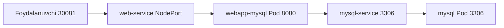

# Lab 303 — Ilova nosozligi: amaliy yechimlar (Application Failure Lab)

> 🎯 **Bu labda nimani o'rganamiz:**
> - 2-qavatli (web + MySQL) ilovadagi 6 xil real nosozlikni topish va tuzatish
> - Service nomi, port, targetPort, selector va NodePort xatolarini aniqlash
> - Deployment va Pod'dagi environment o'zgaruvchilari (DB user, parol) xatolarini tuzatish
> - `kubectl config set-context` bilan default namespace almashtirishni o'rganish

## Umumiy strategiya

Bu labda bitta va bir xil 2-qavatli ilova (web-app + MySQL) 6 ta turli namespace'da (alpha, beta, gamma, delta, epsilon, zeta) joylashtirilgan — har birida qasddan bittadan xato "yashiringan". Strategiyamiz oddiy: avval brauzerdagi xato xabarini o'qiymiz, keyin ilova xaritasi bo'ylab foydalanuvchidan boshlab DB'gacha har bir bo'g'inni (NodePort → Web Service → Web Pod → MySQL Service → MySQL Pod) birma-bir tekshiramiz. Har topilgan xatoni tuzatib, sahifani yangilab, "yashil" (Success) natijani ko'rgunimizcha davom etamiz.



### Tekshirish checklist jadvali

| Bo'g'in | Nimani tekshiramiz | Buyruq |
|---|---|---|
| NodePort | Port to'g'rimi (30081)? | `kubectl get svc` |
| Web Service | Endpoints bormi? | `kubectl describe svc web-service` |
| Web Pod/Deploy | Env: DB host, user, parol | `kubectl describe deploy webapp-mysql` |
| MySQL Service | Nomi, port, targetPort, selector | `kubectl describe svc mysql-service` |
| MySQL Pod | IP, label, env (root parol) | `kubectl describe pod mysql` |

## Qulaylik: default namespace'ni almashtirish

Har bir masala alohida namespace'da. Har buyruqqa `-n alpha` deb yozib o'tirmaslik uchun joriy context'ning default namespace'ini o'zgartirib olamiz:

```bash
kubectl config set-context --current --namespace=alpha
```

Endi `kubectl get pods` desak, avtomatik alpha'dagi pod'lar ko'rinadi. Har yangi masalada shu buyruqni tegishli namespace bilan qaytaramiz.

---

## ### Masala 1 (alpha) — Service nomi noto'g'ri

**Muammo:** ilova sahifasi ochiladi, lekin qizil xato: `Can't connect to MySQL server on 'mysql-service:3306' — Name does not resolve`. Ya'ni web-ilova `mysql-service` degan nomni DNS orqali topa olmayapti.

**Tekshirish:**

```bash
kubectl config set-context --current --namespace=alpha
kubectl get pods              # webapp pod (deployment ichida) va mysql pod — ishlab turibdi
kubectl get deploy            # webapp-mysql deployment
kubectl get svc               # servislarni ko'ramiz

# ilovani terminal orqali ham tekshirish mumkin:
curl http://localhost:30081   # o'sha xato matn ko'rinishida chiqadi

kubectl describe deploy webapp-mysql
# Env: DB_Host=mysql-service, DB_User=root, DB_Password=paswrd
```

**Topilgan sabab:** deployment `mysql-service` nomiga ulanmoqchi, lekin `kubectl get svc` da servis nomi shunchaki **`mysql`** — nomlar mos emas, shuning uchun DNS nomni topa olmayapti.

**Tuzatish:** servis nomini o'zgartirib bo'lmaydi (name — immutable maydon). Shuning uchun eski servisni o'chirib, to'g'ri nom bilan qayta yaratamiz. Qulay yo'l: `kubectl edit svc mysql` da nomni `mysql-service` ga o'zgartiramiz — saqlashga ruxsat bermaydi, lekin o'zgartirilgan nusxani `/tmp/...yaml` vaqtinchalik faylga yozib qo'yadi. O'sha fayldan foydalanamiz:

```bash
kubectl edit svc mysql          # nomni mysql-service ga o'zgartiramiz, saqlaganda rad etiladi,
                                # lekin /tmp/kubectl-edit-xxxx.yaml fayl qoladi
kubectl delete svc mysql
kubectl create -f /tmp/kubectl-edit-xxxx.yaml
```

**Tekshirish:**

```bash
kubectl get svc     # mysql-service 3306 portda paydo bo'ldi
```

Sahifani yangilaymiz — **Success**, yashil sahifa. ✅

---

## ### Masala 2 (beta) — Servisda targetPort noto'g'ri

**Muammo:** xuddi shu ilova beta namespace'da, xato: `Can't connect to MySQL server on 'mysql-service:3306' — Connection refused`. Bu safar nom topilgan (DNS ishlayapti), lekin ulanish rad etilyapti.

**Tekshirish:**

```bash
kubectl config set-context --current --namespace=beta
kubectl get pods,svc                     # hammasi joyida ko'rinadi
kubectl describe deploy webapp-mysql     # DB_Host=mysql-service — to'g'ri
kubectl describe svc mysql-service
```

Natijada:

```
Port:        3306/TCP
TargetPort:  8080/TCP        ← e'tibor bering!
Endpoints:   10.42.0.12:8080
```

Endpoint IP to'g'ri pod'ga tegishlimi, tekshiramiz:

```bash
kubectl get pods -o wide     # mysql pod IP = 10.42.0.12 — mos
```

**Topilgan sabab:** servis endpoint'ni topgan, lekin trafikni pod'ning **8080**-portiga yuboryapti. MySQL esa **3306**-portda tinglaydi. `targetPort: 8080` — xato.

**Tuzatish:**

```bash
kubectl edit svc mysql-service
# targetPort: 8080  →  targetPort: 3306
```

**Tekshirish:**

```bash
kubectl describe svc mysql-service   # Endpoints: 10.42.0.12:3306
```

Sahifa yangilanadi — **Success**. ✅

---

## ### Masala 3 (gamma) — MySQL servis selektori noto'g'ri

**Muammo:** bu safar sahifa umuman ochilmayapti — aylanib turadi va oxiri timeout bo'ladi. Demak, muammo "old tomonda"dek tuyuladi.

**Tekshirish (frontdan boshlab, hammasini birma-bir):**

```bash
kubectl config set-context --current --namespace=gamma
kubectl get pods,svc                    # pod'lar Running, servislar bor

kubectl get svc web-service             # NodePort = 30081 — to'g'ri
kubectl describe svc web-service        # Endpoints: 10.42.0.14:8080 — bor
kubectl get pods -o wide                # webapp pod IP = 10.42.0.14 — mos
kubectl describe deploy webapp-mysql    # image, env — hammasi to'g'ri
kubectl logs <webapp-pod>               # ilova ishga tushgan, 8080 da tinglayapti
```

Front tomonida hech qanday xato yo'q! Shunda ham tekshiruvni oxirigacha davom ettiramiz:

```bash
kubectl describe svc mysql-service
```

Natija:

```
Selector:   name=sql00001
Endpoints:  <none>          ← endpoint yo'q!
```

```bash
kubectl describe pod mysql   # Labels: name=mysql
```

**Topilgan sabab:** `mysql-service` selektori `name=sql00001`, pod labeli esa `name=mysql`. Selector mos kelmagani uchun servis pod'ni "ko'rmaydi" — endpoints bo'sh. Web-ilova DB'ga ulana olmay javob bermay qolgan, shuning uchun butun sahifa ham osilib qolgan.

**Tuzatish:**

```bash
kubectl edit svc mysql-service
# selector:
#   name: sql00001   →   name: mysql
```

**Tekshirish:**

```bash
kubectl describe svc mysql-service   # Endpoints paydo bo'ldi
```

Sahifa — **Success**. ✅

💡 **Muhim saboq:** intuitsiya "muammo frontda" desa ham, aniq dalil topilmasa — xaritadagi **qolgan barcha bo'g'inlarni ham** tekshirib chiqing. Ba'zan orqadagi (DB) nosozlik oldingi qavatni ham "osiltirib" qo'yadi.

---

## ### Masala 4 (delta) — Deployment'da DB foydalanuvchisi noto'g'ri

**Muammo:** xato xabari: `Access denied for user 'sqluser'@'10.42.0.16' (using password: YES)`. Demak, ulanish bor, lekin **login/parol** rad etilyapti.

**Tekshirish:**

```bash
kubectl config set-context --current --namespace=delta
kubectl get pods,svc
kubectl describe deploy webapp-mysql
# Env: DB_Host=mysql-service, DB_User=sqluser, DB_Password=paswrd
```

**Topilgan sabab:** web-ilova DB'ga `sqluser` nomi bilan kirmoqchi, lekin MySQL'da to'g'ri foydalanuvchi — **`root`**.

**Tuzatish:**

```bash
kubectl edit deploy webapp-mysql
# env:
#   DB_User: sqluser   →   DB_User: root
```

Deployment tahrirlanganda yangi pod avtomatik qayta yaratiladi (rollout).

**Tekshirish:**

```bash
kubectl get pods    # yangi webapp pod Running bo'lguncha kutamiz
```

Sahifa yangilanadi — **Success**. ✅

---

## ### Masala 5 (epsilon) — Ham user, ham MySQL root paroli noto'g'ri

**Muammo:** yana `Access denied for user 'sqluser'` xatosi — avvalgi masaladagidek ko'rinadi.

**Tekshirish va 1-tuzatish:**

```bash
kubectl config set-context --current --namespace=epsilon
kubectl edit deploy webapp-mysql
# DB_User: sqluser  →  root
```

Sahifani yangilaymiz — xato **o'zgardi**: endi `Access denied for user 'root'`. Demak, user to'g'ri, lekin **parol** mos emas. Login ma'lumotlari ikki joyda bo'lishi mumkin: ulanuvchi ilovada (deployment — tekshirdik, parol `paswrd`) yoki **DB'ning o'zida**. MySQL pod'ni tekshiramiz:

```bash
kubectl describe pod mysql
# Env: MYSQL_ROOT_PASSWORD=passwooooorrd   ← paswrd emas!
```

**Topilgan sabab:** MySQL pod'da root paroli boshqacha qiymatga o'rnatilgan — web-ilova yuborayotgan `paswrd` bilan mos emas.

**2-tuzatish:** pod'ning env maydonini oddiy `edit` bilan o'zgartirib bo'lmaydi (pod'da bu maydon immutable). `edit` saqlashda rad etadi, lekin o'zgargan nusxa vaqtinchalik faylda qoladi — uni `replace --force` bilan qo'llaymiz:

```bash
kubectl edit pod mysql
# MYSQL_ROOT_PASSWORD: passwooooorrd  →  paswrd  (saqlash rad etiladi)
kubectl replace --force -f /tmp/kubectl-edit-xxxx.yaml
# eski pod o'chirilib, yangisi yaratiladi
```

**Tekshirish:**

```bash
kubectl get pods    # mysql pod qayta Running bo'lguncha kutamiz
```

Sahifa yangilanadi (pod endi ko'tarilayotganda bir lahza `Connection refused` chiqishi mumkin — biroz kutamiz) — **Success**. ✅

⚠️ **Eslatma:** bu labda parollar oddiy env o'zgaruvchi sifatida berilgan. Real hayotda ular ko'pincha **ConfigMap** yoki **Secret** ichida bo'ladi — xato topilmasa, ularga bog'langan ConfigMap/Secret'larni ham tekshiring.

---

## ### Masala 6 (zeta) — NodePort noto'g'ri + user + parol (3 ta xato birdan)

**Muammo:** sahifa umuman ochilmaydi — darhol `Bad Gateway`. Demak, web-servisga yetib ham bora olmayapmiz. Tepadan boshlaymiz.

**Tekshirish va 1-tuzatish (NodePort):**

```bash
kubectl config set-context --current --namespace=zeta
kubectl get svc
# web-service  NodePort  ...  8080:30088/TCP   ← biz 30081 orqali kiryapmiz!
```

**Sabab:** NodePort 30088 qilib qo'yilgan, ilovaga 30081 orqali kirilyapti.

```bash
kubectl edit svc web-service
# nodePort: 30088  →  30081
kubectl get svc    # 30081 bo'lganini tasdiqlaymiz
```

Sahifa endi ochildi, lekin tanish xato: `Access denied for user 'sqluser'`.

**2-tuzatish (DB user):**

```bash
kubectl describe deploy webapp-mysql   # DB_User=sqluser
kubectl edit deploy webapp-mysql       # DB_User → root
```

Yangi pod ko'tarilgach, xato yana o'zgaradi: `Access denied for user 'root'` — demak, endi parol muammosi (5-masaladagi holat).

**3-tuzatish (MySQL root paroli):**

```bash
kubectl describe pod mysql             # MYSQL_ROOT_PASSWORD noto'g'ri qiymatda
kubectl edit pod mysql                 # parolni paswrd ga to'g'rilaymiz (saqlash rad etiladi)
kubectl replace --force -f /tmp/kubectl-edit-xxxx.yaml
```

**Tekshirish:** pod Running bo'lgach, sahifa — **Success**. ✅

---

## 💡 Xulosa

- Har doim **xato xabarini diqqat bilan o'qing** — `Name does not resolve` (DNS/servis nomi), `Connection refused` (port/endpoint), `Access denied` (user/parol) — har biri o'z yo'nalishiga ishora qiladi.
- Ilova xaritasi bo'ylab **tartib bilan** yuring: NodePort → Web Service → Web Pod (env) → DB Service (port, targetPort, selector, endpoints) → DB Pod (label, env).
- Endpoints bo'sh bo'lsa — deyarli har doim **selector va pod label mos emas**.
- Servis nomi va pod'dagi env — **immutable**: `edit` rad etsa, vaqtinchalik fayldan `delete` + `create` yoki `replace --force` ishlating.
- Xatoni tuzatgach xato **o'zgargan** bo'lsa — bu yutuq: bir muammo hal bo'ldi, keyingisiga o'tdingiz.

### Tez-tez uchraydigan xatolar jadvali

| Xato xabari / belgi | Ehtimoliy sabab | Qayerdan qidirish |
|---|---|---|
| `Name does not resolve` | Servis nomi env'dagi DB_Host bilan mos emas | `kubectl get svc` vs deploy env |
| `Connection refused` | targetPort noto'g'ri yoki servis boshqa portda | `kubectl describe svc` (Port/TargetPort/Endpoints) |
| Sahifa osilib/timeout | Orqa qavat (DB) servisida endpoints yo'q | selector vs pod label |
| `Endpoints: <none>` | Selector pod labeliga mos emas | `describe svc` + `describe pod` |
| `Access denied for user 'X'` | DB_User yoki DB_Password noto'g'ri | deploy env va MySQL pod env |
| `Bad Gateway` / ochilmaydi | NodePort raqami noto'g'ri | `kubectl get svc` (nodePort) |

## 🔗 Manbalar

- [Debug Services — kubernetes.io](https://kubernetes.io/docs/tasks/debug/debug-application/debug-service/)
- [Debug Pods — kubernetes.io](https://kubernetes.io/docs/tasks/debug/debug-application/debug-pods/)
- [kubectl config set-context](https://kubernetes.io/docs/reference/kubectl/generated/kubectl_config/kubectl_config_set-context/)

---
*Bu dars KodeKloud CKA kursining 303-videosi asosida tayyorlandi.*
