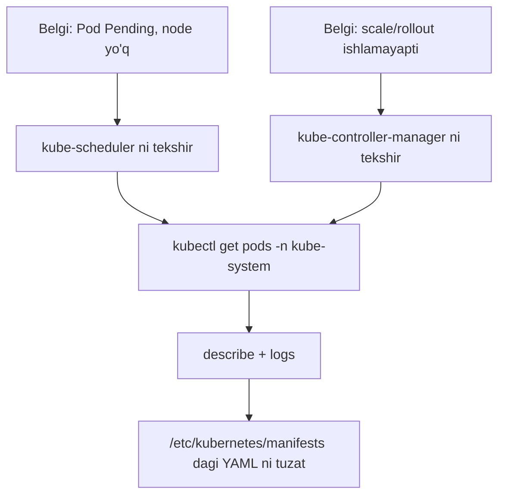

# Lab 306 — Control Plane nosozligi: amaliy yechimlar (Control Plane Failure Lab)

> 🎯 **Bu labda nimani o'rganamiz:**
> - Pending pod'dan kube-scheduler nosozligiga yetib borish
> - Static pod manifestlaridagi (`/etc/kubernetes/manifests/`) xatolarni topish va tuzatish
> - kube-controller-manager'ning kubeconfig yo'li va volume (hostPath) xatolarini aniqlash
> - CrashLoopBackOff holatini `describe` + `logs` bilan tahlil qilish

## Umumiy strategiya

Control plane muammolarida oddiy qoida ishlaydi: **belgi qaysi komponentning vazifasi bo'lsa — o'shani tekshiring.** Pod Pending bo'lib node olmayaptimi — bu scheduler'ning ishi; deployment/replicaset scale bo'lmayaptimi — bu controller-manager'ning ishi. kubeadm klasterida bu komponentlar `kube-system` namespace'dagi **static pod'lar** bo'lgani uchun, ularning manifestlari `/etc/kubernetes/manifests/` papkasida yotadi — xato ko'pincha ana shu YAML fayllarda bo'ladi.



**Boshlashdan oldin foydali maslahat:** vaqt tejash uchun alias va avtoto'ldirishni yoqib oling (kubernetes.io'dagi *kubectl cheat sheet* sahifasidan):

```bash
alias k=kubectl
source <(kubectl completion bash)
complete -o default -F __start_kubectl k   # alias uchun ham avtoto'ldirish
```

---

## Masala 1 — Pod Pending: scheduler manifestida buyruq xato

**Muammo:** klaster "buzilgan" — ilova deploy qilingan, lekin ishlamayapti.

**Tekshirish (zanjir bo'ylab pastdan yuqoriga):**

```bash
kubectl get nodes                 # nodelar Ready — yaxshi
kubectl get deploy                # app deployment: 0/1 ready
kubectl describe deploy app       # 1 desired, 0 available; event: replicaset yaratilgan
kubectl get rs                    # replicaset bor
kubectl describe rs app-xxxxx     # event: pod yaratilgan
kubectl get pods                  # pod bor, lekin STATUS = Pending
kubectl describe pod app-xxxxx    # Events bo'sh, Node: <none>
```

Pod **Pending** va `Node: <none>` — demak, pod hech qanday node'ga biriktirilmagan. Pod'ni node'ga biriktirish — **scheduler'ning** vazifasi. Scheduler holatini ko'ramiz:

```bash
kubectl get pods -n kube-system
# kube-scheduler-controlplane   CrashLoopBackOff
```

Pod nomining oxirida node nomi (`-controlplane`) borligi — bu **static pod** ekanining belgisi. Batafsil:

```bash
kubectl describe pod kube-scheduler-controlplane -n kube-system
```

Events'da: `Failed to start container ... OCI runtime create failed: executable file not found` — konteyner ichida ko'rsatilgan buyruq (binary) topilmayapti. `describe` chiqishidagi `Command:` bo'limiga qarasak — buyruq nomi noto'g'ri yozilgan (masalan, `kube-schedulerrrr` kabi).

**Topilgan sabab:** static pod manifestida — `/etc/kubernetes/manifests/kube-scheduler.yaml` — `command` qatorida ortiqcha belgilar bor, shuning uchun mavjud bo'lmagan binary chaqirilyapti.

**Tuzatish:**

```bash
vi /etc/kubernetes/manifests/kube-scheduler.yaml
# command:
#   - kube-schedulerrrr   →   - kube-scheduler
```

Faylni saqlashimiz bilan kubelet o'zgarishni sezib static pod'ni qayta yaratadi (hech qanday `apply` kerak emas).

**Tekshirish:**

```bash
kubectl get pods -n kube-system --watch   # scheduler: ContainerCreating → Running → Ready
kubectl get pods                          # app pod endi Running
kubectl get deploy                        # app 1/1 Ready
```

---

## Masala 2 — Scale ishlamayapti: controller-manager'da kubeconfig yo'li xato

**Muammo:** avval topshiriq bo'yicha deployment'ni 2 ta replikaga oshiramiz:

```bash
kubectl scale deploy app --replicas=2
```

Lekin pod soni oshmayapti — `kubectl get pods` da hali ham 1 ta pod, deployment esa `1/2` ko'rsatadi.

**Tekshirish:**

```bash
kubectl describe deploy app
# Replicas: 2 desired, 1 available — lekin replicaset scale-up eventi yo'q
```

Deployment'dagi o'zgarishni amalga oshirish (replicaset'ni scale qilish) — **deployment controller** va **replicaset controller**'ning, ya'ni umumiy qilib **kube-controller-manager**'ning vazifasi. Uni tekshiramiz:

```bash
kubectl get pods -n kube-system
# kube-controller-manager-controlplane   CrashLoopBackOff

kubectl describe pod kube-controller-manager-controlplane -n kube-system
# Exit Code: 1, buyruq to'g'ri ko'rinadi — events'da foydali narsa yo'q

kubectl logs kube-controller-manager-controlplane -n kube-system
# ... "no such file or directory" — /etc/kubernetes/controller-manager-XXXX.conf topilmadi
```

Log aytgan fayl haqiqatan bormi?

```bash
ls /etc/kubernetes/
# controller-manager.conf bor — lekin log boshqa (mavjud emas) nomni izlayapti
cat /etc/kubernetes/controller-manager.conf   # bu haqiqiy kubeconfig fayl
grep XXXX /etc/kubernetes/manifests/kube-controller-manager.yaml
# --kubeconfig=/etc/kubernetes/controller-manager-XXXX.conf   ← xato shu yerda
```

**Topilgan sabab:** manifestdagi `--kubeconfig` flagi mavjud bo'lmagan fayl nomiga ko'rsatilgan. To'g'ri fayl — `/etc/kubernetes/controller-manager.conf`.

**Tuzatish:**

```bash
vi /etc/kubernetes/manifests/kube-controller-manager.yaml
# --kubeconfig=/etc/kubernetes/controller-manager-XXXX.conf
#   →  --kubeconfig=/etc/kubernetes/controller-manager.conf
```

**Tekshirish:**

```bash
kubectl get pods -n kube-system --watch   # controller-manager: Pending → Running → Ready
kubectl get pods                          # endi 2 ta app pod
kubectl get deploy                        # 2/2 Ready
```

---

## Masala 3 — Yana scale ishlamayapti: volume'dagi hostPath noto'g'ri

**Muammo:** deployment 3 replikaga scale qilingan, lekin pod'lar 2 ta ligicha qolgan (`kubectl get deploy` → `2/3`).

**Tekshirish:** oldingi masaladan bilamiz — scale ishlamasa, aybdor odatda controller-manager:

```bash
kubectl get pods -n kube-system
# kube-controller-manager-controlplane yana muammoda

kubectl logs kube-controller-manager-controlplane -n kube-system
# "unable to load client CA file /etc/kubernetes/pki/ca.crt: no such file or directory"
```

Host'da bu fayl bormi?

```bash
ls /etc/kubernetes/pki/ca.crt    # host'da fayl BOR!
```

Fayl host'da bor, lekin **konteyner ichida** yo'q. Control plane komponentlari sertifikat fayllarini host'dan **volume (hostPath) orqali mount** qilib oladi. Demak, manifestdagi volume sozlamasini tekshiramiz:

```bash
vi /etc/kubernetes/manifests/kube-controller-manager.yaml
```

`volumeMounts` bo'limida `k8s-certs` nomli mount `/etc/kubernetes/pki` ga to'g'ri ko'rsatilgan. Endi `volumes` bo'limida shu nomli volume'ni topamiz:

```yaml
volumes:
  - hostPath:
      path: /etc/kubernetes/WRONG-PKI-DIRECTORY   # ← xato!
      type: DirectoryOrCreate
    name: k8s-certs
```

**Topilgan sabab:** `k8s-certs` volume'ning host'dagi yo'li noto'g'ri — `/etc/kubernetes/WRONG-PKI-DIRECTORY` o'rniga `/etc/kubernetes/pki` bo'lishi kerak. Shuning uchun konteyner ichiga bo'sh papka mount bo'lib, `ca.crt` "yo'q" bo'lib qolgan.

**Tuzatish:**

```bash
# o'sha faylda:
# path: /etc/kubernetes/WRONG-PKI-DIRECTORY  →  path: /etc/kubernetes/pki
```

**Tekshirish:**

```bash
kubectl get pods -n kube-system --watch   # controller-manager Running/Ready
kubectl get pods                          # 3 ta app pod
kubectl get deploy                        # 3/3 Ready
```

---

## 💡 Xulosa

- **Belgi → mas'ul komponent** qoidasini yodlang: Pending pod (node yo'q) = scheduler; scale/rollout/replika o'zgarishi ishlamaydi = controller-manager; umuman `kubectl` ishlamaydi = apiserver.
- kubeadm klasterida control plane komponentlari — **static pod'lar**: manifestlar `/etc/kubernetes/manifests/` da; faylni to'g'irlab saqlasangiz kubelet o'zi qayta ishga tushiradi.
- Diagnostika tartibi: `kubectl get pods -n kube-system` → `describe` (events, exit code, command) → `logs`. Events'da hech narsa bo'lmasa — **loglar** javob beradi.
- Konteyner "fayl topilmadi" desa-yu, fayl host'da bo'lsa — manifestdagi **volume/hostPath yo'lini** tekshiring.

### Tez-tez uchraydigan xatolar jadvali

| Belgi | Ehtimoliy sabab | Qayerdan qidirish |
|---|---|---|
| Pod Pending, `Node: <none>` | Scheduler ishlamayapti | `kube-scheduler` pod (kube-system) |
| `executable file not found` | Manifestda `command` xato yozilgan | `/etc/kubernetes/manifests/*.yaml` |
| Scale/rollout ta'sir qilmayapti | Controller-manager ishlamayapti | `kube-controller-manager` pod |
| `no such file or directory` (conf) | `--kubeconfig` yo'li noto'g'ri | manifest flaglari |
| CA/sertifikat yuklanmayapti, host'da fayl bor | hostPath volume yo'li noto'g'ri | manifest `volumes:` bo'limi |
| CrashLoopBackOff, events bo'sh | Ishga tushish paytidagi ichki xato | `kubectl logs -n kube-system <pod>` |

## 🔗 Manbalar

- [Troubleshooting Clusters — kubernetes.io](https://kubernetes.io/docs/tasks/debug/debug-cluster/)
- [Static Pods — kubernetes.io](https://kubernetes.io/docs/tasks/configure-pod-container/static-pod/)
- [kubectl Cheat Sheet](https://kubernetes.io/docs/reference/kubectl/quick-reference/)

---
*Bu dars KodeKloud CKA kursining 306-videosi asosida tayyorlandi.*
