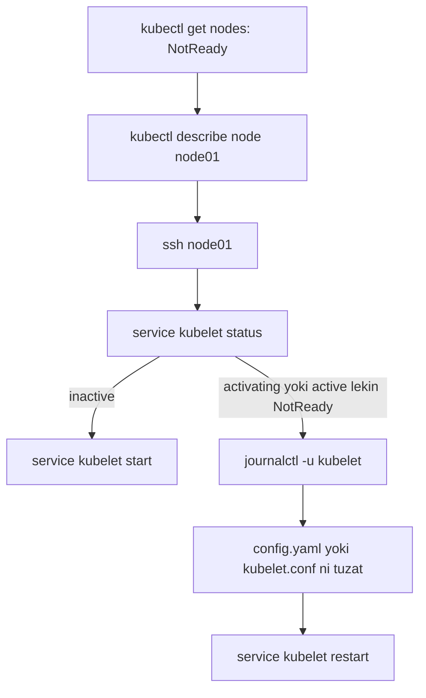

# Lab 309 — Worker node nosozligi: amaliy yechimlar (Worker Node Failure Lab)

> 🎯 **Bu labda nimani o'rganamiz:**
> - `NotReady` node'ni control plane'dan turib va node'ning ichidan tekshirish
> - kubelet servisining holatini ko'rish, ishga tushirish va loglarini o'qish (`journalctl`)
> - kubelet config faylidagi (`/var/lib/kubelet/config.yaml`) noto'g'ri CA yo'lini tuzatish
> - kubelet kubeconfig'idagi (`/etc/kubernetes/kubelet.conf`) noto'g'ri apiserver portini tuzatish

## Umumiy strategiya

Worker node muammosida tartib doim bir xil: avval **control plane'dan** `kubectl get nodes` va `describe node` bilan umumiy manzarani ko'ramiz, keyin **muammoli node'ning ichiga kirib** (`ssh node01`) birinchi navbatda **kubelet** servisini tekshiramiz — chunki kubelet node'ning "kapitani": u ishlamasa, node control plane bilan gaplasha olmaydi va `NotReady` bo'lib qoladi. Kubelet ishlayotgan-u node baribir NotReady bo'lsa — `journalctl -u kubelet` loglari asl sababni aytib beradi.



### Kubelet bilan bog'liq 2 ta muhim fayl

| Fayl | Vazifasi | Nimasi buzilishi mumkin |
|---|---|---|
| `/var/lib/kubelet/config.yaml` | kubelet'ning o'z konfiguratsiyasi (parametrlari) | `clientCAFile` yo'li noto'g'ri |
| `/etc/kubernetes/kubelet.conf` | kubelet'ning apiserverga ulanish kubeconfig'i | server manzili/porti noto'g'ri |

---

## ### Masala 1 — kubelet shunchaki to'xtab qolgan

**Muammo:** klaster buzilgan — `node01` NotReady holatda.

**Tekshirish:**

```bash
kubectl get nodes
# node01   NotReady

kubectl describe node node01     # events'da g'ayrioddiy narsa yo'q

ssh node01
service kubelet status
# Loaded: loaded ...
# Active: inactive (dead)        ← kubelet umuman ishlamayapti
```

**Topilgan sabab:** kubelet servisi shunchaki **to'xtatilgan** (inactive/dead) — hech qanday xato yo'q, faqat ishga tushirilmagan.

**Tuzatish:**

```bash
service kubelet start
# yoki: systemctl start kubelet
service kubelet status           # Active: active (running)
```

**Tekshirish (control plane'ga qaytib):**

```bash
kubectl get nodes
# node01   Ready   ✅
```

---

## ### Masala 2 — config.yaml'da noto'g'ri CA fayl yo'li

**Muammo:** klaster yana buzilgan, `node01` yana NotReady.

**Tekshirish:**

```bash
kubectl describe node node01     # events normal, foydali narsa yo'q

ssh node01
service kubelet status
# Active: activating (auto-restart)
# Main PID: exited, status=255    ← ishga tushmoqchi bo'lyapti-yu, yiqilyapti
```

`status=255` bilan chiqib ketyapti — demak, `service kubelet start` foyda bermaydi: jarayonning o'zida xato bor. Servis loglarini ko'ramiz:

```bash
journalctl -u kubelet
# (oxirgi yozuvlarga o'tish uchun Shift+G, keyin yuqoriga qarab o'qiymiz)
# ... "unable to load client CA file /etc/kubernetes/pki/WRONG-CA-FILE.crt:
#      no such file or directory"
```

Kubelet konfiguratsiyasi qayerda? Ikkita joy bor: `/etc/kubernetes/kubelet.conf` — bu kubeconfig (apiserverga ulanish uchun sertifikat, kontekst) — bu yerda muammo yo'q. Kubelet servisining o'z parametrlari esa `/var/lib/kubelet/config.yaml` faylidan olinadi:

```bash
cat /var/lib/kubelet/config.yaml
# authentication:
#   x509:
#     clientCAFile: /etc/kubernetes/pki/WRONG-CA-FILE.crt   ← xato!

ls /etc/kubernetes/pki/
# ca.crt   ← haqiqiy fayl shu
```

**Topilgan sabab:** `config.yaml` dagi `clientCAFile` mavjud bo'lmagan faylga ko'rsatilgan; to'g'risi — `/etc/kubernetes/pki/ca.crt`.

**Tuzatish:**

```bash
vi /var/lib/kubelet/config.yaml
# clientCAFile: /etc/kubernetes/pki/WRONG-CA-FILE.crt
#   →  clientCAFile: /etc/kubernetes/pki/ca.crt

service kubelet restart
service kubelet status           # Active: active (running)
```

**Tekshirish:**

```bash
# control plane'da:
kubectl get nodes                # node01   Ready   ✅
```

---

## ### Masala 3 — kubelet.conf'da apiserver porti noto'g'ri

**Muammo:** klaster yana buzilgan, `node01` NotReady. Lekin bu safar kubelet **ishlab turibdi**:

```bash
ssh node01
service kubelet status
# Active: active (running)        ← servis tirik, ammo node baribir NotReady
```

**Tekshirish:** servis tirik bo'lsa ham loglarni ko'ramiz:

```bash
journalctl -u kubelet
# (Shift+G bilan oxiriga, keyin orqaga qarab o'qiymiz)
# "Unable to register node ..."
# "dial tcp 10.x.x.x:6553: connect: connection refused"
```

Kubelet control plane'ga `:6553` portga ulanmoqchi bo'lyapti va rad etilyapti. Biz bilamizki, kube-apiserver'ning standart porti — **6443**, 6553 emas. Kubelet apiserver manzilini qayerdan oladi? Kubeconfig faylidan:

```bash
cat /etc/kubernetes/kubelet.conf
# clusters:
# - cluster:
#     server: https://controlplane:6553    ← port xato!
```

**Topilgan sabab:** kubelet'ning kubeconfig faylida apiserver porti 6553 deb yozilgan — to'g'ri port 6443.

**Tuzatish:**

```bash
vi /etc/kubernetes/kubelet.conf
# server: https://controlplane:6553  →  https://controlplane:6443

service kubelet restart
service kubelet status           # active (running)
journalctl -u kubelet            # avvalgi connection refused xatolari yo'qoldi
```

**Tekshirish:**

```bash
# control plane'da:
kubectl get nodes                # node01   Ready   ✅
```

---

## 💡 Xulosa

- Worker node tekshiruvi doim **control plane'dan boshlanadi** (`get nodes`, `describe node`), keyin muammoli node ichiga kirib **birinchi bo'lib kubelet** tekshiriladi.
- kubelet holatlari uch xil "hikoya" aytadi: `inactive/dead` — shunchaki start bering; `activating` + exit code — konfiguratsiyada xato bor, `journalctl -u kubelet` o'qing; `active/running` lekin node NotReady — kubelet apiserverga yeta olmayapti, yana loglarga qarang.
- Ikki faylni adashtirmang: `/var/lib/kubelet/config.yaml` — kubelet'ning **o'z sozlamalari** (CA fayl va h.k.), `/etc/kubernetes/kubelet.conf` — apiserverga **ulanish kubeconfig'i** (server manzili/porti).
- kube-apiserver'ning standart porti — **6443**. Logda boshqa port ko'rsangiz, darrov shubhalaning.

### Tez-tez uchraydigan xatolar jadvali

| Belgi | Ehtimoliy sabab | Tuzatish |
|---|---|---|
| kubelet `inactive (dead)` | Servis to'xtatilgan | `service kubelet start` |
| kubelet `activating`, exit 255 | Konfiguratsiya xatosi | `journalctl -u kubelet` → faylni tuzat |
| `unable to load client CA file` | `config.yaml` dagi `clientCAFile` yo'li xato | `/etc/kubernetes/pki/ca.crt` ga to'g'rila |
| `dial tcp ...: connection refused` | kubeconfig'da apiserver port/manzil xato | `kubelet.conf` da portni 6443 qil |
| kubelet running, node NotReady | Apiserver bilan aloqa yo'q | loglar + `kubelet.conf` ni tekshir |
| Har qanday tuzatishdan keyin | O'zgarish kuchga kirmagan | `service kubelet restart` ni unutmang |

## 🔗 Manbalar

- [Troubleshooting kubeadm / nodes — kubernetes.io](https://kubernetes.io/docs/setup/production-environment/tools/kubeadm/troubleshooting-kubeadm/)
- [Kubelet configuration file — kubernetes.io](https://kubernetes.io/docs/tasks/administer-cluster/kubelet-config-file/)
- [Debugging Kubernetes nodes with crictl](https://kubernetes.io/docs/tasks/debug/debug-cluster/crictl/)

---
*Bu dars KodeKloud CKA kursining 309-videosi asosida tayyorlandi.*
