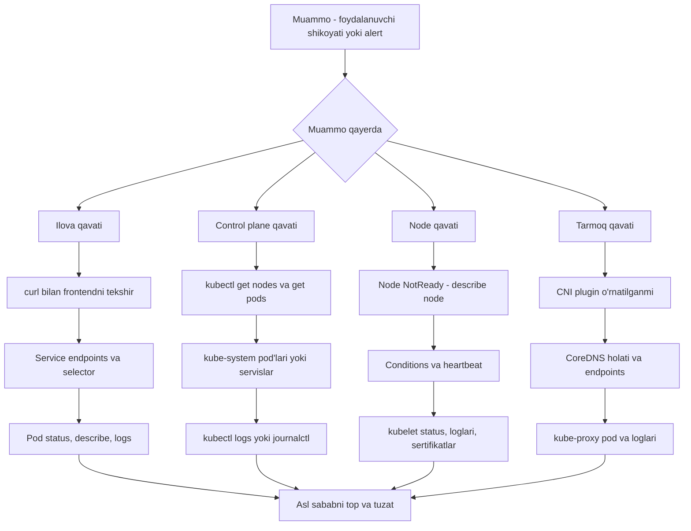

# 🔧 14-bo'lim — Troubleshooting (Muammolarni topish va tuzatish)

Ushbu bo'limda Kubernetes klasteridagi muammolarni topish va tuzatish usullarini o'rganamiz. Kurs davomida har bir mavzu ichida u yoki bu darajada troubleshooting bilan shug'ullangan edik — bu bo'limda esa barcha texnikalarni bir tizimga solamiz: avval **ilova nosozliklari**, keyin **control plane nosozliklari**, so'ng **worker node nosozliklari** va nihoyat **tarmoq bilan bog'liq muammolar**. Bo'lim amaliy laboratoriyalarga boy: sizga ataylab "buzilgan" klaster beriladi va muammoni topib tuzatishingiz so'raladi. Omad!

## Muammoni izlashning umumiy strategiyasi

Qaysi turdagi muammo bo'lmasin, yondashuv bir xil: belgidan sababga qarab, qavat-baqavat pastga tushamiz.

## 📚 Bo'lim darslari

| # | Dars | Tavsif |
|---|---|---|
| 301 | [Ilova nosozligi](301_Application_failure.md) | 2-qavatli ilova misolida frontdan orqaga tekshirish: curl, Service selector/port, Pod status va loglar |
| 303 | [Lab: Ilova nosozligi](Lab_303_Application_failure.md) | Buzilgan ilovalarni topib tuzatish bo'yicha amaliy mashqlar yechimi |
| 304 | [Control Plane nosozligi](304_Control_plane_failure.md) | kube-apiserver, controller-manager, scheduler holati va loglarini tekshirish (kubectl logs, journalctl) |
| 306 | [Lab: Control Plane](Lab_306_Control_plane.md) | Buzilgan control plane komponentlarini tuzatish bo'yicha amaliy mashqlar yechimi |
| 307 | [Worker Node nosozligi](307_Worker_node_failure.md) | NotReady node'lar: conditions, kubelet holati/loglari va sertifikatlarni tekshirish |
| 309 | [Lab: Worker Node](Lab_309_Worker_node.md) | NotReady node'larni tiklash bo'yicha amaliy mashqlar yechimi |
| 311 | [Tarmoq muammolari](311_Network_troubleshooting.md) | CNI pluginlar, CoreDNS (Pending, CrashLoopBackOff, loop) va kube-proxy muammolari |

## 📌 CKA imtihon uchun eslatma

Troubleshooting — CKA imtihonining **eng katta og'irlikdagi bo'limi** (taxminan 30%). Bu bo'limdagi tekshirish ketma-ketliklarini (Service → Pod → loglar; node → kubelet → sertifikatlar; CNI → CoreDNS → kube-proxy) qo'l avtomatizmiga aylantirib olsangiz, imtihonning katta qismini ishonch bilan yechasiz.

---
*Bu bo'lim KodeKloud CKA kursining 14-bo'limi (300-311 videolar) asosida tayyorlandi.*
