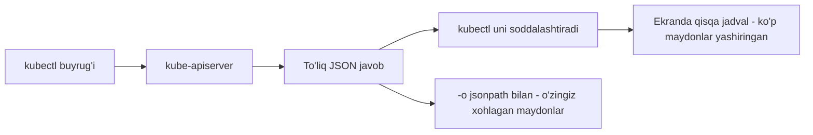

# Dars 315 — kubectl bilan JSON Path (JSONPath)

> 🎯 **Bu darsda nimani o'rganamiz:**
> - Nega umuman JSONPath kerak: minglab obyekt orasidan kerakli ma'lumotni "hisobot" ko'rinishida chiqarish
> - `kubectl -o jsonpath` bilan ishlashning 4 qadamli usuli
> - `range` bilan sikllar, `\n` va `\t` formatlash belgilari
> - `-o custom-columns` va `--sort-by` — tayyor, qulay alternativlar

## ⚠️ Tayyorgarlik (314-maqoladan)

Bu darsga kirishdan oldin JSONPath so'rovlarining o'zini bilishingiz kerak — bu **majburiy tayyorgarlik**. Agar JSONPath bilan hech ishlamagan bo'lsangiz, kurs muallifi 314-maqolada bepul kirish darslari va mashqlarga havola beradi:

- JSONPath kirish kursi va testlari: <https://kodekloud.com/p/json-path-quiz>
- Kubernetes obyektlari ustida JSONPath mashqlari:
  - <https://mmumshad.github.io/json-path-quiz/index.html#!/?questions=questionskub1>
  - <https://mmumshad.github.io/json-path-quiz/index.html#!/?questions=questionskub2>

Avval oddiy JSON hujjatlarda, keyin Kubernetes ma'lumotlari ustida mashq qiling — shundan so'ng bu darsdagi `kubectl` bilan ishlash oson tuyuladi.

## Hayotiy o'xshatish: ombor va hisobot

Tasavvur qiling, siz katta omborning hisobchisisiz. Omborda minglab quti bor, har qutining ichida yuzlab yozuvli pasport varag'i yotadi. Direktor sizdan: "Menga faqat quti nomi va ichidagi mahsulot soni ikki ustunli jadval bo'lib kelsin" deydi. Har qutini ochib, qo'lda ko'chirib chiqish — azob. **JSONPath — ana shu "kerakli katakchalarni avtomatik sug'urib olib, jadval qilib beradigan" so'rov tili.** `kubectl` ombor xodimi bo'lsa, JSONPath — sizning hisobot shabloningiz.

## Nega JSONPath kerak?

Ishlab chiqarish (production) muhitida yuzlab node va minglab obyekt (Deployment, Pod, ReplicaSet, Service, Secret...) bilan ishlaysiz. Ko'pincha shunday talablar chiqadi:

- resurslarning faqat **ma'lum maydonlarini** ko'rish;
- turli mezonlar bo'yicha **filtrlangan** ma'lumot olish;
- masalan: node'lar va ularning CPU sonlari jadvali, node'lardagi taint'lar ro'yxati, pod'lar va ular ishlatayotgan image'lar ro'yxati.

Oddiy `kubectl get` bunday "hisobot"ni bera olmaydi. Gap shundaki, `kubectl` har bir buyruqda **kube-apiserver** bilan gaplashadi, apiserver esa javobni **JSON formatida** qaytaradi. `kubectl` shu JSON'ni odam o'qishi qulay jadvalga aylantiradi — va bu jarayonda **juda ko'p ma'lumot yashiriladi**.



`-o wide` biroz ko'proq ustun beradi, lekin baribir to'liq emas: node resurs sig'imi, taint'lar, condition'lar, arxitektura, image'lar ko'rinmaydi. `kubectl describe` hammasini ko'rsatadi-yu, lekin jadval emas. Ana shunday joyda JSONPath yordamga keladi: **buyruq chiqishini xohlagancha filtrlaysiz va formatlaysiz.**

## 4 qadamli usul

JSONPath'ni `kubectl` bilan ishlatish uchun doim shu 4 qadamni bajaring:

| Qadam | Nima qilinadi | Misol |
|---|---|---|
| 1 | Kerakli ma'lumotni beradigan **buyruqni aniqlang** | node'lar kerakmi → `kubectl get nodes`; pod'lar kerakmi → `kubectl get pods` |
| 2 | Chiqishni **JSON formatida ko'ring** | `kubectl get pods -o json` |
| 3 | JSON tuzilmasini o'rganib, **JSONPath so'rovini tuzing** | image uchun: `.items[0].spec.containers[0].image` |
| 4 | So'rovni **shu buyruqqa qo'shing** | `kubectl get pods -o=jsonpath='{.items[0].spec.containers[0].image}'` |

```bash
# 2-qadam: to'liq JSON chiqish
kubectl get pods -o json

# 4-qadam: so'rovni jsonpath opsiyasiga beramiz
kubectl get pods -o=jsonpath='{.items[0].spec.containers[0].image}'
```

💡 **Muhim qoidalar:**
- So'rov **bitta qo'shtirnoq** (`'...'`) va **jingalak qavslar** (`{...}`) ichiga olinadi.
- `$` — JSON hujjatning **ildizi** (root). `kubectl`da uni yozish shart emas — `{.items[0]...}` deb boshlasangiz ham bo'ladi, `kubectl` ildizni o'zi tushunadi.
- `kubectl get` ro'yxat qaytaradi, shuning uchun obyektlar doim `.items[...]` massivi ichida bo'ladi: `.items[0]` — birinchi obyekt, `.items[*]` — hammasi.

💡 Yangi boshlovchi bo'lsangiz, muallif tavsiyasi: avval `-o json` chiqishini <https://jsonpath.com> kabi JSONPath baholovchi (evaluator) saytga ko'chiring, u yerda so'rovni "o'ynab" topib oling, keyin tayyor so'rovni `kubectl` buyrug'iga o'tkazing.

## Foydali misollar

```bash
# Klasterdagi node nomlari
kubectl get nodes -o=jsonpath='{.items[*].metadata.name}'
# master node01

# Node'larning hardware arxitekturasi
kubectl get nodes -o=jsonpath='{.items[*].status.nodeInfo.architecture}'
# amd64 amd64

# Node'lardagi CPU soni
kubectl get nodes -o=jsonpath='{.items[*].status.capacity.cpu}'
# 4 4
```

Ikkita so'rovni **bitta buyruqda** birlashtirish ham mumkin — ular ketma-ket yoziladi:

```bash
kubectl get nodes -o=jsonpath='{.items[*].metadata.name}{.items[*].status.capacity.cpu}'
# master node01 4 4
```

Ishladi, lekin chiroyli emas. Formatlash belgilari yordam beradi: `{"\n"}` — yangi qator, `{"\t"}` — tab (bo'shliq):

```bash
kubectl get nodes -o=jsonpath='{.items[*].metadata.name}{"\n"}{.items[*].status.capacity.cpu}'
# master  node01
# 4       4
```

## Sikllar — `range`

Yuqoridagi natija baribir biz xohlagandek emas: biz "har qatorda bitta node nomi + uning CPU soni" ko'rinishini xohlaymiz — ya'ni ro'yxatdagi **har bir element ustidan aylanib chiqish** kerak. Buning uchun `range` kalit so'zi ishlatiladi ("for each" sikli kabi):

```
{range .items[*]}     ← har bir element (node) uchun...
  {.metadata.name}    ← nomini chiqar
  {"\t"}              ← tab qo'y
  {.status.capacity.cpu}  ← CPU sonini chiqar
  {"\n"}              ← yangi qatorga o'ized
{end}                 ← siklni yakunla
```

Hammasini bir qatorga yig'ib, buyruqqa beramiz:

```bash
kubectl get nodes -o=jsonpath='{range .items[*]}{.metadata.name}{"\t"}{.status.capacity.cpu}{"\n"}{end}'
# master    4
# node01    4
```

⚠️ Muallifning eslatmasi: `range` biroz murakkabroq mavzu — imtihon (sertifikatsiya) nuqtai nazaridan asosiy kerakli narsalar bungacha yoritilgan, shuning uchun darrov tushunmasangiz xavotir olmang.

## Custom Columns — osonroq yo'l

Xuddi shu natijani ko'pincha `range`siz, osonroq olish mumkin — `-o custom-columns` opsiyasi bilan. U `USTUN_NOMI:jsonpath` juftliklarini vergul bilan qabul qiladi:

```bash
kubectl get nodes -o=custom-columns=NODE:.metadata.name,CPU:.status.capacity.cpu
# NODE      CPU
# master    4
# node01    4
```

⚠️ **Diqqat:** custom-columns'da so'rovdan `.items[*]` qismi **olib tashlanadi** — bu opsiya so'rov ro'yxatdagi har bir elementga tegishli deb o'zi hisoblaydi. Qo'shimcha ustun kerak bo'lsa, vergul bilan yana `NOM:so'rov` juftligini qo'shasiz. Bu yerda ham tavsiya: avval har ustun uchun JSONPath so'rovni alohida topib oling, keyin buyruqqa birlashtiring.

## Saralash — `--sort-by`

JSONPath'dan saralashda ham foydalansa bo'ladi. `kubectl`ning `--sort-by` opsiyasiga JSON maydon so'rovini berasiz — chiqish shu maydon qiymati bo'yicha tartiblanadi (bu yerda ham `.items[*]` yozilmaydi):

```bash
# Nom bo'yicha saralash
kubectl get nodes --sort-by=.metadata.name

# CPU soni bo'yicha saralash
kubectl get nodes --sort-by=.status.capacity.cpu
```

## Uch usul taqqoslamasi

| Usul | Nima uchun qulay | Kamchiligi |
|---|---|---|
| `-o jsonpath` + `range` | To'liq erkin format, istalgan kombinatsiya | Sintaksisi murakkabroq |
| `-o custom-columns` | Tayyor jadval, ustun sarlavhalari bilan, sodda | Faqat ustunli jadval formati |
| `--sort-by` | Bir opsiya bilan saralash | Faqat tartibni o'zgartiradi, maydon tanlamaydi |

## 🧪 Mustaqil topshiriqlar

> Yechishdan oldin darsni yopib qo'ying. Taxminiy vaqt: 15 daqiqa.

**1-topshiriq · oson.** JSONPath bilan barcha Pod nomlarini chiqaring.

<details><summary>O'zingizni tekshiring</summary>

```bash
kubectl get pods -o jsonpath='{.items[*].metadata.name}{"\n"}'
```
</details>

**2-topshiriq · o'rta.** Node nomi va IP manzilini jadval ko'rinishida chiqaring.

<details><summary>O'zingizni tekshiring</summary>

```bash
kubectl get nodes -o custom-columns=NOM:.metadata.name,IP:.status.addresses[0].address
```
</details>

**3-topshiriq · qiyin.** Faqat `Running` bo'lmagan Pod'larni toping. **Avval ayting:** JSONPath
filtri qanday yoziladi?

<details><summary>O'zingizni tekshiring</summary>

```bash
# JSONPath filtri
kubectl get pods -A -o jsonpath=\
  '{range .items[?(@.status.phase!="Running")]}{.metadata.name}{"\t"}{.status.phase}{"\n"}{end}'

# Ko'pincha oddiyroq yo'l bor:
kubectl get pods -A --field-selector=status.phase!=Running
```

`?()` — filtr ifodasi, `@` esa joriy elementni bildiradi.
`range` va `end` esa ro'yxat bo'ylab aylanish uchun.
</details>

## ❓ Savol-Javob

"Savol:" Nega `kubectl get nodes` chiqishida CPU soni, taint'lar, arxitektura ko'rinmaydi — apiserver ularni yubormayaptimi?
"Javob:" Yuboradi. apiserver javobni to'liq JSON'da qaytaradi, lekin `kubectl` uni odam o'qishi oson bo'lsin deb soddalashtiradi va ko'p maydonlarni yashiradi. `-o json` bilan to'liq javobni, `-o jsonpath` bilan esa aynan kerakli maydonlarni ko'rasiz.

"Savol:" JSONPath so'rovini `kubectl`da qanday o'rab yozish kerak?
"Javob:" Bitta qo'shtirnoq va jingalak qavs ichida: `-o=jsonpath='{.items[0].spec.containers[0].image}'`. `$` ildiz belgisini yozish shart emas — kubectl uni o'zi qo'shadi.

"Savol:" `custom-columns` va oddiy `jsonpath` so'rovlarining asosiy sintaksis farqi nimada?
"Javob:" `jsonpath`da ro'yxat bo'ylab `.items[*]` (yoki `range .items[*]`) yozasiz; `custom-columns` va `--sort-by`da esa `.items` yozilmaydi — so'rov avtomatik har bir elementga qo'llanadi (masalan `NODE:.metadata.name`).

"Savol:" Har qatorda "node nomi + CPU soni" chiqarishning ikki yo'li?
"Javob:" 1) `range` sikli: `'{range .items[*]}{.metadata.name}{"\t"}{.status.capacity.cpu}{"\n"}{end}'`; 2) osonrog'i — `-o=custom-columns=NODE:.metadata.name,CPU:.status.capacity.cpu`.

## 📌 CKA imtihon uchun maslahat

- Imtihonda "pod'lar ro'yxatini image nomi bilan chiqar", "node'larni CPU bo'yicha sarala" kabi topshiriqlar uchraydi — `-o jsonpath`, `-o custom-columns` va `--sort-by` uchalasini ham qo'lda mashq qilib oling.
- Ish tartibini yodda tuting: avval `-o json` bilan tuzilmani ko'ring, keyin so'rov tuzing — taxmin qilib yozmang.
- `range` chuqur bilish imtihon uchun majburiy emas, lekin `custom-columns` ko'p vaqt tejaydi.
- Bu darsdan keyingi practice testlarda JSONPath bo'yicha maxsus mashqlar bor — ularni albatta ishlang.

## 📖 Asosiy atamalar

| Atama | Oddiy tushuntirish |
|---|---|
| JSON | Ma'lumotlarni kalit-qiymat ko'rinishida saqlash formati; apiserver shu tilda "gaplashadi" |
| JSONPath | JSON hujjat ichidan kerakli maydonlarni sug'urib oladigan so'rov tili |
| `$` (root) | JSON hujjatning ildizi; kubectl'da yozish ixtiyoriy |
| `.items[*]` | `kubectl get` qaytargan ro'yxatdagi barcha elementlar; `[0]` — birinchisi |
| `range` / `end` | JSONPath'da sikl: ro'yxatdagi har bir element uchun shablonni takrorlaydi |
| custom-columns | `kubectl`ning ustun nomi + JSONPath juftliklaridan jadval yasovchi opsiyasi |
| `--sort-by` | Chiqishni ko'rsatilgan JSON maydoni bo'yicha saralovchi opsiya |

## 🔗 Manbalar

- [JSONPath Support — kubernetes.io](https://kubernetes.io/docs/reference/kubectl/jsonpath/)
- [kubectl Quick Reference (formatlash va saralash) — kubernetes.io](https://kubernetes.io/docs/reference/kubectl/quick-reference/)
- [JSONPath mashq testlari — KodeKloud](https://kodekloud.com/p/json-path-quiz)
- [JSONPath baholovchi (evaluator)](https://jsonpath.com)

---
*Bu dars KodeKloud CKA kursining 315-videosi (va 314-maqolasi) asosida tayyorlandi.*
