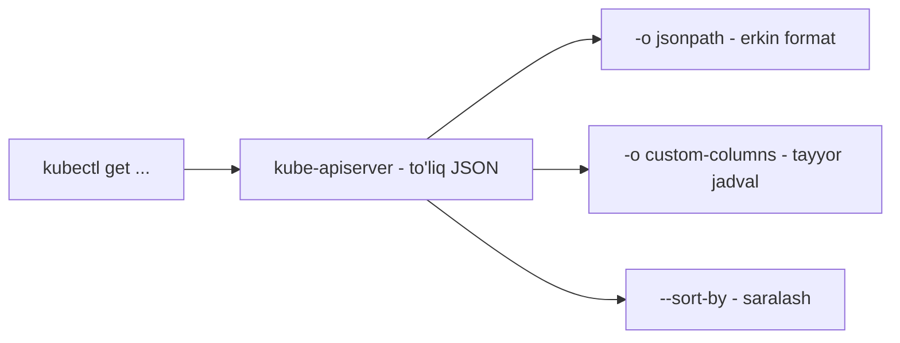

# 🧰 15-bo'lim — Boshqa mavzular (Other Topics)

Ushbu qisqa bo'lim CKA kursining "aralash" mavzulariga bag'ishlangan. Asosiy qahramon — **JSONPath**: `kubectl` chiqishini xohlagancha filtrlash va hisobot ko'rinishida formatlash tili. Katta klasterlarda (yuzlab node, minglab obyekt) aynan shu ko'nikma sizni qo'lda qidirishdan qutqaradi va imtihonda vaqt tejaydi.

## 📚 Bo'lim darslari

| # | Dars | Tavsif |
|---|---|---|
| 314 | Tayyorgarlik — JSON PATH (maqola) | JSONPath'ga kirish kurslari va mashq testlariga havolalar; 315-dars ichida yoritilgan |
| 315 | [kubectl bilan JSON Path](315_JSONPath_kubectl.md) | `-o jsonpath`, 4 qadamli usul, `range` sikllari, `custom-columns` va `--sort-by` |

## 💡 Lab havolalari haqida

Bu bo'limning o'ziga xosligi — nazariyadan ko'ra **amaliyot** muhim. 314-maqolada berilgan bepul JSONPath lab/mashqlarini albatta ishlang:

- JSONPath kirish testlari: <https://kodekloud.com/p/json-path-quiz>
- Kubernetes obyektlari ustida JSONPath mashqlari: [1-to'plam](https://mmumshad.github.io/json-path-quiz/index.html#!/?questions=questionskub1) · [2-to'plam](https://mmumshad.github.io/json-path-quiz/index.html#!/?questions=questionskub2)

Videodan keyin esa kursning o'z practice testlarida JSONPath'ni `kubectl` bilan qo'llash bo'yicha mashqlar bor.

## 📌 CKA imtihon uchun eslatma

Imtihonda "pod'larni image'lari bilan chiqar", "node'larni CPU bo'yicha sarala" turidagi topshiriqlar tez-tez uchraydi — `-o jsonpath`, `-o custom-columns`, `--sort-by` uchligini qo'l avtomatizmiga aylantiring.

---
*Bu bo'lim KodeKloud CKA kursining 15-bo'limi (314-315 materiallar) asosida tayyorlandi.*
