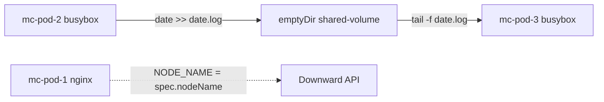
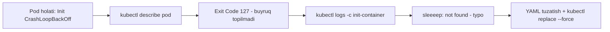

# Mock Exam 1 — Yechimlar (320-video)

> 🎯 **Bu darsda nimani o'rganamiz:**
> - Mock Exam 1 dagi barcha 12 ta savolning to'liq yechimi
> - Imperativ buyruqlar bilan vaqtni tejash usullari
> - Multi-container pod, HPA, VPA, Gateway API va Helm bo'yicha amaliy ko'nikmalar
> - Har savolda tez-tez uchraydigan xatolardan qanday qochish

## 🎯 Imtihon haqida qisqacha

Mock Exam — bu haqiqiy CKA imtihoniga tayyorgarlik uchun mashq imtihoni. Uni oddiy o'xshatish bilan tushuntirsak: haydovchilik guvohnomasi olishdan oldin avtodromda mashq qilganingizga o'xshaydi — yo'l qoidalari o'sha-o'sha, lekin xatoning narxi arzon. Kurs muallifi (KodeKloud) 319-darsda shunday ogohlantiradi:

- Bu imtihon **haqiqiy CKA imtihonining nusxasi emas** — savollar, interfeys, baholash tizimi va qiyinlik darajasi farq qilishi mumkin.
- Maqsad — savolni **o'qib to'g'ri tushunish**, o'z ishingizni **o'zingiz tekshirish** va berilgan **vaqt ichida ulgurish** ko'nikmalarini shakllantirish.
- Mock testlar hozircha beta/eksperimental bosqichda, muammo bo'lsa Q&A bo'limiga yozing.
- Mock test havolasi: https://uklabs.kodekloud.com/topic/mock-exam-1-4/

**Umumiy maslahatlar (yechim videosidan olingan):**

1. **Rasmiy hujjatlardan qo'rqmang.** Instruktor o'zi ham haqiqiy imtihonda kubernetes.io hujjatlaridan foydalanganini aytadi — tayyor YAML namunani ko'chirib, kerakli joylarini o'zgartirish noldan yozishdan ancha tez.
2. **Imperativ buyruqlarni o'rganing.** `kubectl run`, `kubectl create deployment`, `kubectl expose` — oddiy obyektlar uchun YAML yozishdan bir necha barobar tez.
3. **`--dry-run=client -o yaml` — eng yaxshi do'stingiz.** Buyruq bilan skelet YAML yaratib, faylga yozing, keyin faqat kerakli maydonlarni qo'shing.
4. **Har savoldan keyin natijani tekshiring:** `kubectl get ...`, `kubectl describe ...`, `kubectl logs ...` — imtihonda ball faqat ishlayotgan yechim uchun beriladi.

---

### 1-savol: Multi-container pod (mc-pod)

**Masala:** `mc-namespace` namespace ichida `mc-pod` nomli, uchta konteynerli pod yarating: birinchisi `nginx:1-alpine` bo'lib `NODE_NAME` muhit o'zgaruvchisida pod tushgan node nomini saqlasin; ikkinchisi `busybox:1` bo'lib har sekundda `date` natijasini `/var/log/shared/date.log` faylga yozsin; uchinchisi `busybox:1` bo'lib o'sha faylni stdout ga chiqarsin. Konteynerlar orasida **doimiy bo'lmagan (non-persistent)** umumiy volume ishlatilsin.

**Yechim.** Avval skelet YAML tayyorlab olamiz:

```bash
kubectl run mc-pod --image=nginx:1-alpine --dry-run=client -o yaml > question1.yaml
```

Keyin faylni ochib, uchta konteyner, `emptyDir` volume va mountlarni qo'shamiz:

```yaml
apiVersion: v1
kind: Pod
metadata:
  name: mc-pod
  namespace: mc-namespace
spec:
  containers:
  - name: mc-pod-1
    image: nginx:1-alpine
    env:
    - name: NODE_NAME
      valueFrom:
        fieldRef:
          fieldPath: spec.nodeName
  - name: mc-pod-2
    image: busybox:1
    command: ["sh", "-c", "while true; do date >> /var/log/shared/date.log; sleep 1; done"]
    volumeMounts:
    - name: shared-volume
      mountPath: /var/log/shared
  - name: mc-pod-3
    image: busybox:1
    command: ["sh", "-c", "tail -f /var/log/shared/date.log"]
    volumeMounts:
    - name: shared-volume
      mountPath: /var/log/shared
  volumes:
  - name: shared-volume
    emptyDir: {}
```

```bash
kubectl apply -f question1.yaml
```

Tekshiramiz — uchinchi konteyner loglarida sanalar oqib turishi kerak:

```bash
kubectl logs mc-pod -n mc-namespace -c mc-pod-3 -f
```

**Tushuntirish.** Bitta pod ichidagi konteynerlar bitta xonadagi odamlarga o'xshaydi — tarmoqni bo'lishadi, lekin fayl tizimi har birida alohida. Ikkinchi konteyner yozgan faylni uchinchisi ko'rishi uchun umumiy "javon" — volume kerak. Savoldagi "non-persistent" kalit so'zi `emptyDir` ga ishora: u pod yashab turgan davrda mavjud, pod o'chsa — ma'lumot ham yo'qoladi. Node nomini dinamik olish uchun esa Downward API ishlatiladi: `valueFrom.fieldRef.fieldPath: spec.nodeName`.



⚠️ **Tez-tez qilinadigan xato:** `volumeMounts` so'zini xato yozish (videoda ham instruktor typo qilib, apply paytida xatoga uchradi). Volume faqat e'lon qilinib, konteynerlarga mount qilinmasa — fayl umumiy bo'lmaydi va uchinchi konteyner `date.log` ni topa olmaydi.

---

### 2-savol: node01 da cri-docker o'rnatish

**Masala:** `node01` ga SSH orqali kirib (bob foydalanuvchisi, parol berilgan), `/root` katalogidagi `cri-docker` .deb paketini o'rnating; `cri-docker` xizmati ishga tushgan (running) va tizim yuklanganda avtomatik ishga tushadigan (enabled) bo'lsin.

**Yechim:**

```bash
ssh bob@node01          # parol so'raladi
sudo su                 # /root ga kirish uchun root bo'lamiz
cd /root
ls                      # cri-docker .deb paketini ko'ramiz

dpkg -i ./cri-dockerd_*.deb        # paketni o'rnatamiz

systemctl start cri-docker         # xizmatni ishga tushiramiz
systemctl status cri-docker        # "active (running)" bo'lishi kerak
systemctl enable cri-docker        # boot da avtomatik ishga tushsin
systemctl is-enabled cri-docker    # "enabled" chiqishi kerak
```

**Tushuntirish.** Bu savol Kubernetes emas, Linux administratorlik ko'nikmasini tekshiradi — CKA imtihonida bunday "tizim darajasidagi" topshiriqlar ham uchraydi. `.deb` paket `dpkg -i` bilan o'rnatiladi, xizmat holati esa `systemctl` bilan boshqariladi. `start` — hozir ishga tushiradi, `enable` — keyingi qayta yuklashlarda ham avtomatik ishga tushishini ta'minlaydi. Ikkalasi ham kerak!

⚠️ **Tez-tez qilinadigan xato:** faqat `systemctl start` qilib, `enable` ni unutish. "Running" va "enabled" — ikki alohida talab. Yana biri: bob foydalanuvchisi bilan `/root` ga kirishga urinish — `Permission denied` olasiz, avval `sudo su` qiling.

---

### 3-savol: VPA ga tegishli CRD larni topish

**Masala:** Control plane node da Vertical Pod Autoscaler ga tegishli barcha CRD (Custom Resource Definition) larni aniqlab, nomlarini `/root/vpa-crds.txt` fayliga yozing.

**Yechim:**

```bash
kubectl get crd | grep -i vertical
```

Natijada ikkita CRD chiqadi (masalan):

```
verticalpodautoscalercheckpoints.autoscaling.k8s.io
verticalpodautoscalers.autoscaling.k8s.io
```

Shu nomlarni faylga yozamiz:

```bash
vi /root/vpa-crds.txt
# faqat CRD nomlarini joylashtiramiz (CREATED AT ustunisiz), saqlaymiz
```

**Tushuntirish.** VPA Kubernetes ning "tug'ma" resursi emas — u klasterga CRD sifatida qo'shiladi. Barcha CRD larni `kubectl get crd` bilan ko'rish mumkin, VPA ga tegishlilari nomida "verticalpodautoscaler" so'zi bor, shuning uchun oddiy `grep` yetarli.

⚠️ **Tez-tez qilinadigan xato:** faylga `kubectl get crd` chiqishini to'liq (sarlavha va CREATED AT ustuni bilan) saqlab qo'yish. Savol faqat **nomlarni** so'ragan — ortiqcha ma'lumotni olib tashlang.

---

### 4-savol: messaging-service (ClusterIP)

**Masala:** Mavjud `messaging` podini klaster ichida 6379-portda ochib beradigan `messaging-service` nomli service yarating.

**Yechim:**

```bash
kubectl get pod                     # messaging pod borligini tekshiramiz

kubectl expose pod messaging --port=6379 --name=messaging-service
```

Tekshiramiz:

```bash
kubectl get service
kubectl get pod -o wide                      # pod IP sini ko'ramiz
kubectl describe service messaging-service   # Endpoints da pod IP turishi kerak
```

**Tushuntirish.** "Klaster ichida" (within the cluster) iborasi — bu ClusterIP turiga ishora. ClusterIP service turlarining standart (default) qiymati, shuning uchun `--type` ni umuman ko'rsatmasak ham bo'ladi. `kubectl expose pod` buyrug'i pod labellaridan selector ni avtomatik oladi — YAML yozishga hojat yo'q. `describe` natijasida `Endpoints` qatorida pod IP si (masalan `172.17.0.9:6379`) ko'rinsa — service podga to'g'ri ulangan.

⚠️ **Tez-tez qilinadigan xato:** "tashqaridan kirish so'ralmagan" savolga NodePort yaratib qo'yish. Savol shartidagi kalit so'zlarga e'tibor bering: *within the cluster* = ClusterIP, *on the nodes* = NodePort.

---

### 5-savol: hr-web-app deployment

**Masala:** `kodekloud/webapp-color` image dan foydalanib, 2 replikali `hr-web-app` nomli deployment yarating.

**Yechim:**

```bash
kubectl create deployment hr-web-app --image=kodekloud/webapp-color --replicas=2
```

Tekshiramiz:

```bash
kubectl get deployment hr-web-app    # READY 2/2 bo'lishi kerak
```

**Tushuntirish.** Bu imtihondagi eng oson savollardan biri — bitta imperativ buyruq bilan hal bo'ladi. Hujjatlardan deployment YAML namunasini ko'chirish ham mumkin, lekin bunday sodda konfiguratsiya uchun bu ortiqcha vaqt sarfi. Imtihonda oson savollarni shunday tez yopib, qiyinlariga vaqt qoldiring.

---

### 6-savol: orange podini tuzatish (init container)

**Masala:** `orange` nomli yangi ilova deploy qilingan, lekin ishlamayapti. Muammoni toping va tuzating.

**Yechim.** Avval holatni ko'ramiz:

```bash
kubectl get pod
# orange   0/1   Init:CrashLoopBackOff   ...
```

`Init:CrashLoopBackOff` — muammo init konteynerda. Chuqurroq qaraymiz:

```bash
kubectl describe pod orange
# Init Containers -> State: Terminated, Reason: Error, Exit Code: 127
# Command: sh -c sleeeep 2

kubectl logs orange -c init-myservice
# sh: sleeeep: not found
```

Sabab topildi — `sleep` buyrug'i `sleeeep` deb xato yozilgan. Pod alohida (deployment/replicaset ga tegishli emas), shuning uchun YAML ini olib, tuzatib, qayta yaratamiz:

```bash
kubectl get pod orange -o yaml > question6.yaml
vi question6.yaml          # sleeeep -> sleep ga tuzatamiz
kubectl replace -f question6.yaml --force
```

Tekshiramiz:

```bash
kubectl get pod
# orange   Init:0/1 -> Running
```

**Tushuntirish.** Init container — asosiy konteyner ishga tushishidan oldin bajarilishi **shart** bo'lgan tayyorgarlik bosqichi. U xato bilan tugasa, kubelet uni qayta-qayta ishga tushiraveradi (CrashLoopBackOff), asosiy konteyner esa hech qachon boshlanmaydi. Exit code 127 = "buyruq topilmadi" — bu deyarli har doim typo yoki yo'q dastur belgisi. `kubectl replace --force` — eski podni o'chirish + yangisini yaratishni bitta buyruqda bajaradigan tezkor usul.



⚠️ **Tez-tez qilinadigan xato:** ishga tushayotgan pod YAML ini to'g'ridan-to'g'ri `kubectl apply` bilan yangilashga urinish — pod spec dagi command maydonini "jonli" o'zgartirib bo'lmaydi, shuning uchun `replace --force` kerak. Tuzatishdan oldin pod biror deployment ga tegishli emasligini tekshiring — aks holda deployment ni tuzatish kerak bo'ladi, podni emas.

---

### 7-savol: hr-web-app-service (NodePort)

**Masala:** Oldingi savolda yaratilgan `hr-web-app` deploymentini `hr-web-app-service` nomli service orqali klaster nodelarining 30082-portida oching. Ilova 8080-portda eshitadi.

**Yechim.** `kubectl expose` da nodePort ni bevosita berib bo'lmaydi, shuning uchun avval YAML yaratamiz:

```bash
kubectl expose deployment hr-web-app --type=NodePort --port=8080 \
  --name=hr-web-app-service --dry-run=client -o yaml > question7.yaml
```

Faylni ochib, `nodePort` ni qo'shamiz:

```yaml
apiVersion: v1
kind: Service
metadata:
  name: hr-web-app-service
spec:
  type: NodePort
  selector:
    app: hr-web-app
  ports:
  - port: 8080
    targetPort: 8080
    nodePort: 30082
```

```bash
kubectl apply -f question7.yaml
kubectl describe service hr-web-app-service
# Endpoints da 2 ta pod IP ko'rinishi kerak (replikalar 2 ta bo'lgani uchun)
```

**Tushuntirish.** "Nodelarning portida ochish" (accessible on the nodes) = NodePort. Bu yerda uch xil port bor: `port` (service porti, 8080), `targetPort` (konteyner porti, 8080) va `nodePort` (har bir node da ochiladigan tashqi port, 30082). `kubectl expose` buyrug'ida `--node-port` bayrog'i yo'qligi uchun `--dry-run=client -o yaml` bilan skelet olib, `nodePort: 30082` ni qo'lda qo'shish — eng tezkor yo'l.

⚠️ **Tez-tez qilinadigan xato:** nodePort ni ko'rsatmay apply qilish — Kubernetes tasodifiy port (30000-32767) tanlaydi va savol talabi bajarilmaydi. Ball yo'qotasiz!

---

### 8-savol: pv-analytics (PersistentVolume)

**Masala:** Quyidagi talablar bilan PersistentVolume yarating: nomi `pv-analytics`, hajmi 100Mi, access mode `ReadWriteMany`, turi `hostPath`, yo'li `/pv/data-analytics`.

**Yechim.** Hujjatlardan PV namunasini ko'chirib, `question8.yaml` faylida moslashtiramiz:

```yaml
apiVersion: v1
kind: PersistentVolume
metadata:
  name: pv-analytics
spec:
  capacity:
    storage: 100Mi
  accessModes:
    - ReadWriteMany
  hostPath:
    path: /pv/data-analytics
```

```bash
kubectl apply -f question8.yaml
kubectl get pv
# pv-analytics   100Mi   RWX   ...   Available
```

**Tushuntirish.** Hujjatdagi namuna odatda `nfs`, `storageClassName`, `persistentVolumeReclaimPolicy`, `mountOptions` kabi qo'shimcha maydonlar bilan keladi — savolda so'ralmagan hamma narsani **o'chirib tashlang** va `nfs` o'rniga `hostPath` yozing. PV holati `Available` bo'lsa — u yaratildi va claim (PVC) kutmoqda; bu savol uchun shu yetarli.

⚠️ **Tez-tez qilinadigan xato:** namunadan qolgan `storageClassName` ni o'chirmasdan qoldirish yoki `100Mi` o'rniga `100M` yozish (Mi — mebibayt, M — megabayt; savol aynan mebibayt so'ragan bo'lsa Mi yozing).

---

### 9-savol: webapp-hpa (Horizontal Pod Autoscaler)

**Masala:** `/root/webapp-hpa.yaml` faylidan foydalanib, default namespace dagi `kkapp-deploy` deploymenti uchun `webapp-hpa` nomli HPA yarating. HPA barcha podlar bo'ylab o'rtacha CPU sarfini 50% da ushlab tursin va scale down uchun 300 soniyalik stabilization window bilan "ehtiyotkor" kichraytirish sozlansin.

**Yechim.** Tayyor faylni ochib (`vi /root/webapp-hpa.yaml`), `metrics` va `behavior` bo'limlarini qo'shamiz:

```yaml
apiVersion: autoscaling/v2
kind: HorizontalPodAutoscaler
metadata:
  name: webapp-hpa
  namespace: default
spec:
  scaleTargetRef:
    apiVersion: apps/v1
    kind: Deployment
    name: kkapp-deploy
  minReplicas: 1
  maxReplicas: 2
  metrics:
  - type: Resource
    resource:
      name: cpu
      target:
        type: Utilization
        averageUtilization: 50
  behavior:
    scaleDown:
      stabilizationWindowSeconds: 300
```

```bash
kubectl apply -f /root/webapp-hpa.yaml
kubectl get hpa
# webapp-hpa   Deployment/kkapp-deploy   .../50%   1   2   ...
```

**Tushuntirish.** HPA ni termostatga o'xshatish mumkin: CPU "harorati" 50% dan oshsa — replika qo'shadi, pastga tushsa — kamaytiradi. `stabilizationWindowSeconds: 300` esa "shoshilmaslik" qoidasi: HPA scale down qilishdan oldin oxirgi 5 daqiqadagi eng yuqori tavsiyani hisobga oladi — bu yuklama bir sekund tushib, keyin qaytib ko'tarilganda podlar keraksiz o'chib-yonishining (flapping) oldini oladi. Stabilization sintaksisini yoddan bilmasangiz — hujjatlarda "stabilization window" deb qidiring, tayyor namuna bor.

⚠️ **Tez-tez qilinadigan xato:** hujjatdan `behavior` blokini ko'chirganda YAML indentatsiyasi buzilishi (videoda ham shunday bo'ldi). Apply dan oldin har doim chekinishlarni ko'zdan kechiring — `behavior` `spec` ostida, `scaleDown` `behavior` ostida turishi kerak.

---

### 10-savol: analytics-vpa (Vertical Pod Autoscaler)

**Masala:** Default namespace dagi `analytics-deployment` deploymenti uchun `analytics-vpa` nomli VPA yarating. VPA podlarning CPU/xotira requestlarini avtomatik moslashtirsin — **Auto** rejimida ishlab, kerak bo'lganda podlarni evict qilib, yangilangan requestlar bilan qayta yaratsin.

**Yechim:**

```yaml
apiVersion: autoscaling.k8s.io/v1
kind: VerticalPodAutoscaler
metadata:
  name: analytics-vpa
  namespace: default
spec:
  targetRef:
    apiVersion: apps/v1
    kind: Deployment
    name: analytics-deployment
  updatePolicy:
    updateMode: "Auto"
```

```bash
kubectl apply -f question10.yaml
kubectl get vpa
```

**Tushuntirish.** HPA podlar **sonini** o'zgartirsa, VPA har bir podning **"kuchini"** (CPU/xotira requestlarini) o'zgartiradi — go'yo xodimlar sonini ko'paytirish o'rniga har bir xodimga kuchliroq kompyuter berish. E'tibor bering: `apiVersion` bu yerda `autoscaling.k8s.io/v1` — chunki VPA CRD orqali o'rnatilgan (3-savolda aynan shu CRD larni topgan edik!). `updateMode: "Auto"` — VPA podlarni o'zi evict qilib, yangi requestlar bilan qayta yaratishiga ruxsat beradi.

⚠️ **Tez-tez qilinadigan xato:** VPA ga HPA ning `apiVersion` ini (`autoscaling/v2`) yozib yuborish — apply xato beradi. VPA — alohida CRD, uning apiVersion i `autoscaling.k8s.io/v1`.

---

### 11-savol: web-gateway (Gateway API)

**Masala:** `nginx-gateway` namespace da `web-gateway` nomli Gateway resursi yarating: gatewayClassName `nginx`, listener nomi `http`, protokol HTTP, port 80.

**Yechim.** Hujjatlardan Gateway namunasini olib moslashtiramiz:

```yaml
apiVersion: gateway.networking.k8s.io/v1
kind: Gateway
metadata:
  name: web-gateway
  namespace: nginx-gateway
spec:
  gatewayClassName: nginx
  listeners:
  - name: http
    protocol: HTTP
    port: 80
```

```bash
kubectl apply -f question11.yaml
kubectl get gateway -n nginx-gateway
```

**Tushuntirish.** Gateway API — Ingress ning zamonaviy vorisi va yangi CKA dasturidagi muhim mavzu. GatewayClass — "qaysi kontroller ishlaydi" (bu yerda nginx), Gateway — "qaysi port va protokolda eshitamiz" degan savolga javob beradi. Hujjatdagi namunada deyarli hamma narsa tayyor — faqat nom, namespace va gatewayClassName ni almashtirish kifoya. Bu imtihondagi eng tez savollardan biri.

⚠️ **Tez-tez qilinadigan xato:** `namespace: nginx-gateway` ni yozishni unutish — Gateway default namespace ga tushib qoladi va tekshiruvda topilmaydi.

---

### 12-savol: Helm chartni yangilash (kk-mock1)

**Masala:** Hamkasbingiz `kk-ns` namespace ga `kk-mock1` nomli nginx helm chartini o'rnatgan. Chartga yangilanish chiqqan — helm repository ni yangilab, chartni `18.1.15` versiyasiga ko'taring.

**Yechim.** Qadam-baqadam:

```bash
# 1. Mavjud releaselarni ko'ramiz (namespace ni unutmang!)
helm list -n kk-ns
# NAME       NAMESPACE   CHART          ...
# kk-mock1   kk-ns       nginx-18.1.0

# 2. Repolar ro'yxati
helm repo list
# kk-mock1   https://...

# 3. Repositoryni yangilaymiz — yangi versiyalar tortib olinadi
helm repo update

# 4. Kerakli versiya bor-yo'qligini tekshiramiz
helm search repo nginx --versions | grep 18.1.15

# 5. Yangilaymiz
helm upgrade kk-mock1 kk-mock1/nginx --version=18.1.15 -n kk-ns

# 6. Tekshiramiz
helm list -n kk-ns
# CHART: nginx-18.1.15
```

**Tushuntirish.** Helm repo — telefondagi ilovalar do'koniga o'xshaydi: `helm repo update` — do'kon katalogini yangilash, `helm search repo ... --versions` — ilovaning barcha versiyalarini ko'rish, `helm upgrade` — o'rnatilgan ilovani tanlangan versiyaga ko'tarish. Buyruq tuzilishi: `helm upgrade <release-nomi> <repo>/<chart> --version=<versiya> -n <namespace>`.

⚠️ **Tez-tez qilinadigan xato:** `helm list` ni namespace siz ishlatib "release yo'q ekan" deb o'ylash (videoda ham avval bo'sh ro'yxat chiqdi) — Helm faqat joriy namespace ni ko'rsatadi, har doim `-n kk-ns` qo'shing. Yana biri: `helm repo update` qilmasdan to'g'ridan-to'g'ri upgrade ga urinish — eski katalogda yangi versiya bo'lmaydi.

---

## 💡 Umumiy xulosa va vaqtni boshqarish

Mock Exam 1 asosan **imperativ buyruqlar + hujjatlardan tez foydalanish** ko'nikmasini sinaydi. 12 savolning taxminan yarmi 1-2 daqiqada bitta buyruq bilan yechiladi — ana shu tejaladigan vaqtni multi-container pod (1-savol) va HPA (9-savol) kabi YAML talab qiladigan savollarga sarflang.

| Savol | Mavzu | Usul | Taxminiy vaqt |
|-------|-------|------|----------------|
| 1 | Multi-container pod + emptyDir | YAML (skelet: `kubectl run --dry-run`) | 8-10 daqiqa |
| 2 | cri-docker o'rnatish | Linux: `dpkg`, `systemctl` | 3-4 daqiqa |
| 3 | VPA CRD larini topish | `kubectl get crd \| grep` | 2 daqiqa |
| 4 | ClusterIP service | Imperativ: `kubectl expose pod` | 2 daqiqa |
| 5 | Deployment yaratish | Imperativ: `kubectl create deployment` | 1-2 daqiqa |
| 6 | Init container debug | `describe` + `logs` + `replace --force` | 5-7 daqiqa |
| 7 | NodePort service | `expose --dry-run` + nodePort qo'shish | 4-5 daqiqa |
| 8 | PersistentVolume | YAML (hujjatdan namuna) | 3-4 daqiqa |
| 9 | HPA + stabilization window | Tayyor YAML ni to'ldirish | 5-7 daqiqa |
| 10 | VPA yaratish | YAML | 4-5 daqiqa |
| 11 | Gateway API | YAML (hujjatdan namuna) | 3 daqiqa |
| 12 | Helm upgrade | `helm repo update` + `helm upgrade` | 4-5 daqiqa |

**Yodda tuting:**

- Oson savollarni birinchi yeching, qiyinlarini belgilab qo'yib keyin qayting.
- Har yechimdan so'ng 15-20 soniya tekshiruvga ajrating (`get`, `describe`, `logs`) — bu ballni kafolatlaydi.
- Savol shartidagi kalit so'zlar yechimni aytib turadi: *within the cluster* → ClusterIP, *on the nodes* → NodePort, *non-persistent* → emptyDir, *cautiously scale down* → stabilization window.
- Hujjatlardan namunani ko'chirganda so'ralmagan maydonlarni o'chirishni va indentatsiyani tekshirishni unutmang.

## 🔗 Manbalar

- [Kubernetes hujjatlari — Multi-container pods va emptyDir](https://kubernetes.io/docs/concepts/storage/volumes/#emptydir)
- [Downward API — muhit o'zgaruvchilari](https://kubernetes.io/docs/tasks/inject-data-application/environment-variable-expose-pod-information/)
- [Horizontal Pod Autoscaling](https://kubernetes.io/docs/tasks/run-application/horizontal-pod-autoscale/)
- [Gateway API](https://gateway-api.sigs.k8s.io/)
- [Helm hujjatlari — helm upgrade](https://helm.sh/docs/helm/helm_upgrade/)
- [Mock Exam 1 laboratoriyasi (KodeKloud)](https://uklabs.kodekloud.com/topic/mock-exam-1-4/)

---
*Bu dars KodeKloud CKA kursining 319-320-videolari asosida tayyorlandi.*
