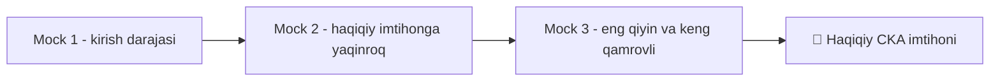

# 📝 17-bo'lim — Mock imtihonlar

Uchta to'liq mock (sinov) imtihon yechimi — har biri haqiqiy CKA imtihoniga o'xshash savollar va vaqt bosimi bilan. Bular kursning eng qimmatli qismlaridan biri: nazariyani amaliyotga aylantirish imkoni.

> ⚠️ **Eslatma:** Bu mock imtihonlar haqiqiy CKA imtihonining aynan nusxasi emas — savollar, interfeys, baholash tizimi va qiyinlik darajasi farq qilishi mumkin. Ammo vaqtni boshqarish, savolni tez o'qib tushunish va o'z ishingizni tekshirish ko'nikmalarini mashq qilish uchun juda foydali.

## 📚 Darslar

| # | Fayl | Mavzu |
|---|---|---|
| 320 | [Mock_1_yechimlar.md](Mock_1_yechimlar.md) | 1-mock imtihon — to'liq yechimlar |
| 322 | [Mock_2_yechimlar.md](Mock_2_yechimlar.md) | 2-mock imtihon — to'liq yechimlar |
| 324 | [Mock_3_yechimlar.md](Mock_3_yechimlar.md) | 3-mock imtihon — to'liq yechimlar |

## 💡 Imtihonga tayyorgarlik bo'yicha maslahatlar

Har bir mock imtihonni avval **o'zingiz mustaqil**, vaqtni belgilab (masalan, 2 soat) yechishga harakat qiling — yechimlar faylini oldindan ochmang. Faqat shundan keyin natijangizni ushbu fayllardagi yechimlar bilan solishtiring. Xato qilgan joylaringizni alohida yozib boring va o'sha mavzu bo'yicha tegishli bo'limga (masalan, Networking yoki Troubleshooting) qaytib, qayta mustahkamlang.

Amaliy muhitda mashq qilish uchun [killer.sh](https://killer.sh) (rasmiy CKA imtihoni bilan birga beriladigan simulyatsiya muhiti) va [KodeKloud mock test muhiti](https://uklabs.kodekloud.com/topic/mock-exam-1-4/) tavsiya etiladi.

## 🔗 Umumiy manbalar

- [killer.sh — CKA/CKAD simulyatori](https://killer.sh)
- [CNCF — CKA sertifikati](https://www.cncf.io/training/certification/cka/)
- [Kubernetes rasmiy hujjatlari](https://kubernetes.io/docs/home/)
- [kubectl cheat sheet](https://kubernetes.io/docs/reference/kubectl/cheatsheet/)

---
*Bu bo'lim KodeKloud CKA kursining 17-Mock Exams bo'limi asosida o'zbek tilida tayyorlandi.*
