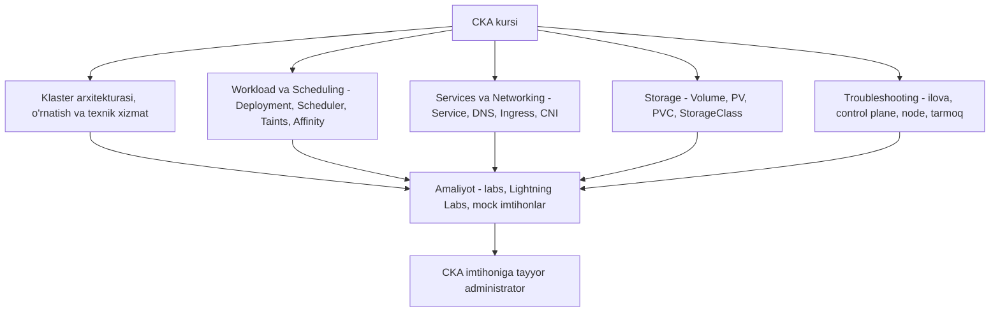

# Dars 327 — Kurs xulosasi (Bonus Lecture — Conclusion)

> 🎯 **Bu darsda nimani o'rganamiz:**
> - Kurs davomida bosib o'tilgan yo'lning sarhisobi
> - Imtihon oldidan qo'shimcha amaliyot manbalari (Ultimate CKA Mock Exam seriyasi)
> - CKA'dan keyingi sertifikatlar: CKS va KCNA

## Hayotiy o'xshatish: marafon marrasi

CKA kursi — uzoq marafon edi. Siz start chizig'ida "Pod nima?" deb boshlagan bo'lsangiz, endi marraga klaster quradigan, buzilganini tuzata oladigan administrator bo'lib yetib keldingiz. Marradan keyin sportchi nima qiladi? Natijasini mustahkamlaydi va keyingi musobaqaga (imtihonga!) tayyorgarlikni boshlaydi. Bu dars — ana shu marradagi qisqa "sovrin topshirish marosimi".

## Nimalarni o'rganib chiqdik?

Bu ajoyib o'quv safari yakuniga yetdi. Kurs davomida siz CKA imtihonining barcha bilim sohalarini bosib o'tdingiz:

Muallifning tilaklari sodda va samimiy: imtihonga tayyorgarlikda omad, mehnat va intilish — muvaffaqiyat kaliti. Sertifikatni qo'lga kiritganingizda esa jamoa bilan quvonchni baham ko'rish uchun ijtimoiy tarmoqlarda ulashishingiz va kurs jamoasini belgilashingiz (tag qilishingiz) so'raladi.

## Qo'shimcha amaliyot: Ultimate CKA Mock Exam seriyasi

Imtihondan oldin **ko'proq amaliyot** xohlasangiz, KodeKloud'da yaqinda chiqarilgan **Ultimate CKA Mock Exam** seriyasi tavsiya qilinadi:

- haqiqiy imtihon muhitiga juda yaqin qilib qurilgan: **bir nechta klaster** va imtihon uslubidagi savollar;
- kursning ichidagi mock imtihonlarga ajoyib qo'shimcha;
- katta lab infratuzilmasi talab qilgani uchun faqat KodeKloud saytida, **pullik obuna** bilan ochiladi.

## Keyingi sertifikatlar va kurslar

| Yo'nalish | Nima beradi |
|---|---|
| **CKS** (Certified Kubernetes Security Specialist) | CKA'dan keyingi tabiiy qadam — Kubernetes xavfsizligi; KodeKloud'dagi kurs barcha mavzular, hands-on lab va mock imtihonlar bilan |
| **KCNA** (Kubernetes and Cloud Native Associate) | Boshlang'ich darajadagi sertifikat uchun tayyorlov kursi |
| Linux learning path | Mutlaq boshlovchidan sertifikatlangan Linux mutaxassisigacha, amaliy uslubda |
| Cloud learning paths | Mashhur cloud platformalar asoslari, sertifikatlar va servislarga chuqur kirish |

Bulardan tashqari KodeKloud'da Udemy'da yo'q 40+ kurs bor, yil davomida yana 50+ kurs (Linux, DevOps, cloud) rejalashtirilgan. **KodeKloud Pro** rejasida uchala cloud platforma uchun **cloud playground**lar va 50+ DevOps playground ham qo'shiladi — muhitni tozalashni unutib, cloud'da ortiqcha pul to'lash tashvishi yo'q, buni platforma o'zi hal qiladi.

💡 KodeKloud obunasini sotib olayotganda **UDEMY10** kupon kodi qo'shimcha maxsus chegirma beradi.

## ❓ Savol-Javob

"Savol:" Kursni tugatdim — imtihondan oldin yana qanday amaliyot qilsam bo'ladi?
"Javob:" Kursning ichidagi mock imtihonlarni qayta ishlang, qo'shimcha sifatida KodeKloud'dagi Ultimate CKA Mock Exam seriyasini oling — u bir nechta klasterli, haqiqiy imtihonga o'xshash muhit beradi.

"Savol:" CKA'dan keyin qaysi sertifikatga o'tish mantiqiy?
"Javob:" Xavfsizlik yo'nalishida chuqurlashmoqchi bo'lsangiz — **CKS** (uni topshirish uchun amaldagi CKA talab qilinadi). Endi boshlayotgan hamkasblarga esa boshlang'ich **KCNA** mos.

"Savol:" Ultimate Mock Exam seriyasi nega Udemy'da emas?
"Javob:" U bir nechta klasterdan iborat katta lab infratuzilmasini talab qiladi, shuning uchun faqat KodeKloud platformasida (pullik obuna bilan) taqdim etiladi.

## 📌 CKA imtihon uchun maslahat

Kursni tugatish — yarim yo'l. Imtihon oldidan mock imtihonlarni **vaqt o'lchab** qayta-qayta ishlang: maqsad — javobni bilish emas, uni tez va xatosiz **terish** darajasiga chiqish.

## 🔗 Manbalar

- [CKA imtihoni rasmiy sahifasi — CNCF](https://www.cncf.io/training/certification/cka/)
- [CKS sertifikati — CNCF](https://www.cncf.io/training/certification/cks/)
- [KCNA sertifikati — CNCF](https://www.cncf.io/training/certification/kcna/)
- [KodeKloud platformasi](https://kodekloud.com)

---
*Bu dars KodeKloud CKA kursining 327-videosi asosida tayyorlandi.*
