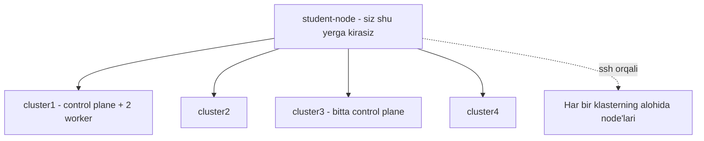

# Dars 328 — Keyingi qadamlar (What's Next)

> 🎯 **Bu darsda nimani o'rganamiz:**
> - CKA imtihonining 5 bilim sohasi va ularning foizdagi og'irliklari
> - Ultimate CKA Mock Exam seriyasi qanday tuzilgan: 4 klaster, student-node, 20 tasodifiy savol, 2 soat
> - Imtihonda klasterlar orasida context almashtirish odati
> - Namuna savol yechimi: Secret'ni `base64` bilan dekodlash

## Hayotiy o'xshatish: haydovchilik imtihonidan oldingi "sinov maydoni"

Haydovchilik guvohnomasi imtihonidan oldin avtodromda mashq qilasiz: xuddi imtihondagidek konuslar, xuddi shunday vaqt, xuddi shunday baholash. Ultimate CKA Mock Exam seriyasi — ana shunday **avtodrom**: haqiqiy imtihondagi kabi bir nechta klaster, xuddi shunday savol taqsimoti va vaqt chegarasi. Farqi — bu yerda yiqilsangiz ham hech narsa yo'qotmaysiz, aksincha yechimni ko'rib o'rganasiz.

Bu videoda KodeKloud'dan Vijin Palazhi Ultimate CKA Mock Exam seriyasini tanishtiradi. **Tayyorgarlik sharti:** bu seriyaga kirishdan oldin CKA tayyorlov kursini, undagi mock imtihonlar va Lightning Lab'larni tugatgan bo'lishingiz kerak — aks holda avval kursni yakunlab, keyin qaytish tavsiya qilinadi.

## CKA imtihonining 5 bilim sohasi

Imtihon amaliy bilimni 5 sohada tekshiradi, mock imtihonlar ham aynan shu og'irliklarni saqlaydi:

| Bilim sohasi | Savollardagi ulushi |
|---|---|
| Troubleshooting (nosozliklarni tuzatish) | **30%** — eng katta bo'lim |
| Cluster Architecture, Installation & Maintenance | 25% |
| Services & Networking | 20% |
| Workloads & Scheduling | 15% |
| Storage | 10% |

## Mock imtihon muhiti qanday tuzilgan?



- Jami **4 ta Kubernetes klasteri** bor, ba'zilari muayyan bilim sohalariga ajratilgan.
- Siz sukut bo'yicha **student-node**ga kirasiz — bu shunchaki mijoz (client) mashina; undan barcha klasterlarga murojaat qilasiz va kerak bo'lsa node'larga `ssh` qilasiz.
- Jami **20 ta tasodifiy savol**, vaqt — **2 soat**. Savollar katta savollar bazasidan tasodifiy tanlanadi — bir labni qayta ochsangiz, butunlay boshqa savollar chiqadi.
- Vaqt tugasa imtihon avtomatik yakunlanib tekshiriladi; xohlagan payt **End Exam** tugmasi bilan o'zingiz ham yakunlashingiz mumkin. Natija avtomatik baholanadi, har bir yechilmagan savol uchun **to'g'ri yechim** ko'rsatiladi.

## Klasterlar orasida almashish

Har savolning boshida to'g'ri klasterga o'tish buyrug'i beriladi — uni **har doim** bajaring, hatto "to'g'ri klasterdaman" deb o'ylasangiz ham!

```bash
# Qanday klasterlar sozlanganini ko'rish
kubectl config get-clusters

# Muayyan klaster kontekstiga o'tish (savol boshida beriladi)
kubectl config use-context cluster3

# Joriy klaster node'larini tekshirish
kubectl get nodes
```

Masalan, sukutdagi `cluster1`da ikkita worker (`cluster1-node01`, `node02`) bor; `cluster3` esa bitta control plane'li yakka klaster (yozib olingan paytda versiyasi 1.24).

## Namuna savol: Secret'ni dekodlash

Birinchi savol (og'irligi 8, "Architecture, Install & Maintenance" bo'limidan): `cluster3`da alohida namespace'da yaratilgan `beta-sec-cka14-arch` nomli Secret'ni dekodlab, natijani student-node'dagi faylga yozish.

```bash
# 1. Kontekstni cluster3 ga o'tkazamiz (savolda berilgan buyruq)
kubectl config use-context cluster3

# 2. Namespace mavjudligini tekshiramiz
kubectl get ns

# 3. Secret'ni topamiz
kubectl get secrets -n <namespace>

# 4. YAML ko'rinishda ochib, data bo'limidagi qiymatni ko'ramiz
kubectl get secret beta-sec-cka14-arch -n <namespace> -o yaml

# 5. base64 dan dekodlaymiz va so'ralgan faylga yo'naltiramiz
echo '<base64-qiymat>' | base64 -d
echo '<base64-qiymat>' | base64 -d > <fayl-yo'li>
```

💡 Savolda "student-node'da saqlansin" deyilgan — biz allaqachon student-node'da bo'lganimiz uchun natijani to'g'ridan-to'g'ri faylga yo'naltirdik.

## Keyingi qadamlaringiz

1. Kurs ichidagi mock imtihonlar va Lightning Lab'larni yakunlang.
2. Ultimate CKA Mock Exam seriyasida (10 ta tasodifiylashtirilgan mock imtihon) real muhitda mashq qiling — yechilmagan savollarning yechimlarini o'rganib, labni qayta oling.
3. O'zingizga ishonch hosil qilgach, Linux Foundation / CNCF sahifasi orqali **CKA imtihoniga ro'yxatdan o'ting** (chegirma kodlari 325-darsdagi FAQ faylida).
4. Imtihondan keyin — CKS yoki boshqa yo'nalishlarga (327-darsga qarang).

## 🧪 Mustaqil topshiriqlar

> Yechishdan oldin darsni yopib qo'ying. Taxminiy vaqt: 10 daqiqa.

**1-topshiriq · oson.** CKA'dan keyingi sertifikatlarni sanang (CKAD, CKS) va farqini ayting.

<details><summary>O'zingizni tekshiring</summary>

```bash
# CKA  — administrator: klaster o'rnatish, boshqarish, tuzatish
# CKAD — dasturchi: ilovani joylashtirish va sozlash
# CKS  — xavfsizlik: CKA talab qilinadi
```
</details>

**2-topshiriq · o'rta.** O'zingiz uchun keyingi o'rganish rejasini uch banddan tuzing.

<details><summary>O'zingizni tekshiring</summary>

```bash
# Masalan: GitOps (ArgoCD) -> monitoring (Prometheus) -> service mesh
```
</details>

**3-topshiriq · qiyin.** Kubernetes bilimini amalda qanday mustahkamlash mumkin?

<details><summary>O'zingizni tekshiring</summary>

Eng samarali uchta yo'l:

1. **O'z klasteringizni ko'taring va unda haqiqiy narsa ishlating** —
   blog, bot, monitoring. Sinov klasteri bilan taqqoslab bo'lmaydigan
   muammolar chiqadi.
2. **Buzing va tuzating.** Ataylab CNI'ni o'chiring, sertifikatni
   eskirtiring, disk to'ldiring — keyin tiklang.
3. **Ochiq kodli loyihalarga hissa qo'shing** — hatto hujjatdagi xatoni
   tuzatish ham real jarayonni ko'rsatadi.
</details>

## ❓ Savol-Javob

"Savol:" Imtihonda (va mock'da) har savoldan oldin nimani unutmaslik kerak?
"Javob:" Savol boshida berilgan context almashtirish buyrug'ini bajarishni — har doim, hatto to'g'ri klasterdaman deb o'ylasangiz ham. Noto'g'ri klasterda bajarilgan yechim hisobga o'tmaydi.

"Savol:" CKA'da eng ko'p savol qaysi bo'limdan tushadi?
"Javob:" Troubleshooting — savollarning 30% i. Keyin arxitektura/o'rnatish/maintenance (25%) va Services & Networking (20%).

"Savol:" Mock imtihonni qayta ochsam, xuddi shu savollar chiqadimi?
"Javob:" Yo'q — savollar katta bazadan tasodifiy tanlanadi, har urinishda boshqa to'plam chiqadi. Shuning uchun bitta labni ham bir necha marta ishlash foydali.

"Savol:" Yechim topolmay qolsam nima bo'ladi?
"Javob:" Imtihon yakunida baholash jarayonida har bir savolning to'liq yechimi ko'rsatiladi — uni o'rganib, testni qayta topshiring.

## 📌 CKA imtihon uchun maslahat

- Vaqt taqsimotini mashq qiling: 20 savol / 2 soat — o'rtacha savolga 6 daqiqa. Qiyin savolda tiqilib qolmang, belgilab keyinroq qaytING.
- `kubectl config get-clusters` va `kubectl config use-context` buyruqlarini avtomatizmga aylantiring.
- Troubleshooting eng og'ir bo'lim (30%) — 14-bo'limdagi tekshirish ketma-ketliklarini takrorlab chiqing.

## 📖 Asosiy atamalar

| Atama | Oddiy tushuntirish |
|---|---|
| student-node | Imtihon muhitida siz o'tiradigan mijoz mashina; klasterlarga shu yerdan murojaat qilinadi |
| context | kubeconfig'dagi "qaysi klaster + qaysi foydalanuvchi" kombinatsiyasi; `use-context` bilan almashtiriladi |
| mock exam | Haqiqiy imtihonni taqlid qiluvchi sinov imtihoni |
| weightage (og'irlik) | Savolning umumiy balldagi ulushi |
| base64 | Secret qiymatlari saqlanadigan kodlash usuli; `base64 -d` bilan dekodlaash mumkin |

## 🔗 Manbalar

- [CKA imtihoni rasmiy sahifasi — CNCF](https://www.cncf.io/training/certification/cka/)
- [CKA imtihoniga yozilish — Linux Foundation](https://training.linuxfoundation.org/certification/certified-kubernetes-administrator-cka/)
- [CKA dastur mavzulari (Curriculum) — GitHub](https://github.com/cncf/curriculum)
- [kubectl config buyruqlari — kubernetes.io](https://kubernetes.io/docs/tasks/access-application-cluster/configure-access-multiple-clusters/)

---
*Bu dars KodeKloud CKA kursining 328-videosi asosida tayyorlandi.*
